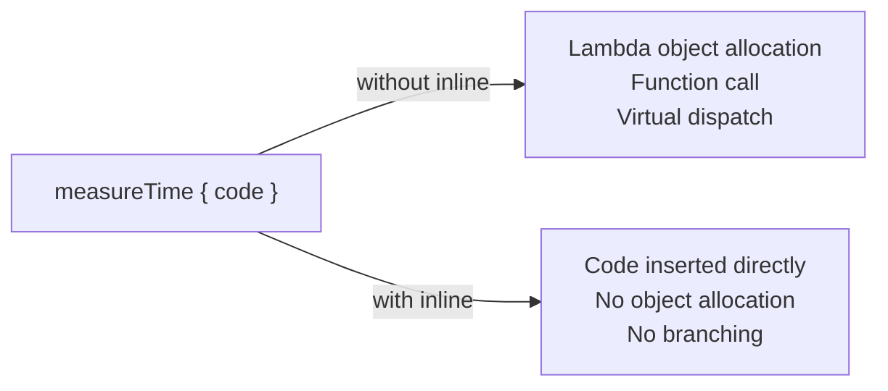

## Overall Analogy: Copying the Recipe vs Ordering from the Restaurant

`inline` functions are easy to understand by analogy to **copying a recipe directly**.

| Analogy | Kotlin Concept | Effect |
|---------|----------------|--------|
| Copying the recipe from the cookbook | `inline` function | Insert the code with no call overhead |
| Ordering from the restaurant each time | Regular function call | Call overhead is incurred |
| Ingredient list (type) copied as-is | `reified T` | Type information preserved at runtime |
| "Copy everything except this ingredient" | `noinline` | Exclude a specific lambda from inlining |
| "OK to pass it to another chef" | `crossinline` | Allow the lambda to be called from another scope |

---

> **Target Audience**: Kotlin developers who understand generics and lambdas
> **Prerequisites**: Generics, lambdas, generics and variance
> **Estimated Time**: About 30 minutes
> **What You'll Learn**: You'll be able to use `inline`/`reified` appropriately to write type-safe utility functions.


- `inline fun` — Function body is inserted at the call site; no lambda object allocation cost
- `reified T` — Usable only in `inline` functions; enables runtime type checks like `T is String`
- `noinline` — Exclude a specific lambda parameter from inlining
- `crossinline` — Disallow `return` from an inline lambda (when passing to another scope)


#### Why Do We Need inline Functions?

A function that takes a lambda as a parameter allocates a lambda object every time it's called. In performance-critical code (especially inside loops), this cost adds up.

```kotlin
// Regular higher-order function — creates a lambda object every call
fun <T> measureTime(block: () -> T): T {
    val start = System.currentTimeMillis()
    val result = block()
    println("Elapsed: ${System.currentTimeMillis() - start}ms")
    return result
}

// After compilation (conceptually)
// block is passed as a Function0 interface object
```

With `inline`, the compiler inserts the function body directly at the call site.

```kotlin
inline fun <T> measureTime(block: () -> T): T {
    val start = System.currentTimeMillis()
    val result = block()
    println("Elapsed: ${System.currentTimeMillis() - start}ms")
    return result
}

// Usage
val result = measureTime {
    heavyComputation()
}

// After compilation (conceptually — function body is inserted)
val start = System.currentTimeMillis()
val result = heavyComputation()
println("Elapsed: ${System.currentTimeMillis() - start}ms")
```



*Figure: Before vs after inline application — without inline, lambda allocation and virtual dispatch occur; with inline, the code is inserted directly, removing the overhead.*

#### Non-Local Returns in Inline Functions

Inside lambdas in `inline` functions, you can perform a **non-local return that exits the outer function**.

```kotlin
inline fun findFirst(list: List<Int>, predicate: (Int) -> Boolean): Int? {
    for (element in list) {
        if (predicate(element)) return element
    }
    return null
}

fun search(numbers: List<Int>): Int? {
    numbers.forEach {           // forEach is inline
        if (it > 10) return it  // This return exits the search() function
    }
    return null
}

// Kotlin's forEach, filter, map, etc. are all inline, so
// these patterns work naturally
```

#### noinline

To exclude a specific lambda parameter of an inline function from inlining, add `noinline`. This is needed when storing the lambda in a variable or passing it to another function.

```kotlin
inline fun performAction(
    inlineAction: () -> Unit,
    noinline storedAction: () -> Unit   // Kept as a lambda object
) {
    inlineAction()                       // Inlined
    val saved = storedAction             // Can be stored in a variable
    scheduleForLater(saved)              // Can be passed to another function
}

fun scheduleForLater(action: () -> Unit) {
    // Execute later
}
```

#### crossinline

To disallow non-local returns from an inline lambda, use `crossinline`. This is needed when the lambda is called from another scope (e.g., another thread or another class).

```kotlin
inline fun runAsync(crossinline block: () -> Unit) {
    Thread {
        block()   // Runs on another thread — no non-local return allowed
    }.start()
}

fun example() {
    runAsync {
        println("Running asynchronously")
        // return  // Compile error — non-local return not allowed in crossinline lambdas
    }
}
```

| Keyword | Inlined | Storable | Non-local return |
|---------|---------|----------|------------------|
| (default) | Yes | No | Yes |
| `noinline` | No | Yes | No |
| `crossinline` | Yes | No | No |

#### Reified Type Parameters

Generic types are erased at runtime (type erasure), so type information is unavailable. Using `reified` in an `inline` function bypasses this restriction.

```kotlin
// Without reified — runtime type check is not possible
fun <T> isType(value: Any): Boolean {
    // return value is T   // Compile error: T is erased at runtime
    return false
}

// Using reified — runtime type check is possible
inline fun <reified T> isType(value: Any): Boolean {
    return value is T
}

println(isType<String>("hello"))   // true
println(isType<Int>("hello"))      // false
println(isType<List<*>>(listOf())) // true
```

**Practical Uses of reified**

```kotlin
// 1. Type casting
inline fun <reified T> Any.castOrNull(): T? = this as? T

val obj: Any = "hello"
val str: String? = obj.castOrNull<String>()   // "hello"
val num: Int? = obj.castOrNull<Int>()         // null

// 2. Collection filtering — already provided by the standard library with reified
val mixed: List<Any> = listOf(1, "hello", 2, "world", 3.14)
val strings: List<String> = mixed.filterIsInstance<String>()
// ["hello", "world"]

// 3. JSON / configuration parsing (Jackson pattern)
inline fun <reified T> String.fromJson(): T {
    return objectMapper.readValue(this, T::class.java)
}

val user: User = jsonString.fromJson<User>()
// T::class.java — thanks to reified, User.class can be passed at runtime

// 4. findView, getBean patterns on Android/Spring
inline fun <reified T : Any> ApplicationContext.getBean(): T {
    return getBean(T::class.java)
}
// val service: UserService = context.getBean()
```

#### Use of reified in the Standard Library

```kotlin
// filterIsInstance — the most representative use of reified
val mixed: List<Any> = listOf(1, "a", 2, "b", 3.0)
val ints: List<Int> = mixed.filterIsInstance<Int>()         // [1, 2]
val strings: List<String> = mixed.filterIsInstance<String>() // ["a", "b"]

// let, run, apply, also, with — all inline
// Accessing T::class
inline fun <reified T> typeNameOf(): String = T::class.simpleName ?: "Unknown"
println(typeNameOf<String>())   // String
println(typeNameOf<List<*>>())  // List
```

#### Costs and Caveats of inline

`inline` is not always faster. If the function body is large, the bytecode size grows.

```kotlin
// Suitable for inline — a small function that takes a lambda parameter
inline fun <T> withLock(lock: Lock, block: () -> T): T {
    lock.lock()
    try { return block() }
    finally { lock.unlock() }
}

// Not suitable for inline — a regular function with no lambda
// inline fun add(a: Int, b: Int) = a + b   // Meaningless, triggers a warning

// Not suitable — very large function (code bloat)
// inline fun complexProcess(block: () -> Unit) {
//     // Hundreds of lines of code...
//     block()
// }
```

**inline Suitability Table**

| Condition | inline Recommended? |
|-----------|---------------------|
| Small function with lambda parameter(s) | Recommended |
| Performance measurement shows it's a bottleneck | Recommended |
| Reified type parameter needed | Required |
| Regular function with no lambda | Not recommended (compiler warning) |
| Function over 100 lines | Not recommended |
| Public API (library) | Careful — affects binary compatibility |


- `inline` functions have their body inserted at the call site → eliminates lambda object allocation cost
- `reified T` — usable only in `inline` functions; allows runtime type checks and casts
- `noinline` — excludes a specific lambda from inlining; can be stored/passed
- `crossinline` — forbids non-local returns from a lambda that runs in another scope
- Applying `inline` to a regular function without lambdas causes unnecessary code bloat


#### Next Steps

- [Scope Functions](scope-functions/) — Why `let`, `apply`, etc. are implemented as `inline`
- [Extension Functions](extension-functions/) — Combining extension functions and `inline`
