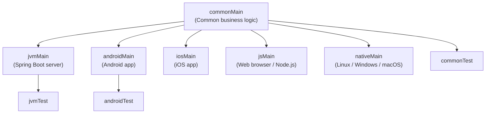
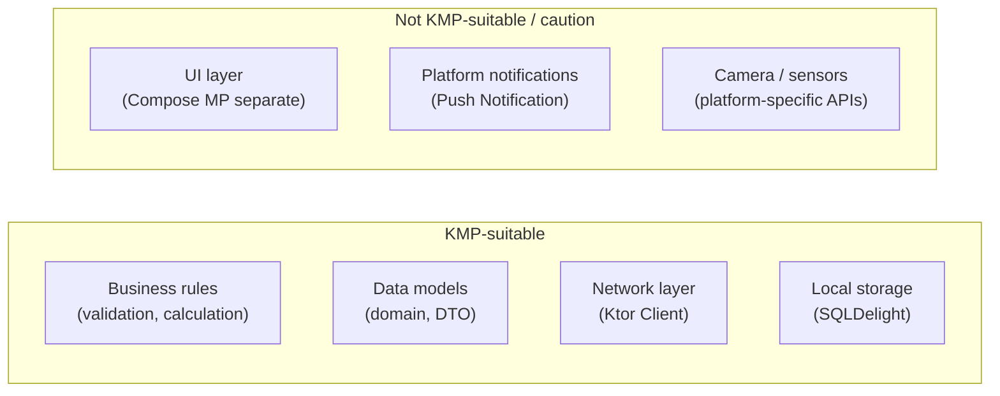

## Overall Analogy: A Franchise Restaurant

A franchise restaurant shares a **common menu and recipes** (common) across stores worldwide, but the **ingredient suppliers** (platforms) differ by region. A New York store (JVM) and a Seoul store (iOS/Android) use the same recipe with different ingredients.

| Franchise Analogy | Kotlin Multiplatform | Role |
|-------------------|----------------------|------|
| Common recipe (menu) | `commonMain` | Code shared across all platforms |
| Region-specific ingredients | `jvmMain` / `iosMain` / `jsMain` | Concrete implementations per platform |
| "Use local ingredients" note on the recipe | `expect` declaration | A contract requiring a platform implementation |
| Local store actually preparing ingredients | `actual` implementation | Actual platform-specific code |

---

> **Target Audience**: Intermediate or higher Kotlin developers interested in multiplatform development
> **Prerequisites**: Basic Kotlin syntax, Gradle basics
> **Estimated Time**: About 30–40 minutes
> **What You'll Learn**: You'll understand the KMP project structure, separate platform-specific code with expect/actual, and judge when KMP is suitable.


- KMP writes the **business logic** once in Kotlin while keeping the UI native per platform.
- Declare an interface with `expect`, and provide implementations per platform with `actual`.
- Use the `commonMain` → `jvmMain`/`iosMain`/`jsMain` source set hierarchy.
- kotlinx-coroutines, kotlinx-serialization, and kotlinx-datetime support multiplatform.
- KMP is more suitable for **sharing business logic** than for sharing UI.


---

#### Why Kotlin Multiplatform?

If mobile, web, and server each re-implement the same business logic in Swift, TypeScript, and Java, three problems arise.

1. **Synchronization cost**: Logic changes must be made in all three places.
2. **Bug inconsistency**: Implementation details differ across platforms, leading to divergent behavior.
3. **Test duplication**: The same tests must be written in each language.

KMP lets you **write common business logic once in Kotlin**, while UI and platform APIs are implemented in each platform's language. Unlike React Native or Flutter, which unify UI as well, KMP shares only the logic while keeping native UI.

---

#### KMP Architecture — Source Set Hierarchy



*Figure: KMP source set hierarchy — commonMain branches into jvmMain, androidMain, iosMain, jsMain, and nativeMain, each connected to its platform-specific test source set.*

Each source set has an independent directory:

```text
src/
├── commonMain/kotlin/          # Common code (runs on all platforms)
│   └── com/example/
│       ├── domain/             # Domain models
│       └── repository/         # Abstract repositories
├── commonTest/kotlin/          # Common tests
├── jvmMain/kotlin/             # JVM-only implementations
├── androidMain/kotlin/         # Android-only implementations
├── iosMain/kotlin/             # iOS-only implementations (Kotlin/Native)
└── jsMain/kotlin/              # JavaScript-only implementations
```

---

#### The expect / actual Mechanism

`expect` declares in common code: "I need this functionality; please provide the implementation per platform." `actual` provides those implementations on each platform.

**expect declaration (commonMain):**

```kotlin
// commonMain/kotlin/com/example/Platform.kt

// Function returning the platform name — implementations provided by each platform
expect fun currentPlatform(): String

// Platform-specific UUID generator
expect class UuidGenerator() {
    fun generate(): String
}

// Platform-specific logger
expect object Logger {
    fun log(message: String)
    fun error(message: String, throwable: Throwable? = null)
}
```

**actual implementation (jvmMain):**

```kotlin
// jvmMain/kotlin/com/example/Platform.jvm.kt

actual fun currentPlatform(): String = "JVM ${System.getProperty("java.version")}"

actual class UuidGenerator actual constructor() {
    actual fun generate(): String = java.util.UUID.randomUUID().toString()
}

actual object Logger {
    actual fun log(message: String) {
        println("[INFO] $message")
    }
    actual fun error(message: String, throwable: Throwable?) {
        System.err.println("[ERROR] $message")
        throwable?.printStackTrace()
    }
}
```

**actual implementation (iosMain):**

```kotlin
// iosMain/kotlin/com/example/Platform.ios.kt
import platform.UIKit.UIDevice
import platform.Foundation.NSUUID

actual fun currentPlatform(): String =
    UIDevice.currentDevice.systemName() + " " + UIDevice.currentDevice.systemVersion

actual class UuidGenerator actual constructor() {
    actual fun generate(): String = NSUUID().UUIDString
}

actual object Logger {
    actual fun log(message: String) {
        println("[iOS INFO] $message")
    }
    actual fun error(message: String, throwable: Throwable?) {
        println("[iOS ERROR] $message ${throwable?.message ?: ""}")
    }
}
```

---

#### Writing Common Code

Write business logic in `commonMain`.

```kotlin
// commonMain/kotlin/com/example/domain/User.kt
data class User(
    val id: String,
    val name: String,
    val email: String
)

// commonMain/kotlin/com/example/domain/UserRepository.kt
interface UserRepository {
    suspend fun findById(id: String): User?
    suspend fun save(user: User): User
    suspend fun findAll(): List<User>
}

// commonMain/kotlin/com/example/usecase/UserUseCase.kt
class UserUseCase(private val repository: UserRepository) {

    suspend fun getUser(id: String): Result<User> = runCatching {
        repository.findById(id) ?: throw NoSuchElementException("User not found: $id")
    }

    suspend fun createUser(name: String, email: String): Result<User> = runCatching {
        val user = User(
            id = UuidGenerator().generate(),  // expect/actual
            name = name,
            email = email
        )
        repository.save(user)
    }
}
```

---

#### Gradle Configuration (kotlin-multiplatform)

```kotlin
// build.gradle.kts
plugins {
    kotlin("multiplatform") version "2.0.0"
    kotlin("plugin.serialization") version "2.0.0"
}

kotlin {
    // Target platforms
    jvm()
    androidTarget()
    iosArm64()
    iosSimulatorArm64()
    js(IR) { browser() }

    sourceSets {
        commonMain.dependencies {
            // Multiplatform libraries
            implementation("org.jetbrains.kotlinx:kotlinx-coroutines-core:1.8.1")
            implementation("org.jetbrains.kotlinx:kotlinx-serialization-json:1.6.3")
            implementation("org.jetbrains.kotlinx:kotlinx-datetime:0.6.0")
        }
        jvmMain.dependencies {
            implementation("io.ktor:ktor-client-okhttp:2.3.10")
        }
        iosMain.dependencies {
            implementation("io.ktor:ktor-client-darwin:2.3.10")
        }
        jsMain.dependencies {
            implementation("io.ktor:ktor-client-js:2.3.10")
        }
    }
}
```

---

#### Multiplatform-Supported Libraries

| Library | Supported Platforms | Key Features |
|---------|---------------------|--------------|
| `kotlinx-coroutines` | JVM, Android, iOS, JS, Native | Coroutines, Flow |
| `kotlinx-serialization` | JVM, Android, iOS, JS, Native | JSON, Protobuf serialization |
| `kotlinx-datetime` | JVM, Android, iOS, JS, Native | Date/time handling |
| `Ktor Client` | JVM, Android, iOS, JS, Native | HTTP client |
| `SQLDelight` | JVM, Android, iOS, JS, Native | SQLite ORM |
| `Koin` | JVM, Android, iOS, JS | Dependency injection |

**kotlinx-serialization example:**

```kotlin
// Usable in commonMain
import kotlinx.serialization.*
import kotlinx.serialization.json.*

@Serializable
data class ApiResponse<T>(
    val data: T,
    val success: Boolean,
    val message: String = ""
)

@Serializable
data class UserDto(
    val id: String,
    val name: String,
    val email: String
)

// Serialization/deserialization (common across all platforms)
val json = Json { prettyPrint = true }

val response = ApiResponse(
    data = UserDto("1", "Alice", "alice@example.com"),
    success = true
)
val jsonStr = json.encodeToString(response)
println(jsonStr)

val decoded = json.decodeFromString<ApiResponse<UserDto>>(jsonStr)
println(decoded.data.name)  // Alice
```

---

#### Limitations of KMP

KMP does not solve every problem. Be aware of the following limitations before adopting it.

| Limitation | Description |
|------------|-------------|
| **No UI sharing** | KMP shares only logic. UI must use the platform's native technology or Compose Multiplatform separately. |
| **Build complexity** | Building multiple targets makes configuration more complex and increases build time. |
| **iOS build environment** | The iOS target requires a macOS build environment. |
| **Direct platform API access** | `iosMain` can use iOS frameworks, but requires understanding the Objective-C/Swift bridge. |
| **Library ecosystem** | Not every JVM library supports KMP; you may need to find multiplatform alternatives. |

---

#### KMP Suitable Use Cases



*Figure: KMP-suitable vs unsuitable use cases — business logic and network layers can be shared, while UI, notifications, and camera/sensor features are hard to apply KMP to.*

**Scenarios where KMP shines:**

1. **Mobile + backend** — iOS app, Android app, and Spring Boot server share the same domain models and validation logic.
2. **Client SDK** — When building an SDK that offers the same API across platforms, KMP reduces code duplication.
3. **Offline-first apps** — Share SQLDelight + kotlinx-coroutines as common code to implement sync logic once.

---

#### Compose Multiplatform

To share UI as well, use **Compose Multiplatform** as a separate layer. It's not a superset of KMP but an independent layer.

| Layer | Technology | Supported Platforms |
|-------|------------|---------------------|
| Business logic | Kotlin Multiplatform | JVM, Android, iOS, JS, Native |
| UI (optional) | Compose Multiplatform | Android, iOS, Desktop, Web |
| UI (native) | SwiftUI / XML / React | Each platform-specific |

---

#### Key Points


- KMP is designed with **native UI and Kotlin common business logic**.
- `expect` is the "platform contract" in common code, and `actual` is the platform-specific implementation.
- Source sets follow the `commonMain` → `jvmMain`/`iosMain`/`jsMain` hierarchy.
- kotlinx-coroutines, serialization, datetime, and Ktor Client support all platforms.
- iOS builds require a macOS environment, and you should consider the increased build complexity.


---

#### Next Steps

- [Gradle Kotlin DSL Tips](../../howto/gradle-kotlin-dsl-tips/) — Practical know-how for KMP Gradle configuration
- [DSL Builders](../dsl-builders/) — Patterns combining expect/actual with DSLs
- [Official KMP Documentation](https://kotlinlang.org/docs/multiplatform.html) — Latest target support status
