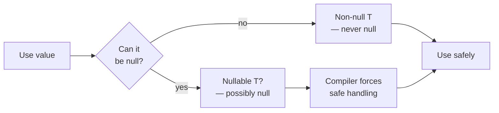

## Overall Analogy: Receiving a Parcel and Handling Absences

Kotlin's Null Safety is easy to understand by analogy to **receiving a parcel and handling absences**. Inside the box, the item may or may not be present. Kotlin marks the possibility of "the item might be missing" in the type system. It forces you to handle the missing case safely before trying to take the item out.

| Analogy | Kotlin Concept | Role |
|---------|----------------|------|
| Box that may or may not have an item | Nullable type (`T?`) | Marks possible null in the type |
| Check before opening the box | Safe call (`?.`) | Returns null if null, otherwise proceeds |
| "If none, use this instead" | Elvis operator (`?:`) | Use default value when null |
| Forcing the box open | Non-null assertion (`!!`) | Throws NullPointerException on null |
| Checking if the box is the right kind | Safe casting (`as?`) | Returns null on conversion failure |

---

> **Target Audience**: Learners who have read [Functions](../functions/)
> **Prerequisites**: Kotlin basic types, function declarations
> **Estimated Time**: About 25 minutes
> **What You'll Learn**: You'll handle nullable types correctly, use `?.`, `?:`, `!!` in the right contexts, and safely interoperate with Java APIs.


- **`T?`** is a type that can be null; **`T`** is a type that cannot be null
- **`?.`** (safe call) — returns null if the receiver is null; used for chained calls
- **`?:`** (Elvis) — returns a default value when null, or handles exceptions
- **`!!`** — throws if null; avoid except when absolutely necessary


#### Why Do We Need Null Safety?

`NullPointerException` has plagued developers for decades. Because it occurs at runtime rather than compile time, it's easy to miss in testing and leads to sudden production outages.

Kotlin **distinguishes nullable and non-null types at the type system level**. Most null-related errors can be caught at compile time.



*Figure: Kotlin null-safe type system flow — non-null and nullable (T?) types are separated, with the compiler enforcing safe handling.*

---

#### Declaring Nullable Types

Adding `?` to a type makes it nullable.

```kotlin
// Non-null — cannot be null
val name: String = "Kotlin"
// name = null   // Compile error!

// Nullable — can be null
val nickname: String? = null
val email: String? = "user@example.com"

// Also applies to function parameters and return values
fun findUser(id: Int): String? {     // Returns null if user not found
    return if (id == 1) "John" else null
}
```

Types that cannot be null don't require null checks, so all their members can be called safely.

---

#### Safe Call Operator ?.

`?.` returns null for the entire expression if the receiver is null; otherwise it accesses the member normally.

```kotlin
val name: String? = getName()

// Safe call
val length = name?.length      // null if name is null, else Int

// Chained safe calls
val city = user?.address?.city  // null if user or address is null
```

**Comparison with Chained Calls**

```kotlin
// Direct call without null check — compile error
val len = name.length   // Error: cannot access String? directly

// Explicit null check
val len = if (name != null) name.length else null

// Safe call — more concise
val len = name?.length
```

**Combining Safe Call with let**

To execute a block only when the value is not null, use `?.let { }`.

```kotlin
val email: String? = getEmail()

email?.let { addr ->
    println("Sending email: $addr")
    sendEmail(addr)
}
// If email is null, the block is entirely skipped
```

---

#### Elvis Operator ?:

`?:` returns the right-hand value if the left-hand side is null. It concisely expresses a default for null.

```kotlin
val name: String? = getUserName()

// Provide a default
val displayName = name ?: "Anonymous"

// Apply to a function's return value
fun getLength(s: String?): Int = s?.length ?: 0

// Throw an exception for early exit
fun requireName(s: String?): String =
    s ?: throw IllegalArgumentException("Name is required")

// Early return from a function
fun processUser(id: Int) {
    val user = findUser(id) ?: return   // Exit if null
    println("Processing: ${user.name}")
}
```

**Elvis Operator Patterns**

| Pattern | Code | Description |
|---------|------|-------------|
| Default | `value ?: "default"` | Return default if null |
| Exception | `value ?: throw Exception("required")` | Throw if null |
| Early return | `value ?: return` | Exit function if null |
| Zero/empty | `list?.size ?: 0` | Return 0 if null |

---

#### Non-Null Assertion !!

`!!` forces a nullable type to be treated as non-null. If the value is null, it throws `NullPointerException`.

```kotlin
val name: String? = "Kotlin"
val length = name!!.length   // NullPointerException if name is null!
```


`!!` bypasses Kotlin's Null Safety. If you see `!!` in code, you're giving up the compiler's safety guarantee.

**When `!!` is appropriate:**
- When the developer is certain the value can logically never be null
- In test code where fail-fast is intentional

**Patterns to use instead of `!!`:**
```kotlin
// Use Elvis for a default instead of !!
val len = name?.length ?: 0

// Use requireNotNull for a clear message instead of !!
val name = requireNotNull(rawName) { "name must not be null" }

// Use checkNotNull instead of !!
val config = checkNotNull(loadConfig()) { "Failed to load configuration file" }
```


---

#### Safe Casting as?

`as?` tries to convert the type and returns null on failure.

```kotlin
val obj: Any = "Hello"

// Safe cast
val str = obj as? String        // "Hello"
val num = obj as? Int           // null (conversion fails)

// Combined with Elvis
val length = (obj as? String)?.length ?: 0
```

**Comparison with Regular Cast `as`**

```kotlin
val obj: Any = 42

// Regular cast — throws ClassCastException on failure
val str = obj as String   // Exception thrown!

// Safe cast — returns null on failure
val str = obj as? String  // Returns null
```

---

#### Null Safety and Smart Casts

The Kotlin compiler automatically infers a non-null type after a null check.

```kotlin
fun printLength(s: String?) {
    if (s != null) {
        // Inside this block, s is inferred as String (non-null)
        println(s.length)   // Safe to call
    }
}

// is checks also enable smart casts
fun describe(obj: Any) {
    if (obj is String) {
        println(obj.length)  // obj smart-cast to String
    }
    if (obj is Int) {
        println(obj + 1)     // obj smart-cast to Int
    }
}
```

---

#### Platform Types and Java Interop

Types coming from Java are called **platform types**. Without null annotations, Kotlin can't tell whether Java code is nullable. The Kotlin compiler marks them as `T!` (platform type).


`T!` is a **notation** used by the compiler and IDE to show "this type may or may not be null." Typing `String!` in Kotlin source code produces a compile error.

In IntelliJ, hovering over a Java method shows the return type as `String!`. This is a hint that "if you receive it as `String`, an NPE may occur; if you receive it as `String?`, it's safe." That is, the developer must explicitly choose `T` or `T?`.


```kotlin
// Java method call — return may be null
val name: String = System.getenv("APP_NAME")   // Risky! May be null
val safeName: String? = System.getenv("APP_NAME")  // Safe
val result = System.getenv("APP_NAME") ?: "default"  // Defend with Elvis
```


It's safest to treat Java library method return values as nullable by default. If Java methods carry annotations like `@NonNull`, `@NotNull`, or `@Nullable`, Kotlin recognizes them and handles the type correctly.


---

#### Code Example: Real-World Null Safety Patterns

```kotlin
package com.example.nullsafety

data class Address(val city: String?, val zipCode: String?)
data class User(val name: String, val email: String?, val address: Address?)

fun main() {
    val user: User? = User(
        name = "John",
        email = null,
        address = Address(city = "Seoul", zipCode = null)
    )

    // Chained safe calls
    val city = user?.address?.city
    println("City: $city")   // City: Seoul

    // Default with Elvis
    val email = user?.email ?: "No email"
    println("Email: $email")   // Email: No email

    // Zip code — null at multiple levels
    val zip = user?.address?.zipCode ?: "No zip code"
    println("Zip code: $zip")   // Zip code: No zip code

    // Execute only when non-null with let
    user?.email?.let { addr ->
        println("Sending email: $addr")
    }
    // Outputs nothing (email is null)

    // Safe casting
    val values: List<Any> = listOf(1, "hello", 3.14, null)
    val strings = values.filterIsInstance<String>()
    println("Strings only: $strings")   // Strings only: [hello]

    // requireNotNull pattern
    try {
        val name = requireNotNull(user?.name) { "User name required" }
        println("Name: $name")
    } catch (e: IllegalArgumentException) {
        println("Error: ${e.message}")
    }
}
```

---

#### Key Points


- Mark the possibility of null in the type with **`T?`**
- **`?.`** (safe call) — null if receiver is null, else access member
- **`?:`** (Elvis) — when null, provide a default or handle with exception/return
- **`!!`** throws NPE on null; use only when absolutely necessary and generally avoid
- **`as?`** — safe cast, returns null on failure
- Defend against **Java API** return values by treating them as nullable


#### Next Steps

- [Classes and Objects](../classes-objects/) - Learn how to manage null-safe properties in classes
- [Data/Sealed Classes](../data-sealed-classes/) - Learn safe data modeling
