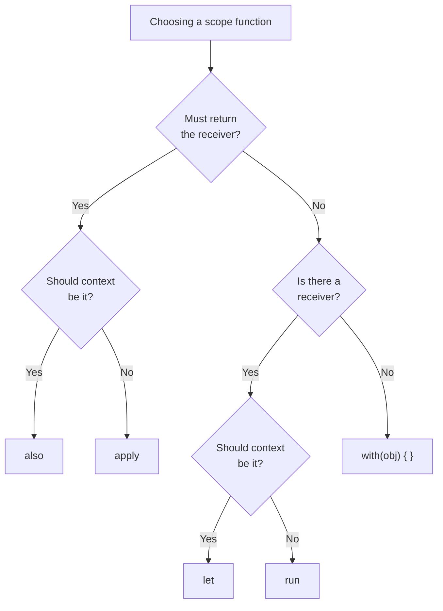

## Overall Analogy: How a Kitchen Handles Ingredients

Scope functions are easy to understand by analogy to **cooking actions in a kitchen**. The same ingredient (object) is handled in different ways depending on the goal.

| Kitchen Analogy | Scope Function | Context | Return Value |
|-----------------|----------------|---------|--------------|
| Pick up an ingredient and return a result | `let` | `it` | Lambda result |
| Do several things in the pot, then return a result | `run` | `this` | Lambda result |
| Place on the counter and do several things | `with` | `this` | Lambda result |
| Set up the ingredient (configure) and keep it | `apply` | `this` | Receiver object |
| Use the ingredient, do something extra, and keep it | `also` | `it` | Receiver object |

All five provide ways to **work with an object inside a lambda block**, but differ in how the context object is referenced (it vs this) and in the return value.

---

> **Target Audience**: Developers familiar with Kotlin basic syntax
> **Prerequisites**: Lambdas, extension function basics
> **Estimated Time**: About 30 minutes
> **What You'll Learn**: You'll pick the right scope function for each situation and write proper chains.


- `apply` / `also` → Return the receiver object (for configuration/side actions)
- `let` / `run` / `with` → Return the lambda result (for transformations/computations)
- `it`: `let`, `also` / `this`: `run`, `with`, `apply`
- Scope functions are tools to simplify code, not silver bullets


#### Why Do We Need Scope Functions?

When you reference the same object repeatedly or chain work after a null check, the code becomes cluttered.

```kotlin
// Without scope functions
val user = findUser(id)
if (user != null) {
    user.name = "John"
    user.email = "john@example.com"
    userRepository.save(user)
}

// Concise with apply + let
findUser(id)?.apply {
    name = "John"
    email = "john@example.com"
}?.let { userRepository.save(it) }
```

#### Detailed Comparison of the Five Scope Functions



*Figure: Decision tree for choosing a scope function — based on return-value type and context reference (it/this), it shows which of let, run, also, apply, with to pick.*

#### let

`let` is most often used for **null-safe handling** and **transformation**. It references the context object as `it` and returns the last expression of the lambda.

```kotlin
// Basic usage
val name = "  kotlin  "
val upper = name.let {
    val trimmed = it.trim()
    trimmed.uppercase()         // Lambda result returned
}
println(upper)                  // KOTLIN

// Null-safe check (most common pattern)
val user: User? = findUser(id)
user?.let {
    sendEmail(it.email)         // Only runs when user is not null
    println("Email sent: ${it.name}")
}

// Convert result to another type
val length: Int = "hello".let { it.length }
```


- When bringing a nullable value into a non-null context (`?.let { }`)
- When chained transformations on an expression are needed
- When a temporary variable name is helpful in a local scope


#### run

Use `run` when you want **object initialization and computation together**. It references the context object as `this` (direct member access) and returns the lambda result.

```kotlin
// Access object members directly while computing a result
data class Config(var host: String = "", var port: Int = 0, var timeout: Int = 0)

val config = Config()
val connectionString = config.run {
    host = "localhost"
    port = 5432
    timeout = 30
    "$host:$port (timeout=${timeout}s)"   // Lambda result returned
}
println(connectionString)   // localhost:5432 (timeout=30s)

// Block execution without an extension (run without a receiver)
val result = run {
    val x = 10
    val y = 20
    x + y                               // 30
}
```

#### with

Use `with` to **perform several actions on an already non-null object**. It's a regular function, not an extension, so it's called in the form `with(obj) { }`.

```kotlin
data class StringBuilder(var value: String = "")

// Access multiple members while computing a result
val report = with(orderRepository.findById(orderId)) {
    """
    Order ID: $id
    Customer: $customerName
    Amount: ${amount.formatCurrency()}
    Status: $status
    """.trimIndent()
}
```


- `with(obj) { }` — when obj is non-null; returns the lambda result
- `obj.run { }` — supports null-safe (`?.run { }`); returns the lambda result
- Both reference the object as `this` and return the lambda result — choose based on the situation


#### apply

`apply` is ideal for **object initialization (builder pattern)**. It references the context object as `this` and **returns the receiver object itself**.

```kotlin
// Object initialization
data class UserDto(
    var name: String = "",
    var email: String = "",
    var role: String = "USER"
)

val dto = UserDto().apply {
    name = "John"
    email = "john@example.com"
    role = "ADMIN"
}

// Replace the builder pattern
val alert = AlertDialog.Builder(context).apply {
    setTitle("Confirm")
    setMessage("Are you sure you want to delete?")
    setPositiveButton("OK") { _, _ -> delete() }
    setNegativeButton("Cancel", null)
}.create()

// Useful for collection initialization
val headers = mutableMapOf<String, String>().apply {
    put("Content-Type", "application/json")
    put("Authorization", "Bearer $token")
    put("X-Request-Id", UUID.randomUUID().toString())
}
```

#### also

`also` is used to slip **side actions (logging, validation)** into a chain. It references the context object as `it` and **returns the receiver object itself**.

```kotlin
// Insert logging in the middle of a chain
val user = createUser(request)
    .also { log.info("User created: ${it.id}") }
    .also { sendWelcomeEmail(it.email) }

// Validation
fun saveUser(user: User): User {
    return user
        .also { require(it.name.isNotBlank()) { "Name is blank" } }
        .also { require(it.email.contains("@")) { "Email is invalid" } }
        .let { userRepository.save(it) }
}
```


- `also` (uses `it`): when treating the object from the outside — logging, validation
- `apply` (uses `this`): when configuring the object's internals — initialization, builder


#### Five Functions at a Glance

| Function | Context | Return | Primary Use |
|----------|---------|--------|-------------|
| `let` | `it` | Lambda result | Null-safe handling, transformation |
| `run` | `this` | Lambda result | Initialization + computation |
| `with` | `this` | Lambda result | Multiple actions on a non-null object |
| `apply` | `this` | Receiver | Object initialization/configuration |
| `also` | `it` | Receiver | Side actions (logging, validation) |

#### Chaining Example

Chaining scope functions lets you express data processing pipelines concisely.

```kotlin
data class Order(
    val id: String,
    var status: OrderStatus = OrderStatus.PENDING,
    var totalAmount: Long = 0
)

enum class OrderStatus { PENDING, CONFIRMED, SHIPPED }

fun processOrder(orderId: String): String {
    return findOrder(orderId)
        ?.also { log.info("Order processing started: ${it.id}") }     // Logging
        ?.apply {
            status = OrderStatus.CONFIRMED                              // Change status
            totalAmount = calculateTotal(id)                             // Compute amount
        }
        ?.also { orderRepository.save(it) }                              // Save
        ?.let { "Order ${it.id} processed (${it.totalAmount} won)" }  // Convert result
        ?: "Order not found"
}
```

#### Anti-Patterns — Don't Do This

```kotlin
// Bad: deep nesting — poor readability
val result = user?.let { u ->
    u.order?.let { o ->
        o.items?.let { items ->
            items.sumOf { it.price }
        }
    }
}
// Good — break into a function or use safe-call chaining
val result = user?.order?.items?.sumOf { it.price }

// Bad: abusing let for a simple null check
if (user != null) {
    user.let { println(it.name) }   // let is unnecessary
}
// Good
user?.let { println(it.name) }

// Bad: confusion using it inside apply
val obj = Foo().apply {
    value = it.calculate()   // it refers to the outer lambda's it — unclear intent
}

// Bad: very long scope-function block — extract into a function instead
val config = Config().apply {
    // 30 lines of complex configuration...
}
// Good
fun createDefaultConfig() = Config().apply {
    // Only logically related configuration
}
```


- `let`/`also` reference the context as `it`; `run`/`with`/`apply` as `this`
- `apply`/`also` return the receiver (keep chaining), `let`/`run`/`with` return the lambda result
- Scope functions should not nest more than **1–2 levels deep** — extract to a function if deeper
- Default for null-safe handling is `?.let { }`; default for initialization is `.apply { }`


#### Next Steps

- [Extension Functions](extension-functions/) — The extension function basis that scope functions build on
- [Inline/Reified](inline-reified/) — Why and how scope functions are implemented as inline
