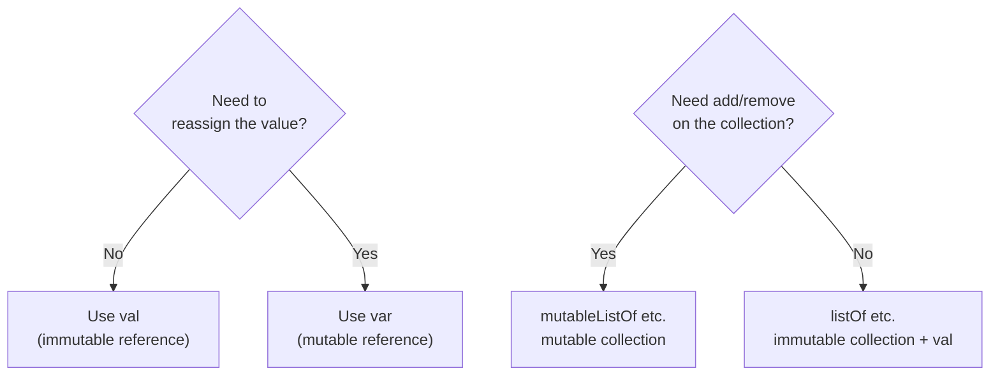
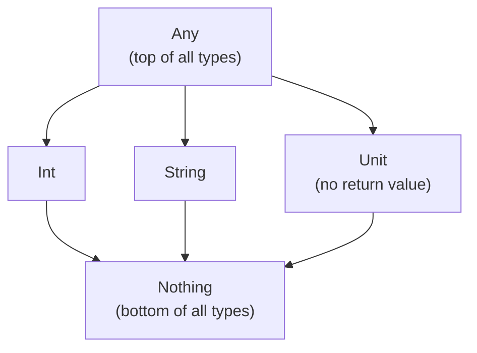

## Overall Analogy: Boxes and Labels

Kotlin variables and types are easy to understand by analogy to **boxes and labels**. A box holds items (values), and the label (type) tells you what kind of item it can hold. `val` is a locked box that can't be replaced once filled; `var` is a regular box whose contents can be swapped.

| Analogy | Kotlin Concept | Role |
|---------|----------------|------|
| Locked box | `val` (immutable) | Cannot be replaced once filled |
| Regular box | `var` (mutable) | Contents can be replaced any time |
| Box label | Type declaration | Defines the kind of value it can hold |
| Auto-labeling machine | Type inference | Compiler decides the type automatically |
| Viewing window | String template | Insert a value directly into a string |

---

> **Target Audience**: Learners who have read [Basic Syntax](../basics/)
> **Prerequisites**: Kotlin basic syntax (packages, entry point, expressions)
> **Estimated Time**: About 25 minutes
> **What You'll Learn**: You'll choose between `val` and `var` correctly, use basic types, and print values with string templates.


- Use **`val` by default**; use `var` only when truly needed
- **Type inference** is strong, so you can usually omit type annotations
- **String templates** with `"$variable"` and `"${expression}"` make string composition easy
- **`Any`**, **`Unit`**, **`Nothing`** are special types in Kotlin's type hierarchy


#### Why Distinguish val and var?

State mutation is one of the main causes of bugs. As code grows, it becomes harder to track where a value was changed. Kotlin makes **immutability the default** to reduce this problem at the design level.



*Figure: val/var selection flow — based on whether reassignment is needed and whether the collection must be mutable.*

---

#### val — Immutable Variables

A variable declared with `val` **cannot be reassigned after initialization**.

```kotlin
val name = "Kotlin"
val version = 2
val pi = 3.14159

// name = "Java"  // Compile error! val cannot be reassigned
```


`val` means the **reference** doesn't change, not that the object it points to is internally immutable.

```kotlin
val list = mutableListOf(1, 2, 3)
list.add(4)      // OK — the list's contents can change
// list = mutableListOf() // Error — the reference itself cannot change
```


#### var — Mutable Variables

A variable declared with `var` **can be reassigned**. Use only when truly needed.

```kotlin
var count = 0
count = count + 1   // OK
count += 1          // OK (shorthand)

var message = "start"
message = "done"    // OK
```

**When to Use var**

| Situation | Description |
|-----------|-------------|
| Loop accumulator | When values accumulate during iteration |
| External library requirement | When the library requires mutable state |
| Split initialization | When declaration and initialization must be separated |

---

#### Basic Types

Every type in Kotlin is an object. Even numeric types have methods.

**Numeric Types**

| Type | Size | Range | Example |
|------|------|-------|---------|
| `Byte` | 8 bit | -128 to 127 | `val b: Byte = 42` |
| `Short` | 16 bit | -32768 to 32767 | `val s: Short = 1000` |
| `Int` | 32 bit | ~±2.1 billion | `val i = 42` |
| `Long` | 64 bit | ~±9.2 quintillion | `val l = 1_000_000L` |
| `Float` | 32 bit | Single precision | `val f = 3.14f` |
| `Double` | 64 bit | Double precision | `val d = 3.14159` |

```kotlin
// Numeric literals
val million = 1_000_000     // Underscores improve readability
val hex = 0xFF              // Hexadecimal
val binary = 0b1010_1010    // Binary
val longVal = 100L          // Long literal

// Methods on numeric types
val n = 42
println(n.toString())   // "42"
println(n.toDouble())   // 42.0
println(42.coerceIn(0, 100))  // 42 (clamp into range)
```

**Boolean Type**

```kotlin
val isActive = true
val isDisabled = false

// Logical operators
val and = isActive && !isDisabled   // true
val or = isActive || isDisabled     // true
val not = !isActive                 // false
```

**Char Type**

```kotlin
val letter: Char = 'K'
val digit: Char = '5'

println(letter.code)            // Unicode code point: 75
println(digit.isDigit())        // true
println(letter.isUpperCase())   // true
println(letter.lowercaseChar()) // 'k'
```

**String Type**

```kotlin
val greeting = "Hello"
println(greeting.length)         // 5
println(greeting[0])             // 'H'
println(greeting.uppercase())    // "HELLO"
println("  spaces  ".trim())     // "spaces"

// Multiline strings
val multiline = """
    SELECT *
    FROM users
    WHERE active = true
""".trimIndent()
```

---

#### Type Inference

The Kotlin compiler infers the type from the initial value. In most cases, you can omit the type annotation.

```kotlin
val name = "Kotlin"          // Inferred as String
val count = 42               // Inferred as Int
val pi = 3.14                // Inferred as Double
val flag = true              // Inferred as Boolean
val nums = listOf(1, 2, 3)   // Inferred as List<Int>
```

**When Explicit Type Annotations Are Needed**

```kotlin
// 1. When you want a specific type
val longNum: Long = 42         // Default inference is Int; specify Long
val floatNum: Float = 3.14f

// 2. Empty collections
val emptyList: List<String> = emptyList()  // Cannot infer

// 3. Function parameters (always required)
fun add(a: Int, b: Int): Int = a + b

// 4. Return type of a recursive function
fun factorial(n: Int): Int = if (n <= 1) 1 else n * factorial(n - 1)

// 5. Public API — explicit recommended for readability
fun fetchUser(id: Long): User = userRepository.findById(id)
```

---

#### String Templates

Kotlin's string template (`$`) inserts a variable or expression directly into a string.

```kotlin
val name = "John"
val age = 30

// Insert a variable
println("Name: $name")                    // Name: John

// Insert an expression — use ${ }
println("Age: ${age}")                    // Age: 30
println("Next year's age: ${age + 1}")    // Next year's age: 31
println("Name length: ${name.length}")    // Name length: 4

// Nested expression
val items = listOf("apple", "pear", "persimmon")
println("List: ${items.joinToString(", ")}")  // List: apple, pear, persimmon
```

**Using the Dollar Sign as a Character**

```kotlin
val price = 1000
println("Price: \$${price}")   // Price: $1000
// or
println("Price: ${'$'}${price}")
```

---

#### Numeric Conversion

Kotlin **does not allow implicit numeric conversions**. You must call a conversion function explicitly.

```kotlin
val intVal: Int = 42
// val longVal: Long = intVal   // Compile error!
val longVal: Long = intVal.toLong()   // OK

// List of conversion functions
val n = 100
n.toByte()      // Byte
n.toShort()     // Short
n.toInt()       // Int
n.toLong()      // Long
n.toFloat()     // Float
n.toDouble()    // Double
n.toChar()      // Char (converted from code point)
```

**String <-> Number Conversion**

```kotlin
// String -> Number
val num = "42".toInt()              // 42
val safe = "abc".toIntOrNull()      // null (parsing fails)
val withDefault = "abc".toIntOrNull() ?: 0  // 0

// Number -> String
val str = 42.toString()             // "42"
val formatted = "%.2f".format(3.14159)  // "3.14"
```

---

#### Any, Unit, Nothing

These are three special types in Kotlin's type hierarchy.



*Figure: Kotlin type hierarchy — from Any (top) down to Nothing (bottom), including Int, String, and Unit.*

**Any — Ancestor of All Types**

```kotlin
fun describe(value: Any): String = when (value) {
    is Int    -> "Integer: $value"
    is String -> "String: $value"
    is Boolean -> "Boolean: $value"
    else      -> "Other: $value"
}

println(describe(42))       // Integer: 42
println(describe("hello"))  // String: hello
```

**Unit — Type That Has No Return Value**

`Unit` corresponds to Java's `void`. It's the return type of a function with no return value.

```kotlin
fun logMessage(msg: String): Unit {
    println("[LOG] $msg")
    // return Unit is implicitly added
}

// The Unit return type can be omitted
fun logMessage2(msg: String) {
    println("[LOG] $msg")
}
```

**Nothing — Expresses "No Normal Return"**

`Nothing` is the type of a function that does not return. Used for throwing exceptions or infinite loops.

```kotlin
// A function that always throws
fun fail(message: String): Nothing {
    throw IllegalStateException(message)
}

// Nothing is a subtype of every type, so it's type-compatible
val name: String = System.getenv("APP_NAME") ?: fail("APP_NAME environment variable missing")
```

| Special Type | Position | Meaning |
|--------------|----------|---------|
| `Any` | Top of type hierarchy | Common ancestor of all Kotlin objects |
| `Unit` | Middle of type hierarchy | No return value (corresponds to void) |
| `Nothing` | Bottom of type hierarchy | No normal return |

---

#### Code Example: Putting It All Together

```kotlin
package com.example.types

fun main() {
    // val / var
    val language = "Kotlin"
    var year = 2011  // JetBrains first revealed Project Kotlin in July 2011
    year = 2016      // Kotlin 1.0 official release in February 2016

    // Type inference
    val pi = 3.14159          // Double
    val million = 1_000_000   // Int

    // String template
    println("$language release year: $year")
    println("Pi to 2 decimals: ${"%.2f".format(pi)}")
    println("Half a million: ${million / 2}")

    // Numeric conversion
    val intVal = 42
    val longVal: Long = intVal.toLong()
    val parsed = "100".toIntOrNull() ?: 0

    // Using the Any type
    val values: List<Any> = listOf(1, "two", true, 3.0)
    for (v in values) {
        println("${v::class.simpleName}: $v")
    }
}
```

---

#### Key Points


- Use **`val`** by default; use **`var`** only when truly needed
- **Type inference** allows you to omit type annotations in most cases
- Use **string templates** `"$variable"`, `"${expression}"` to compose strings
- **Numeric conversions are explicit** (`toInt()`, `toLong()`, etc.)
- **`Any`**, **`Unit`**, **`Nothing`** are the top, no-return, and bottom types respectively


#### Next Steps

- [Functions](../functions/) - Learn `fun` definitions, default/named arguments, and lambdas
- [Null Safety](../null-safety/) - Learn nullable types and safe call operators
