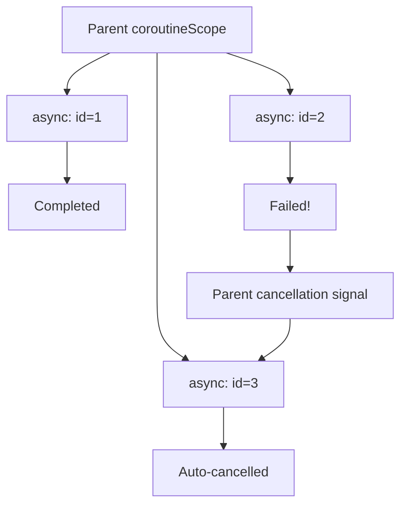

> **Estimated time**: about 30 minutes


- `async { }` + `await()` — call two APIs in parallel, faster than serial
- Using `suspend fun` on `@GetMapping` enables coroutine controllers in Spring MVC
- `withTimeout(ms) { }` — set a timeout; on exceed throws `TimeoutCancellationException`
- Structured concurrency — when the parent coroutine is cancelled, child coroutines are also cancelled automatically


**Target audience**: Developers with Kotlin basics and Spring Boot experience
**Prerequisites**: [Spring Boot Integration](spring-boot-integration/), basic coroutine concepts

---

Apply coroutines to real-world scenarios. Call two external APIs in parallel, use `suspend fun` inside Spring MVC controllers, and handle timeouts and cancellation propagation.

#### Step 1 — Dependencies

```kotlin
// build.gradle.kts
dependencies {
    implementation("org.springframework.boot:spring-boot-starter-web")
    implementation("org.springframework.boot:spring-boot-starter-webflux") // For WebClient
    implementation("org.jetbrains.kotlinx:kotlinx-coroutines-core:1.8.1")
    implementation("org.jetbrains.kotlinx:kotlinx-coroutines-reactor:1.8.1") // Spring integration
    implementation("org.jetbrains.kotlin:kotlin-reflect")
    implementation("com.fasterxml.jackson.module:jackson-module-kotlin")
    testImplementation("org.springframework.boot:spring-boot-starter-test")
    testImplementation("org.jetbrains.kotlinx:kotlinx-coroutines-test:1.8.1")
}
```

`kotlinx-coroutines-reactor` bridges Reactor (Project Reactor) and coroutines, allowing `suspend fun` to be used in Spring MVC.

#### Step 2 — Calling Two External APIs in Parallel

The most common real-world scenario: fetch user info and order history from different services.

```kotlin
// src/main/kotlin/com/example/coroutine/service/UserDashboardService.kt
package com.example.coroutine.service

import kotlinx.coroutines.async
import kotlinx.coroutines.coroutineScope
import kotlinx.coroutines.withTimeout
import org.slf4j.LoggerFactory
import org.springframework.stereotype.Service
import org.springframework.web.reactive.function.client.WebClient
import org.springframework.web.reactive.function.client.awaitBody

data class UserInfo(val id: Long, val name: String, val email: String)
data class OrderHistory(val userId: Long, val orders: List<String>, val totalAmount: Long)
data class UserDashboard(val user: UserInfo, val orders: OrderHistory, val loadTimeMs: Long)

@Service
class UserDashboardService(
    private val webClient: WebClient
) {
    private val log = LoggerFactory.getLogger(this::class.java)

    suspend fun getDashboard(userId: Long): UserDashboard {
        val startTime = System.currentTimeMillis()
        log.info("Dashboard query started: userId=$userId")

        // coroutineScope — wait until both tasks complete
        // If one fails, the other is cancelled (structured concurrency)
        return coroutineScope {
            // async — call two APIs concurrently
            val userDeferred = async {
                withTimeout(3_000L) {   // 3-second timeout
                    fetchUserInfo(userId)
                }
            }

            val ordersDeferred = async {
                withTimeout(5_000L) {   // 5-second timeout
                    fetchOrderHistory(userId)
                }
            }

            // Wait for both results — parallel execution
            val user = userDeferred.await()
            val orders = ordersDeferred.await()
            val elapsed = System.currentTimeMillis() - startTime

            log.info("Dashboard query complete: ${elapsed}ms")
            UserDashboard(user, orders, elapsed)
        }
    }

    private suspend fun fetchUserInfo(userId: Long): UserInfo {
        log.info("Fetching user info: $userId")
        // In real code, you'd call an external API
        // return webClient.get()
        //     .uri("http://user-service/users/$userId")
        //     .retrieve()
        //     .awaitBody<UserInfo>()

        // Simulation
        kotlinx.coroutines.delay(500L)
        return UserInfo(userId, "Alice", "alice@example.com")
    }

    private suspend fun fetchOrderHistory(userId: Long): OrderHistory {
        log.info("Fetching order history: $userId")
        // Simulation
        kotlinx.coroutines.delay(800L)
        return OrderHistory(userId, listOf("ORDER-001", "ORDER-002"), 150_000L)
    }
}
```

Instead of serial processing (500ms + 800ms = 1300ms), parallel processing (max(500ms, 800ms) = 800ms) is about 40% faster.

#### Step 3 — suspend Controller

You can use `suspend fun` as a controller method in Spring MVC. When the coroutine-Reactor adapter (`kotlinx-coroutines-reactor`) is on the classpath, Spring automatically recognizes coroutines.

```kotlin
// src/main/kotlin/com/example/coroutine/controller/DashboardController.kt
package com.example.coroutine.controller

import com.example.coroutine.service.UserDashboard
import com.example.coroutine.service.UserDashboardService
import kotlinx.coroutines.TimeoutCancellationException
import org.slf4j.LoggerFactory
import org.springframework.http.HttpStatus
import org.springframework.web.bind.annotation.*

@RestController
@RequestMapping("/api")
class DashboardController(
    private val dashboardService: UserDashboardService
) {
    private val log = LoggerFactory.getLogger(this::class.java)

    // suspend fun — Spring runs this as a coroutine
    @GetMapping("/users/{userId}/dashboard")
    suspend fun getDashboard(@PathVariable userId: Long): UserDashboard {
        return dashboardService.getDashboard(userId)
    }

    // Exception handling — including timeouts
    @GetMapping("/users/{userId}/dashboard-safe")
    suspend fun getDashboardSafe(@PathVariable userId: Long): Any {
        return try {
            dashboardService.getDashboard(userId)
        } catch (ex: TimeoutCancellationException) {
            log.warn("Dashboard query timed out: userId=$userId")
            mapOf("error" to "Request timed out", "code" to "TIMEOUT")
        } catch (ex: Exception) {
            log.error("Dashboard query failed: userId=$userId", ex)
            mapOf("error" to "An internal service error occurred", "code" to "INTERNAL_ERROR")
        }
    }
}
```

#### Step 4 — Using withTimeout

```kotlin
// src/main/kotlin/com/example/coroutine/service/ResilientService.kt
package com.example.coroutine.service

import kotlinx.coroutines.*
import org.slf4j.LoggerFactory
import org.springframework.stereotype.Service

@Service
class ResilientService {
    private val log = LoggerFactory.getLogger(this::class.java)

    // Timeout + fallback
    suspend fun fetchWithFallback(id: Long): String {
        return try {
            withTimeout(2_000L) {
                slowExternalCall(id)
            }
        } catch (ex: TimeoutCancellationException) {
            log.warn("Timeout — returning fallback: id=$id")
            "fallback"
        }
    }

    // Retry logic
    suspend fun fetchWithRetry(id: Long, maxRetries: Int = 3): String {
        repeat(maxRetries) { attempt ->
            try {
                return withTimeout(2_000L) {
                    slowExternalCall(id)
                }
            } catch (ex: TimeoutCancellationException) {
                log.warn("Attempt ${attempt + 1}/$maxRetries failed")
                if (attempt < maxRetries - 1) {
                    delay(500L * (attempt + 1))   // Exponential backoff
                }
            }
        }
        throw RuntimeException("Failed after $maxRetries retries: id=$id")
    }

    private suspend fun slowExternalCall(id: Long): String {
        delay(1_500L)    // Simulate 1.5-second delay
        return "result-$id"
    }
}
```

#### Step 5 — Cancellation Propagation via Structured Concurrency

With coroutine structured concurrency, **when the parent is cancelled, all child coroutines are automatically cancelled**.

```kotlin
// src/main/kotlin/com/example/coroutine/service/BatchService.kt
package com.example.coroutine.service

import kotlinx.coroutines.*
import org.slf4j.LoggerFactory
import org.springframework.stereotype.Service

@Service
class BatchService {
    private val log = LoggerFactory.getLogger(this::class.java)

    // Process multiple items in parallel — if one fails, all are cancelled
    suspend fun processBatch(ids: List<Long>): List<String> = coroutineScope {
        ids.map { id ->
            async {
                log.info("Processing started: $id")
                processItem(id)
            }
        }.map { deferred ->
            deferred.await()   // Collect all results
        }
    }

    // Independent parallel processing — individual failures don't affect others
    suspend fun processBatchIndependent(ids: List<Long>): Map<Long, Result<String>> =
        coroutineScope {
            ids.map { id ->
                id to async {
                    runCatching { processItem(id) }   // Handle exceptions individually
                }
            }.associate { (id, deferred) ->
                id to deferred.await()
            }
        }

    // Cancellable work — handle CancellationException
    suspend fun cancellableWork(id: Long): String {
        return try {
            repeat(10) { i ->
                ensureActive()   // Check cancellation status
                delay(100L)
                log.info("In progress $i/10: id=$id")
            }
            "Done: $id"
        } catch (ex: CancellationException) {
            log.info("Work cancelled: id=$id")
            throw ex   // CancellationException MUST be re-thrown
        }
    }

    private suspend fun processItem(id: Long): String {
        delay(200L)
        if (id == 99L) throw RuntimeException("Processing failed: $id")
        return "result-$id"
    }
}
```



*Figure: Exception propagation in structured concurrency — when one of three async tasks fails, the parent coroutineScope receives a cancellation signal and the remaining child coroutines are automatically cancelled.*

#### Step 6 — Exception Handling Patterns

```kotlin
// src/main/kotlin/com/example/coroutine/service/ErrorHandlingService.kt
package com.example.coroutine.service

import kotlinx.coroutines.*
import org.slf4j.LoggerFactory
import org.springframework.stereotype.Service

@Service
class ErrorHandlingService {
    private val log = LoggerFactory.getLogger(this::class.java)

    // CoroutineExceptionHandler — handle uncaught exceptions in launch
    private val exceptionHandler = CoroutineExceptionHandler { _, ex ->
        log.error("Unhandled coroutine exception", ex)
    }

    // SupervisorJob — sibling coroutines continue even if one child fails
    suspend fun independentTasks() = supervisorScope {
        val task1 = async {
            delay(100L)
            "task1 done"
        }

        val task2 = async {
            delay(200L)
            throw RuntimeException("task2 failed")
        }

        val task3 = async {
            delay(300L)
            "task3 done"
        }

        // task1 and task3 still complete even if task2 fails
        listOf(
            runCatching { task1.await() }.getOrDefault("task1 failed"),
            runCatching { task2.await() }.getOrDefault("task2 failed"),
            runCatching { task3.await() }.getOrDefault("task3 failed")
        )
    }
}
```

#### Step 7 — Running and Testing

```bash
./gradlew bootRun
```

```bash
# Parallel API call test
curl http://localhost:8080/api/users/1/dashboard

# Example response
# {
#   "user": {"id":1,"name":"Alice","email":"alice@example.com"},
#   "orders": {"userId":1,"orders":["ORDER-001","ORDER-002"],"totalAmount":150000},
#   "loadTimeMs": 823
# }

# Timeout handling test
curl http://localhost:8080/api/users/1/dashboard-safe
```

Simple test:

```kotlin
// src/test/kotlin/com/example/coroutine/service/UserDashboardServiceTest.kt
package com.example.coroutine.service

import kotlinx.coroutines.test.runTest
import org.junit.jupiter.api.Test
import org.springframework.boot.test.context.SpringBootTest

@SpringBootTest
class UserDashboardServiceTest(
    private val dashboardService: UserDashboardService
) {
    @Test
    fun `dashboard query runs in parallel`() = runTest {
        val start = System.currentTimeMillis()
        val dashboard = dashboardService.getDashboard(1L)
        val elapsed = System.currentTimeMillis() - start

        assert(dashboard.user.id == 1L)
        // Completes faster than serial (1300ms)
        assert(elapsed < 1100L) { "Parallel execution is slower than expected: ${elapsed}ms" }
    }
}
```


- `coroutineScope { }` + `async { }.await()` — parallel execution with structured concurrency
- `suspend fun` + Spring MVC — coroutine controllers without WebFlux
- `withTimeout(ms) { }` — set a timeout, handle `TimeoutCancellationException`
- `CancellationException` MUST be re-thrown for cancellation to propagate correctly
- `supervisorScope` — use when a child's failure shouldn't affect siblings


---

### Writing Tests

For coroutine testing, use `kotlinx-coroutines-test`. For mocking suspend functions, use MockK. For Flow assertions, use Turbine. Add the following to `build.gradle.kts`.

```kotlin
// build.gradle.kts — dependencies block
testImplementation("org.jetbrains.kotlinx:kotlinx-coroutines-test:1.8.1")
testImplementation("io.mockk:mockk:1.13.10")
testImplementation("app.cash.turbine:turbine:1.1.0")
```

**`runTest` basic pattern + `StandardTestDispatcher`**

`runTest` replaces `delay()` with a virtual clock so tests complete immediately. With `StandardTestDispatcher` you can advance virtual time explicitly using `advanceTimeBy()`.

```kotlin
// src/test/kotlin/com/example/coroutine/service/ResilientServiceTest.kt
package com.example.coroutine.service

import kotlinx.coroutines.ExperimentalCoroutinesApi
import kotlinx.coroutines.launch
import kotlinx.coroutines.test.StandardTestDispatcher
import kotlinx.coroutines.test.advanceTimeBy
import kotlinx.coroutines.test.runTest
import org.assertj.core.api.Assertions.assertThat
import org.junit.jupiter.api.Test

@OptIn(ExperimentalCoroutinesApi::class)
class ResilientServiceTest {

    private val service = ResilientService()

    @Test
    fun `delay is handled instantly with virtual time inside runTest`() = runTest {
        // The internal delay(1_500L) does not actually wait — the test completes immediately
        val result = service.fetchWithFallback(1L)
        assertThat(result).isEqualTo("result-1")
    }

    @Test
    fun `StandardTestDispatcher verifies timeout boundary explicitly`() = runTest(StandardTestDispatcher()) {
        var result: String? = null
        val job = launch { result = service.fetchWithFallback(1L) }

        // Advance 1499ms — internal delay(1500L) not yet complete, still within withTimeout(2000L)
        advanceTimeBy(1_499L)
        assertThat(result).isNull()

        // Advance the rest — delay completes
        advanceTimeBy(2L)
        job.join()
        assertThat(result).isEqualTo("result-1")
    }
}
```

**Mocking suspend functions with MockK `coEvery`**

MockK mocks suspend functions using `coEvery { ... } returns ...`. Use `coVerify` to verify calls.

```kotlin
// src/test/kotlin/com/example/coroutine/service/UserDashboardMockTest.kt
package com.example.coroutine.service

import io.mockk.coEvery
import io.mockk.coVerify
import io.mockk.mockk
import kotlinx.coroutines.test.runTest
import org.assertj.core.api.Assertions.assertThat
import org.junit.jupiter.api.Test

class UserDashboardMockTest {

    private val service: UserDashboardService = mockk()

    @Test
    fun `dashboard query success returns user and orders`() = runTest {
        val expectedUser   = UserInfo(1L, "Alice", "alice@example.com")
        val expectedOrders = OrderHistory(1L, listOf("ORDER-001"), 50_000L)
        val expected       = UserDashboard(expectedUser, expectedOrders, 100L)

        // coEvery — mock suspend function
        coEvery { service.getDashboard(1L) } returns expected

        val result = service.getDashboard(1L)

        assertThat(result.user.name).isEqualTo("Alice")
        assertThat(result.orders.totalAmount).isEqualTo(50_000L)

        // coVerify — verify the suspend function was called
        coVerify(exactly = 1) { service.getDashboard(1L) }
    }

    @Test
    fun `exception from getDashboard propagates to the caller`() = runTest {
        coEvery { service.getDashboard(99L) } throws RuntimeException("Service error")

        val exception = runCatching { service.getDashboard(99L) }.exceptionOrNull()

        assertThat(exception).isInstanceOf(RuntimeException::class.java)
        assertThat(exception?.message).isEqualTo("Service error")
    }
}
```

**Verifying Flows with Turbine**

Turbine uses a `flow.test { }` block to verify emitted Flow values in order via `awaitItem()`, `awaitComplete()`, and so on.

```kotlin
// src/test/kotlin/com/example/coroutine/service/ProgressFlowTest.kt
package com.example.coroutine.service

import app.cash.turbine.test
import kotlinx.coroutines.flow.flow
import kotlinx.coroutines.test.runTest
import org.assertj.core.api.Assertions.assertThat
import org.junit.jupiter.api.Test

class ProgressFlowTest {

    // Example function emitting progress updates as a Flow
    private fun progressFlow(ids: List<Long>) = flow {
        for (id in ids) {
            emit("Processing: $id")
        }
        emit("Done")
    }

    @Test
    fun `progressFlow emits each ID in order and completes`() = runTest {
        progressFlow(listOf(1L, 2L, 3L)).test {
            assertThat(awaitItem()).isEqualTo("Processing: 1")
            assertThat(awaitItem()).isEqualTo("Processing: 2")
            assertThat(awaitItem()).isEqualTo("Processing: 3")
            assertThat(awaitItem()).isEqualTo("Done")
            awaitComplete()   // Verify the Flow terminates normally
        }
    }

    @Test
    fun `flow exception is verified with awaitError`() = runTest {
        val errorFlow = flow<String> {
            emit("Start")
            throw RuntimeException("Processing failed")
        }

        errorFlow.test {
            assertThat(awaitItem()).isEqualTo("Start")
            val error = awaitError()
            assertThat(error).isInstanceOf(RuntimeException::class.java)
            assertThat(error.message).isEqualTo("Processing failed")
        }
    }
}
```


- `runTest` — the standard entry point for all coroutine tests. Handles `delay()` with virtual time.
- `StandardTestDispatcher` — use when you want to control the virtual clock manually.
- `UnconfinedTestDispatcher` — use when coroutines should run immediately (eager execution).
- `coEvery` / `coVerify` — mock suspend functions and verify their calls.
- `Turbine` — verify emissions from `Flow`, `StateFlow`, and `SharedFlow` in order.


Run the tests.

```bash
./gradlew test
```

#### Next Steps

- [Multiplatform Intro](multiplatform-intro/) — how coroutines work in KMP
- [Coroutines Basics](../concepts/coroutines-basics/) — coroutine builders and dispatcher mechanics

> Tip: **Further reading**: As parallel calls grow, analyzing the response-time distribution becomes important. See [Golden Signals: Latency]() for p95/p99 measurement criteria and operational perspectives.
