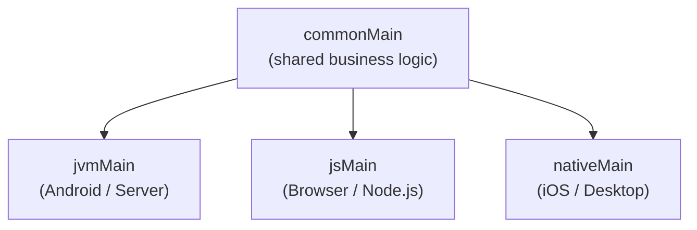

> **Estimated time**: about 30 minutes


- `commonMain` — Kotlin code shared across all platforms
- `expect` — declared in the common module; `actual` — implemented per platform
- `jvmMain`, `jsMain` — platform-specific code
- Reuse business logic written once on JVM (backend/Android) and JS (frontend)


**Target audience**: Intermediate or above Kotlin developers
**Prerequisites**: [Environment Setup](setup/), basic Kotlin syntax

---

Use Kotlin Multiplatform (KMP) to share business logic across multiple platforms. We'll write a date formatter as a common module and implement it for both JVM and JS in a mini project.

#### Step 1 — Project Structure

In a KMP project, code is organized into source sets.

```text
shared/
├── build.gradle.kts
└── src/
    ├── commonMain/kotlin/          # Code shared across all platforms
    ├── commonTest/kotlin/          # Common tests
    ├── jvmMain/kotlin/             # JVM-only implementation
    ├── jvmTest/kotlin/
    ├── jsMain/kotlin/              # JS-only implementation
    └── jsTest/kotlin/
```



*Figure: KMP source set branching — common business logic in commonMain branches out to platform-specific code in jvmMain, jsMain, and nativeMain.*

#### Step 2 — Project Creation

In IntelliJ IDEA: **File** → **New** → **Project** → **Kotlin Multiplatform** → **Library**.

Or write `build.gradle.kts` directly.

```kotlin
// settings.gradle.kts
rootProject.name = "kmp-date-formatter"
include(":shared")
```

```kotlin
// shared/build.gradle.kts
plugins {
    kotlin("multiplatform") version "2.0.0"
}

group = "com.example"
version = "0.1.0"

kotlin {
    jvm {
        jvmToolchain(17)
        testRuns["test"].executionTask.configure {
            useJUnitPlatform()
        }
    }

    js(IR) {
        browser {
            testTask {
                useKarma {
                    useChromeHeadless()
                }
            }
        }
        nodejs()
    }

    sourceSets {
        val commonMain by getting {
            dependencies {
                implementation("org.jetbrains.kotlinx:kotlinx-datetime:0.6.0")
            }
        }
        val commonTest by getting {
            dependencies {
                implementation(kotlin("test"))
            }
        }
        val jvmMain by getting
        val jvmTest by getting
        val jsMain by getting
        val jsTest by getting
    }
}
```

#### Step 3 — Define the Common Interface (expect)

`expect` is a contract that says "this declaration must be implemented by each platform."

```kotlin
// shared/src/commonMain/kotlin/com/example/datetime/DateFormatter.kt
package com.example.datetime

import kotlinx.datetime.LocalDate
import kotlinx.datetime.LocalDateTime

// expect declaration — each platform provides an implementation
expect class PlatformDateFormatter() {
    fun formatDate(date: LocalDate): String
    fun formatDateTime(dateTime: LocalDateTime): String
    fun formatRelative(date: LocalDate): String   // "3 days ago", "today", etc.
}

// Common logic — business logic that uses expect
class DateService(private val formatter: PlatformDateFormatter = PlatformDateFormatter()) {

    fun describeDate(date: LocalDate): String {
        val relative = formatter.formatRelative(date)
        val formatted = formatter.formatDate(date)
        return "$relative ($formatted)"
    }

    fun describeDateTime(dateTime: LocalDateTime): String {
        return formatter.formatDateTime(dateTime)
    }
}
```

```kotlin
// shared/src/commonMain/kotlin/com/example/datetime/DateUtils.kt
package com.example.datetime

import kotlinx.datetime.*

// Platform-independent common utilities
fun LocalDate.isWeekend(): Boolean {
    val day = this.dayOfWeek
    return day == DayOfWeek.SATURDAY || day == DayOfWeek.SUNDAY
}

fun LocalDate.daysUntil(other: LocalDate): Long {
    return (other.toEpochDays() - this.toEpochDays()).toLong()
}

fun LocalDate.nextWeekday(): LocalDate {
    var next = this.plus(1, DateTimeUnit.DAY)
    while (next.isWeekend()) {
        next = next.plus(1, DateTimeUnit.DAY)
    }
    return next
}

data class DateRange(val start: LocalDate, val end: LocalDate) {
    val durationDays: Long get() = start.daysUntil(end)
    operator fun contains(date: LocalDate): Boolean = date >= start && date <= end
}
```

#### Step 4 — JVM Implementation (actual)

```kotlin
// shared/src/jvmMain/kotlin/com/example/datetime/DateFormatter.jvm.kt
package com.example.datetime

import kotlinx.datetime.*
import java.time.format.DateTimeFormatter
import java.time.format.FormatStyle
import java.util.Locale

actual class PlatformDateFormatter {
    private val locale = Locale.ENGLISH
    private val dateFormatter = DateTimeFormatter.ofLocalizedDate(FormatStyle.LONG)
        .withLocale(locale)
    private val dateTimeFormatter = DateTimeFormatter.ofLocalizedDateTime(FormatStyle.MEDIUM)
        .withLocale(locale)

    actual fun formatDate(date: LocalDate): String {
        val javaDate = java.time.LocalDate.of(date.year, date.monthNumber, date.dayOfMonth)
        return javaDate.format(dateFormatter)
    }

    actual fun formatDateTime(dateTime: LocalDateTime): String {
        val javaDateTime = java.time.LocalDateTime.of(
            dateTime.year, dateTime.monthNumber, dateTime.dayOfMonth,
            dateTime.hour, dateTime.minute, dateTime.second
        )
        return javaDateTime.format(dateTimeFormatter)
    }

    actual fun formatRelative(date: LocalDate): String {
        val today = Clock.System.now().toLocalDateTime(TimeZone.currentSystemDefault()).date
        val diff = today.daysUntil(date)
        return when {
            diff == 0L -> "today"
            diff == 1L -> "tomorrow"
            diff == -1L -> "yesterday"
            diff > 0 -> "in $diff days"
            else -> "${-diff} days ago"
        }
    }
}
```

#### Step 5 — JS Implementation (actual)

```kotlin
// shared/src/jsMain/kotlin/com/example/datetime/DateFormatter.js.kt
package com.example.datetime

import kotlinx.datetime.*

actual class PlatformDateFormatter {
    // In JS, use the Intl.DateTimeFormat API (accessed via kotlin-js)
    actual fun formatDate(date: LocalDate): String {
        // Format in English style
        return "${date.dayOfMonth}/${date.monthNumber}/${date.year}"
    }

    actual fun formatDateTime(dateTime: LocalDateTime): String {
        return "${formatDate(dateTime.date)} " +
               "${dateTime.hour.toString().padStart(2, '0')}:" +
               "${dateTime.minute.toString().padStart(2, '0')}"
    }

    actual fun formatRelative(date: LocalDate): String {
        val today = Clock.System.now().toLocalDateTime(TimeZone.currentSystemDefault()).date
        val diff = today.daysUntil(date)
        return when {
            diff == 0L -> "today"
            diff == 1L -> "tomorrow"
            diff == -1L -> "yesterday"
            diff > 0 -> "in $diff days"
            else -> "${-diff} days ago"
        }
    }
}
```

#### Step 6 — Common Tests

Common tests run on every platform.

```kotlin
// shared/src/commonTest/kotlin/com/example/datetime/DateUtilsTest.kt
package com.example.datetime

import kotlinx.datetime.LocalDate
import kotlin.test.Test
import kotlin.test.assertEquals
import kotlin.test.assertFalse
import kotlin.test.assertTrue

class DateUtilsTest {
    @Test
    fun `Saturday is weekend`() {
        val saturday = LocalDate(2026, 5, 16)   // Saturday
        assertTrue(saturday.isWeekend())
    }

    @Test
    fun `Monday is not weekend`() {
        val monday = LocalDate(2026, 5, 11)     // Monday
        assertFalse(monday.isWeekend())
    }

    @Test
    fun `verify date range membership`() {
        val range = DateRange(
            start = LocalDate(2026, 5, 1),
            end = LocalDate(2026, 5, 31)
        )
        assertTrue(LocalDate(2026, 5, 15) in range)
        assertFalse(LocalDate(2026, 6, 1) in range)
    }

    @Test
    fun `daysUntil calculation`() {
        val from = LocalDate(2026, 5, 1)
        val to = LocalDate(2026, 5, 10)
        assertEquals(9L, from.daysUntil(to))
    }

    @Test
    fun `nextWeekday skips weekends`() {
        val friday = LocalDate(2026, 5, 15)     // Friday
        val nextWorkday = friday.nextWeekday()
        assertEquals(LocalDate(2026, 5, 18), nextWorkday)  // Monday
    }
}
```

#### Step 7 — JVM Main (Usage Example)

```kotlin
// shared/src/jvmMain/kotlin/com/example/Main.kt
package com.example

import com.example.datetime.*
import kotlinx.datetime.*

fun main() {
    val formatter = PlatformDateFormatter()
    val service = DateService(formatter)

    // Format dates
    val today = Clock.System.now()
        .toLocalDateTime(TimeZone.currentSystemDefault()).date

    println("Today: ${formatter.formatDate(today)}")
    // e.g., Today: May 13, 2026

    // Relative dates
    val nextWeek = today.plus(7, kotlinx.datetime.DateTimeUnit.DAY)
    println("Next week: ${service.describeDate(nextWeek)}")
    // e.g., Next week: in 7 days (May 20, 2026)

    // Weekend check
    println("Is today a weekend: ${today.isWeekend()}")

    // Date range
    val projectPeriod = DateRange(
        start = today,
        end = today.plus(30, kotlinx.datetime.DateTimeUnit.DAY)
    )
    println("Project duration: ${projectPeriod.durationDays} days")
}
```

#### Step 8 — Build and Test

```bash
# Run common tests (JVM + JS)
./gradlew :shared:allTests

# JVM only
./gradlew :shared:jvmTest

# JS only
./gradlew :shared:jsTest

# Run on JVM
./gradlew :shared:jvmRun
```

**Build artifacts**

```bash
# JAR for JVM
shared/build/libs/shared-jvm-0.1.0.jar

# JS bundle (Node.js / browser)
shared/build/js/packages/kmp-date-formatter-shared/
```


`expect`/`actual` applies not only to classes but also to:

- Top-level functions: `expect fun currentTimeMs(): Long`
- Objects: `expect object Platform`
- Type aliases: `expect class IOException`
- Annotations: `expect annotation class Serializable`



- Validation rules and business rules — identical logic on backend and frontend
- Date/time handling, unit conversions, formatting rules
- API response parsing models (data classes)
- Algorithms and computation logic

UI, file systems, and lower-layer networking are usually a better fit for platform-specific code.



- `commonMain` — platform-independent shared code (business logic, models, utilities)
- `expect` — declared in the common module, implemented as `actual` per platform
- `jvmMain`, `jsMain` — can use platform-specific APIs
- Common tests run on every platform simultaneously, ensuring consistency
- Use official multiplatform libraries like `kotlinx-datetime` to expand the scope of shared code


---

### Writing Tests

KMP common tests live in the `commonTest` source set, and the `kotlin("test")` dependency alone is enough to run the same tests on both JVM and JS. Confirm the dependencies already present in the `commonTest` source set of `build.gradle.kts`.

```kotlin
// shared/build.gradle.kts — commonTest source set
val commonTest by getting {
    dependencies {
        implementation(kotlin("test"))  // Includes assertEquals, assertNotNull, etc.
    }
}
```

**`commonTest` source set layout**

```text
shared/src/
├── commonMain/kotlin/com/example/datetime/
│   ├── DateFormatter.kt   (expect declaration)
│   └── DateUtils.kt       (common utilities)
└── commonTest/kotlin/com/example/datetime/
    ├── DateRangeTest.kt   (common test — runs on both JVM and JS)
    └── DateServiceTest.kt
```

**Using kotlin.test basic assertions**

`kotlin.test` provides `assertEquals`, `assertNotNull`, `assertTrue`, `assertFailsWith`, and more. You can use them directly in `commonTest` without platform-specific imports.

```kotlin
// shared/src/commonTest/kotlin/com/example/datetime/DateRangeTest.kt
package com.example.datetime

import kotlinx.datetime.LocalDate
import kotlin.test.Test
import kotlin.test.assertEquals
import kotlin.test.assertFalse
import kotlin.test.assertNotNull
import kotlin.test.assertTrue

class DateRangeTest {

    @Test
    fun `DateRange durationDays returns days between two dates`() {
        val range = DateRange(
            start = LocalDate(2026, 5, 1),
            end   = LocalDate(2026, 5, 31)
        )
        assertEquals(30L, range.durationDays)
    }

    @Test
    fun `contains checks date membership`() {
        val range = DateRange(
            start = LocalDate(2026, 5, 1),
            end   = LocalDate(2026, 5, 31)
        )
        assertTrue(LocalDate(2026, 5, 15) in range)
        assertFalse(LocalDate(2026, 6, 1) in range)
        assertFalse(LocalDate(2026, 4, 30) in range)
    }

    @Test
    fun `nextWeekday returns the next weekday by skipping the weekend`() {
        val friday   = LocalDate(2026, 5, 15)   // Friday
        val expected = LocalDate(2026, 5, 18)   // Following Monday
        val actual   = friday.nextWeekday()
        assertEquals(expected, actual)
        assertNotNull(actual)
    }
}
```

**Common unit tests for `DateService`**

`DateService` uses `PlatformDateFormatter`, which requires `expect/actual` implementations. To verify the pure common logic, target classes like `DateRange`.

```kotlin
// shared/src/commonTest/kotlin/com/example/datetime/DateUtilsExtTest.kt
package com.example.datetime

import kotlinx.datetime.LocalDate
import kotlin.test.Test
import kotlin.test.assertEquals
import kotlin.test.assertFalse
import kotlin.test.assertTrue

class DateUtilsExtTest {

    @Test
    fun `Saturday and Sunday are weekend`() {
        val saturday = LocalDate(2026, 5, 16)
        val sunday   = LocalDate(2026, 5, 17)
        assertTrue(saturday.isWeekend())
        assertTrue(sunday.isWeekend())
    }

    @Test
    fun `weekdays are not weekend`() {
        val monday    = LocalDate(2026, 5, 11)
        val wednesday = LocalDate(2026, 5, 13)
        assertFalse(monday.isWeekend())
        assertFalse(wednesday.isWeekend())
    }

    @Test
    fun `daysUntil returns negative values too`() {
        val from = LocalDate(2026, 5, 10)
        val to   = LocalDate(2026, 5, 1)
        assertEquals(-9L, from.daysUntil(to))
    }
}
```

Run the tests on both JVM and JS simultaneously.

```bash
# Run common tests across all platforms
./gradlew :shared:allTests

# JVM only
./gradlew :shared:jvmTest

# JS only
./gradlew :shared:jsTest
```


| Function | Description |
|----------|-------------|
| `assertEquals(expected, actual)` | Asserts two values are equal |
| `assertNotNull(value)` | Asserts the value is non-null |
| `assertTrue(condition)` | Asserts the condition is true |
| `assertFalse(condition)` | Asserts the condition is false |
| `assertFailsWith<T> { }` | Asserts that a specific exception is thrown |

`kotlin.test` maps to JUnit 5 on JVM and Mocha on JS, so no platform-specific setup is required.


#### Next Steps

- [Multiplatform Overview](../concepts/multiplatform-overview/) — KMP architecture and platform support status
- [Environment Setup](setup/) — Gradle Kotlin DSL deep dive
