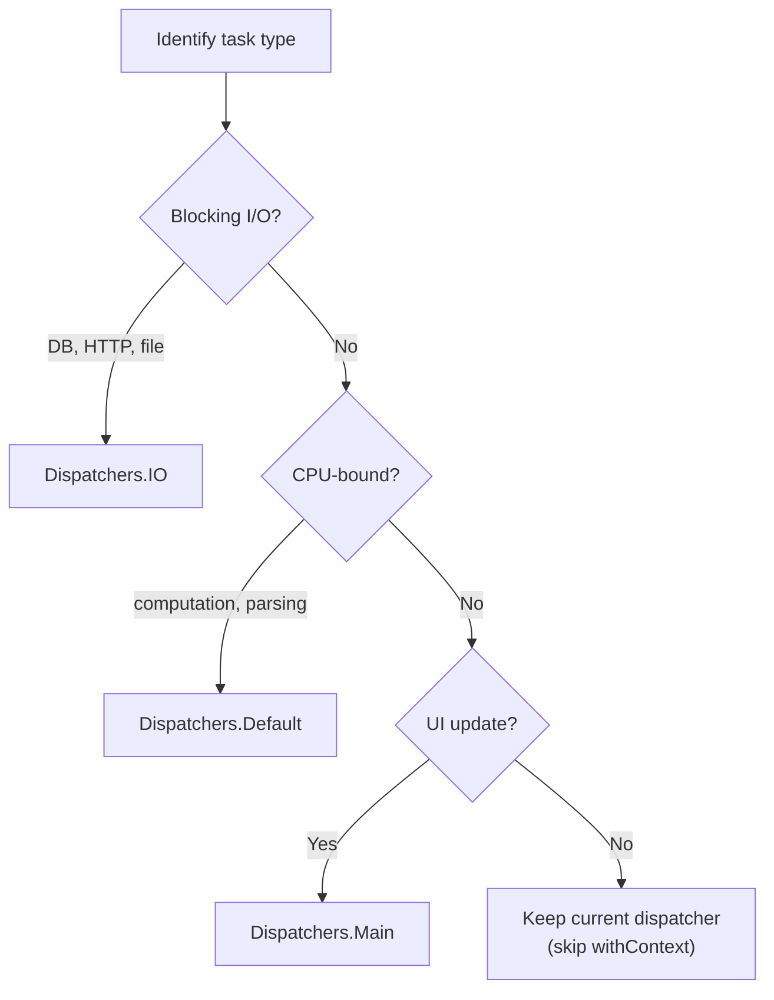

Step-by-step instructions for finding and optimizing performance bottlenecks in Kotlin/JVM applications.

**Estimated time**: about 20-25 minutes


- Don't guess — **measure first**. Find real hotspots with Async Profiler or JFR.
- Coroutine dispatcher choice has the biggest impact. Use `Dispatchers.IO` for I/O and `Dispatchers.Default` for CPU.
- Reduce lambda capture and boxing costs with `inline` functions and primitive types.
- Measurements taken before JIT warm-up don't reflect real production performance.


---

## What This Guide Solves

Use this guide in the following situations:

- When API response times are slower than expected and you need to find the bottleneck
- When performance got worse after switching to coroutines
- When GC (garbage collection) pressure is causing latency
- When you want to reduce the overhead of code that uses many lambdas and higher-order functions

---

## Before You Start: Measurement Principles


Performance work always follows **measure → analyze → optimize → re-measure**. Trust profiler data over the intuition that "this part looks slow."


**Metrics to measure:**

| Metric | Description | Tool |
|--------|-------------|------|
| Throughput | Requests per second (RPS) | k6, wrk, Gatling |
| Latency | p50/p95/p99 response time | k6, Gatling |
| CPU usage | CPU time per method | Async Profiler, JFR |
| Memory allocation | GC frequency, heap usage | JFR, VisualVM |
| Thread state | Wait/run ratio | Async Profiler |

---

## Step 1: Install and Use Async Profiler

Async Profiler profiles CPU and memory allocations with low overhead.

**Install:**

```bash
# Linux / macOS
wget https://github.com/async-profiler/async-profiler/releases/download/v3.0/async-profiler-3.0-linux-x64.tar.gz
tar -xzf async-profiler-3.0-linux-x64.tar.gz
cd async-profiler-3.0-linux-x64
```

**CPU profiling (30 seconds):**

```bash
# Find the running JVM PID
jps -l

# CPU profiling (30 seconds, generates a Flamegraph HTML)
./asprof -d 30 -f /tmp/cpu-flame.html <PID>
```

**Memory allocation profiling:**

```bash
# Find memory allocation hotspots
./asprof -e alloc -d 30 -f /tmp/alloc-flame.html <PID>
```

**Auto-profile a Spring Boot app at startup:**

```bash
java -agentpath:/path/to/libasyncProfiler.so=start,event=cpu,file=/tmp/profile.html \
     -jar my-app.jar
```

**Reading a flamegraph:**

- X axis: call frequency (wider means more calls)
- Y axis: call-stack depth (higher means deeper)
- The widest box is the hotspot

---

## Step 2: Use Java Flight Recorder (JFR)

JFR is the profiler bundled with JDK 11+. Low overhead makes it production-safe.

**Start JFR at app launch:**

```bash
java -XX:+FlightRecorder \
     -XX:StartFlightRecording=duration=60s,filename=/tmp/app.jfr \
     -jar my-app.jar
```

**Start JFR on a running JVM:**

```bash
# Record for 60 seconds
jcmd <PID> JFR.start duration=60s filename=/tmp/app.jfr

# Stop and save
jcmd <PID> JFR.stop name=1 filename=/tmp/app.jfr
```

**Analyzing JFR (JMC — JDK Mission Control):**

1. Download [JDK Mission Control](https://adoptium.net/jmc)
2. Open `/tmp/app.jfr`
3. **Method Profiling** tab: find CPU hotspots
4. **Garbage Collection** tab: check GC frequency and times
5. **Thread** tab: check thread wait times

**Record JFR events directly in code:**

```kotlin
import jdk.jfr.*

@Label("User lookup")
@Description("Execution info for UserService.getUser")
@Category("Application")
class UserFetchEvent : Event() {
    @Label("User ID")
    var userId: String = ""

    @Label("Duration (ms)")
    var durationMs: Long = 0
}

class UserService {
    fun getUser(id: String): User {
        val event = UserFetchEvent()
        event.begin()
        event.userId = id

        val start = System.currentTimeMillis()
        try {
            return findUser(id)
        } finally {
            event.end()
            event.durationMs = System.currentTimeMillis() - start
            event.commit()
        }
    }
}
```

---

## Step 3: Kotlin-Specific Performance Costs

### Lambda capture cost

```kotlin
// Problem: when a lambda captures outside variables, an object may be allocated
fun processItems(items: List<String>) {
    val prefix = "Processed"  // Captured
    items.forEach { item ->
        println("$prefix: $item")  // Lambda object may be created per call
    }
}

// Solution 1: use inline functions (forEach is already inline)
// The standard library forEach is inline so no lambda object is created

// Solution 2: move the lambda to class level (removes capture)
class ItemProcessor {
    private val prefix = "Processed"

    fun process(items: List<String>) {
        items.forEach(::printItem)  // Method reference
    }

    private fun printItem(item: String) {
        println("$prefix: $item")
    }
}
```

### Effect of inline functions

```kotlin
// Non-inline: the lambda is boxed as a Function object
fun <T> measureTime(block: () -> T): Pair<T, Long> {
    val start = System.nanoTime()
    val result = block()
    return result to (System.nanoTime() - start)
}

// inline: the lambda is inlined at the call site, no object allocation
inline fun <T> measureTimeInline(block: () -> T): Pair<T, Long> {
    val start = System.nanoTime()
    val result = block()
    return result to (System.nanoTime() - start)
}

// In hot paths, inline makes a difference
fun criticalPath() {
    repeat(1_000_000) {
        val (result, time) = measureTimeInline { heavyComputation() }
    }
}
```

### Boxing cost

```kotlin
// Bad: generics cause Int to be boxed to Integer
fun sumBoxed(numbers: List<Int>): Int {
    return numbers.fold(0) { acc, n -> acc + n }
    // List<Int> is actually List<Integer> — primitive types can't be used
}

// Optimized: use IntArray (no boxing)
fun sumUnboxed(numbers: IntArray): Int {
    return numbers.sum()  // primitive int array — no boxing
}

// Or use LongArray, DoubleArray, etc.
```

---

## Step 4: Optimize Coroutine Performance

### Dispatcher choice is key

```kotlin
import kotlinx.coroutines.*

// Bad: CPU work on the IO dispatcher
suspend fun badCpuTask(): Long = withContext(Dispatchers.IO) {
    // IO can grow up to 64 threads → inefficient for CPU work
    (1L..10_000_000L).sum()
}

// Good: CPU work belongs on Default
suspend fun goodCpuTask(): Long = withContext(Dispatchers.Default) {
    // Default keeps threads = CPU cores, minimal
    (1L..10_000_000L).sum()
}

// Bad: blocking I/O on Default
suspend fun badIoTask(): String = withContext(Dispatchers.Default) {
    Thread.sleep(1000)  // Occupies a Default thread pool slot!
    "result"
}

// Good: blocking I/O on IO
suspend fun goodIoTask(): String = withContext(Dispatchers.IO) {
    Thread.sleep(1000)  // Handled on the IO-dedicated pool
    "result"
}
```

### suspend function reentry cost

`suspend` functions run state-machine code each time they resume. Overusing `suspend` on very short tasks adds overhead.

```kotlin
// Bad: overly fine-grained suspend functions
suspend fun addOne(n: Int): Int {
    return n + 1  // suspend overhead exceeds the actual work
}

// Good: use suspend only for genuine async work
suspend fun fetchAndProcess(id: Int): String {
    val data = fetchFromDatabase(id)  // Actual I/O — suspend is meaningful
    return process(data)              // Pure computation — suspend not needed
}

fun process(data: String): String = data.uppercase().trim()
```

### Avoid withContext overuse

```kotlin
// Bad: context switching on every call
suspend fun processAll(ids: List<Int>): List<String> {
    return ids.map { id ->
        withContext(Dispatchers.IO) {  // Context switch every iteration
            fetchFromDb(id)
        }
    }
}

// Good: switch to IO once
suspend fun processAllOptimized(ids: List<Int>): List<String> =
    withContext(Dispatchers.IO) {
        ids.map { id -> fetchFromDb(id) }  // Already in IO context
    }

// Use async for parallel work
suspend fun processAllParallel(ids: List<Int>): List<String> =
    withContext(Dispatchers.IO) {
        ids.map { id ->
            async { fetchFromDb(id) }
        }.awaitAll()
    }
```

---

## Step 5: Microbenchmarks with JMH

JMH (Java Microbenchmark Harness) gives accurate benchmarks that account for JVM warm-up.

**Gradle setup:**

```kotlin
// build.gradle.kts
plugins {
    id("me.champeau.jmh") version "0.7.2"
}

dependencies {
    jmhImplementation("org.openjdk.jmh:jmh-core:1.37")
    jmhAnnotationProcessor("org.openjdk.jmh:jmh-generator-annprocess:1.37")
}
```

**Benchmark code:**

```kotlin
import org.openjdk.jmh.annotations.*
import java.util.concurrent.TimeUnit

@BenchmarkMode(Mode.AverageTime)
@OutputTimeUnit(TimeUnit.MICROSECONDS)
@Warmup(iterations = 5, time = 1)    // Warm-up: 5 rounds, 1 second each
@Measurement(iterations = 10, time = 1) // Measure: 10 rounds, 1 second each
@State(Scope.Benchmark)
open class KotlinBenchmark {

    private val data = (1..1000).toList()

    @Benchmark
    fun sumWithFold(): Int = data.fold(0) { acc, n -> acc + n }

    @Benchmark
    fun sumWithSum(): Int = data.sum()

    @Benchmark
    fun sumWithReduce(): Int = data.reduce { acc, n -> acc + n }

    @Benchmark
    fun sumWithLoop(): Int {
        var sum = 0
        for (n in data) sum += n
        return sum
    }
}
```

**Run:**

```bash
./gradlew jmh
```

---

## Step 6: Reduce GC Pressure

```kotlin
// Bad: many temporary objects in a loop
fun buildReport(items: List<Int>): String {
    var result = ""
    for (item in items) {
        result += "$item\n"  // Creates a new String each iteration!
    }
    return result
}

// Good: use StringBuilder
fun buildReportOptimized(items: List<Int>): String = buildString {
    for (item in items) {
        appendLine(item)  // Reuses a single object
    }
}

// Or use joinToString
fun buildReportConcise(items: List<Int>): String =
    items.joinToString(separator = "\n")
```

**Data class copy() cost:**

```kotlin
data class Config(
    val host: String,
    val port: Int,
    val timeout: Int,
    val maxConnections: Int
    // ... many fields
)

// copy() allocates a new object
val updated = config.copy(port = 9090)  // Allocates a new Config

// Consider Builder or mutable classes for frequent updates
```

---

## Step 7: Interpreting Measurements

**Target values for key metrics (general guidance):**

| Metric | Good | Caution | Risk |
|--------|------|---------|------|
| p99 API response | < 100ms | 100-500ms | > 500ms |
| GC pause | < 10ms | 10-100ms | > 100ms |
| CPU usage | < 60% | 60-80% | > 80% |
| Thread wait ratio | > 80% (I/O server) | - | < 50% |

**Coroutine dispatcher selection guide:**



*Figure: Coroutine dispatcher selection decision tree — classify blocking I/O to Dispatchers.IO, CPU-bound work to Dispatchers.Default, and UI updates to Dispatchers.Main.*

---

## Checklist

Before optimizing, confirm:

- [ ] Did you measure actual hotspots with Async Profiler or JFR?
- [ ] Is the data post-JIT-warm-up? (measure after at least 5,000 executions)
- [ ] Does the dispatcher choice match the work type? (CPU vs IO)
- [ ] Is `withContext` not called unnecessarily in a loop?
- [ ] Did you check lambda-capture and boxing costs on hot paths?
- [ ] Did you replace `String` concatenation loops with `buildString` / `StringBuilder`?
- [ ] Did you re-measure after optimization to confirm improvement?

---

## Related Documents

- [Coroutines Basics](../concepts/coroutines-basics/) — dispatcher types and selection criteria
- [Coroutines Advanced](../concepts/coroutines-advanced/) — CoroutineScope and leak prevention
- [Coroutine Debugging](coroutine-debugging/) — intersection of performance and debugging
- [Inline / Reified](../concepts/inline-reified/) — inline function performance internals
