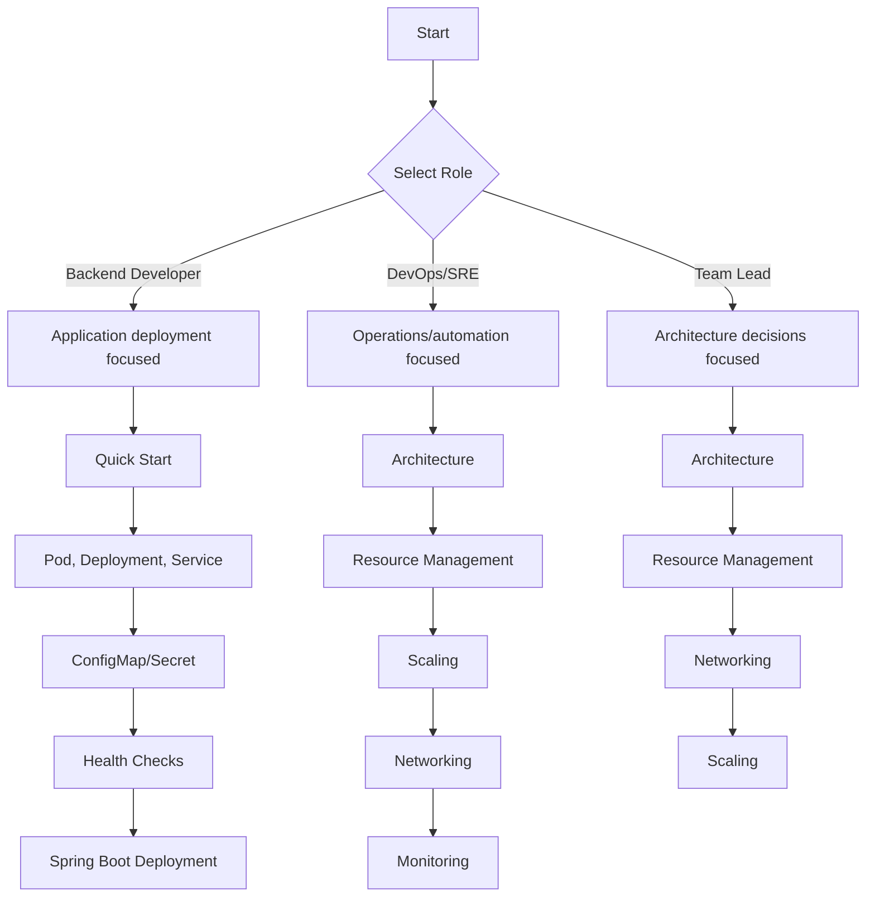

Kubernetes (K8s) is an **open-source platform for automating the deployment, scaling, and management of containerized applications**. Designed based on Google's 15 years of experience running production workloads, it is now managed by the CNCF (Cloud Native Computing Foundation).

**Why do you need Kubernetes?**

Building containers with Docker is not the end of the story. In real production environments, you need to deploy and manage dozens or hundreds of containers across multiple servers.

| Problems with containers alone | After adopting Kubernetes |
|-------------------------------|--------------------------|
| Manual restart when container dies | Automatic recovery (Self-healing) |
| Manual container addition when traffic increases | Automatic scaling (HPA) adjusts Pod count |
| Manual management when deploying across servers | Declarative deployment maintains desired state |
| Configure load balancing manually | Automatic load balancing with Service |
| Write rolling update scripts | Automated zero-downtime deployment with Deployment |
| Complex config/secret management | Centralized management with ConfigMap/Secret |

Kubernetes solves various container operation problems through automation and declarative configuration.

**Core Features of Kubernetes**

Kubernetes provides the following key capabilities:

**1. Declarative Configuration**
Instead of saying "run 3 containers," you declare "maintain a state where 3 containers are running." Kubernetes continuously monitors the current state and takes automatic actions to match the desired state.

**2. Self-healing**
Automatically restarts failed containers and reschedules Pods from dead nodes to other nodes. Containers that don't respond to health checks are removed from service.

**3. Horizontal Scaling**
Automatically adjusts the number of Pods based on CPU usage, memory, or custom metrics. Enables flexible response to traffic increases.

**4. Service Discovery and Load Balancing**
Access Pods reliably through Service even when Pod IPs change. Automatically distributes traffic across multiple Pods.

**When should you use Kubernetes?**

Kubernetes adoption should consider team size, service complexity, and operational capabilities.

**Suitable cases:**
- Microservices architecture with multiple separated services
- High traffic variability requiring automatic scaling
- Multi-cloud or hybrid cloud strategy
- Frequent need for zero-downtime deployments and rollbacks
- Team with DevOps/SRE capabilities

**May be overkill:**
- Operating only 1-2 monolithic applications
- Predictable traffic with little variability
- Team lacking container/cloud experience
- Managed services (AWS ECS, Google Cloud Run, etc.) are sufficient

## What This Guide Covers

This guide is structured step-by-step for backend developers to apply Kubernetes in practice.

**[Quick Start](quick-start/)**
Deploy an application to Kubernetes in 5 minutes. See a working environment before diving into concepts.

**[Concepts](concepts/)**

Explains Kubernetes core principles from a **backend developer's perspective**.

| Topic | What you'll learn |
|-------|------------------|
| [Architecture](concepts/architecture/) | Components and roles of Control Plane, Worker Node |
| [Pod](concepts/pod/) | Kubernetes' minimum deployment unit, container grouping |
| [Deployment](concepts/deployment/) | Application deployment and update strategies |
| [Service](concepts/service/) | Network access to Pods and load balancing |
| [ConfigMap and Secret](concepts/configmap-secret/) | Separating configuration and sensitive information |
| [Volume and Storage](concepts/storage/) | Persistent data storage and PV/PVC |
| [Networking](concepts/networking/) | Intra/external cluster communication and Ingress |
| [Resource Management](concepts/resources/) | CPU/memory requests and limits |
| [Scaling](concepts/scaling/) | Auto-scaling with HPA, VPA |
| [Health Checks](concepts/health-checks/) | Liveness, Readiness, Startup Probe |

**[Hands-on Examples](examples/)**

Practice with executable examples:
- [Environment Setup](examples/setup/) - Local Kubernetes environment setup (Minikube, Kind)
- [Basic Examples](examples/basic/) - Pod, Deployment, Service practice
- [Spring Boot Deployment](examples/spring-boot/) - Deploying Spring Boot applications to Kubernetes

**[How-To Guides](howto/)**

Step-by-step guides for solving specific problems:
- [Pod Troubleshooting](howto/pod-troubleshooting/) - Diagnosing when Pods don't start
- [Resource Optimization](howto/resource-optimization/) - Finding optimal resource settings

**[Appendix](appendix/)**
- [Glossary](appendix/glossary/) - Quick reference for Kubernetes terms
- [FAQ](appendix/faq/) - Frequently asked questions
- [References](appendix/references/) - Official documentation and additional learning resources

## Docker vs Kubernetes

Docker and Kubernetes are tools for different domains. Docker creates and runs containers, while Kubernetes is an orchestration platform that manages multiple containers.

| Item | Docker | Kubernetes |
|------|--------|------------|
| Role | Container runtime | Container orchestration |
| Scope | Single host | Multiple hosts (cluster) |
| Deployment | `docker run` | Deployment, Pod |
| Networking | Bridge network | Cluster network, Service |
| Scaling | Manual | Automatic (HPA) |
| Failure recovery | None (`--restart` flag) | Automatic (Self-healing) |
| Load balancing | Configure manually | Automatic with Service |

The typical workflow is building images with Docker, then Kubernetes deploying and managing those images in a cluster. Note that since Kubernetes v1.24, container runtimes like containerd or CRI-O are used instead of Docker (Dockershim support ended).

> **Note:** Kubernetes dropping Docker support doesn't mean you can't use Docker images. OCI-compatible images built with Docker run on all container runtimes.

## Prerequisites

The following knowledge is needed to effectively learn this guide:

- **Required**: Docker basics (images, containers), Linux commands
- **Helpful**: YAML syntax, network fundamentals (IP, ports, DNS), REST API development experience

## Learning Path Guide

The most efficient learning order varies by role and goals:

**Learning paths by role**

**Documents by difficulty level**

| Document | Difficulty | Estimated time | Prerequisites |
|----------|-----------|----------------|---------------|
| **Quick Start** | ⭐ Beginner | 30 min | None |
| **Architecture** | ⭐ Beginner | 30 min | None |
| **Pod** | ⭐ Beginner | 30 min | Quick Start |
| **Deployment** | ⭐⭐ Basic | 45 min | Pod |
| **Service** | ⭐⭐ Basic | 45 min | Pod |
| **ConfigMap/Secret** | ⭐⭐ Basic | 30 min | Pod |
| **Basic Examples** | ⭐⭐ Basic | 60 min | Deployment, Service |
| **Health Checks** | ⭐⭐⭐ Intermediate | 30 min | Pod, Deployment |
| **Volume and Storage** | ⭐⭐⭐ Intermediate | 45 min | Pod |
| **Resource Management** | ⭐⭐⭐ Intermediate | 45 min | Pod, Deployment |
| **Networking** | ⭐⭐⭐ Intermediate | 60 min | Service |
| **Spring Boot Deployment** | ⭐⭐⭐ Intermediate | 90 min | Basic Examples |
| **Scaling** | ⭐⭐⭐⭐ Advanced | 60 min | Deployment, Resource Management |
| **Pod Troubleshooting** | ⭐⭐⭐⭐ Advanced | 45 min | Pod, Health Checks |

Each document can be read independently, but if you're new, we recommend the order above.

## Common Misconceptions

Here are frequently heard misconceptions about Kubernetes:

**"Kubernetes is only for large enterprises"** — Not true. Lightweight distributions like Minikube, Kind, and k3s can be used in development environments or small-scale production. Using cloud managed services (EKS, GKE, AKS) significantly reduces operational burden.

**"You need a DevOps team to use Kubernetes"** — Cloud managed services greatly reduce cluster operation burden. Developers can also handle basic deployment and scaling themselves.

**"Kubernetes is easy if you know Docker"** — Docker knowledge helps, but Kubernetes requires additional learning about distributed systems. You need to understand new concepts like networking, storage, and scheduling.

**"All applications should run on Kubernetes"** — Not true. Stateful workloads like databases have less operational burden when using managed services (RDS, Cloud SQL). Kubernetes' strengths are maximized with stateless applications.
