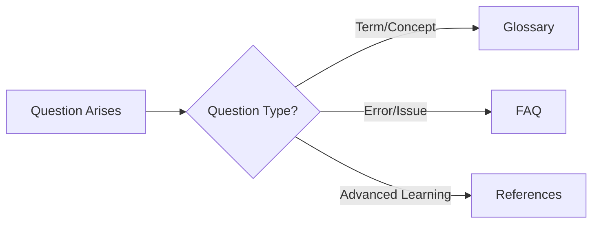

This section provides supplementary resources to help with Kubernetes learning and operations.

## Situation-based Appendix Usage Guide

If you're unsure which resource to consult, refer to the guide below.

| Situation | Recommended Resource | Usage Example |
|-----------|---------------------|---------------|
| When encountering unfamiliar terms | [Glossary]() | "What's PVC?" → Check PersistentVolumeClaim definition |
| When stuck or encountering errors | [FAQ]() | "Pod is in Pending state" → Check causes and solutions |
| When wanting to study in depth | [References]() | "Want to prepare for CKA?" → Check certification/learning resources |

## Appendix List

| Resource | Description | Target Audience |
|----------|-------------|-----------------|
| [Glossary]() | Quick reference for Kubernetes core terms | All learners |
| [FAQ]() | Frequently asked questions and answers | Beginners, troubleshooting |
| [References]() | Official documentation and additional learning resources | Advanced learners |
