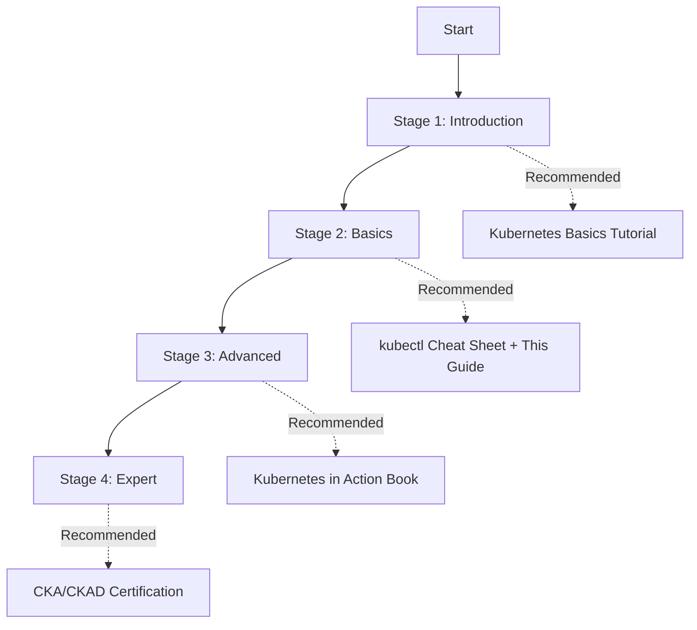

This page organizes official documentation and additional learning resources helpful for Kubernetes learning and operations.

## Learning Roadmap by Stage

If you're unsure where to start, refer to the roadmap below.

*This diagram shows a four-stage learning roadmap from beginner to expert with recommended resources for each stage.*

| Stage | Goal | Recommended Resources | Expected Duration |
|-------|------|----------------------|-------------------|
| **1. Introduction** | First successful deployment | Kubernetes Basics, Play with K8s | 1 week |
| **2. Basics** | Understanding core concepts | This guide, kubectl Cheat Sheet | 2-4 weeks |
| **3. Advanced** | Operations capability | Kubernetes in Action, Prometheus | 1-3 months |
| **4. Expert** | Certification/Architecture | CKA/CKAD, Kubernetes Patterns | 3-6 months |

---

## Official Documentation

### Kubernetes Official

| Resource | Description | Link |
|----------|-------------|------|
| Kubernetes Documentation | Official docs (Korean supported) | [kubernetes.io/docs](https://kubernetes.io/docs/) |
| Kubernetes Blog | New features, release news | [kubernetes.io/blog](https://kubernetes.io/blog/) |
| Kubernetes GitHub | Source code, issues | [github.com/kubernetes](https://github.com/kubernetes/kubernetes) |

### kubectl Reference

| Resource | Description | Link |
|----------|-------------|------|
| kubectl Cheat Sheet | Collection of frequently used commands | [kubectl cheatsheet](https://kubernetes.io/docs/reference/kubectl/cheatsheet/) |
| kubectl Reference | Complete command reference | [kubectl reference](https://kubernetes.io/docs/reference/kubectl/) |

### API Reference

| Resource | Description | Link |
|----------|-------------|------|
| API Reference | Kubernetes API documentation | [API Reference](https://kubernetes.io/docs/reference/kubernetes-api/) |

## Learning Resources

### Interactive Tutorials

| Resource | Description | Link |
|----------|-------------|------|
| Kubernetes Basics | Official interactive tutorial | [Learn Kubernetes Basics](https://kubernetes.io/docs/tutorials/kubernetes-basics/) |
| Katacoda (Killercoda) | Browser-based practice environment | [killercoda.com](https://killercoda.com/) |
| Play with Kubernetes | Free online practice environment | [labs.play-with-k8s.com](https://labs.play-with-k8s.com/) |

### Books

| Book | Author | Features |
|------|--------|----------|
| Kubernetes in Action | Marko Lukša | Practice-oriented, detailed explanations |
| Kubernetes Patterns | Bilgin Ibryam | Design pattern focused |
| Cloud Native DevOps with Kubernetes | John Arundel | DevOps perspective |

### Certifications

| Certification | Target Audience | Description |
|--------------|-----------------|-------------|
| CKA | Administrators | Validates Kubernetes cluster administration skills |
| CKAD | Developers | Validates Kubernetes application development skills |
| CKS | Security Specialists | Validates Kubernetes security skills |

## Tools

### Local Development

| Tool | Description | Link |
|------|-------------|------|
| Minikube | Local Kubernetes cluster | [minikube.sigs.k8s.io](https://minikube.sigs.k8s.io/) |
| Kind | Docker-based local cluster | [kind.sigs.k8s.io](https://kind.sigs.k8s.io/) |
| k3d | Lightweight Kubernetes (k3s) | [k3d.io](https://k3d.io/) |

### Package Management

| Tool | Description | Link |
|------|-------------|------|
| Helm | Kubernetes package manager | [helm.sh](https://helm.sh/) |
| Kustomize | Configuration customization | [kustomize.io](https://kustomize.io/) |

### Monitoring

| Tool | Description | Link |
|------|-------------|------|
| Prometheus | Metrics collection | [prometheus.io](https://prometheus.io/) |
| Grafana | Visualization dashboard | [grafana.com](https://grafana.com/) |
| Lens | Kubernetes IDE | [k8slens.dev](https://k8slens.dev/) |

### CLI Tools

| Tool | Description | Link |
|------|-------------|------|
| kubectx/kubens | Context/namespace switching | [github.com/ahmetb/kubectx](https://github.com/ahmetb/kubectx) |
| k9s | Terminal UI | [k9scli.io](https://k9scli.io/) |
| stern | Multi-pod logs | [github.com/stern/stern](https://github.com/stern/stern) |

## Managed Kubernetes

| Service | Cloud | Link |
|---------|-------|------|
| Amazon EKS | AWS | [aws.amazon.com/eks](https://aws.amazon.com/eks/) |
| Google GKE | GCP | [cloud.google.com/kubernetes-engine](https://cloud.google.com/kubernetes-engine) |
| Azure AKS | Azure | [azure.microsoft.com/services/kubernetes-service](https://azure.microsoft.com/services/kubernetes-service/) |

## Community

| Channel | Description | Link |
|---------|-------------|------|
| Kubernetes Slack | Official community | [slack.kubernetes.io](https://slack.kubernetes.io/) |
| CNCF | Cloud Native Foundation | [cncf.io](https://www.cncf.io/) |
| Stack Overflow | Q&A | [stackoverflow.com/questions/tagged/kubernetes](https://stackoverflow.com/questions/tagged/kubernetes) |

## Versions and Releases

| Resource | Description | Link |
|----------|-------------|------|
| Release Notes | Changes by version | [kubernetes.io/releases](https://kubernetes.io/releases/) |
| Deprecation Policy | Deprecation policy | [Deprecation Policy](https://kubernetes.io/docs/reference/using-api/deprecation-policy/) |
| Version Skew Policy | Version compatibility | [Version Skew](https://kubernetes.io/releases/version-skew-policy/) |
