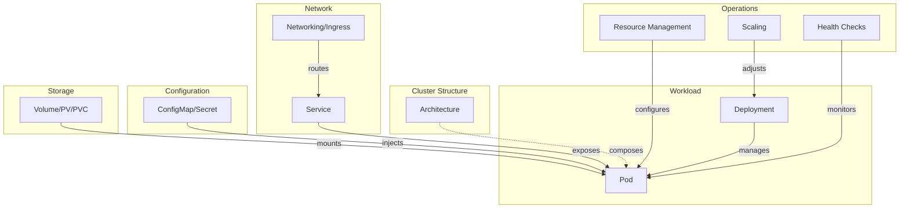

To properly utilize Kubernetes, knowing kubectl commands alone is not enough. You need to understand why you need multiple Pods, how Services distribute traffic, and where to store configurations to quickly diagnose and resolve operational issues. This section covers Kubernetes core components and operating principles step by step.

## Overall Concept Structure

The diagram below shows the relationships between Kubernetes core concepts. Arrow directions indicate dependency or reference relationships.

## Concept Summary

| Concept | One-line Summary | Key Question |
|---------|------------------|--------------|
| [Architecture]() | Cluster structure composed of Control Plane and Worker Nodes | "How does Kubernetes work?" |
| [Pod]() | Minimum deployment unit wrapping containers | "Why Pod instead of container?" |
| [Deployment]() | Declarative deployment and update management of Pods | "How to deploy without downtime?" |
| [Service]() | Stable network access point for Pods | "How to find changing Pod IPs?" |
| [ConfigMap/Secret]() | Separate management of configuration and sensitive information | "How to separate config from code?" |
| [Volume/Storage]() | Data storage independent of Pod lifecycle | "How to persist data when Pod dies?" |
| [Networking]() | Cluster internal/external communication and Ingress | "How to access from outside?" |
| [Resource Management]() | CPU/memory requests and limits configuration | "How much resources to allocate?" |
| [Scaling]() | Automatic scaling with HPA/VPA | "How to respond to traffic increases?" |
| [Health Checks]() | Status monitoring and auto-recovery through Probes | "How to verify app is healthy?" |
| [Namespace]() | Mechanism to logically isolate resources within a cluster | "How to separate resources by team?" |
| [StatefulSet]() | Deployment and management of stateful applications | "How to deploy a DB on Kubernetes?" |
| [RBAC]() | Role-based access control for API permission management | "Who can access which resources?" |
| [Jobs and CronJobs]() | One-time and recurring batch job execution | "How to run batch jobs?" |
| [NetworkPolicy]() | Control network traffic between Pods | "How to restrict Pod-to-Pod communication?" |

#### Learning Path

The learning path below is designed considering dependencies between concepts. It's recommended to thoroughly understand basic concepts before moving to advanced topics. Pod and Deployment especially are the foundation for all subsequent concepts and should be well understood.

**Basic Concepts**

Basic concepts cover the core elements that compose a Kubernetes cluster and the application deployment process. The goal is to understand how Pods are created, how Deployments manage Pods, and how Services deliver traffic.

1. [Architecture]() - Understand components of Control Plane and Worker Nodes. Grasp the big picture of how Kubernetes operates.
2. [Pod]() - Learn the concept and lifecycle of Pod, the minimum deployment unit in Kubernetes. Understand why we use Pods instead of containers.
3. [Deployment]() - Learn Deployment that manages Pod creation, updates, and rollbacks. Understand the principles of zero-downtime deployment.
4. [Service]() - Learn Service that provides stable network access to Pods. Understand the differences between ClusterIP, NodePort, and LoadBalancer.
5. [ConfigMap and Secret]() - Learn how to separate and manage application configuration and sensitive information.

**Advanced Topics**

Advanced topics cover subjects necessary for stable Kubernetes operations in production environments. This includes persistent data storage, network configuration, resource management, auto-scaling, and other content essential for actual service operations.

6. [Volume and Storage]() - Learn Persistent Volumes (PV) and Persistent Volume Claims (PVC) that retain data even after Pod termination.
7. [Networking]() - Learn the principles of cluster internal/external communication and HTTP routing through Ingress.
8. [Resource Management]() - Learn how to configure CPU and memory requests and limits. Understand behavior under resource shortage situations.
9. [Scaling]() - Learn auto-scaling through HPA (Horizontal Pod Autoscaler) and the concept of VPA.
10. [Health Checks]() - Learn how to monitor application status and auto-recover through Liveness, Readiness, and Startup Probes.

**Advanced Topics**

Advanced topics cover multi-tenant environment setup, stateful workloads, security, batch processing, and other practical in-depth content.

11. [Namespace]() - Learn how to logically isolate resources within a cluster and limit usage with ResourceQuota.
12. [StatefulSet]() - Learn how to deploy and manage stateful applications like databases.
13. [RBAC]() - Learn how to manage API access permissions for users and services through Role-Based Access Control.
14. [Jobs and CronJobs]() - Learn how to run and manage one-time batch tasks and schedule-based recurring tasks.
15. [NetworkPolicy]() - Learn how to control Pod-to-Pod network traffic to strengthen cluster security.
