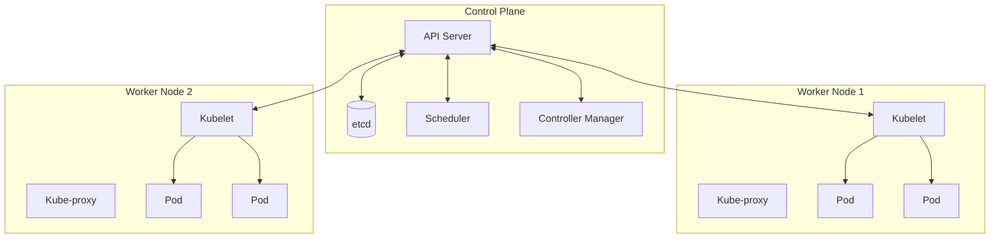
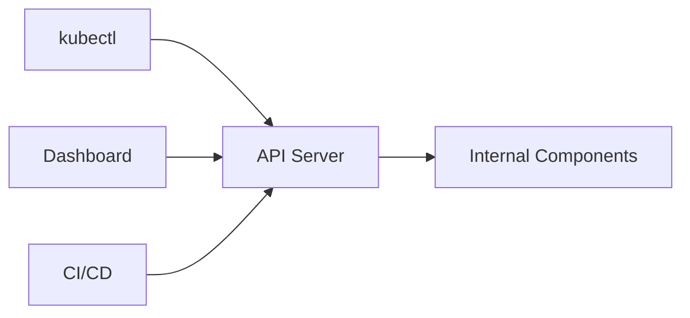
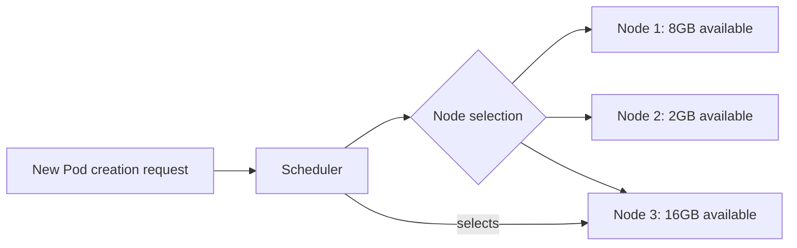
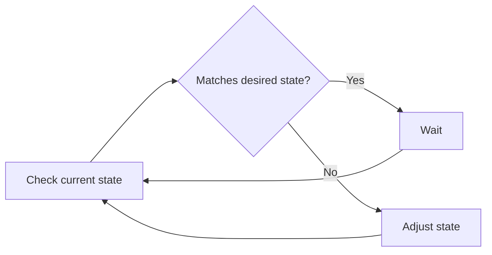
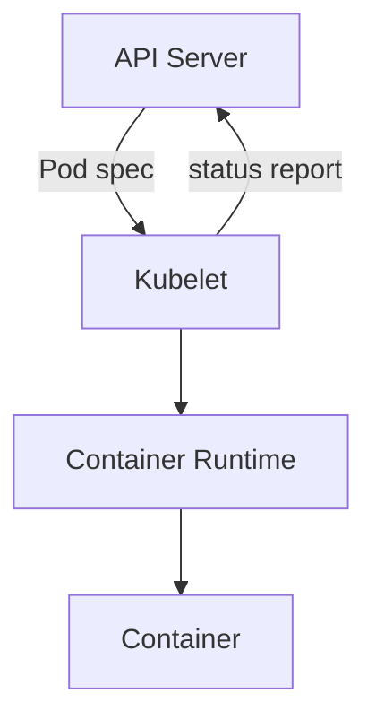
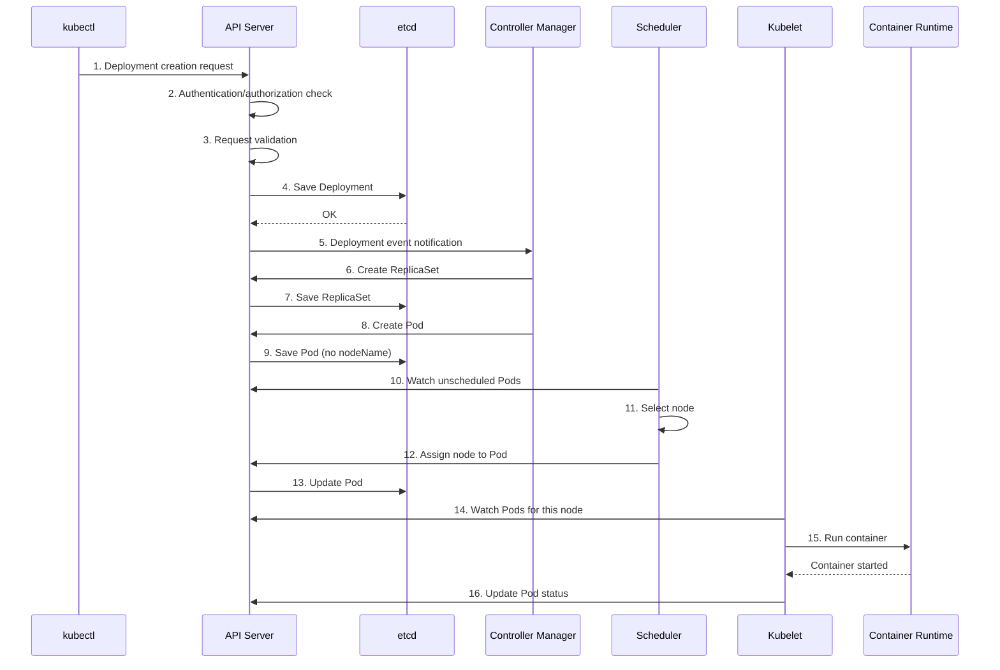
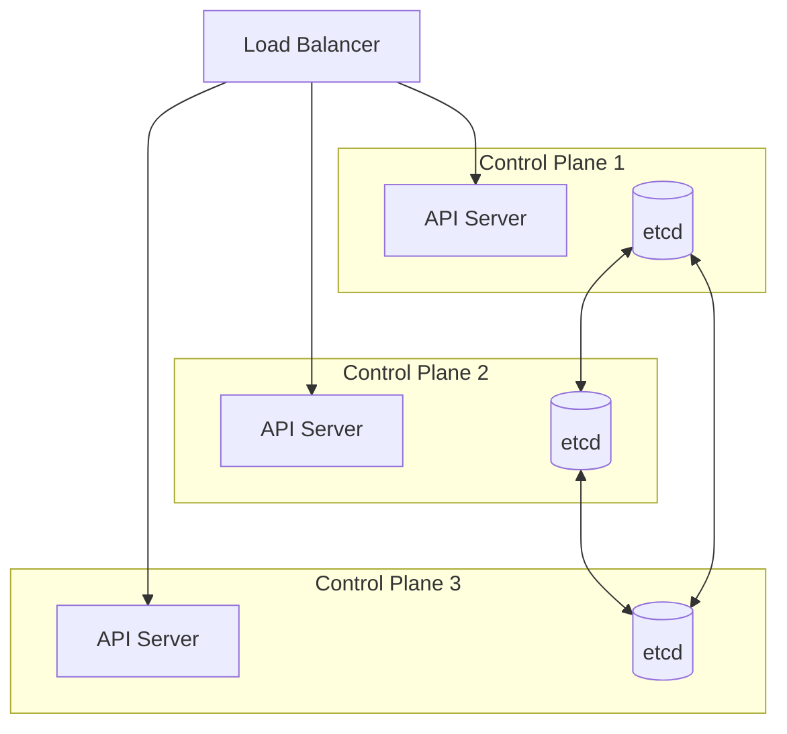

> **Target Audience**: Backend developers who want to understand Kubernetes structure
> **Prerequisites**: Basic Docker concepts
> **After reading this**: You will understand Kubernetes cluster components and their roles


- Kubernetes cluster consists of Control Plane (brain) and Worker Nodes (muscle)
- Control Plane manages cluster state, Worker Nodes execute actual workloads
- kubectl commands communicate with the cluster through API Server


## Overall Cluster Structure

A Kubernetes cluster is broadly divided into two parts.



Comparing the roles of Control Plane and Worker Nodes:

| Component | Role | Analogy |
|-----------|------|---------|
| Control Plane | Cluster state management, scheduling decisions | Brain, control tower |
| Worker Node | Actual container execution, network processing | Muscle, worker |

The Control Plane acts as the brain managing the entire cluster, while Worker Nodes execute actual containers following Control Plane's instructions.

## Control Plane Components

The Control Plane is the brain of the cluster, consisting of 4 core components.

### API Server (kube-apiserver)

The API Server is the frontend of Kubernetes. All communication goes through the API Server.



Its main roles are:

**Authentication and authorization checks**: When a kubectl command comes in, it first verifies who the requester is (authentication) and whether they have permission for that operation (authorization).

**Request validation**: It checks if the YAML syntax is correct, whether required fields are present, etc.

**Communication with etcd**: Resources that pass validation are stored in etcd. Only the API Server can directly access etcd.

```bash
# Direct API Server request (what kubectl does internally)
kubectl get pods -v=8  # -v=8 outputs detailed HTTP requests
```

### etcd

etcd is a distributed key-value store that stores all cluster state.

Information stored includes:

| Storage Target | Example |
|----------------|---------|
| Resource definitions | Deployment, Service, ConfigMap YAML |
| Cluster state | Pod IP, node status, labels |
| Configuration info | RBAC policies, namespaces |

If etcd is damaged, cluster state cannot be fully recovered. Therefore, etcd backups are essential in production.


etcd is Kubernetes' only state store. Other components don't store state; they query etcd through the API Server when needed.


### Scheduler (kube-scheduler)

The Scheduler decides which node newly created Pods should run on.



Scheduling decision factors include:

| Factor | Description |
|--------|-------------|
| Resource requirements | Nodes that can provide the CPU/memory requested by Pod |
| Node selector | Place only on nodes with specific labels |
| Taint/Toleration | Avoid or allow nodes with specific conditions |
| Affinity/Anti-affinity | Place with/separately from specific Pods |

The Scheduler only makes decisions. Actual Pod execution is handled by the Kubelet on that node.

### Controller Manager (kube-controller-manager)

Controller Manager is a process that runs multiple controllers. Each controller manages a specific resource.

Main controllers and their roles:

| Controller | Manages | Role |
|------------|---------|------|
| Deployment Controller | Deployment | Create/update ReplicaSet |
| ReplicaSet Controller | ReplicaSet | Maintain Pod count |
| Node Controller | Node | Monitor node status, detect failures |
| Service Controller | Service | Provision cloud load balancers |
| Endpoint Controller | Endpoints | Connect Service and Pods |

Controllers operate on the **Reconciliation Loop** principle.



For example, if a Deployment is set to `replicas: 3` but only 2 Pods currently exist, the ReplicaSet Controller creates 1 additional Pod.

## Worker Node Components

Worker Nodes are where actual workloads run.

### Kubelet

Kubelet is an agent running on each node. It manages Pod lifecycle.

Its main roles are:

**Pod execution**: Runs containers according to the Pod spec assigned by the API Server.

**Status reporting**: Periodically reports Pod and node status to the API Server.

**Health checks**: Executes Liveness/Readiness Probes and takes action based on results.



Kubelet communicates with the container runtime (containerd, CRI-O, etc.) to actually manage containers.

### Kube-proxy

Kube-proxy manages network rules. It forwards traffic coming to Services to appropriate Pods.

Comparing operation modes:

| Mode | Description | Performance |
|------|-------------|-------------|
| iptables | Uses Linux iptables rules | Medium |
| IPVS | Uses Linux IPVS (IP Virtual Server) | High |
| userspace | Proxy in userspace (legacy) | Low |

Most environments use iptables mode by default. IPVS mode is recommended for large-scale clusters.

### Container Runtime

Software that actually runs containers.

| Runtime | Description |
|---------|-------------|
| containerd | Lightweight runtime separated from Docker (recommended) |
| CRI-O | Runtime designed for Kubernetes |
| Docker | Direct support ended from v1.24 |

While Kubernetes doesn't directly support Docker from v1.24, images built with Docker can run on all runtimes.

## kubectl Command Flow

Let's trace what happens inside the cluster when executing `kubectl apply -f deployment.yaml`.



Summarizing each step:

| Step | Component | Action |
|------|-----------|--------|
| 1-4 | API Server | Validate request and store in etcd |
| 5-9 | Controller Manager | Create Deployment → ReplicaSet → Pod |
| 10-13 | Scheduler | Determine node to run Pod |
| 14-16 | Kubelet | Execute container and report status |

## High Availability (HA) Configuration

In production environments, the Control Plane is configured for high availability.



Key elements of HA configuration:

| Element | Configuration | Reason |
|---------|---------------|--------|
| Control Plane nodes | 3+ (odd number) | Majority consensus needed |
| API Server | Behind load balancer | Zero-downtime access |
| etcd | Cluster configuration | Data replication |
| Scheduler/Controller | Leader election | Prevent duplicate operations |

When using managed Kubernetes (EKS, GKE, AKS), Control Plane HA is managed by the cloud provider.

## Developer Perspective: Why Know Architecture?

To know **which component to check** when deployment issues occur.

### Component by Symptom

| Symptom | Cause Component | How to Check |
|---------|----------------|--------------|
| Pod in Pending state | Scheduler | `kubectl describe pod` → Check Events |
| Pod not created | Controller Manager | `kubectl get events --sort-by=.lastTimestamp` |
| Pod not starting on node | Kubelet | `kubectl describe node`, node logs |
| Service not connecting | kube-proxy | `kubectl get endpoints` |
| All commands fail | API Server | `kubectl cluster-info` |

### Impact of Component Failures

| Component | Impact on Failure | Existing Pods | Urgency |
|-----------|-------------------|---------------|---------|
| **API Server** | All kubectl fails, no new deployments | Maintained | 🔴 Critical |
| **etcd** | Cluster state loss, unrecoverable | Maintained | 🔴 Critical |
| **Scheduler** | Cannot place new Pods | Maintained | 🟡 High |
| **Controller Manager** | Auto-recovery/scaling stopped | Maintained | 🟡 High |
| **Kubelet (1 node)** | Only that node's Pods affected | Other nodes normal | 🟢 Medium |
| **kube-proxy** | That node's Service routing fails | Pods themselves normal | 🟢 Medium |


Even with Control Plane failure, **already running Pods continue to operate**. However, new deployments, scaling, and auto-recovery are stopped.


---

## Practice: Verify Cluster Components

Let's check components in an actual cluster.

### Check Control Plane Components

```bash
# Check Pods in kube-system namespace
kubectl get pods -n kube-system
```

**Expected output:**
```
NAME                               READY   STATUS    RESTARTS   AGE
coredns-xxx                        1/1     Running   0          1d
etcd-minikube                      1/1     Running   0          1d
kube-apiserver-minikube            1/1     Running   0          1d
kube-controller-manager-minikube   1/1     Running   0          1d
kube-proxy-xxx                     1/1     Running   0          1d
kube-scheduler-minikube            1/1     Running   0          1d
```

### Check Node Information

```bash
# Node list
kubectl get nodes

# Node details
kubectl describe node <node-name>
```

Items you can check in node details:

| Item | Description |
|------|-------------|
| Capacity | Total node resources |
| Allocatable | Resources allocatable to Pods |
| Conditions | Node status (Ready, MemoryPressure, etc.) |
| Addresses | Node IP |
| Non-terminated Pods | List of running Pods |

### Check API Server Status

```bash
# Cluster information
kubectl cluster-info

# API resources list
kubectl api-resources
```

---

## Next Steps

Once you understand the architecture, proceed to the next steps:

| Goal | Recommended Doc |
|------|----------------|
| Understand Pod concept | [Pod](pod/) |
| Try actual deployment | [Quick Start](../quick-start/) |
| Understand network configuration | [Networking](networking/) |
