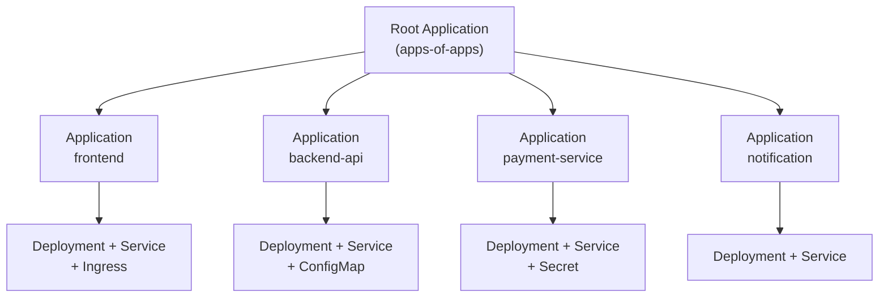
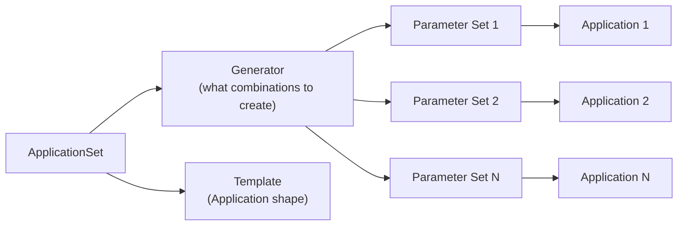
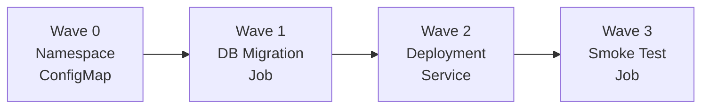
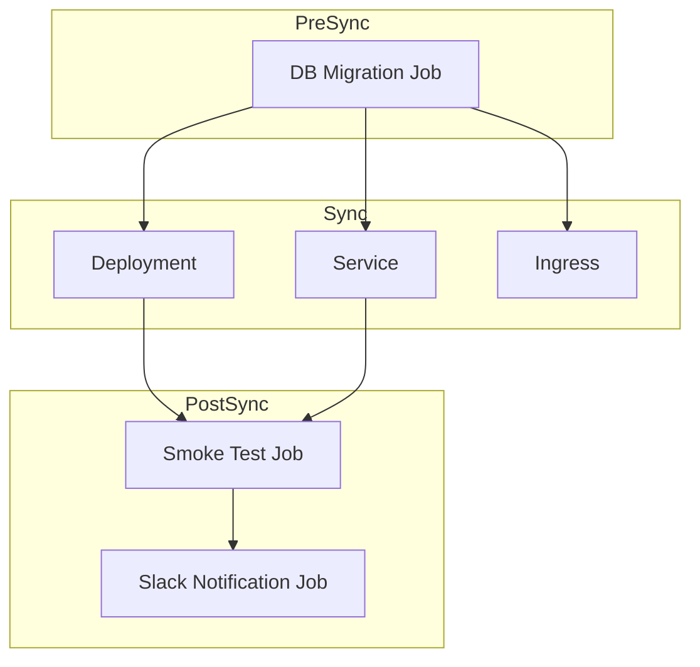
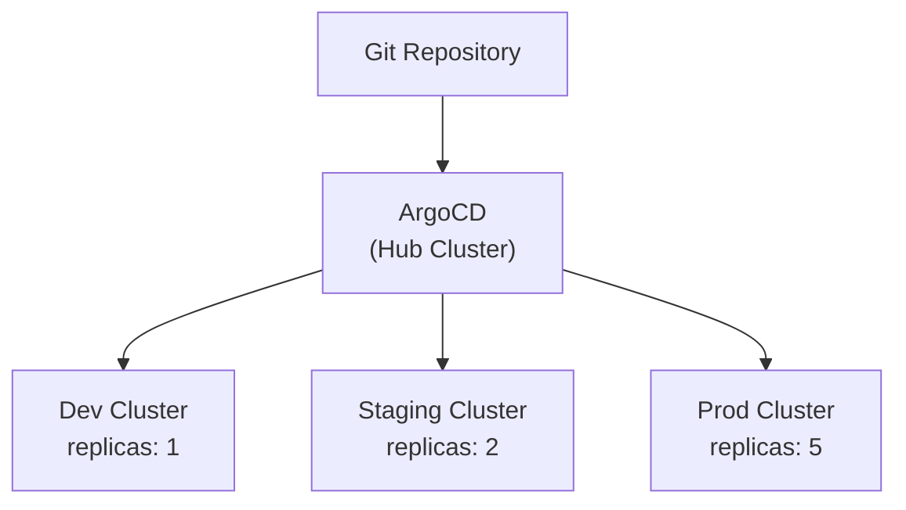

## Overall Analogy: Franchise Headquarters Operations System

ArgoCD advanced patterns are easiest to understand when compared to a **franchise headquarters operations system**:

| Franchise Analogy | ArgoCD Advanced Pattern | Role |
|-------------------|------------------------|------|
| Headquarters management system | Root Application | Centrally manages all stores (Applications) |
| Auto-opening rules for stores | ApplicationSet | Automatically creates stores when conditions are met |
| Store opening procedure manual | Sync Waves | Guarantees order: interior → equipment → staff placement |
| Regional headquarters nationwide | Multi-cluster | Independent operations per region (dev/staging/prod) |
| Pre-opening checklist | PreSync Hook | Pre-deployment verification |
| During-business inspection | PostSync Hook | Post-deployment status check |
| HQ standard manual | Git Repository | Source of Truth for all stores |

In this way, ArgoCD advanced patterns are like "headquarters automatically managing hundreds of stores with consistent rules and systematically controlling the opening sequence."

---

> **Target Audience**: DevOps engineers who understand ArgoCD basics
> **Prerequisites**: ArgoCD core concepts, Kubernetes resource management
> **Estimated Time**: ~35 minutes
> **After reading this**: You can leverage App of Apps, ApplicationSet, Sync Waves, and other advanced patterns to efficiently manage large-scale multi-cluster environments


- **App of Apps**: A pattern where a Root Application recursively manages child Applications
- **ApplicationSet**: A declarative approach that auto-generates Applications based on Generators
- **Sync Waves**: Number-based deployment ordering for safely deploying resources with dependencies
- **Multi-cluster**: Unified management of multiple clusters with ApplicationSet + Cluster Generator


## 1. App of Apps Pattern

### Why Is It Needed?

In a microservices architecture, what happens when you scale to 10 or 20 services? You have to manually create and manage an ArgoCD Application for each service. Every time a service is added, you create an Application with kubectl, and delete them one by one when removing. This manual work invites mistakes and makes it difficult to grasp the overall deployment state.

The App of Apps pattern solves this problem. **A single Root Application manages all other Applications.**

### How It Works



*Shows the two-tier structure where the Root Application manages child Application manifests, and each Application manages its own Kubernetes resources.*

### Directory Structure

```
gitops-repo/
├── apps/                          # Path watched by Root Application
│   ├── frontend.yaml              # Application manifest
│   ├── backend-api.yaml
│   ├── payment-service.yaml
│   └── notification.yaml
├── manifests/                     # Actual K8s resources for each service
│   ├── frontend/
│   │   ├── deployment.yaml
│   │   ├── service.yaml
│   │   └── ingress.yaml
│   ├── backend-api/
│   │   ├── deployment.yaml
│   │   └── service.yaml
│   ├── payment-service/
│   │   ├── deployment.yaml
│   │   ├── service.yaml
│   │   └── secret.yaml
│   └── notification/
│       ├── deployment.yaml
│       └── service.yaml
```

### Root Application Example

```yaml
apiVersion: argoproj.io/v1alpha1
kind: Application
metadata:
  name: apps-of-apps
  namespace: argocd
spec:
  project: default
  source:
    repoURL: https://github.com/my-org/gitops-repo.git
    targetRevision: main
    path: apps           # Directory containing child Application manifests
  destination:
    server: https://kubernetes.default.svc
    namespace: argocd
  syncPolicy:
    automated:
      prune: true        # Apps deleted from Git are also deleted from the cluster
      selfHeal: true     # Manual changes are restored to Git state
```

### Child Application Example

```yaml
# apps/frontend.yaml
apiVersion: argoproj.io/v1alpha1
kind: Application
metadata:
  name: frontend
  namespace: argocd
  finalizers:
    - resources-finalizer.argocd.argoproj.io
spec:
  project: default
  source:
    repoURL: https://github.com/my-org/gitops-repo.git
    targetRevision: main
    path: manifests/frontend
  destination:
    server: https://kubernetes.default.svc
    namespace: frontend
  syncPolicy:
    automated:
      prune: true
      selfHeal: true
    syncOptions:
      - CreateNamespace=true
```


The core of App of Apps is that **the Git repository is the Single Source of Truth**. To add a new service, simply commit an Application YAML to the `apps/` directory. Deletion works the same way -- remove the file and commit, and ArgoCD automatically cleans up.


## 2. ApplicationSet

### Why Is It Needed?

The App of Apps pattern is effective but has limitations. If you have 30 services, you need to write 30 nearly identical Application YAMLs. With 3 clusters (dev/staging/prod), that's 90. Copy-pasting files that differ only in name and namespace is inefficient and error-prone.

ApplicationSet solves this problem with **Templates + Generators**. Define the rules, and Applications are automatically created.

### Generator Types

| Generator | Purpose | Use Case |
|-----------|---------|----------|
| List | Explicit list | Small number of fixed environment definitions |
| Cluster | Based on registered clusters | Multi-cluster deployment |
| Git Directory | Based on Git directory structure | Auto-create Applications per directory |
| Git File | Based on Git file contents | Control via JSON/YAML config files |
| Matrix | Generator combination (cross product) | Cluster x service combinations |
| Merge | Generator merge | Defaults + overrides |

### ApplicationSet Structure



*Shows how ApplicationSet extracts parameters from a Generator and injects them into a Template to auto-generate multiple Applications.*

### Git Directory Generator Example

Automatically creates Applications based on directory structure alone:

```yaml
apiVersion: argoproj.io/v1alpha1
kind: ApplicationSet
metadata:
  name: service-apps
  namespace: argocd
spec:
  generators:
    - git:
        repoURL: https://github.com/my-org/gitops-repo.git
        revision: main
        directories:
          - path: manifests/*    # Create an Application for each subdirectory under manifests
  template:
    metadata:
      name: '{{path.basename}}'
    spec:
      project: default
      source:
        repoURL: https://github.com/my-org/gitops-repo.git
        targetRevision: main
        path: '{{path}}'
      destination:
        server: https://kubernetes.default.svc
        namespace: '{{path.basename}}'
      syncPolicy:
        automated:
          prune: true
          selfHeal: true
        syncOptions:
          - CreateNamespace=true
```

With this configuration, adding a new directory under `manifests/` automatically creates an Application.

### List Generator Example -- Multi-cluster

```yaml
apiVersion: argoproj.io/v1alpha1
kind: ApplicationSet
metadata:
  name: multi-cluster-app
  namespace: argocd
spec:
  generators:
    - list:
        elements:
          - cluster: dev
            url: https://dev-cluster.example.com
            namespace: app-dev
          - cluster: staging
            url: https://staging-cluster.example.com
            namespace: app-staging
          - cluster: prod
            url: https://prod-cluster.example.com
            namespace: app-prod
  template:
    metadata:
      name: 'myapp-{{cluster}}'
    spec:
      project: default
      source:
        repoURL: https://github.com/my-org/gitops-repo.git
        targetRevision: main
        path: 'overlays/{{cluster}}'
      destination:
        server: '{{url}}'
        namespace: '{{namespace}}'
```

### Matrix Generator Example -- Cluster x Service

```yaml
apiVersion: argoproj.io/v1alpha1
kind: ApplicationSet
metadata:
  name: cluster-service-matrix
  namespace: argocd
spec:
  generators:
    - matrix:
        generators:
          - clusters:
              selector:
                matchLabels:
                  env: production
          - git:
              repoURL: https://github.com/my-org/gitops-repo.git
              revision: main
              directories:
                - path: services/*
  template:
    metadata:
      name: '{{name}}-{{path.basename}}'
    spec:
      project: default
      source:
        repoURL: https://github.com/my-org/gitops-repo.git
        targetRevision: main
        path: '{{path}}'
      destination:
        server: '{{server}}'
        namespace: '{{path.basename}}'
```


ApplicationSet is a superset of App of Apps. For small projects, App of Apps is more intuitive, but as services and clusters grow, ApplicationSet's Generator-based automation is far more efficient.


## 3. Sync Waves & Hooks

### Why Are They Needed?

Deploying all resources simultaneously can cause problems. For example:

- If the application starts **before** a DB schema migration completes, tables won't exist and errors occur
- If a Deployment is deployed **before** a ConfigMap is created, environment variables can't be read
- Running a smoke test **after** deployment allows faster detection of issues

Sync Waves and Hooks **explicitly control deployment order**.

### How Sync Waves Work

Sync Waves specify order using the `argocd.argoproj.io/sync-wave` annotation. Lower numbers deploy first, and resources in the same Wave deploy simultaneously.



*Shows resources deploying in order of Sync Wave number. Each Wave must complete before the next one proceeds.*

### Sync Wave Example

```yaml
# Wave 0: Namespace (default, annotation can be omitted)
apiVersion: v1
kind: Namespace
metadata:
  name: myapp
  annotations:
    argocd.argoproj.io/sync-wave: "0"
---
# Wave 1: ConfigMap and Secret
apiVersion: v1
kind: ConfigMap
metadata:
  name: myapp-config
  annotations:
    argocd.argoproj.io/sync-wave: "1"
data:
  DATABASE_URL: "jdbc:postgresql://db:5432/myapp"
---
# Wave 2: DB Migration Job
apiVersion: batch/v1
kind: Job
metadata:
  name: db-migration
  annotations:
    argocd.argoproj.io/sync-wave: "2"
    argocd.argoproj.io/hook: PreSync
spec:
  template:
    spec:
      containers:
        - name: migrate
          image: myapp/migration:v1.2
          command: ["flyway", "migrate"]
      restartPolicy: Never
---
# Wave 3: Application Deployment
apiVersion: apps/v1
kind: Deployment
metadata:
  name: myapp
  annotations:
    argocd.argoproj.io/sync-wave: "3"
spec:
  replicas: 3
  selector:
    matchLabels:
      app: myapp
  template:
    metadata:
      labels:
        app: myapp
    spec:
      containers:
        - name: myapp
          image: myapp/api:v1.2
```

### Hook Types

| Hook | Execution Timing | Use Case |
|------|-------------------|----------|
| PreSync | Before Sync starts | DB migration, data backup |
| Sync | Along with normal resources | Standard deployment |
| PostSync | After Sync completes | Smoke test, notification |
| SyncFail | On Sync failure | Rollback trigger, failure alert |
| Skip | Excluded from Sync | Manually managed resources |

### Hook Deletion Policy

Resources created by Hooks can have a deletion policy:

```yaml
metadata:
  annotations:
    argocd.argoproj.io/hook: PostSync
    argocd.argoproj.io/hook-delete-policy: HookSucceeded
```

| Policy | Description |
|--------|-------------|
| HookSucceeded | Delete on success |
| HookFailed | Delete on failure |
| BeforeHookCreation | Delete existing before creating new Hook |

### Real-World Scenario: DB Migration -> App Deployment -> Smoke Test



*Shows the complete deployment pipeline: DB migration in PreSync, application deployment in Sync, and verification with notifications in PostSync.*

```yaml
# PostSync: Smoke Test
apiVersion: batch/v1
kind: Job
metadata:
  name: smoke-test
  annotations:
    argocd.argoproj.io/hook: PostSync
    argocd.argoproj.io/hook-delete-policy: BeforeHookCreation
spec:
  template:
    spec:
      containers:
        - name: test
          image: curlimages/curl:latest
          command:
            - sh
            - -c
            - |
              curl -sf http://myapp-service:8080/health || exit 1
              echo "Smoke test passed"
      restartPolicy: Never
  backoffLimit: 3
---
# SyncFail: Failure Notification
apiVersion: batch/v1
kind: Job
metadata:
  name: notify-failure
  annotations:
    argocd.argoproj.io/hook: SyncFail
    argocd.argoproj.io/hook-delete-policy: BeforeHookCreation
spec:
  template:
    spec:
      containers:
        - name: notify
          image: curlimages/curl:latest
          command:
            - sh
            - -c
            - |
              curl -X POST "$SLACK_WEBHOOK_URL" \
                -H 'Content-Type: application/json' \
                -d '{"text": "Deployment failed: myapp sync error occurred"}'
      restartPolicy: Never
```


Combining Sync Waves and Hooks lets you define complex deployment pipelines **declaratively**. Compared to controlling order with scripts in CI/CD pipelines, this approach is managed in Git, making tracking and rollback easier.


## 4. Multi-Cluster Management

### Why Is It Needed?

In real production environments, it's rare to handle all workloads with a single cluster. Typically, development (dev), staging, and production (prod) environments are separated into distinct clusters. You need to consistently deploy the same application to each cluster while varying only the per-environment configuration.

### Cluster Registration

```bash
# Register clusters
argocd cluster add dev-cluster-context --name dev
argocd cluster add staging-cluster-context --name staging
argocd cluster add prod-cluster-context --name prod

# Verify registered clusters
argocd cluster list
```

You can add labels to registered clusters for use with ApplicationSet's Cluster Generator:

```bash
# Add labels to clusters
kubectl label secret dev-cluster -n argocd env=dev
kubectl label secret staging-cluster -n argocd env=staging
kubectl label secret prod-cluster -n argocd env=prod
```

### ApplicationSet + Cluster Generator Combination

```yaml
apiVersion: argoproj.io/v1alpha1
kind: ApplicationSet
metadata:
  name: multi-env-deployment
  namespace: argocd
spec:
  generators:
    - clusters:
        selector:
          matchLabels:
            env: dev
        values:
          replicas: "1"
          logLevel: "debug"
    - clusters:
        selector:
          matchLabels:
            env: staging
        values:
          replicas: "2"
          logLevel: "info"
    - clusters:
        selector:
          matchLabels:
            env: prod
        values:
          replicas: "5"
          logLevel: "warn"
  template:
    metadata:
      name: 'myapp-{{name}}'
    spec:
      project: default
      source:
        repoURL: https://github.com/my-org/gitops-repo.git
        targetRevision: main
        path: base
        helm:
          parameters:
            - name: replicas
              value: '{{values.replicas}}'
            - name: logLevel
              value: '{{values.logLevel}}'
      destination:
        server: '{{server}}'
        namespace: myapp
```

### Per-Environment Kustomize Directory Structure

```
gitops-repo/
├── base/                        # Common manifests
│   ├── deployment.yaml
│   ├── service.yaml
│   └── kustomization.yaml
└── overlays/
    ├── dev/
    │   ├── kustomization.yaml   # replicas: 1, minimal resources
    │   └── patch-deployment.yaml
    ├── staging/
    │   ├── kustomization.yaml   # replicas: 2
    │   └── patch-deployment.yaml
    └── prod/
        ├── kustomization.yaml   # replicas: 5, increased resources
        ├── patch-deployment.yaml
        └── patch-hpa.yaml
```



*Shows a single ArgoCD instance (Hub Cluster) watching the Git repository and deploying to multiple clusters with per-environment configurations.*


The key to multi-cluster management is the **Hub-Spoke model**. The Hub Cluster where ArgoCD is installed centrally manages all Spoke Clusters. With the Cluster Generator, simply registering a new cluster automatically starts deployment.


## 5. Advanced Sync Strategies

### Selective Sync

You can selectively synchronize specific resources:

```bash
# Sync specific resources only
argocd app sync myapp --resource '*:Service:myapp-svc'
argocd app sync myapp --resource 'apps:Deployment:myapp'

# Exclude specific resources
argocd app sync myapp --resource '!*:ConfigMap:*'
```

### Sync Windows

You can allow or block Sync during specific time windows. Useful for preventing deployments during business hours in production, or allowing deployments only during maintenance windows:

```yaml
apiVersion: argoproj.io/v1alpha1
kind: AppProject
metadata:
  name: production
  namespace: argocd
spec:
  syncWindows:
    # Block auto Sync during weekday business hours (09:00-18:00)
    - kind: deny
      schedule: '0 9 * * 1-5'
      duration: 9h
      applications:
        - '*'
      manualSync: true        # Manual Sync is still allowed
    # Allow deployment every Wednesday at 2 AM (1 hour window)
    - kind: allow
      schedule: '0 2 * * 3'
      duration: 1h
      applications:
        - '*'
```

### Resource Hooks & Finalizers

Control how child resources are handled when an Application is deleted:

```yaml
metadata:
  finalizers:
    # Delete child resources when Application is deleted (Cascading Delete)
    - resources-finalizer.argocd.argoproj.io
```

| Finalizer | Behavior |
|-----------|----------|
| `resources-finalizer.argocd.argoproj.io` | Delete managed resources when Application is deleted |
| `resources-finalizer.argocd.argoproj.io/background` | Asynchronous deletion in background |
| (none) | Delete Application only, keep resources |

### Diff Customization

Ignore differences in specific fields to prevent unnecessary OutOfSync status:

```yaml
apiVersion: argoproj.io/v1alpha1
kind: Application
metadata:
  name: myapp
spec:
  ignoreDifferences:
    # Ignore auto-generated replicas field (managed by HPA)
    - group: apps
      kind: Deployment
      jsonPointers:
        - /spec/replicas
    # Ignore auto-injected fields in ServiceAccount
    - group: ""
      kind: ServiceAccount
      jqPathExpressions:
        - '.secrets'
    # Ignore status field for all Ingresses
    - group: networking.k8s.io
      kind: Ingress
      jsonPointers:
        - /status
```


Overusing `ignoreDifferences` can cause you to miss actual drift. Use it only for fields modified by external controllers, such as `replicas` managed by HPA.


## Pattern Comparison Summary

A comparison table to help you decide which pattern to choose:

| Criteria | App of Apps | ApplicationSet |
|----------|-------------|----------------|
| Complexity | Low (pure YAML) | Medium (Generator + Template) |
| Automation level | Manual (requires adding files) | High (rule-based auto-creation) |
| Multi-cluster | Possible but file count explodes | Easy with Cluster Generator |
| Flexibility | Individual customization per Application | Template-based consistency enforcement |
| Recommended scale | 10 or fewer services | 10+ services or multi-cluster |
| Learning curve | Low | Medium |

## References / Next Steps

### Official Documentation

| Resource | URL |
|----------|-----|
| ArgoCD Official Docs | https://argo-cd.readthedocs.io |
| ApplicationSet Docs | https://argo-cd.readthedocs.io/en/stable/operator-manual/applicationset |
| Sync Waves Guide | https://argo-cd.readthedocs.io/en/stable/user-guide/sync-waves |
| Multi-Cluster Guide | https://argo-cd.readthedocs.io/en/stable/operator-manual/declarative-setup/#clusters |

### Next Steps

1. **Basic Lab**: Set up App of Apps pattern on a single cluster
2. **Expand Automation**: Migrate to ApplicationSet with Git Directory Generator
3. **Deployment Safety**: Build DB migration pipeline with Sync Waves + Hooks
4. **Multi-Environment**: Unified dev/staging/prod management with Kustomize overlays + Cluster Generator
5. **Operational Maturity**: Establish production deployment governance with Sync Windows and RBAC
