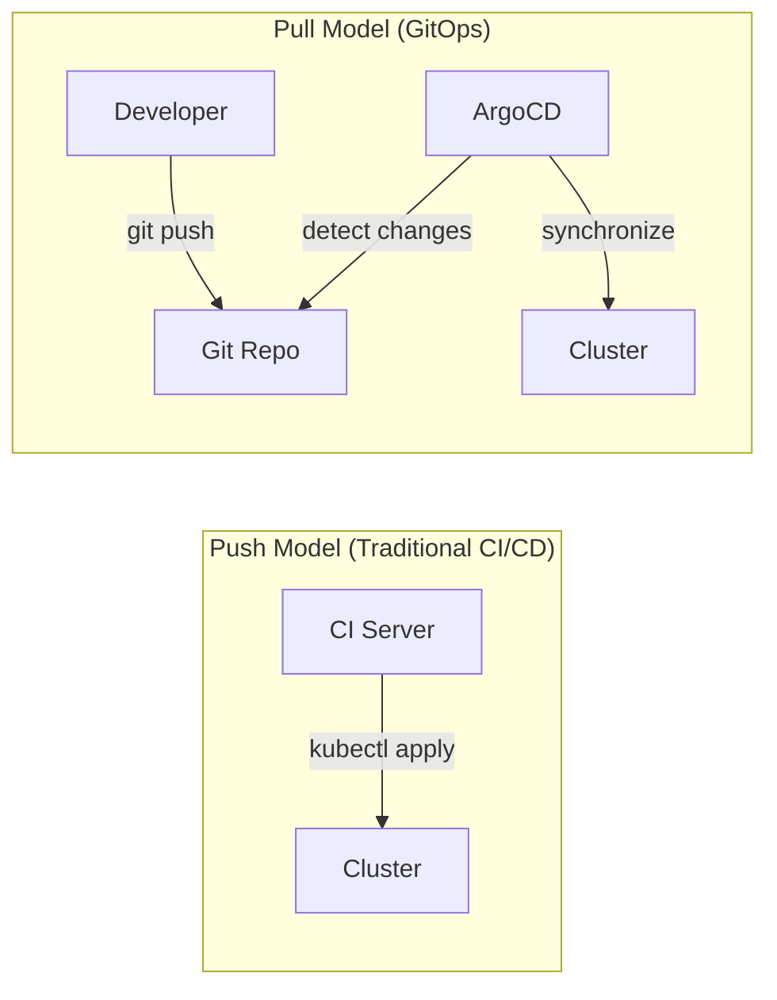
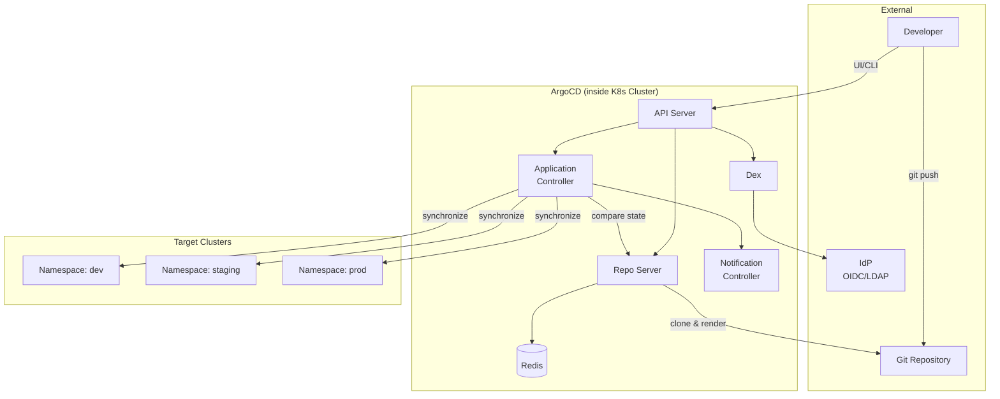
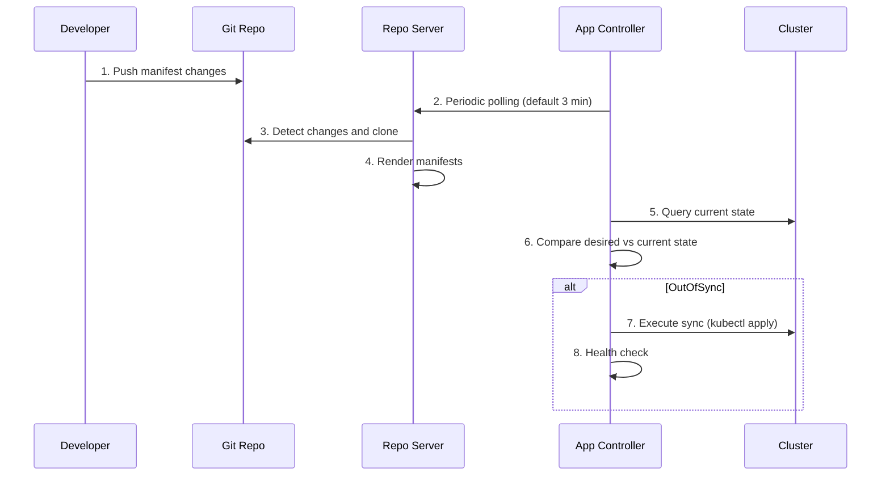
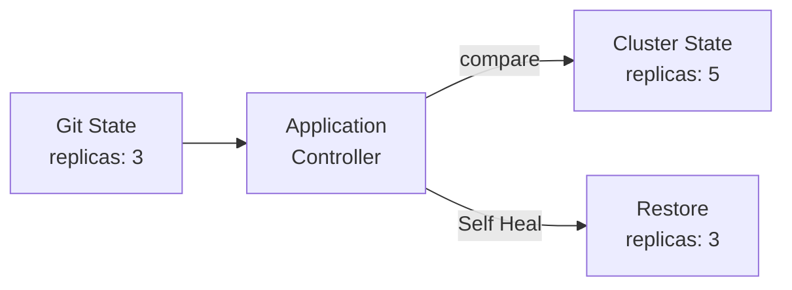
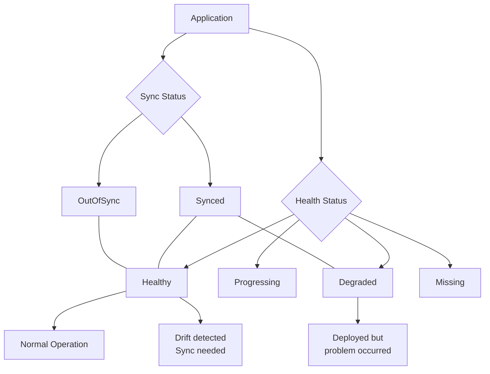

## Overall Analogy: Automated Library Synchronization System

ArgoCD is easiest to understand when compared to an **automated library synchronization librarian**:

| Library Analogy | ArgoCD | Role |
|----------------|--------|------|
| Master book catalog | Git Repository | Single source of all deployment definitions |
| Auto-sync librarian | Application Controller | Continuously compares shelves with the catalog |
| Bookshelves (actual placement) | Kubernetes Cluster | Actually deployed resources |
| Comparing catalog with shelves | Sync Status check | Comparing Git state with cluster state |
| Auto-restock when books are missing | Self Healing | Restores to original when manual changes occur |
| Librarian's inspection report | Health Assessment | Diagnostics of deployed resource health |
| Section managers per area | AppProject | Access control per team/environment |
| Auto-shelving new arrivals | Auto Sync | Automatic deployment on Git change detection |
| Auto-removal of retired books | Prune | Automatic cleanup of resources deleted from Git |

In this way, ArgoCD is an "automated librarian that keeps the master catalog (Git) and the actual shelves (cluster) always in sync."

---

> **Target Audience**: Backend/infrastructure engineers looking to automate Kubernetes deployments
> **Prerequisites**: Deployment, Service
> **Estimated Time**: ~30 minutes
> **After reading this**: You will understand GitOps concepts, ArgoCD architecture, core resources, and Sync strategies


- ArgoCD uses Git as the Single Source of Truth to automatically deploy to Kubernetes
- The Application resource maps a Git repo to a K8s cluster
- Auto Sync + Self Healing keeps Git and cluster state always synchronized
- Health Assessment monitors the health of deployed resources in real time


## What is GitOps?

### Why Do We Need GitOps?

**What problems arise when operators directly modify the cluster with kubectl?** You lose the ability to track who changed what and when, and the gap between development and production environments grows over time. When incidents occur, no one can answer "who changed what last?" GitOps fundamentally solves this problem.

GitOps is **an operational approach that uses Git as the Single Source of Truth for infrastructure and applications**. All changes are made only through Git, and the actual system is automatically synchronized to reflect the Git state.

### Traditional Deployment vs GitOps

| Aspect | Traditional Deployment (CI/CD Push) | GitOps |
|--------|-------------------------------------|--------|
| Deploy trigger | CI pipeline pushes to cluster | Detects Git changes and pulls |
| State management | Relies on pipeline execution history | Git commit history = deployment history |
| Rollback | Re-run previous pipeline | Git revert |
| Audit trail | Requires separate logging | Automatically tracked via Git commit log |
| Cluster access | CI holds cluster credentials | Only ArgoCD accesses the cluster |
| Drift detection | Manual verification | Automatic detection and remediation |

### Push vs Pull Model



*The Push model deploys directly to the cluster from outside, while the Pull model has ArgoCD inside the cluster watching Git and synchronizing.*


The biggest advantage of the Pull model is **security**. You don't need to give cluster credentials to CI pipelines. ArgoCD runs inside the cluster and only needs to read from Git.


### Four Principles of GitOps

| Principle | Description |
|-----------|-------------|
| Declarative | Describe the desired state of the system declaratively |
| Versioned | Version all state in Git |
| Automated | Approved changes are automatically applied to the system |
| Self-healing | Automatically remediate when actual state differs from declared state |

## ArgoCD Architecture

### Why ArgoCD?

**What if you tried to implement GitOps manually?** Polling Git for changes, computing diffs, running kubectl apply, retrying on failures... Implementing all of this yourself leads to exploding complexity. ArgoCD packages this complex GitOps workflow in a proven tool.

ArgoCD is a GitOps continuous deployment tool that runs within a Kubernetes cluster. Its core components are as follows:

| Component | Role |
|-----------|------|
| API Server | Provides Web UI, CLI, gRPC API. Handles authentication/authorization |
| Repo Server | Clones Git repos, generates manifests (Helm, Kustomize, etc.) |
| Application Controller | Monitors cluster state, compares with Git, executes Sync |
| Redis | Caching (repo data, cluster state) |
| Dex | SSO integration (OIDC, LDAP, SAML, etc.) |
| Notification Controller | Sends notifications to Slack, email, etc. |

### Architecture Diagram



*ArgoCD runs inside the cluster and synchronizes manifests from the Git Repository to the target cluster (or namespaces).*

### Operation Flow

The basic operation flow of ArgoCD is as follows:



*When a developer pushes to Git, ArgoCD detects the changes and automatically synchronizes them to the cluster.*


ArgoCD polls the Git repo **every 3 minutes** by default. If you need faster reflection, you can set up a **Webhook** to trigger Sync immediately on Git Push.


## Core Resources

### Why Is the Resource Model Important?

**To use ArgoCD, you need to define "which path from which Git repo should be deployed to which cluster."** ArgoCD manages this mapping through Kubernetes CRDs (Custom Resource Definitions). Let's look at the three most important resources.

### Application

Application is the core resource of ArgoCD. It maps a specific path in a Git repo to a specific namespace in a Kubernetes cluster.

```yaml
apiVersion: argoproj.io/v1alpha1
kind: Application
metadata:
  name: my-app
  namespace: argocd
spec:
  project: default
  source:
    repoURL: https://github.com/my-org/my-app.git
    targetRevision: main
    path: k8s/overlays/dev
  destination:
    server: https://kubernetes.default.svc
    namespace: my-app-dev
  syncPolicy:
    automated:
      prune: true
      selfHeal: true
    syncOptions:
      - CreateNamespace=true
```

The role of each field is as follows:

| Field | Description |
|-------|-------------|
| `project` | The AppProject this Application belongs to |
| `source.repoURL` | Git repo URL |
| `source.targetRevision` | Branch, tag, or commit to track |
| `source.path` | Directory path where manifests reside |
| `destination.server` | Target cluster API server |
| `destination.namespace` | Target deployment namespace |
| `syncPolicy.automated` | Enable automatic synchronization |
| `syncPolicy.automated.prune` | Automatically remove resources deleted from Git |
| `syncPolicy.automated.selfHeal` | Automatically restore on manual changes |

### Helm-based Application

Application definition when using Helm Charts:

```yaml
apiVersion: argoproj.io/v1alpha1
kind: Application
metadata:
  name: my-app-helm
  namespace: argocd
spec:
  project: default
  source:
    repoURL: https://charts.example.com
    chart: my-app
    targetRevision: 1.2.3
    helm:
      values: |
        replicaCount: 3
        image:
          tag: v2.1.0
        resources:
          requests:
            memory: 256Mi
            cpu: 100m
  destination:
    server: https://kubernetes.default.svc
    namespace: my-app
```

### AppProject

**How do you isolate teams sharing a single ArgoCD?** AppProject creates logical groups and applies access controls.

```yaml
apiVersion: argoproj.io/v1alpha1
kind: AppProject
metadata:
  name: backend-team
  namespace: argocd
spec:
  description: "Backend team project"
  sourceRepos:
    - "https://github.com/my-org/backend-*"
  destinations:
    - namespace: "backend-*"
      server: https://kubernetes.default.svc
  clusterResourceWhitelist:
    - group: ""
      kind: Namespace
  namespaceResourceWhitelist:
    - group: "apps"
      kind: Deployment
    - group: ""
      kind: Service
    - group: ""
      kind: ConfigMap
  roles:
    - name: developer
      description: "Backend developer"
      policies:
        - p, proj:backend-team:developer, applications, sync, backend-team/*, allow
        - p, proj:backend-team:developer, applications, get, backend-team/*, allow
```

Items controlled by AppProject:

| Item | Description |
|------|-------------|
| `sourceRepos` | Allowed Git repos (wildcard supported) |
| `destinations` | Deployable clusters and namespaces |
| `clusterResourceWhitelist` | Allowed cluster-scoped resources |
| `namespaceResourceWhitelist` | Allowed namespace-scoped resources |
| `roles` | RBAC role and policy definitions |


The `default` project allows everything. In production environments, always create **per-team/per-environment AppProjects** and apply the principle of least privilege.


### Repository

How to connect Git or Helm repositories to ArgoCD:

```bash
# HTTPS (username/password)
argocd repo add https://github.com/my-org/my-app.git \
  --username admin \
  --password $GIT_TOKEN

# SSH key
argocd repo add git@github.com:my-org/my-app.git \
  --ssh-private-key-path ~/.ssh/id_rsa

# Helm repo
argocd repo add https://charts.example.com \
  --type helm \
  --name my-charts
```

You can also define it directly as a Secret:

```yaml
apiVersion: v1
kind: Secret
metadata:
  name: my-repo
  namespace: argocd
  labels:
    argocd.argoproj.io/secret-type: repository
stringData:
  type: git
  url: https://github.com/my-org/my-app.git
  username: admin
  password: ghp_xxxxxxxxxxxx
```

## Sync Strategy

### Why Understand Sync Strategies?

**Should every Git push be deployed immediately?** Auto-deploy is convenient for development environments, but production environments are safer with manual approval before deployment. ArgoCD allows different Sync strategies per environment.

### Auto Sync vs Manual Sync

| Strategy | Description | Suitable Environment |
|----------|-------------|---------------------|
| Auto Sync | Auto-deploy on Git change detection | dev, staging |
| Manual Sync | Explicitly execute Sync from UI/CLI | production |

```yaml
# Auto Sync configuration
syncPolicy:
  automated:
    prune: true      # Automatically remove resources deleted from Git
    selfHeal: true   # Automatically restore on manual changes
    allowEmpty: false # Prevent empty manifests
```

```yaml
# Manual Sync (omit the automated block)
syncPolicy:
  syncOptions:
    - Validate=true
```

### Self Healing

**What happens when an operator directly modifies the cluster with kubectl?** If Self Healing is enabled, ArgoCD detects the change and automatically restores to the Git state.



*Even if someone changes replicas to 5 with kubectl scale, Self Healing automatically restores it to 3 from Git.*


When Self Healing is enabled, emergency fixes made via kubectl will also be reverted. In emergency situations, temporarily **switch the ArgoCD Application to Manual Sync** or **disable Auto Sync**.


### Prune

Prune automatically removes resources from the cluster that have been deleted from Git.

| Prune Setting | When file is deleted from Git | Cluster Behavior |
|---------------|-------------------------------|------------------|
| `prune: false` (default) | Deleted file detected | Resource kept (shown as OutOfSync) |
| `prune: true` | Deleted file detected | Resource automatically deleted |

### Sync Status

ArgoCD expresses the state difference between Git and cluster in three statuses:

| Status | Meaning | Icon |
|--------|---------|------|
| **Synced** | Git and cluster state match | Green check |
| **OutOfSync** | Git and cluster state differ | Yellow circle |
| **Unknown** | Unable to determine state | Gray question mark |

```mermaid
stateDiagram-v2
    &#91;*&#93; --> OutOfSync : New Application created
    OutOfSync --> Synced : Sync executed successfully
    Synced --> OutOfSync : Git change detected
    Synced --> OutOfSync : Manual cluster change
    OutOfSync --> OutOfSync : Sync failed
    Synced --> Unknown : Connection lost
    Unknown --> OutOfSync : Connection restored
```



*State transition diagram for Application Sync Status.*

### Sync Wave and Hook

In complex deployments, the order of resource deployment matters. Sync Waves allow you to control the order:

```yaml
# wave 0: deploy first (default)
apiVersion: v1
kind: Namespace
metadata:
  name: my-app
  annotations:
    argocd.argoproj.io/sync-wave: "0"
---
# wave 1: deploy after Namespace creation
apiVersion: v1
kind: ConfigMap
metadata:
  name: my-config
  annotations:
    argocd.argoproj.io/sync-wave: "1"
---
# wave 2: deploy after ConfigMap creation
apiVersion: apps/v1
kind: Deployment
metadata:
  name: my-app
  annotations:
    argocd.argoproj.io/sync-wave: "2"
```

Sync Hooks execute Jobs at specific points in the Sync lifecycle:

| Hook | Execution Timing | Use Case |
|------|-------------------|----------|
| `PreSync` | Before Sync execution | DB migration, schema changes |
| `Sync` | Along with main Sync | Normal resource deployment |
| `PostSync` | After Sync completion | Integration tests, notifications |
| `SyncFail` | On Sync failure | Rollback, notifications |

```yaml
apiVersion: batch/v1
kind: Job
metadata:
  name: db-migration
  annotations:
    argocd.argoproj.io/hook: PreSync
    argocd.argoproj.io/hook-delete-policy: HookSucceeded
spec:
  template:
    spec:
      containers:
        - name: migrate
          image: my-app:latest
          command: ["./migrate.sh"]
      restartPolicy: Never
```

## Health Assessment

### Why Is Health Checking Necessary?

**A successful Sync doesn't mean the deployment is healthy.** kubectl apply may succeed, but a Pod could be stuck in CrashLoopBackOff. ArgoCD's Health Assessment verifies that deployed resources are actually functioning properly.

### Health Status

ArgoCD classifies the actual state of resources into four categories:

| Status | Meaning | Example |
|--------|---------|---------|
| **Healthy** | Operating normally | All Pods in a Deployment are Ready |
| **Progressing** | In progress | Rolling update underway |
| **Degraded** | Unhealthy | Pod CrashLoopBackOff |
| **Missing** | Resource doesn't exist | Not yet created |
| **Suspended** | Paused | CronJob waiting |



*Combining Sync Status and Health Status gives a complete picture of the Application's overall state.*

### Default Health Checks per Resource

ArgoCD provides default health checks for major Kubernetes resources:

| Resource | Healthy Condition |
|----------|-------------------|
| Deployment | All replicas updated and available |
| StatefulSet | All replicas ready |
| Service | External IP assigned for LoadBalancer type |
| Ingress | Address assigned |
| PVC | Bound state |
| Pod | Running state with all containers ready |
| Job | Complete state |

### Custom Health Checks

When default health checks are insufficient, you can define custom checks using Lua scripts in the `argocd-cm` ConfigMap. By writing Lua code under the `resource.customizations.health.<group>_<kind>` key, ArgoCD reads the resource's `.status` to determine Healthy/Progressing/Degraded.


Custom health checks are especially useful for **CRDs (Custom Resource Definitions)**. You can define health status for resources that ArgoCD doesn't natively understand (e.g., KafkaTopic, Certificate).


## Operational Best Practices

### Git Repo Structure

```
k8s-manifests/
├── base/                    # Common manifests
│   ├── deployment.yaml
│   ├── service.yaml
│   └── kustomization.yaml
└── overlays/                # Per-environment overlays
    ├── dev/
    │   └── kustomization.yaml
    ├── staging/
    │   └── kustomization.yaml
    └── prod/
        └── kustomization.yaml
```

### Per-Environment Strategy Summary

| Item | dev | staging | production |
|------|-----|---------|------------|
| Auto Sync | Yes | Yes | No (Manual) |
| Self Heal | Yes | Yes | Selective |
| Prune | Yes | Yes | No (caution) |
| Webhook | Yes | Yes | Yes |
| AppProject | team-dev | team-staging | team-prod (strict) |

### Security Best Practices

1. **Don't store Secrets in Git** - Use Sealed Secrets, External Secrets Operator, or Vault
2. **Apply least privilege with AppProject** - Restrict accessible repos, namespaces, and resources per team
3. **Integrate SSO** - Connect with your organization's IdP through Dex
4. **Configure RBAC policies** - Define fine-grained permissions per role


Never store plaintext Secrets in Git. Use one of the following:
- **Sealed Secrets**: Store encrypted Secrets in Git
- **External Secrets Operator**: Inject at runtime from AWS Secrets Manager, Vault, etc.
- **SOPS**: Encrypt YAML files with Mozilla SOPS


## References

| Resource | Link |
|----------|------|
| ArgoCD Official Docs | https://argo-cd.readthedocs.io |
| ArgoCD GitHub | https://github.com/argoproj/argo-cd |
| GitOps Principles (OpenGitOps) | https://opengitops.dev |
| Argo Project | https://argoproj.github.io |

### Next Steps

This document covered the core concepts of ArgoCD. The following documents cover more advanced topics:

- **ArgoCD Installation and Setup**: How to install ArgoCD on a cluster and deploy your first Application
- **ArgoCD Advanced Patterns**: ApplicationSet, App of Apps, Progressive Delivery, and other production-level patterns
