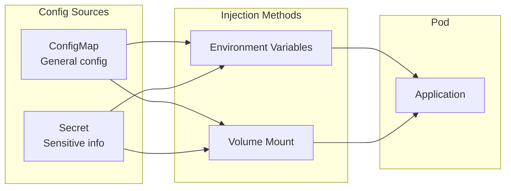

> **Target Audience**: Backend developers who want to manage application configuration in Kubernetes
> **Prerequisites**: Pod concepts
> **After reading this**: You will understand how to separate and manage configuration and sensitive information with ConfigMap and Secret


- ConfigMap stores general configuration (DB host, log level, etc.)
- Secret stores sensitive information (passwords, API keys, etc.)
- Both can be injected into Pods as environment variables or files


## Overall Flow

Let's first examine the flow of ConfigMap and Secret injection into Pods.



| Injection Method | Advantages | Disadvantages | When to Use |
|------------------|------------|---------------|-------------|
| Environment variables | Access without code changes | Only reflected on Pod restart | Simple values, config needed at startup |
| Volume mount | File access, auto-refresh | File reading logic needed | Config files, certificates, when dynamic changes needed |

## Why Separate Configuration?

Hardcoding configuration in images causes several problems.

| Problem | After Config Separation |
|---------|------------------------|
| Different images needed per environment | Same image, different config |
| Image rebuild on config change | Update config only |
| Sensitive info included in image | Securely managed with Secret |
| Difficult config history management | Version control as Kubernetes resources |

## ConfigMap

ConfigMap stores configuration data as key-value pairs.

### Creating ConfigMap

Can be created in three ways.

**1. Create with command:**
```bash
# Create from literal values
kubectl create configmap app-config \
  --from-literal=database_host=db.example.com \
  --from-literal=log_level=info

# Create from file
kubectl create configmap app-config \
  --from-file=application.properties
```

**2. Create with YAML:**
```yaml
apiVersion: v1
kind: ConfigMap
metadata:
  name: app-config
data:
  # Simple key-value
  database_host: "db.example.com"
  log_level: "info"

  # Multi-line config file
  application.properties: |
    spring.datasource.url=jdbc:postgresql://db:5432/mydb
    spring.jpa.show-sql=true
    logging.level.root=info
```

### Using ConfigMap: Environment Variables

Inject as environment variables in Pod.

```yaml
apiVersion: v1
kind: Pod
metadata:
  name: my-app
spec:
  containers:
  - name: app
    image: my-app:1.0
    env:
    # Reference individual key
    - name: DATABASE_HOST
      valueFrom:
        configMapKeyRef:
          name: app-config
          key: database_host
    # Or all keys as environment variables
    envFrom:
    - configMapRef:
        name: app-config
```

### Using ConfigMap: Volume Mount

Mount as configuration file.

```yaml
apiVersion: v1
kind: Pod
metadata:
  name: my-app
spec:
  containers:
  - name: app
    image: my-app:1.0
    volumeMounts:
    - name: config-volume
      mountPath: /etc/config
  volumes:
  - name: config-volume
    configMap:
      name: app-config
```

Mount result:

```
/etc/config/
├── database_host        # File content: db.example.com
├── log_level            # File content: info
└── application.properties  # Multi-line content
```

## Secret

Secret stores sensitive information.

### Secret vs ConfigMap

| Item | ConfigMap | Secret |
|------|-----------|--------|
| Purpose | General config | Sensitive info |
| Storage format | Plain text | Base64 encoding |
| Memory storage | Optional | Can be encrypted in etcd |
| Examples | DB host, log level | Passwords, API keys, certificates |


By default, Secrets are only Base64 encoded and easily decoded. In production, consider etcd encryption, RBAC restrictions, and external secret management tools (HashiCorp Vault, etc.).


### Creating Secret

```bash
# Create with command
kubectl create secret generic db-secret \
  --from-literal=username=admin \
  --from-literal=password=secretpass123
```

```yaml
apiVersion: v1
kind: Secret
metadata:
  name: db-secret
type: Opaque
data:
  # Base64 encoded values
  username: YWRtaW4=           # echo -n "admin" | base64
  password: c2VjcmV0cGFzczEyMw== # echo -n "secretpass123" | base64
---
# Or use stringData (auto-encoding)
apiVersion: v1
kind: Secret
metadata:
  name: db-secret
type: Opaque
stringData:
  username: admin
  password: secretpass123
```

### Secret Types

| Type | Purpose |
|------|---------|
| Opaque | General secret (default) |
| kubernetes.io/tls | TLS certificates |
| kubernetes.io/dockerconfigjson | Private registry authentication |
| kubernetes.io/basic-auth | Basic authentication info |
| kubernetes.io/ssh-auth | SSH keys |

### Using Secret

Use the same way as ConfigMap.

**Environment variables:**
```yaml
spec:
  containers:
  - name: app
    env:
    - name: DB_PASSWORD
      valueFrom:
        secretKeyRef:
          name: db-secret
          key: password
    envFrom:
    - secretRef:
        name: db-secret
```

**Volume mount:**
```yaml
spec:
  containers:
  - name: app
    volumeMounts:
    - name: secret-volume
      mountPath: /etc/secrets
      readOnly: true
  volumes:
  - name: secret-volume
    secret:
      secretName: db-secret
```

## Real Example: Spring Boot Configuration

Separate Spring Boot application configuration with ConfigMap and Secret.

### Configuration Separation Strategy

| Config Item | Storage Location |
|-------------|------------------|
| DB host, port | ConfigMap |
| DB username, password | Secret |
| Logging level | ConfigMap |
| API keys | Secret |

### ConfigMap Definition

```yaml
apiVersion: v1
kind: ConfigMap
metadata:
  name: spring-config
data:
  SPRING_DATASOURCE_URL: "jdbc:postgresql://db-service:5432/mydb"
  SPRING_JPA_SHOW_SQL: "false"
  LOGGING_LEVEL_ROOT: "info"
  SERVER_PORT: "8080"
```

### Secret Definition

```yaml
apiVersion: v1
kind: Secret
metadata:
  name: spring-secret
type: Opaque
stringData:
  SPRING_DATASOURCE_USERNAME: "myuser"
  SPRING_DATASOURCE_PASSWORD: "mysecretpassword"
```

### Using in Deployment

```yaml
apiVersion: apps/v1
kind: Deployment
metadata:
  name: spring-app
spec:
  replicas: 2
  selector:
    matchLabels:
      app: spring-app
  template:
    metadata:
      labels:
        app: spring-app
    spec:
      containers:
      - name: app
        image: my-spring-app:1.0
        ports:
        - containerPort: 8080
        envFrom:
        - configMapRef:
            name: spring-config
        - secretRef:
            name: spring-secret
```

## Update Behavior

What happens when ConfigMap or Secret is updated?

| Injection Method | Update Reflection |
|------------------|-------------------|
| Environment variables | Pod restart needed |
| Volume mount | Auto-reflected (takes several minutes) |

With volume mount, the application must detect file changes. Spring Boot can auto-reload with `spring-cloud-kubernetes`.

### Force Restart to Apply Updates

```bash
# Trigger Pod restart
kubectl rollout restart deployment/spring-app
```

Or add annotation to Deployment for auto-restart on changes:

```yaml
spec:
  template:
    metadata:
      annotations:
        # Pods recreated when this value changes
        configmap-hash: "{{ .Values.configmapHash }}"
```

## Immutable ConfigMap/Secret

Can be set to prevent modification once created.

```yaml
apiVersion: v1
kind: ConfigMap
metadata:
  name: app-config
immutable: true  # Immutable setting
data:
  key: value
```

Advantages of immutable ConfigMap:

| Advantage | Description |
|-----------|-------------|
| Prevent mistakes | Unintended modifications impossible |
| Performance improvement | kubelet doesn't need to watch for changes |
| Explicit version management | Changes require creating new resource |

## Practice: Creating and Checking ConfigMap/Secret

### ConfigMap Practice

```bash
# Create ConfigMap
kubectl create configmap test-config \
  --from-literal=message="Hello Kubernetes"

# Check
kubectl get configmap test-config -o yaml

# Test in Pod
kubectl run test --image=busybox:1.36 --rm -it \
  --env-from=configmap:test-config -- env | grep message
```

### Secret Practice

```bash
# Create Secret
kubectl create secret generic test-secret \
  --from-literal=password=mysecret

# Check (shows Base64 encoded value)
kubectl get secret test-secret -o yaml

# Decode
kubectl get secret test-secret -o jsonpath='{.data.password}' | base64 -d
```

---

## Next Steps

Once you understand ConfigMap and Secret, proceed to the next steps:

| Goal | Recommended Doc |
|------|----------------|
| Store persistent data | [Volume and Storage]() |
| Check application status | [Health Checks]() |
| Actual deployment practice | [Spring Boot Deployment]() |
