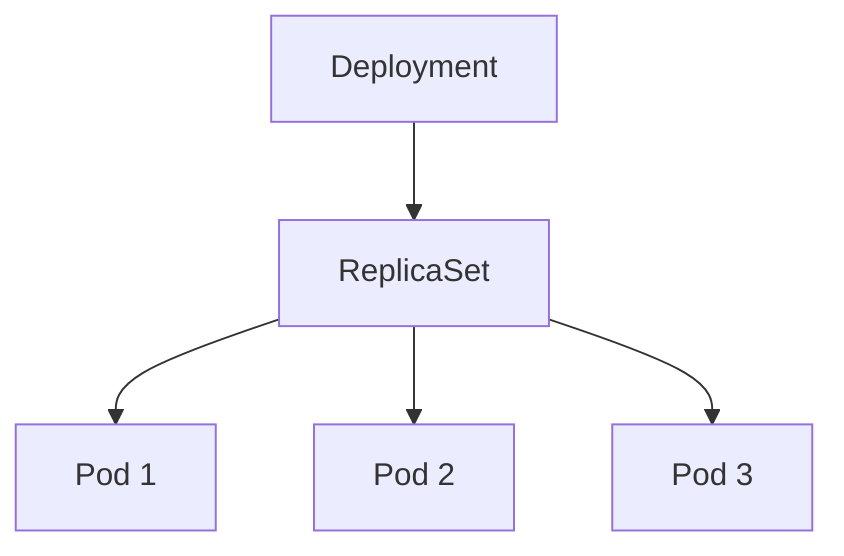
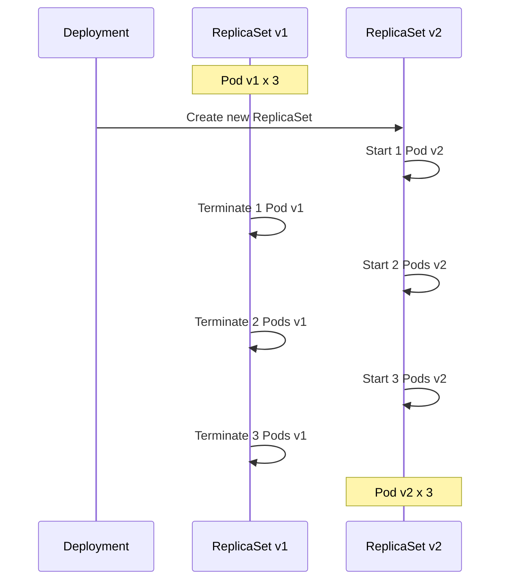

> **Target Audience**: Backend developers who want to deploy applications in Kubernetes
> **Prerequisites**: Pod concepts
> **After reading this**: You will understand how to deploy and update applications with Deployments


- Deployment manages declarative updates of Pods
- Rolling updates enable zero-downtime deployment
- Can rollback to previous version when problems occur


## What is Deployment?

Deployment is a resource that manages Pod deployment and updates. Using Deployment instead of directly managing Pods offers several benefits.

| Feature | Description |
|---------|-------------|
| Declarative updates | Just define desired state, Kubernetes handles the rest |
| Rolling updates | Deploy new version without downtime |
| Rollback | Revert to previous version when problems occur |
| Scaling | Change Pod count by adjusting replicas |
| Auto-recovery | Automatically recreate Pods on failure |

## Deployment Structure

Deployment creates ReplicaSets, and ReplicaSets manage Pods.



Comparing each resource's role:

| Resource | Role |
|----------|------|
| Deployment | Manage deployment strategy, ReplicaSet version management |
| ReplicaSet | Maintain specified number of Pod replicas |
| Pod | Execute actual application containers |


You can create ReplicaSets directly, but they lack rolling update and rollback features. Always use Deployment as it provides these capabilities.


## Deployment YAML

A basic Deployment definition.

```yaml
apiVersion: apps/v1
kind: Deployment
metadata:
  name: my-app
  labels:
    app: my-app
spec:
  replicas: 3
  selector:
    matchLabels:
      app: my-app
  template:
    metadata:
      labels:
        app: my-app
    spec:
      containers:
      - name: app
        image: my-app:1.0
        ports:
        - containerPort: 8080
        resources:
          requests:
            memory: "256Mi"
            cpu: "250m"
          limits:
            memory: "512Mi"
            cpu: "500m"
```

Key fields explained:

| Field | Description |
|-------|-------------|
| `replicas` | Number of Pods to maintain |
| `selector.matchLabels` | Criteria to select Pods to manage |
| `template` | Pod template to create |
| `template.metadata.labels` | Labels to attach to Pods (must match selector) |

### Relationship Between Selector and Labels

Deployment's selector and Pod's labels must match.

```yaml
spec:
  selector:
    matchLabels:
      app: my-app      # Manage Pods with this label
  template:
    metadata:
      labels:
        app: my-app    # Assign this label to Pods (matches above)
```

## Rolling Updates

Understanding rolling updates, a core Deployment feature.

### Rolling Update Process

Changing the image version triggers a rolling update.



### Rolling Update State by Stage

With `replicas=3`, `maxSurge=1`, `maxUnavailable=0`:

| Stage | v1 Pods | v2 Pods | Total Pods | Available Pods | Description |
|-------|---------|---------|------------|----------------|-------------|
| 0 (before) | 3 | 0 | 3 | 3 | Initial state |
| 1 | 3 | 1 | 4 | 3 | Create 1 v2 Pod |
| 2 | 2 | 1 | 3 | 3 | After v2 Ready, terminate 1 v1 |
| 3 | 2 | 2 | 4 | 3 | Create 1 more v2 Pod |
| 4 | 1 | 2 | 3 | 3 | After v2 Ready, terminate 1 v1 |
| 5 | 1 | 3 | 4 | 3 | Create 1 more v2 Pod |
| 6 (complete) | 0 | 3 | 3 | 3 | Terminate last v1 |


With `maxUnavailable=0`, available Pods always remain at 3 or more. Previous Pods are only terminated after new Pods become Ready.


Advantages of rolling updates:

| Advantage | Description |
|-----------|-------------|
| Zero-downtime | Always maintains certain number of running Pods |
| Gradual | Can stop if problems detected |
| Automated | No separate scripts needed |

### Update Strategy Configuration

```yaml
spec:
  strategy:
    type: RollingUpdate
    rollingUpdate:
      maxSurge: 1        # Additional Pods allowed beyond desired count
      maxUnavailable: 0  # Pods that can be unavailable simultaneously
```

| Setting | Meaning | Example (replicas=3) |
|---------|---------|---------------------|
| `maxSurge: 1` | Allow up to 4 running | 3+1=4 |
| `maxUnavailable: 0` | Always keep minimum 3 running | Never go below 2 |
| `maxSurge: 25%` | Allow up to 4 | 3*1.25=3.75→4 |

Comparing common strategies:

| Strategy | maxSurge | maxUnavailable | Characteristics |
|----------|----------|----------------|-----------------|
| Safety first | 1 | 0 | Slow but safe |
| Fast deployment | 25% | 25% | Fast but temporary capacity reduction |
| Resource saving | 0 | 1 | No additional resources needed |

### Recreate Strategy

Strategy to terminate all Pods then create new ones.

```yaml
spec:
  strategy:
    type: Recreate
```

Use cases:

- When old and new versions cannot run simultaneously
- Applications that only allow single instance
- When database migration is needed


Recreate strategy causes downtime. Use carefully in production.


## Rollback

Revert to previous version when problems occur.

### Check Rollout History

```bash
# Check deployment history
kubectl rollout history deployment/my-app
```

**Expected output:**
```
REVISION  CHANGE-CAUSE
1         <none>
2         <none>
3         <none>
```

To record `CHANGE-CAUSE`, add annotation during deployment:

```bash
kubectl annotate deployment/my-app kubernetes.io/change-cause="Update to image version 2.0"
```

### Execute Rollback

```bash
# Rollback to immediately previous version
kubectl rollout undo deployment/my-app

# Rollback to specific version
kubectl rollout undo deployment/my-app --to-revision=2
```

### Check Rollout Status

```bash
# Rollout progress status
kubectl rollout status deployment/my-app

# Pause rollout
kubectl rollout pause deployment/my-app

# Resume rollout
kubectl rollout resume deployment/my-app
```

## Scaling

Adjust Pod count to respond to traffic changes.

### Manual Scaling

```bash
# Change replicas to 5
kubectl scale deployment/my-app --replicas=5

# Or edit YAML
kubectl edit deployment/my-app
```

### Scaling Considerations

| Consideration | Description |
|---------------|-------------|
| Resource check | Whether nodes have sufficient resources |
| Connections | DB connection pool, external API limits |
| Session management | Whether sticky session is needed |
| Storage | RWO volumes cannot be shared by multiple Pods |

## Practice: Deploying and Updating Deployment

### Create Deployment

```bash
# Create Deployment
kubectl apply -f deployment.yaml

# Check status
kubectl get deployment my-app
kubectl get replicaset
kubectl get pods -l app=my-app
```

### Update Image

```bash
# Trigger rolling update by changing image
kubectl set image deployment/my-app app=my-app:2.0

# Monitor rollout status
kubectl rollout status deployment/my-app

# Watch Pods being replaced
kubectl get pods -w
```

### Check ReplicaSets

```bash
# List ReplicaSets - previous versions are retained
kubectl get rs

# Expected output:
# NAME                  DESIRED   CURRENT   READY   AGE
# my-app-7d8f9b7c5f     3         3         3       10m
# my-app-5b9f8c6d4e     0         0         0       30m
```

Previous ReplicaSets are retained for rollback. You can configure retention count with `revisionHistoryLimit`.

```yaml
spec:
  revisionHistoryLimit: 3  # Keep only recent 3 versions
```

### Rollback Practice

```bash
# Intentionally deploy invalid image
kubectl set image deployment/my-app app=my-app:invalid

# Check rollout status (fails)
kubectl rollout status deployment/my-app

# Check Pod status
kubectl get pods
# Check Pods in ImagePullBackOff state

# Rollback
kubectl rollout undo deployment/my-app

# Verify recovery
kubectl get pods
```

## Frequently Used kubectl Commands

| Command | Description |
|---------|-------------|
| `kubectl get deployment` | List Deployments |
| `kubectl describe deployment <name>` | Detailed information |
| `kubectl rollout status deployment/<name>` | Rollout status |
| `kubectl rollout history deployment/<name>` | Version history |
| `kubectl rollout undo deployment/<name>` | Rollback |
| `kubectl scale deployment/<name> --replicas=N` | Scaling |
| `kubectl set image deployment/<name> <container>=<image>` | Change image |

## Production Recommended Settings

Deployment example for actual operations.

```yaml
apiVersion: apps/v1
kind: Deployment
metadata:
  name: my-app
spec:
  replicas: 3
  revisionHistoryLimit: 5
  strategy:
    type: RollingUpdate
    rollingUpdate:
      maxSurge: 1
      maxUnavailable: 0
  selector:
    matchLabels:
      app: my-app
  template:
    metadata:
      labels:
        app: my-app
    spec:
      containers:
      - name: app
        image: my-app:1.0
        ports:
        - containerPort: 8080
        resources:
          requests:
            memory: "256Mi"
            cpu: "250m"
          limits:
            memory: "512Mi"
            cpu: "500m"
        readinessProbe:
          httpGet:
            path: /health
            port: 8080
          initialDelaySeconds: 10
          periodSeconds: 5
        livenessProbe:
          httpGet:
            path: /health
            port: 8080
          initialDelaySeconds: 30
          periodSeconds: 10
```

Recommended settings checklist:

| Item | Reason |
|------|--------|
| `resources` settings | Prevent resource contention, scheduling accuracy |
| `readinessProbe` | Prevent traffic to unready Pods |
| `livenessProbe` | Auto-restart stuck Pods |
| `maxUnavailable: 0` | Guarantee zero-downtime deployment |
| `revisionHistoryLimit` | Manage rollback-able versions |

---

## Next Steps

Once you understand Deployments, proceed to the next steps:

| Goal | Recommended Doc |
|------|----------------|
| Access Pods | [Service](service/) |
| Auto-scaling | [Scaling](scaling/) |
| Configure health checks | [Health Checks](health-checks/) |
