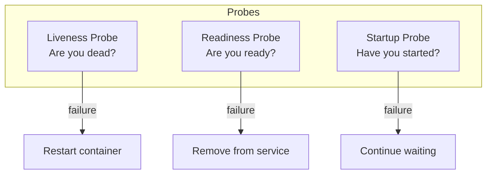
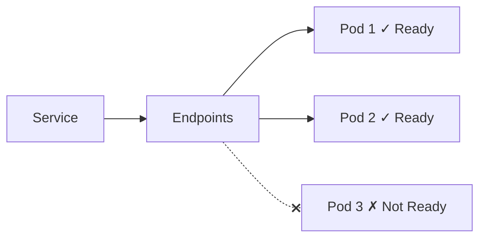
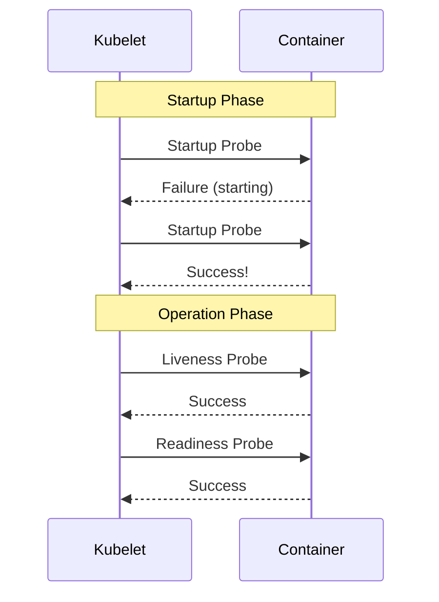

> **Target Audience**: Backend developers who want to monitor application status in Kubernetes
> **Prerequisites**: Pod, Deployment concepts
> **After reading this**: You will understand the differences between Liveness, Readiness, and Startup Probes and how to configure them


- **Liveness Probe**: Check if container is alive, restart on failure
- **Readiness Probe**: Check if ready to receive traffic, remove from service on failure
- **Startup Probe**: Check startup completion, other Probes disabled until completion


## Why Health Checks are Needed?

A Running container doesn't mean the application is healthy.

| Situation | Container State | Actual State |
|-----------|----------------|--------------|
| Deadlock occurred | Running | Cannot respond |
| DB connection lost | Running | Service unavailable |
| Starting up | Running | Not ready |
| Memory shortage | Running | Slow response |

Health checks allow us to detect these situations and respond automatically.

## Probe Types Comparison



*This diagram shows the different failure behaviors of the three probe types: Liveness (restart), Readiness (remove from service), and Startup (wait).*

Comparing characteristics of each Probe:

| Probe | Question | Action on Failure | When to Use |
|-------|----------|-------------------|-------------|
| Liveness | Are you alive? | Restart container | Always |
| Readiness | Are you ready? | Remove from service | Always |
| Startup | Have you started? | Wait | Only at startup |

## Liveness Probe

Checks if application is operating normally. On failure, kubelet restarts the container.

### HTTP Check

```yaml
apiVersion: v1
kind: Pod
metadata:
  name: liveness-http
spec:
  containers:
  - name: app
    image: my-app:1.0
    livenessProbe:
      httpGet:
        path: /health
        port: 8080
      initialDelaySeconds: 30
      periodSeconds: 10
      timeoutSeconds: 5
      failureThreshold: 3
```

### TCP Check

Checks if port is open.

```yaml
livenessProbe:
  tcpSocket:
    port: 8080
  initialDelaySeconds: 15
  periodSeconds: 20
```

### Command Execution Check

```yaml
livenessProbe:
  exec:
    command:
    - cat
    - /tmp/healthy
  initialDelaySeconds: 5
  periodSeconds: 5
```

### Probe Configuration Values

| Setting | Default | Description |
|---------|---------|-------------|
| initialDelaySeconds | 0 | Wait time before first check |
| periodSeconds | 10 | Check interval |
| timeoutSeconds | 1 | Response wait time |
| successThreshold | 1 | Consecutive successes for success |
| failureThreshold | 3 | Consecutive failures for failure |

## Readiness Probe

Checks if application is ready to receive traffic. On failure, removed from Service Endpoints.

```yaml
readinessProbe:
  httpGet:
    path: /ready
    port: 8080
  initialDelaySeconds: 5
  periodSeconds: 5
  failureThreshold: 3
```

### Readiness vs Liveness

| Situation | Readiness | Liveness |
|-----------|-----------|----------|
| DB connection lost | Fail (exclude traffic) | Success (no restart needed) |
| Loading configuration | Fail (not ready) | Success (operating normally) |
| Deadlock | Fail | Fail (restart needed) |



*This diagram shows how a Pod is removed from Service Endpoints and stops receiving traffic when its Readiness Probe fails.*

## Startup Probe

Used when application takes long to start. Liveness/Readiness Probes are disabled until Startup Probe succeeds.

```yaml
startupProbe:
  httpGet:
    path: /health
    port: 8080
  initialDelaySeconds: 10
  periodSeconds: 10
  failureThreshold: 30  # Wait max 5 minutes (10s × 30)
```

### Why is Startup Probe Needed?

Wouldn't setting Liveness Probe's `initialDelaySeconds` longer work?

| Method | Problem |
|--------|---------|
| Use only Liveness, long initialDelay | Check interval remains long after startup |
| Startup + Liveness | Long wait only at startup, short interval afterwards |



*This diagram shows the startup-to-running phase transition where Liveness and Readiness Probes only activate after the Startup Probe succeeds.*

## Real Example: Spring Boot

Example Probe configuration for Spring Boot application.

### Spring Boot Actuator Configuration

```yaml
# application.yml
management:
  endpoints:
    web:
      exposure:
        include: health
  endpoint:
    health:
      probes:
        enabled: true
  health:
    livenessState:
      enabled: true
    readinessState:
      enabled: true
```

Spring Boot Actuator provides these endpoints:

| Endpoint | Purpose |
|----------|---------|
| /actuator/health/liveness | Liveness Probe |
| /actuator/health/readiness | Readiness Probe |
| /actuator/health | Overall status |

### Kubernetes Probe Configuration

```yaml
apiVersion: apps/v1
kind: Deployment
metadata:
  name: spring-app
spec:
  replicas: 3
  selector:
    matchLabels:
      app: spring-app
  template:
    metadata:
      labels:
        app: spring-app
    spec:
      containers:
      - name: app
        image: spring-app:1.0
        ports:
        - containerPort: 8080
        startupProbe:
          httpGet:
            path: /actuator/health/liveness
            port: 8080
          initialDelaySeconds: 10
          periodSeconds: 10
          failureThreshold: 30
        livenessProbe:
          httpGet:
            path: /actuator/health/liveness
            port: 8080
          periodSeconds: 10
          failureThreshold: 3
        readinessProbe:
          httpGet:
            path: /actuator/health/readiness
            port: 8080
          periodSeconds: 5
          failureThreshold: 3
```

## Recommended Settings

| Application Type | startupProbe | livenessProbe | readinessProbe |
|------------------|--------------|---------------|----------------|
| Fast startup (< 30s) | Optional | Required | Required |
| Slow startup (> 30s) | Required | Required | Required |
| Has external dependencies | Optional | Simple check | Include dependency check |

### Health Check Endpoint Design

| Probe | What to Check |
|-------|--------------|
| Liveness | Process survival only (fast and simple) |
| Readiness | External dependencies (DB, cache, external API) |


Checking DB connection in Liveness Probe can worsen the situation by restarting all Pods on DB failure. Check external dependencies in Readiness Probe.


## Troubleshooting

### Pod Keeps Restarting

```bash
# Check events
kubectl describe pod <pod-name>

# Check logs
kubectl logs <pod-name> --previous
```

Common causes:

| Cause | Solution |
|-------|----------|
| Insufficient initialDelaySeconds | Use Startup Probe or increase value |
| Insufficient timeoutSeconds | Increase value or optimize endpoint |
| Wrong health check path | Verify path and port |

### Cannot Receive Traffic Due to Readiness Failure

```bash
# Check Endpoints
kubectl get endpoints <service-name>

# Check Pod Ready status
kubectl get pods -o wide
```

If Endpoints is empty, Readiness Probe is failing.

## Practice: Configuring and Testing Probes

### Check Probe Operation

```yaml
apiVersion: v1
kind: Pod
metadata:
  name: probe-test
spec:
  containers:
  - name: app
    image: nginx:1.25
    ports:
    - containerPort: 80
    livenessProbe:
      httpGet:
        path: /
        port: 80
      initialDelaySeconds: 5
      periodSeconds: 5
    readinessProbe:
      httpGet:
        path: /
        port: 80
      initialDelaySeconds: 5
      periodSeconds: 5
```

```bash
# Create Pod
kubectl apply -f probe-test.yaml

# Monitor events
kubectl get events --watch

# Simulate Probe failure
kubectl exec probe-test -- rm /usr/share/nginx/html/index.html

# Check Pod status (restart occurs)
kubectl get pods -w
```

---

## Next Steps

Once you understand health checks, proceed to the next steps:

| Goal | Recommended Doc |
|------|----------------|
| Troubleshoot Pods | [Pod Troubleshooting](../howto/pod-troubleshooting/) |
| Actual deployment practice | [Spring Boot Deployment](../examples/spring-boot/) |
| Auto-scaling | [Scaling](scaling/) |
