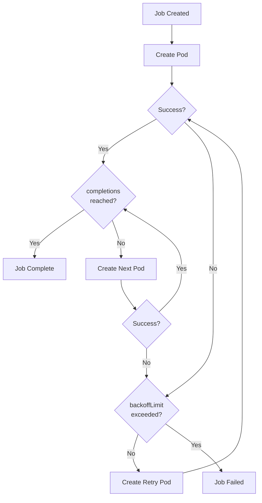
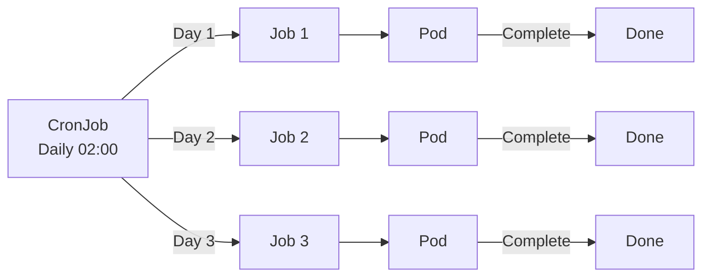

## Overall Analogy: Part-Time Work and Scheduled Cleaning

Jobs and CronJobs are easy to understand when compared to **part-time work and scheduled cleaning**:

| Analogy | Kubernetes | Role |
|---------|-----------|------|
| One-time part-time work | Job | A task that runs once and finishes |
| Scheduled cleaning routine | CronJob | A task that runs periodically on a schedule |
| Hire 3 workers | completions: 3 | Number of successful completions required |
| Deploy 2 workers at once | parallelism: 2 | Number of Pods to run simultaneously |
| Maximum retry attempts | backoffLimit | Retry limit on failure |
| Work deadline | activeDeadlineSeconds | Overall time limit for the task |

In this way, a Job is "a task that finishes once the assigned work is done," and a CronJob is "a scheduled task that runs repeatedly at set times."

---

> **Target Audience**: Developers who want to run batch or scheduled jobs on Kubernetes
> **Prerequisites**: Pod, Deployment concepts
> **After reading this**: You will understand how Jobs and CronJobs work and how to configure them


- A Job terminates after successfully completing a specified number of times
- A CronJob creates Jobs periodically based on a cron expression
- Use backoffLimit and activeDeadlineSeconds to control failure handling


## What Is a Job?

A Job is a resource that creates one or more Pods and terminates once the specified task is complete. Unlike Deployments, the goal is for Pods to terminate successfully.

| Property | Deployment | Job |
|----------|-----------|-----|
| Purpose | Keep Pods running | Terminate after task completion |
| When Pod terminates | Recreate new Pod | Mark as complete if successful |
| Use case | Web servers, API servers | Data migration, batch processing |

## Job Execution Flow



## Job YAML

### Basic Job

```yaml
apiVersion: batch/v1
kind: Job
metadata:
  name: data-migration
spec:
  completions: 1        # Number of successful completions
  parallelism: 1        # Number of concurrent Pods
  backoffLimit: 3       # Maximum retry count
  activeDeadlineSeconds: 600  # Overall time limit (seconds)
  template:
    spec:
      containers:
      - name: migration
        image: my-app:1.0
        command: ["python", "migrate.py"]
        env:
        - name: DB_HOST
          valueFrom:
            secretKeyRef:
              name: db-secret
              key: host
      restartPolicy: Never    # Must be Never or OnFailure for Jobs
```

Key fields explained.

| Field | Default | Description |
|-------|---------|-------------|
| `completions` | 1 | Number of Pods that must complete successfully |
| `parallelism` | 1 | Number of Pods to run concurrently |
| `backoffLimit` | 6 | Maximum retry count on failure |
| `activeDeadlineSeconds` | None | Overall execution time limit for the Job (seconds) |
| `restartPolicy` | - | `Never` or `OnFailure` |


- `Never`: Leaves the failed Pod and creates a new one (useful for debugging)
- `OnFailure`: Restarts the container within the same Pod (saves resources)


### Parallel Processing Job

Run multiple Pods simultaneously for faster task completion.

```yaml
apiVersion: batch/v1
kind: Job
metadata:
  name: batch-processing
spec:
  completions: 10       # 10 total successes needed
  parallelism: 3        # Run 3 Pods concurrently
  backoffLimit: 5
  template:
    spec:
      containers:
      - name: worker
        image: batch-worker:1.0
        command: ["./process.sh"]
      restartPolicy: Never
```

| completions | parallelism | Behavior |
|------------|-------------|----------|
| 1 | 1 | Single Pod execution (default) |
| N | 1 | N Pods run sequentially |
| N | M | Up to M Pods run concurrently, N total successes |
| None | M | Work Queue mode (Pods decide termination themselves) |

## What Is a CronJob?

A CronJob is a resource that creates Jobs periodically according to a cron schedule.



## CronJob YAML

```yaml
apiVersion: batch/v1
kind: CronJob
metadata:
  name: daily-backup
spec:
  schedule: "0 2 * * *"           # Daily at 2 AM
  concurrencyPolicy: Forbid        # Skip if previous Job is still running
  successfulJobsHistoryLimit: 3    # Number of successful Jobs to retain
  failedJobsHistoryLimit: 3        # Number of failed Jobs to retain
  startingDeadlineSeconds: 200     # Grace period for schedule start
  jobTemplate:
    spec:
      backoffLimit: 2
      activeDeadlineSeconds: 3600
      template:
        spec:
          containers:
          - name: backup
            image: backup-tool:1.0
            command: ["./backup.sh"]
          restartPolicy: OnFailure
```

### Cron Expression

```
+------------------- minute (0 - 59)
| +----------------- hour (0 - 23)
| | +--------------- day of month (1 - 31)
| | | +------------- month (1 - 12)
| | | | +----------- day of week (0 - 6, Sunday=0)
| | | | |
* * * * *
```

| Expression | Meaning |
|------------|---------|
| `0 2 * * *` | Daily at 2 AM |
| `*/15 * * * *` | Every 15 minutes |
| `0 9 * * 1-5` | Weekdays at 9 AM |
| `0 0 1 * *` | First day of every month at midnight |
| `0 */6 * * *` | Every 6 hours |

### concurrencyPolicy

| Value | Description |
|-------|-------------|
| `Allow` (default) | Create new Job even if previous is still running |
| `Forbid` | Skip new Job if previous is still running |
| `Replace` | Cancel previous Job and create new one |


With the `Allow` policy, if Job execution time exceeds the schedule interval, Jobs can accumulate. Use `Forbid` or `Replace` in production.


## Retry Policy

Settings that control retry behavior when a Job fails.

| Setting | Description |
|---------|-------------|
| `backoffLimit` | Maximum retry count on failure (default 6) |
| `activeDeadlineSeconds` | Overall execution time limit for the Job |

Retry intervals increase with exponential backoff: 10s, 20s, 40s, ... up to 6 minutes.

```yaml
spec:
  backoffLimit: 3              # Job fails after 3 failures
  activeDeadlineSeconds: 600   # Job forcefully terminated after 10 minutes
```


The Job is marked as failed if either condition is met. `activeDeadlineSeconds` limits the total time regardless of retry count.


## Hands-on: Deploying Jobs and CronJobs

### Run and Verify a Job

```bash
# Create Job
kubectl apply -f job.yaml

# Check Job status
kubectl get jobs

# Expected output:
# NAME              COMPLETIONS   DURATION   AGE
# data-migration    1/1           15s        30s

# Check Pod status (Completed state)
kubectl get pods -l job-name=data-migration

# Check Job logs
kubectl logs job/data-migration
```

### Create and Verify a CronJob

```bash
# Create CronJob
kubectl apply -f cronjob.yaml

# Check CronJob status
kubectl get cronjobs

# Expected output:
# NAME           SCHEDULE    SUSPEND   ACTIVE   LAST SCHEDULE
# daily-backup   0 2 * * *   False     0        <none>

# Manually trigger immediately
kubectl create job --from=cronjob/daily-backup manual-backup

# Check created Jobs
kubectl get jobs
```

### Debugging Failed Jobs

```bash
# Check failed Pods
kubectl get pods -l job-name=data-migration --field-selector=status.phase=Failed

# Check failed Pod logs
kubectl logs <pod-name>

# Check Job events
kubectl describe job data-migration
```

## Frequently Used kubectl Commands

| Command | Description |
|---------|-------------|
| `kubectl get jobs` | List Jobs |
| `kubectl get cronjobs` | List CronJobs |
| `kubectl describe job <name>` | Job details |
| `kubectl logs job/<name>` | Job logs |
| `kubectl delete job <name>` | Delete Job |
| `kubectl create job --from=cronjob/<name> <job-name>` | Manually trigger CronJob |

---

## Next Steps

Now that you understand Jobs and CronJobs, proceed to the following:

| Goal | Recommended Document |
|------|---------------------|
| Network policies | [NetworkPolicy](network-policy/) |
| Resource isolation | [Namespace](namespace/) |
| Access control | [RBAC](rbac/) |
