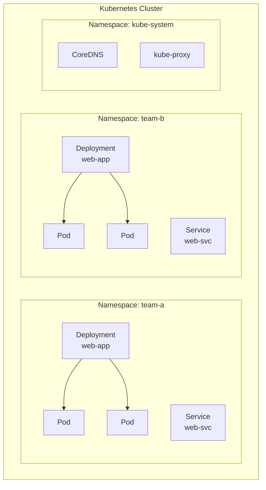
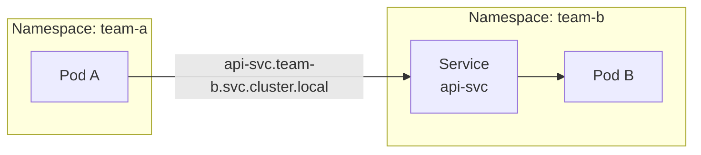

## Overall Analogy: Building Wings in an Apartment Complex

Namespaces are easy to understand when compared to **building wings in an apartment complex**:

| Apartment Complex Analogy | Kubernetes Namespace | Role |
|---------------------------|---------------------|------|
| Wing 101, Wing 102 separation | Namespace | Logically isolate resources |
| Per-wing maintenance budget | ResourceQuota | Limit total resources per namespace |
| Per-unit electricity/water limit | LimitRange | Default resources per Pod/container |
| Management office restricted area | kube-system | Dedicated space for system components |
| Public bulletin board area | kube-public | Space accessible to all users |
| Per-wing access card | RBAC + Namespace | Separate access permissions |

In this way, a Namespace is like "dividing management areas by building wing within a single apartment complex."

---

> **Target Audience**: Operators who want to systematically manage resources in a Kubernetes cluster
> **Prerequisites**: Pod, Deployment, Service concepts
> **After reading this**: You will understand how to configure multi-tenant environments using Namespaces


- Namespaces logically isolate resources within a cluster
- You can limit resource usage with ResourceQuota and LimitRange
- Multi-tenant operations are possible through team/environment separation


## What Is a Namespace?

What happens when multiple teams work on a single cluster? Team A's `web-app` Deployment could be accidentally overwritten by Team B, or one team's Pods could monopolize cluster resources and impact other teams' services. Namespaces prevent such conflicts and interference by logically partitioning a single physical cluster.

A Namespace is a mechanism that divides a single physical cluster into multiple virtual clusters. Resources with the same name can exist in different Namespaces.

| Feature | Description |
|---------|-------------|
| Resource isolation | Separate resources by team/project |
| Name scoping | Create resources with the same name in different Namespaces |
| Access control | Combine with RBAC for permission separation |
| Resource limits | Set usage caps with ResourceQuota |

## Namespace Isolation Structure



*This diagram shows how team-a, team-b, and kube-system are isolated as separate Namespaces within a single cluster.*

Each Namespace is an independent space, so a `web-app` Deployment with the same name can exist in both `team-a` and `team-b`.

## Default Namespaces

When you create a Kubernetes cluster, the following Namespaces are automatically created.

| Namespace | Purpose |
|-----------|---------|
| `default` | The default space used when no Namespace is specified |
| `kube-system` | Kubernetes system components (CoreDNS, kube-proxy, etc.) |
| `kube-public` | Public resources readable by all users |
| `kube-node-lease` | Stores Lease objects for node heartbeats |


Arbitrarily modifying or deleting resources in the `kube-system` Namespace may cause the cluster to malfunction.


## Creating and Using Namespaces

### Creating a Namespace

```yaml
apiVersion: v1
kind: Namespace
metadata:
  name: team-a
  labels:
    team: a
    environment: production
```

```bash
# Create with YAML
kubectl apply -f namespace.yaml

# Or create with command
kubectl create namespace team-a
```

### Creating Resources in a Specific Namespace

```yaml
apiVersion: apps/v1
kind: Deployment
metadata:
  name: web-app
  namespace: team-a    # Specify Namespace
spec:
  replicas: 2
  selector:
    matchLabels:
      app: web-app
  template:
    metadata:
      labels:
        app: web-app
    spec:
      containers:
      - name: app
        image: nginx:1.25
        ports:
        - containerPort: 80
```

### Specifying Namespace in kubectl

```bash
# List Pods in a specific Namespace
kubectl get pods -n team-a

# List Pods across all Namespaces
kubectl get pods --all-namespaces

# Change default Namespace
kubectl config set-context --current --namespace=team-a
```

## ResourceQuota

ResourceQuota limits the total resource usage for an entire Namespace.

```yaml
apiVersion: v1
kind: ResourceQuota
metadata:
  name: team-a-quota
  namespace: team-a
spec:
  hard:
    requests.cpu: "4"
    requests.memory: 8Gi
    limits.cpu: "8"
    limits.memory: 16Gi
    pods: "20"
    services: "10"
    persistentvolumeclaims: "5"
```

| Field | Description |
|-------|-------------|
| `requests.cpu` / `requests.memory` | Upper limit for total resource requests |
| `limits.cpu` / `limits.memory` | Upper limit for total resource limits |
| `pods` | Maximum number of Pods |
| `services` | Maximum number of Services |
| `persistentvolumeclaims` | Maximum number of PVCs |

```bash
# Check ResourceQuota
kubectl describe resourcequota team-a-quota -n team-a
```

## LimitRange

LimitRange sets default values and ranges for individual Pod/container resources within a Namespace.

```yaml
apiVersion: v1
kind: LimitRange
metadata:
  name: team-a-limits
  namespace: team-a
spec:
  limits:
  - type: Container
    default:
      cpu: "500m"
      memory: "256Mi"
    defaultRequest:
      cpu: "100m"
      memory: "128Mi"
    max:
      cpu: "2"
      memory: "2Gi"
    min:
      cpu: "50m"
      memory: "64Mi"
```

| Field | Description |
|-------|-------------|
| `default` | Default limit values applied when limits are not specified |
| `defaultRequest` | Default request values applied when requests are not specified |
| `max` | Maximum values a container can set |
| `min` | Minimum values a container must set |


ResourceQuota limits the total resource amount for the entire Namespace, while LimitRange limits the resource range for individual containers. Using both together enables effective resource management.


## Cross-Namespace Communication

To access a Service in a different Namespace within the same cluster, use the FQDN (Fully Qualified Domain Name).

```
<service-name>.<namespace>.svc.cluster.local
```



*This diagram shows cross-namespace communication where Services in other Namespaces are accessed using FQDNs.*

| Access Method | Example | Description |
|---------------|---------|-------------|
| Same Namespace | `api-svc` | Access by Service name only |
| Different Namespace | `api-svc.team-b` | Append Namespace name |
| Full FQDN | `api-svc.team-b.svc.cluster.local` | Complete DNS name |

## Hands-on: Multi-Tenant Setup with Namespaces

### Configure Namespace and Resource Limits

```bash
# Create Namespace
kubectl create namespace team-a

# Apply ResourceQuota
kubectl apply -f resourcequota.yaml

# Apply LimitRange
kubectl apply -f limitrange.yaml

# Verify configuration
kubectl describe namespace team-a
```

### Deploy Resources and Verify

```bash
# Create Deployment in team-a Namespace
kubectl apply -f deployment.yaml -n team-a

# Check resource usage
kubectl describe resourcequota team-a-quota -n team-a

# Expected output:
# Name:                   team-a-quota
# Resource                Used    Hard
# --------                ----    ----
# limits.cpu              1       8
# limits.memory           512Mi   16Gi
# pods                    2       20
# requests.cpu            200m    4
# requests.memory         256Mi   8Gi
```

## Frequently Used kubectl Commands

| Command | Description |
|---------|-------------|
| `kubectl get namespaces` | List Namespaces |
| `kubectl create namespace <name>` | Create Namespace |
| `kubectl delete namespace <name>` | Delete Namespace (deletes all internal resources) |
| `kubectl get all -n <namespace>` | List resources in a specific Namespace |
| `kubectl describe resourcequota -n <namespace>` | Check resource usage |


Deleting a Namespace also deletes all resources within it (Pods, Services, ConfigMaps, etc.). Always verify before deleting.


---

## Next Steps

Now that you understand Namespaces, proceed to the following:

| Goal | Recommended Document |
|------|---------------------|
| Stateful workloads | [StatefulSet](statefulset/) |
| Access control | [RBAC](rbac/) |
| Network policies | [NetworkPolicy](network-policy/) |
