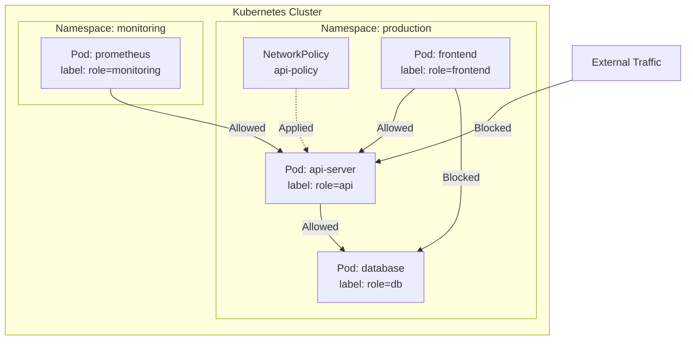

## Overall Analogy: Apartment Complex Firewall

NetworkPolicy is easy to understand when compared to **an apartment complex access control system**:

| Apartment Complex Analogy | Kubernetes NetworkPolicy | Role |
|---------------------------|------------------------|------|
| Per-wing access control rules | NetworkPolicy | Define traffic allow/block between Pods |
| "Only Wing 101 residents allowed" | podSelector | Select target Pods for the policy |
| "Delivery person only to lobby" | Ingress rules | Control incoming traffic |
| "Packages sent through security" | Egress rules | Control outgoing traffic |
| Security system (CCTV, key cards) | CNI plugin | Network engine that enforces policies |
| No rules means free access | Default Allow All | All traffic allowed when no NetworkPolicy is set |

In this way, NetworkPolicy is like firewall rules that control "which Pods can communicate with which Pods."

---

> **Target Audience**: Operators looking to strengthen network security in Kubernetes clusters
> **Prerequisites**: Pod, Service, Namespace, Label concepts
> **After reading this**: You will understand how to control Pod-to-Pod traffic with NetworkPolicy


- NetworkPolicy is a firewall rule that controls network traffic between Pods
- It controls Ingress (inbound) and Egress (outbound) traffic separately
- A CNI plugin (Calico, Cilium, etc.) must be installed for policies to take effect


## What Is NetworkPolicy?

By default, all Pods in a cluster can freely communicate with each other. While convenient, this also means a frontend Pod can directly access the database, or a single compromised Pod can explore the entire internal network. NetworkPolicy adds firewall rules to this default-allow state, permitting only the traffic that is actually needed.

NetworkPolicy is a resource that defines Pod-level firewall rules. With NetworkPolicy, you can allow only permitted traffic.

| Property | Description |
|----------|-------------|
| Default behavior | All traffic allowed when no NetworkPolicy is set |
| Target | Pods selected by podSelector |
| Direction | Ingress (inbound) and Egress (outbound) configured separately |
| Aggregation rule | Multiple NetworkPolicies are combined with OR logic |

## Network Policy Application Flow



*This diagram shows a NetworkPolicy applied to the api-server Pod that allows only frontend and monitoring traffic while blocking external access.*

## Default Policies: Allow All vs Deny All

### Default State (Allow All)

Without any NetworkPolicy, all Pod-to-Pod communication is allowed.

### Deny All Ingress

A default policy that blocks all inbound traffic.

```yaml
apiVersion: networking.k8s.io/v1
kind: NetworkPolicy
metadata:
  name: deny-all-ingress
  namespace: production
spec:
  podSelector: {}      # Apply to all Pods
  policyTypes:
  - Ingress
  # No ingress rules = block all inbound
```

### Deny All Egress

A default policy that blocks all outbound traffic.

```yaml
apiVersion: networking.k8s.io/v1
kind: NetworkPolicy
metadata:
  name: deny-all-egress
  namespace: production
spec:
  podSelector: {}
  policyTypes:
  - Egress
  # No egress rules = block all outbound
```


For security, apply a Deny All policy first, then add NetworkPolicies that allow only necessary communication. This is the fundamental principle of Zero Trust networking.


## Ingress Rules

Control incoming traffic.

```yaml
apiVersion: networking.k8s.io/v1
kind: NetworkPolicy
metadata:
  name: api-ingress
  namespace: production
spec:
  podSelector:
    matchLabels:
      role: api          # Pods this policy applies to
  policyTypes:
  - Ingress
  ingress:
  - from:
    - podSelector:       # Specific Pods in the same Namespace
        matchLabels:
          role: frontend
    - namespaceSelector:  # Specific Pods from another Namespace
        matchLabels:
          name: monitoring
      podSelector:
        matchLabels:
          role: prometheus
    ports:
    - protocol: TCP
      port: 8080
```

### Selector Combination Rules

Each item in the `from` array is an OR condition, and podSelector and namespaceSelector within the same item are AND conditions.

```yaml
ingress:
- from:
  # Rule 1: frontend Pods in the same Namespace (OR)
  - podSelector:
      matchLabels:
        role: frontend
  # Rule 2: prometheus Pods in monitoring Namespace (AND)
  - namespaceSelector:
      matchLabels:
        name: monitoring
    podSelector:
      matchLabels:
        role: prometheus
```

| Combination | Meaning |
|-------------|---------|
| `podSelector` only | Specific Pods within the same Namespace |
| `namespaceSelector` only | All Pods in a specific Namespace |
| Both (same item) | Specific Pods in a specific Namespace (AND) |
| Separate items | Each independently allowed (OR) |


If `podSelector` and `namespaceSelector` are in the same array item (`-`), they form an AND condition. If in different items, they form an OR condition. Pay attention to indentation.


## Egress Rules

Control outgoing traffic.

```yaml
apiVersion: networking.k8s.io/v1
kind: NetworkPolicy
metadata:
  name: api-egress
  namespace: production
spec:
  podSelector:
    matchLabels:
      role: api
  policyTypes:
  - Egress
  egress:
  - to:
    - podSelector:
        matchLabels:
          role: db
    ports:
    - protocol: TCP
      port: 5432
  - to:                        # Allow DNS (required)
    - namespaceSelector: {}
    ports:
    - protocol: UDP
      port: 53
    - protocol: TCP
      port: 53
```


When restricting Egress, you must allow DNS (port 53) traffic. Otherwise, communication via Service names will not work.


## Combined Policy Example

An example setting both Ingress and Egress together.

```yaml
apiVersion: networking.k8s.io/v1
kind: NetworkPolicy
metadata:
  name: db-policy
  namespace: production
spec:
  podSelector:
    matchLabels:
      role: db
  policyTypes:
  - Ingress
  - Egress
  ingress:
  - from:
    - podSelector:
        matchLabels:
          role: api
    ports:
    - protocol: TCP
      port: 5432
  egress:
  - to:                        # Allow DNS only
    - namespaceSelector: {}
    ports:
    - protocol: UDP
      port: 53
    - protocol: TCP
      port: 53
```

This policy summarized.

| Direction | Allowed Target | Port |
|-----------|---------------|------|
| Ingress | role=api Pods only | TCP 5432 |
| Egress | DNS only | UDP/TCP 53 |

## CNI Plugin Dependency

NetworkPolicy requires CNI (Container Network Interface) plugin support to actually function.

| CNI Plugin | NetworkPolicy Support | Features |
|------------|----------------------|----------|
| Calico | Yes | Most widely used, BGP-based |
| Cilium | Yes | eBPF-based, L7 policy support |
| Weave Net | Yes | Easy configuration |
| Flannel | No | Does not support NetworkPolicy |
| AWS VPC CNI | Partial | Requires additional Calico installation |


With CNIs that don't support NetworkPolicy like Flannel, creating NetworkPolicy resources will not actually enforce traffic control. Always verify your CNI's support status.


## Hands-on: Configuring NetworkPolicy

### Apply Default Deny Policy

```bash
# Apply Deny All Ingress
kubectl apply -f deny-all-ingress.yaml

# Verify
kubectl get networkpolicy -n production
```

### Add Allow Rules

```bash
# Apply API Pod policy
kubectl apply -f api-ingress.yaml

# Verify policy
kubectl describe networkpolicy api-ingress -n production
```

### Test Connectivity

```bash
# Test API access from frontend Pod (should be allowed)
kubectl exec -n production frontend-pod -- curl -s http://api-svc:8080/health
# 200 OK

# Test API access from another Pod (should be blocked)
kubectl exec -n production other-pod -- curl -s --connect-timeout 3 http://api-svc:8080/health
# curl: (28) Connection timed out
```

## Frequently Used kubectl Commands

| Command | Description |
|---------|-------------|
| `kubectl get networkpolicy -n <namespace>` | List NetworkPolicies |
| `kubectl describe networkpolicy <name> -n <namespace>` | Detailed info |
| `kubectl delete networkpolicy <name> -n <namespace>` | Delete policy |
| `kubectl exec <pod> -- curl <target>` | Test connectivity |

---

## Next Steps

Now that you understand NetworkPolicy, proceed to the following:

| Goal | Recommended Document |
|------|---------------------|
| Resource isolation | [Namespace](namespace/) |
| Access control | [RBAC](rbac/) |
| Stateful workloads | [StatefulSet](statefulset/) |
