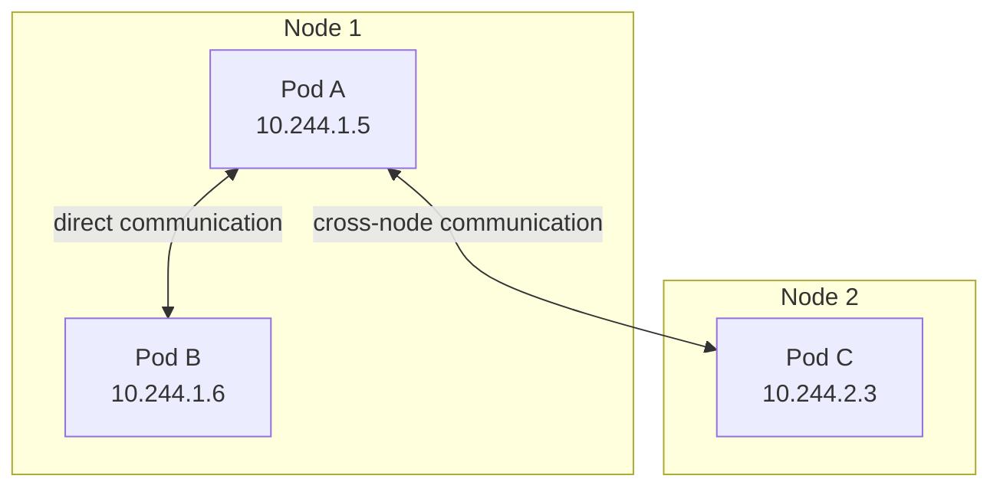
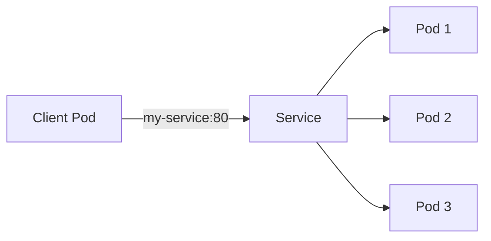
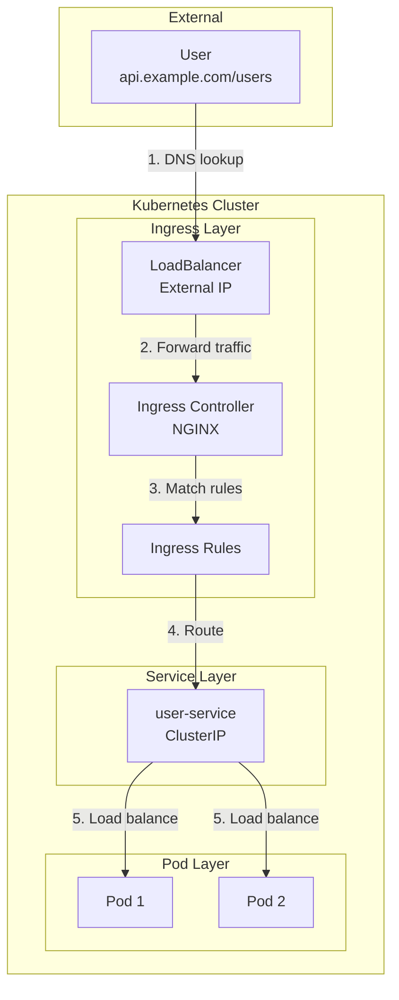
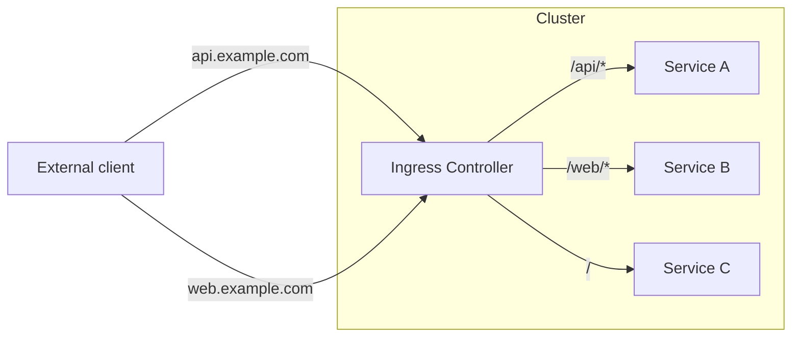
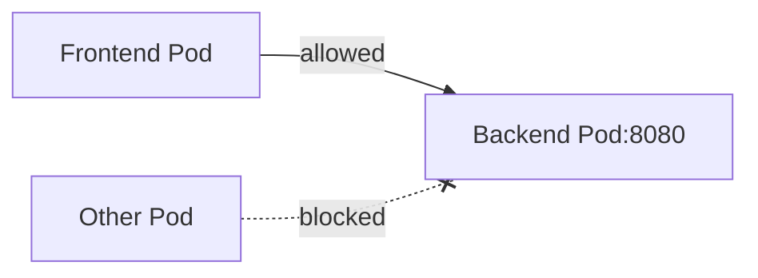

> **Target Audience**: Backend developers who want to understand Kubernetes network structure
> **Prerequisites**: Service concepts, basic networking knowledge (IP, ports, DNS)
> **After reading this**: You will understand Kubernetes network model and Ingress


- All Pods have unique IPs and can communicate directly with other Pods
- Service provides stable access point for a set of Pods
- Ingress routes HTTP/HTTPS traffic from outside the cluster


## Kubernetes Network Model

Kubernetes networking follows three basic principles.

| Principle | Description |
|-----------|-------------|
| Pod-to-Pod | All Pods can communicate with other Pods without NAT |
| Node-to-Pod | All nodes can communicate with all Pods without NAT |
| Pod IP | Pod's own IP and the IP other Pods see are identical |



## Cluster Internal Communication

### Pod-to-Pod Communication

Pods within the same cluster can communicate directly via IP.

```bash
# Direct communication from Pod A to Pod C
kubectl exec pod-a -- curl http://10.244.2.3:8080
```

However, since Pod IPs can change, we actually use Services.

### Communication Through Service



Using Service DNS prevents impact from Pod IP changes.

```yaml
# Use Service name in application
spring:
  datasource:
    url: jdbc:postgresql://postgres-service:5432/mydb
```

## External Exposure Methods Comparison

Comparing methods to access applications from outside the cluster.

| Method | Use Case | Characteristics |
|--------|----------|----------------|
| NodePort | Dev/test | Simple but port limited (30000-32767) |
| LoadBalancer | Single service external exposure | Uses cloud LB, incurs cost |
| Ingress | HTTP routing to multiple services | Domain/path-based routing |

## Ingress

Ingress manages HTTP/HTTPS traffic from outside the cluster to internal Services.

### External Request Processing Flow

Let's examine step by step how HTTP requests from outside reach Pods.



| Step | Component | Action |
|------|-----------|--------|
| 1 | DNS/LB | Resolve domain to LoadBalancer IP |
| 2 | LoadBalancer | Forward traffic to Ingress Controller |
| 3 | Ingress Controller | Match host/path in Ingress rules |
| 4 | Ingress → Service | Route to matched Service |
| 5 | Service → Pod | Distribute traffic to multiple Pods |

### Ingress vs LoadBalancer

| Item | LoadBalancer | Ingress |
|------|--------------|---------|
| Target | Single Service | Multiple Services |
| Protocol | TCP/UDP | HTTP/HTTPS |
| Routing | None | Host/path based |
| TLS | Per-Service configuration | Centralized management |
| Cost | LB cost per Service | One LB for multiple services |



### Ingress Controller

Ingress resource alone doesn't work. An Ingress Controller is needed.

| Controller | Characteristics |
|------------|-----------------|
| NGINX Ingress | Most widely used, community support |
| Traefik | Auto-configuration, Let's Encrypt integration |
| AWS ALB Ingress | Integrates with AWS ALB |
| GKE Ingress | Integrates with GCP HTTP(S) LB |

### Ingress Resource Definition

```yaml
apiVersion: networking.k8s.io/v1
kind: Ingress
metadata:
  name: my-ingress
  annotations:
    nginx.ingress.kubernetes.io/rewrite-target: /
spec:
  ingressClassName: nginx
  rules:
  - host: api.example.com
    http:
      paths:
      - path: /users
        pathType: Prefix
        backend:
          service:
            name: user-service
            port:
              number: 80
      - path: /orders
        pathType: Prefix
        backend:
          service:
            name: order-service
            port:
              number: 80
  - host: web.example.com
    http:
      paths:
      - path: /
        pathType: Prefix
        backend:
          service:
            name: web-service
            port:
              number: 80
```

Key fields explained:

| Field | Description |
|-------|-------------|
| ingressClassName | Ingress Controller to use |
| rules[].host | Domain to route |
| rules[].http.paths[] | Path-based routing rules |
| pathType | Exact (exact match) or Prefix |
| backend.service | Service to forward traffic to |

### TLS Configuration

TLS configuration for HTTPS.

```yaml
apiVersion: networking.k8s.io/v1
kind: Ingress
metadata:
  name: tls-ingress
spec:
  ingressClassName: nginx
  tls:
  - hosts:
    - api.example.com
    secretName: api-tls-secret
  rules:
  - host: api.example.com
    http:
      paths:
      - path: /
        pathType: Prefix
        backend:
          service:
            name: api-service
            port:
              number: 80
```

Create TLS Secret as follows:

```bash
kubectl create secret tls api-tls-secret \
  --cert=path/to/cert.crt \
  --key=path/to/cert.key
```

## NetworkPolicy

NetworkPolicy controls traffic between Pods. By default, all Pods can communicate with each other, but NetworkPolicy can restrict this.

### Default Isolation

```yaml
apiVersion: networking.k8s.io/v1
kind: NetworkPolicy
metadata:
  name: deny-all
spec:
  podSelector: {}  # Apply to all Pods
  policyTypes:
  - Ingress
  - Egress
```

When this policy is applied, all Pods in that namespace have their traffic blocked.

### Allow Specific Traffic

```yaml
apiVersion: networking.k8s.io/v1
kind: NetworkPolicy
metadata:
  name: allow-frontend
spec:
  podSelector:
    matchLabels:
      app: backend
  policyTypes:
  - Ingress
  ingress:
  - from:
    - podSelector:
        matchLabels:
          app: frontend
    ports:
    - protocol: TCP
      port: 8080
```

This policy only allows access from Pods with `app: frontend` label to port 8080 of `app: backend` Pods.



## Practice: Ingress Configuration

### Enable Ingress in Minikube

```bash
# Enable NGINX Ingress Controller
minikube addons enable ingress

# Check status
kubectl get pods -n ingress-nginx
```

### Deploy Test Applications

```bash
# Create two Deployments
kubectl create deployment web --image=nginx
kubectl create deployment api --image=httpd

# Create Services
kubectl expose deployment web --port=80
kubectl expose deployment api --port=80
```

### Create Ingress Resource

```yaml
apiVersion: networking.k8s.io/v1
kind: Ingress
metadata:
  name: test-ingress
  annotations:
    nginx.ingress.kubernetes.io/rewrite-target: /
spec:
  ingressClassName: nginx
  rules:
  - host: test.local
    http:
      paths:
      - path: /web
        pathType: Prefix
        backend:
          service:
            name: web
            port:
              number: 80
      - path: /api
        pathType: Prefix
        backend:
          service:
            name: api
            port:
              number: 80
```

### Test

```bash
# Check Minikube IP
minikube ip

# Add to /etc/hosts (Linux/macOS)
echo "$(minikube ip) test.local" | sudo tee -a /etc/hosts

# Test
curl http://test.local/web
curl http://test.local/api
```

---

## Next Steps

Once you understand networking, proceed to the next steps:

| Goal | Recommended Doc |
|------|----------------|
| Resource configuration | [Resource Management](resources/) |
| Auto-scaling | [Scaling](scaling/) |
| Actual deployment practice | [Spring Boot Deployment](../examples/spring-boot/) |
