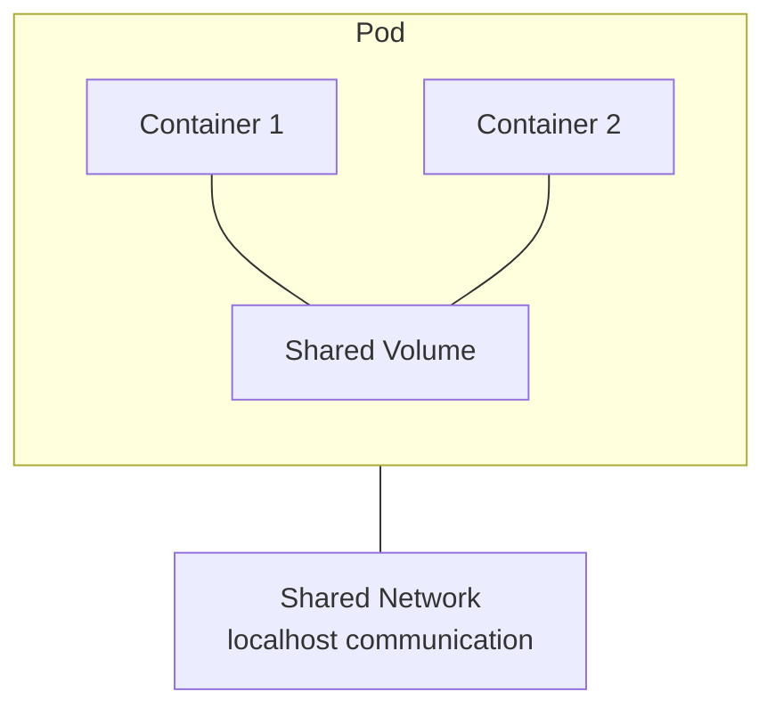
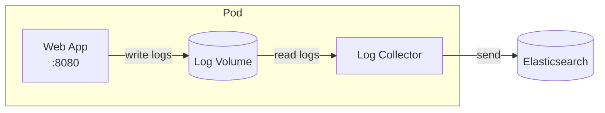
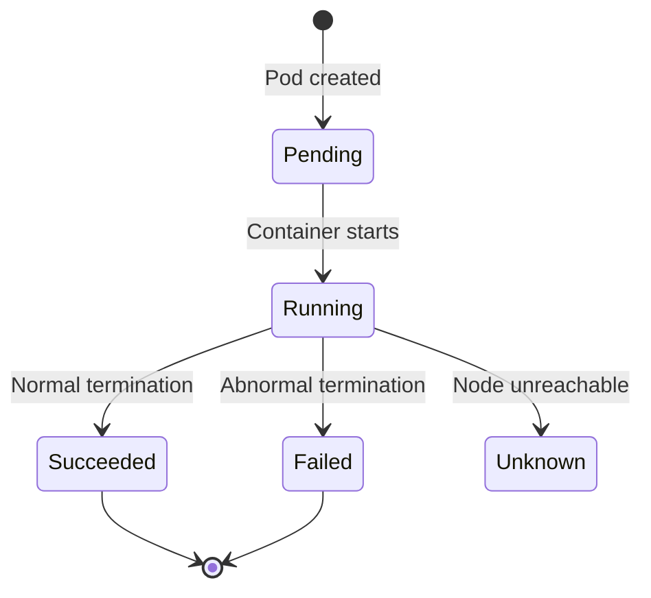
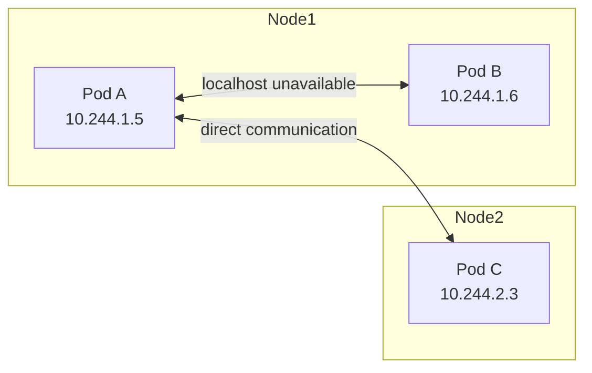

> **Target Audience**: Backend developers who want to understand Kubernetes Pod concept
> **Prerequisites**: Basic Docker container concepts
> **After reading this**: You will understand what Pods are and why we use Pods instead of containers


- Pod is the smallest deployable unit in Kubernetes
- A Pod contains one or more containers that share network and storage
- Most Pods contain only a single container


## What is a Pod?

A Pod is the smallest deployable unit that can be created and managed in Kubernetes. While containers are the smallest unit in Docker, Pods are the smallest unit in Kubernetes.



Containers within a Pod share:

| Shared Resource | Description |
|-----------------|-------------|
| Network | Same IP address, can communicate via localhost |
| Storage | Share data by mounting Volumes |
| IPC | Share inter-process communication namespace |

However, some resources are isolated per container:

| Isolated Resource | Description |
|-------------------|-------------|
| Filesystem | Each container has its own filesystem |
| Processes | Each container has independent process space |
| CPU/Memory | Can set resource limits per container |

## Why Pod Instead of Container?

How do Docker containers differ from Kubernetes Pods?

| Perspective | Docker Container | Kubernetes Pod |
|-------------|------------------|----------------|
| Composition | Single process recommended | Group of related containers |
| Network | Each gets own IP | One IP per Pod |
| Scaling | Individual scaling | Pod-level scaling |
| Deployment | Individual deployment | Deploy together, terminate together |

Pods are used to **manage tightly coupled containers as a single unit**.

### Example: Web Application with Log Collection



In this case, Web App and Log Collector should be in the same Pod because:

- They must run on the same node (to share log files)
- They should start and stop together
- They should be replicated together during scale-out

## Pod YAML Structure

Let's examine a basic Pod definition.

```yaml
apiVersion: v1
kind: Pod
metadata:
  name: my-app
  labels:
    app: my-app
    version: v1
spec:
  containers:
  - name: app
    image: nginx:1.25
    ports:
    - containerPort: 80
    resources:
      requests:
        memory: "128Mi"
        cpu: "100m"
      limits:
        memory: "256Mi"
        cpu: "200m"
```

Meaning of each field:

| Field | Description |
|-------|-------------|
| `apiVersion` | API version to use (v1 for Pod) |
| `kind` | Resource type |
| `metadata.name` | Pod name (unique within namespace) |
| `metadata.labels` | Labels to identify Pod |
| `spec.containers` | List of containers |
| `resources.requests` | Minimum required resources (scheduling criteria) |
| `resources.limits` | Maximum usable resources |

## Pod Lifecycle

A Pod goes through several stages from creation to termination.



Description of each stage:

| Stage | Description | Common Cause |
|-------|-------------|--------------|
| Pending | Pod created but containers not yet started | Image downloading, node scheduling in progress |
| Running | All containers created and at least one running | Normal state |
| Succeeded | All containers terminated successfully | Job, CronJob completed |
| Failed | All containers terminated with at least one failure | Application error |
| Unknown | Cannot determine Pod status | Node network issues |

### Container States

Each container within a Pod also has a state.

| State | Description |
|-------|-------------|
| Waiting | Container waiting to start (image pull, etc.) |
| Running | Container is running |
| Terminated | Container terminated (successfully or failed) |

```bash
# Check container state
kubectl describe pod my-app
```

## Multi-Container Patterns

Common patterns for including multiple containers in a Pod.

### Sidecar Pattern

Run a container that assists the main container.

```yaml
apiVersion: v1
kind: Pod
metadata:
  name: web-with-logging
spec:
  containers:
  - name: web
    image: nginx:1.25
    volumeMounts:
    - name: logs
      mountPath: /var/log/nginx
  - name: log-forwarder
    image: fluent/fluentd:v1.16
    volumeMounts:
    - name: logs
      mountPath: /var/log/nginx
      readOnly: true
  volumes:
  - name: logs
    emptyDir: {}
```

| Container | Role |
|-----------|------|
| web | Main application, generates logs |
| log-forwarder | Collect logs and send externally |

Sidecar pattern use cases:

- Log collection (Fluentd, Filebeat)
- Proxy (Envoy, Istio)
- Configuration sync (Git-sync)

### Init Container Pattern

Perform initialization tasks before main container execution.

```yaml
apiVersion: v1
kind: Pod
metadata:
  name: app-with-init
spec:
  initContainers:
  - name: init-db-check
    image: busybox:1.36
    command: ['sh', '-c', 'until nc -z db-service 5432; do sleep 2; done']
  containers:
  - name: app
    image: my-app:1.0
```

Init Container characteristics:

| Characteristic | Description |
|----------------|-------------|
| Sequential execution | Multiple Init Containers run in order |
| Completion required | All Init Containers must succeed before main containers start |
| Retry | Retries until success if failed |

Use cases:

- Wait for dependent services (DB, cache, etc.)
- Generate configuration files
- Download data

## Pod Networking

Understanding core concepts of Pod networking.

### Pod IP

Each Pod is assigned a unique IP within the cluster.



Networking rules:

| Rule | Description |
|------|-------------|
| Pod-to-Pod communication | All Pods in same cluster communicate without NAT |
| Cross-node communication | Pods on different nodes communicate directly via IP |
| Intra-Pod communication | Containers in same Pod communicate via localhost |

### Port Conflicts

Containers in the same Pod cannot use the same port.

```yaml
# Incorrect example - port conflict
spec:
  containers:
  - name: app1
    ports:
    - containerPort: 8080  # Conflict!
  - name: app2
    ports:
    - containerPort: 8080  # Conflict!
```

```yaml
# Correct example
spec:
  containers:
  - name: app1
    ports:
    - containerPort: 8080
  - name: app2
    ports:
    - containerPort: 8081  # Use different port
```

## Practice: Creating and Managing Pods

### Create Pod

```bash
# Create from YAML file
kubectl apply -f pod.yaml

# Quickly create imperatively (for testing)
kubectl run nginx --image=nginx:1.25
```

### Check Pod Status

```bash
# List Pods
kubectl get pods

# Detailed information
kubectl describe pod nginx

# View logs
kubectl logs nginx

# Logs from specific container in multi-container Pod
kubectl logs nginx -c sidecar
```

### Access Pod

```bash
# Access container shell
kubectl exec -it nginx -- /bin/bash

# Access specific container
kubectl exec -it nginx -c sidecar -- /bin/sh

# Execute command
kubectl exec nginx -- cat /etc/nginx/nginx.conf
```

### Delete Pod

```bash
# Delete single Pod
kubectl delete pod nginx

# Delete using YAML file
kubectl delete -f pod.yaml

# Force delete (use with caution)
kubectl delete pod nginx --force --grace-period=0
```

## Why Not Use Pods Directly?

In actual operations, Pods are not created directly.

| Direct Pod Use | Using Deployment |
|----------------|------------------|
| Not recovered when deleted | Auto-recovery |
| Manual recreation for updates | Rolling updates |
| Cannot scale | Scale with replicas |
| Lost on node failure | Rescheduled on other nodes |

Therefore, in practice, Pods are managed through workload resources like Deployment, StatefulSet, DaemonSet.


- Temporary Pods for debugging
- One-time tasks (quick tests with kubectl run)
- Learning purposes

Always use Deployment etc. in production.


---

## Next Steps

Once you understand Pods, proceed to the next steps:

| Goal | Recommended Doc |
|------|----------------|
| Automatic Pod management | [Deployment](deployment/) |
| How to access Pods | [Service](service/) |
| Configure health checks | [Health Checks](health-checks/) |
