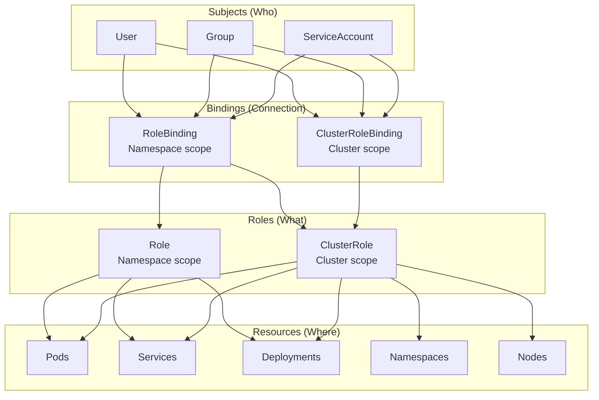

## Overall Analogy: Building Access Card System

RBAC is easy to understand when compared to **a building access card system**:

| Building Access Analogy | Kubernetes RBAC | Role |
|------------------------|----------------|------|
| Access permission set (3rd floor server room access) | Role | Define allowed operations within a specific Namespace |
| Master key for all buildings | ClusterRole | Define allowed operations across the entire cluster |
| Grant permission to employee badge | RoleBinding | Assign a Role to a user |
| Grant access to all branches | ClusterRoleBinding | Assign a ClusterRole to a user |
| Employee badge | ServiceAccount | Authentication identity used by Pods |
| "Access only necessary areas" principle | Principle of Least Privilege | Grant only required permissions |

In this way, RBAC is like systematically managing "who can do what and where."

---

> **Target Audience**: Operators setting up security and access control for Kubernetes clusters
> **Prerequisites**: Namespace, Pod, ServiceAccount basic concepts
> **After reading this**: You will understand how to manage access permissions using RBAC


- RBAC controls Kubernetes API access based on roles
- Role defines Namespace-scoped permissions, ClusterRole defines cluster-scoped permissions
- RoleBinding/ClusterRoleBinding assigns roles to users


## What Is RBAC?

Without access control on a cluster, a junior developer could accidentally delete a production namespace's Deployment, or a CI/CD pipeline could unintentionally read all Secrets. RBAC prevents such incidents by controlling "who can do what, and where" based on roles.

RBAC (Role-Based Access Control) is a mechanism that controls access to the Kubernetes API based on the roles of users or services.

| Component | Description |
|-----------|-------------|
| Role | Define allowed operations (permissions) within a Namespace |
| ClusterRole | Define permissions across the entire cluster |
| RoleBinding | Assign a Role to a user in a specific Namespace |
| ClusterRoleBinding | Assign a ClusterRole to a user across the entire cluster |
| ServiceAccount | Authentication identity for Pods to access the Kubernetes API |

## RBAC Component Relationships



*This diagram shows the RBAC structure where subjects (User, Group, ServiceAccount) access resources through Bindings that reference Roles/ClusterRoles.*

## Role vs ClusterRole

### Role (Namespace Scope)

Defines permissions for resources within a specific Namespace.

```yaml
apiVersion: rbac.authorization.k8s.io/v1
kind: Role
metadata:
  name: pod-reader
  namespace: team-a
rules:
- apiGroups: [""]
  resources: ["pods"]
  verbs: ["get", "watch", "list"]
- apiGroups: [""]
  resources: ["pods/log"]
  verbs: ["get"]
```

### ClusterRole (Cluster Scope)

Defines permissions for resources across the entire cluster.

```yaml
apiVersion: rbac.authorization.k8s.io/v1
kind: ClusterRole
metadata:
  name: node-reader
rules:
- apiGroups: [""]
  resources: ["nodes"]
  verbs: ["get", "watch", "list"]
- apiGroups: [""]
  resources: ["namespaces"]
  verbs: ["get", "list"]
```

### Available Verbs

| Verb | Description | HTTP Method |
|------|-------------|------------|
| `get` | Retrieve a single resource | GET |
| `list` | Retrieve a list of resources | GET |
| `watch` | Watch for resource changes | GET (watch) |
| `create` | Create a resource | POST |
| `update` | Modify a resource | PUT |
| `patch` | Partially modify a resource | PATCH |
| `delete` | Delete a resource | DELETE |

## RoleBinding vs ClusterRoleBinding

### RoleBinding

```yaml
apiVersion: rbac.authorization.k8s.io/v1
kind: RoleBinding
metadata:
  name: read-pods
  namespace: team-a
subjects:
- kind: User
  name: developer-kim
  apiGroup: rbac.authorization.k8s.io
- kind: ServiceAccount
  name: app-sa
  namespace: team-a
roleRef:
  kind: Role
  name: pod-reader
  apiGroup: rbac.authorization.k8s.io
```

### ClusterRoleBinding

```yaml
apiVersion: rbac.authorization.k8s.io/v1
kind: ClusterRoleBinding
metadata:
  name: read-nodes
subjects:
- kind: Group
  name: ops-team
  apiGroup: rbac.authorization.k8s.io
roleRef:
  kind: ClusterRole
  name: node-reader
  apiGroup: rbac.authorization.k8s.io
```

| Item | RoleBinding | ClusterRoleBinding |
|------|-----------|-------------------|
| Scope | Specific Namespace | Entire cluster |
| Referenceable Role | Role, ClusterRole | ClusterRole only |
| Use case | Per-team permissions | Cluster admin permissions |


Referencing a ClusterRole with a RoleBinding applies that permission only to a specific Namespace, not the entire cluster. This is useful for reusing common permission sets across multiple Namespaces.


## ServiceAccount

Pods access the Kubernetes API through ServiceAccounts.

```yaml
apiVersion: v1
kind: ServiceAccount
metadata:
  name: app-sa
  namespace: team-a
---
apiVersion: apps/v1
kind: Deployment
metadata:
  name: my-app
  namespace: team-a
spec:
  replicas: 1
  selector:
    matchLabels:
      app: my-app
  template:
    metadata:
      labels:
        app: my-app
    spec:
      serviceAccountName: app-sa    # Specify ServiceAccount
      containers:
      - name: app
        image: my-app:1.0
```


If you don't specify a ServiceAccount, the `default` ServiceAccount is used. In production, always create a dedicated ServiceAccount and grant only minimum permissions.


## Principle of Least Privilege

You must follow the Principle of Least Privilege when configuring RBAC.

| Principle | Description |
|-----------|-------------|
| Grant only required permissions | Avoid using `*` (wildcard) |
| Prefer Namespace scope | Use Role over ClusterRole |
| Use dedicated ServiceAccounts | Avoid using the default SA |
| Perform regular permission audits | Clean up unnecessary permissions |

Comparison of incorrect and correct examples.

```yaml
# Bad example: Overly broad permissions
rules:
- apiGroups: ["*"]
  resources: ["*"]
  verbs: ["*"]

# Good example: Specify only needed permissions
rules:
- apiGroups: [""]
  resources: ["pods"]
  verbs: ["get", "list"]
- apiGroups: ["apps"]
  resources: ["deployments"]
  verbs: ["get", "list", "update"]
```

## Built-in ClusterRoles

Kubernetes provides commonly used permission sets by default.

| ClusterRole | Description |
|------------|-------------|
| `cluster-admin` | Full permissions across the entire cluster |
| `admin` | Manage most resources within a Namespace |
| `edit` | Read/write resources within a Namespace (cannot modify RBAC) |
| `view` | Read-only access to resources within a Namespace |

```bash
# Check built-in ClusterRoles
kubectl get clusterroles | grep -E "^(cluster-admin|admin|edit|view)"
```

## Hands-on: Configuring RBAC

### Create ServiceAccount and Role

```bash
# Create ServiceAccount
kubectl create serviceaccount app-sa -n team-a

# Create Role
kubectl apply -f role.yaml

# Create RoleBinding
kubectl apply -f rolebinding.yaml

# Verify permissions
kubectl auth can-i get pods --as system:serviceaccount:team-a:app-sa -n team-a
# yes

kubectl auth can-i delete pods --as system:serviceaccount:team-a:app-sa -n team-a
# no
```

### Test Permissions

```bash
# Check a user's permissions
kubectl auth can-i list deployments --as developer-kim -n team-a

# Check all permissions for the current user
kubectl auth can-i --list -n team-a
```

## Frequently Used kubectl Commands

| Command | Description |
|---------|-------------|
| `kubectl get roles -n <namespace>` | List Roles |
| `kubectl get rolebindings -n <namespace>` | List RoleBindings |
| `kubectl get clusterroles` | List ClusterRoles |
| `kubectl describe role <name> -n <namespace>` | Role details |
| `kubectl auth can-i <verb> <resource> --as <user>` | Check permissions |
| `kubectl create role <name> --verb=<verbs> --resource=<resources>` | Create Role |

---

## Next Steps

Now that you understand RBAC, proceed to the following:

| Goal | Recommended Document |
|------|---------------------|
| Batch job execution | [Jobs and CronJobs](jobs/) |
| Network policies | [NetworkPolicy](network-policy/) |
| Resource isolation | [Namespace](namespace/) |
