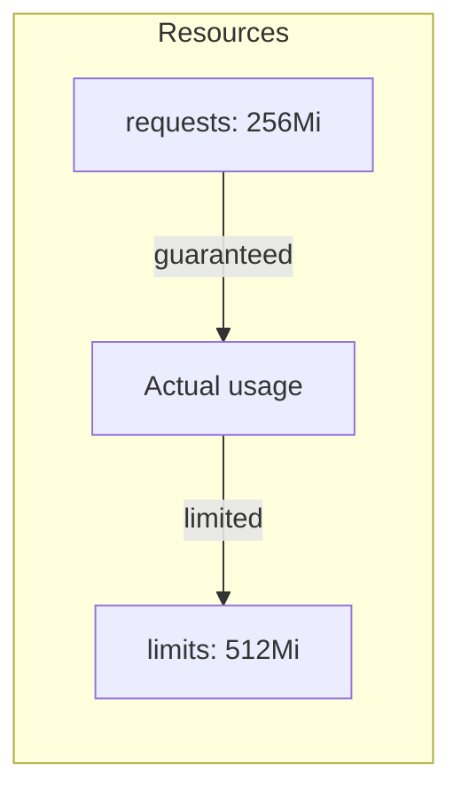
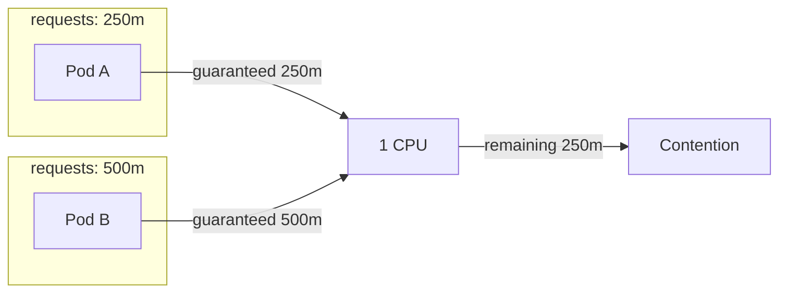

> **Target Audience**: Backend developers who want to efficiently manage resources in Kubernetes
> **Prerequisites**: Pod, Deployment concepts
> **After reading this**: You will understand the difference between requests and limits, and how to configure appropriate resources


- `requests`: Minimum guaranteed resources used for scheduling
- `limits`: Maximum usable resources
- CPU excess causes throttling, memory excess causes OOMKilled


## Why Resource Configuration is Needed?

Running Pods without resource configuration causes several problems.

| Problem | After Resource Configuration |
|---------|------------------------------|
| One Pod monopolizes node resources | Limit max usage with limits |
| Resources not considered during scheduling | Schedule based on requests |
| Random Pod termination on memory shortage | Priority based on QoS class |
| Unpredictable resource usage | Explicit resource allocation |

## requests and limits

Kubernetes provides two resource control methods.

```yaml
resources:
  requests:
    memory: "256Mi"
    cpu: "250m"
  limits:
    memory: "512Mi"
    cpu: "500m"
```



*This diagram shows the range of actual resource usage between requests (minimum guarantee) and limits (maximum cap).*

Comparing requests and limits:

| Item | requests | limits |
|------|----------|--------|
| Role | Minimum guarantee | Maximum allowance |
| Scheduling | Used as criteria | Not used |
| During runtime | Always available | Limited on excess |
| If unset | Same as limits | Unlimited |

## CPU Resources

CPU is a compressible resource. Exceeding causes throttling but not termination.

### CPU Units

| Notation | Meaning | Example |
|----------|---------|---------|
| 1 | 1 vCPU | `cpu: 1` |
| 1000m | 1 vCPU | `cpu: 1000m` |
| 500m | 0.5 vCPU | `cpu: 500m` |
| 100m | 0.1 vCPU | `cpu: 100m` |

`m` means millicores. 1000m = 1 CPU.

### CPU Behavior



*This diagram shows how two Pods each receive their guaranteed CPU from requests and compete for remaining capacity.*

| Situation | Behavior |
|-----------|----------|
| Total usage < node capacity | All Pods use as needed |
| Total usage > node capacity | Distributed by requests ratio |
| Pod usage > limits | CPU throttling (performance degradation) |

## Memory Resources

Memory is an incompressible resource. Exceeding causes Pod termination (OOMKilled).

### Memory Units

| Notation | Meaning |
|----------|---------|
| 256Mi | 256 mebibytes (256 × 2^20 bytes) |
| 1Gi | 1 gibibyte (1 × 2^30 bytes) |
| 256M | 256 megabytes (256 × 10^6 bytes) |
| 1G | 1 gigabyte (1 × 10^9 bytes) |


`Mi` (mebibyte) is 2^20 bytes, `M` (megabyte) is 10^6 bytes. Kubernetes typically uses `Mi`, `Gi`.


### Memory Behavior

| Situation | Behavior |
|-----------|----------|
| Usage < requests | Normal execution |
| requests < usage < limits | Normal execution (if node has room) |
| Usage > limits | OOMKilled (container restart) |
| Node memory shortage | Termination based on QoS class |

## QoS Classes

Kubernetes assigns QoS (Quality of Service) classes to Pods based on resource configuration.

| Class | Condition | Priority |
|-------|-----------|----------|
| Guaranteed | All containers have requests=limits | Highest (terminated last) |
| Burstable | requests < limits or only partially set | Medium |
| BestEffort | No resource configuration | Lowest (terminated first) |

```yaml
# Guaranteed
resources:
  requests:
    memory: "256Mi"
    cpu: "250m"
  limits:
    memory: "256Mi"
    cpu: "250m"

# Burstable
resources:
  requests:
    memory: "256Mi"
    cpu: "250m"
  limits:
    memory: "512Mi"
    cpu: "500m"

# BestEffort (no resource configuration)
# resources: {}
```

Termination order when node memory is insufficient:


*This diagram shows the QoS eviction priority where Pods are terminated in order of BestEffort, Burstable, and Guaranteed when node memory is exhausted.*

## Recommended Settings

### Recommended Settings by Workload Type

Starting points for commonly used workload types in production.

| Workload | requests (CPU/Mem) | limits (CPU/Mem) | Characteristics |
|----------|-------------------|------------------|-----------------|
| **Spring Boot API** | 250m / 512Mi | 1000m / 1Gi | Consider JVM heap |
| **Node.js API** | 100m / 128Mi | 500m / 256Mi | Lightweight |
| **Python Flask** | 100m / 128Mi | 500m / 512Mi | Increase for ML libraries |
| **Nginx (proxy)** | 50m / 64Mi | 200m / 128Mi | Very lightweight |
| **Redis (cache)** | 100m / 256Mi | 500m / 512Mi | Memory-focused |
| **Batch Job** | 500m / 512Mi | 2000m / 2Gi | Throughput-focused |


These values are starting points. Monitor actual usage (`kubectl top pods`) and adjust.


### Java Applications

```yaml
resources:
  requests:
    memory: "512Mi"
    cpu: "250m"
  limits:
    memory: "1Gi"
    cpu: "1000m"
```

For Java applications, set memory limits generously but also adjust JVM heap size.

```yaml
env:
- name: JAVA_OPTS
  value: "-Xms256m -Xmx768m"
```

JVM heap is typically set to 70-80% of container memory limits.

### Resource Configuration Guidelines

| Item | Recommendation |
|------|----------------|
| requests | 90% of normal usage |
| limits (CPU) | 2-4x requests or unset |
| limits (memory) | 1.5-2x requests |
| Guaranteed | Use for critical workloads |

## LimitRange

Set default resource limits at namespace level.

```yaml
apiVersion: v1
kind: LimitRange
metadata:
  name: default-limits
spec:
  limits:
  - default:          # Default limits
      cpu: "500m"
      memory: "512Mi"
    defaultRequest:   # Default requests
      cpu: "100m"
      memory: "128Mi"
    max:              # Maximum allowed
      cpu: "2"
      memory: "2Gi"
    min:              # Minimum allowed
      cpu: "50m"
      memory: "64Mi"
    type: Container
```

Default values are applied to Pods without specified resources.

## ResourceQuota

Limit total resource amount for entire namespace.

```yaml
apiVersion: v1
kind: ResourceQuota
metadata:
  name: compute-quota
spec:
  hard:
    requests.cpu: "4"
    requests.memory: "8Gi"
    limits.cpu: "8"
    limits.memory: "16Gi"
    pods: "10"
```

This limits the following in that namespace:

| Item | Limit |
|------|-------|
| CPU requests total | 4 cores |
| Memory requests total | 8Gi |
| Maximum Pod count | 10 |

## Practice: Configuring and Checking Resources

### Check Resource Usage

```bash
# Check node resources
kubectl describe node <node-name>

# Pod resource usage (requires metrics-server)
kubectl top pods
kubectl top nodes
```

### Simulate Resource Shortage

```yaml
apiVersion: v1
kind: Pod
metadata:
  name: memory-demo
spec:
  containers:
  - name: memory-demo
    image: polinux/stress
    resources:
      requests:
        memory: "50Mi"
      limits:
        memory: "100Mi"
    command: ["stress"]
    args: ["--vm", "1", "--vm-bytes", "150M", "--vm-hang", "1"]
```

```bash
# Create Pod
kubectl apply -f memory-demo.yaml

# Check status (OOMKilled occurs)
kubectl get pod memory-demo
kubectl describe pod memory-demo
```

### Check QoS Class

```bash
kubectl get pod <pod-name> -o jsonpath='{.status.qosClass}'
```

---

## Next Steps

Once you understand resource management, proceed to the next steps:

| Goal | Recommended Doc |
|------|----------------|
| Auto-scaling | [Scaling](scaling/) |
| Configure health checks | [Health Checks](health-checks/) |
| Resource optimization | [Resource Optimization](../howto/resource-optimization/) |
