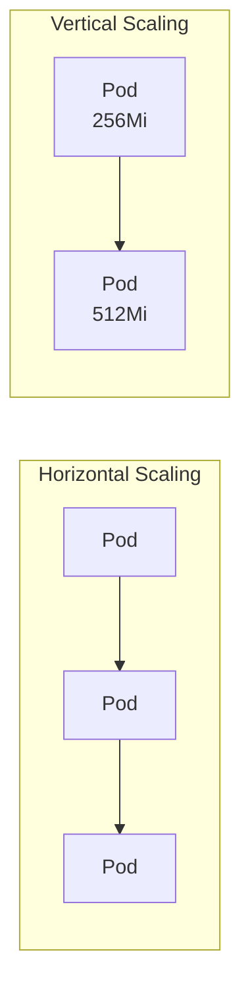
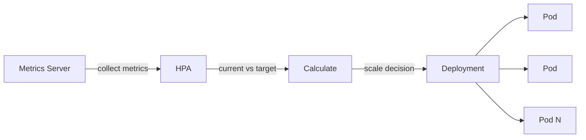
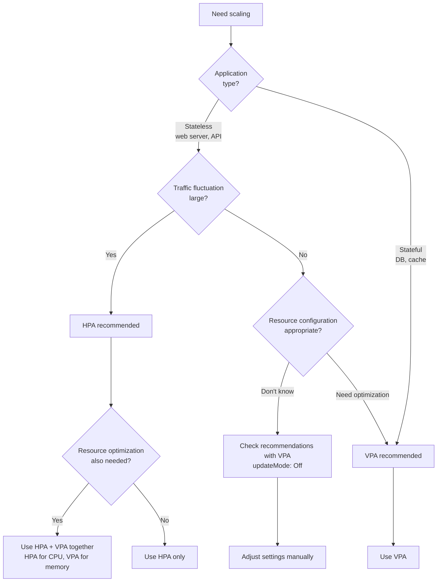

> **Target Audience**: Backend developers who want to configure auto-scaling in Kubernetes
> **Prerequisites**: Deployment, resource management concepts
> **After reading this**: You will understand auto-scaling methods using HPA and VPA


- HPA (Horizontal Pod Autoscaler) automatically adjusts Pod count
- VPA (Vertical Pod Autoscaler) automatically adjusts Pod resource requests
- In most cases, consider HPA first


## Scaling Methods Comparison

Kubernetes provides two scaling methods.

| Method | Description | Suitable For |
|--------|-------------|--------------|
| Horizontal scaling (HPA) | Adjust Pod count | Stateless applications |
| Vertical scaling (VPA) | Adjust Pod resources | Stateful, resource optimization |



## HPA (Horizontal Pod Autoscaler)

HPA automatically adjusts Pod count based on metrics (CPU, memory, custom).

### HPA Operation Principle



HPA operation sequence:

| Step | Action |
|------|--------|
| 1 | Collect current metrics from Metrics Server (15s interval) |
| 2 | Compare target metric with current metric |
| 3 | Calculate required replica count |
| 4 | Adjust Deployment's replicas |

### Creating HPA

**Create with command:**
```bash
kubectl autoscale deployment my-app \
  --cpu-percent=50 \
  --min=2 \
  --max=10
```

**Create with YAML:**
```yaml
apiVersion: autoscaling/v2
kind: HorizontalPodAutoscaler
metadata:
  name: my-app-hpa
spec:
  scaleTargetRef:
    apiVersion: apps/v1
    kind: Deployment
    name: my-app
  minReplicas: 2
  maxReplicas: 10
  metrics:
  - type: Resource
    resource:
      name: cpu
      target:
        type: Utilization
        averageUtilization: 50
```

Key fields explained:

| Field | Description |
|-------|-------------|
| scaleTargetRef | Scaling target (Deployment, etc.) |
| minReplicas | Minimum Pod count |
| maxReplicas | Maximum Pod count |
| metrics | Scaling criteria metrics |
| averageUtilization | Target utilization (%) |

### Multi-Metric HPA

HPA considering both CPU and memory.

```yaml
apiVersion: autoscaling/v2
kind: HorizontalPodAutoscaler
metadata:
  name: my-app-hpa
spec:
  scaleTargetRef:
    apiVersion: apps/v1
    kind: Deployment
    name: my-app
  minReplicas: 2
  maxReplicas: 10
  metrics:
  - type: Resource
    resource:
      name: cpu
      target:
        type: Utilization
        averageUtilization: 50
  - type: Resource
    resource:
      name: memory
      target:
        type: Utilization
        averageUtilization: 70
```

With multiple metrics, the largest replica count calculated from each metric is applied.

### HPA Scaling Calculation

HPA calculates required replicas with this formula:

```
desiredReplicas = ceil(currentReplicas × (currentMetric / targetMetric))
```

Examples:

| Current State | Calculation | Result |
|---------------|-------------|--------|
| 3 Pods, CPU 70%, target 50% | 3 × (70/50) = 4.2 | 5 Pods |
| 5 Pods, CPU 30%, target 50% | 5 × (30/50) = 3 | 3 Pods |

### Controlling Scaling Behavior

Configuration to prevent rapid scaling.

```yaml
apiVersion: autoscaling/v2
kind: HorizontalPodAutoscaler
metadata:
  name: my-app-hpa
spec:
  scaleTargetRef:
    apiVersion: apps/v1
    kind: Deployment
    name: my-app
  minReplicas: 2
  maxReplicas: 10
  behavior:
    scaleDown:
      stabilizationWindowSeconds: 300  # 5 minute stabilization
      policies:
      - type: Percent
        value: 10
        periodSeconds: 60  # Max 10% decrease per minute
    scaleUp:
      stabilizationWindowSeconds: 0
      policies:
      - type: Percent
        value: 100
        periodSeconds: 15  # Max 100% increase per 15s
  metrics:
  - type: Resource
    resource:
      name: cpu
      target:
        type: Utilization
        averageUtilization: 50
```

Comparing scale up/down policies:

| Item | Scale Up | Scale Down |
|------|----------|------------|
| Speed | Fast | Slow |
| Reason | Respond to traffic surge | Prevent unnecessary scale down |

## VPA (Vertical Pod Autoscaler)

VPA automatically adjusts Pod resource requests/limits.


VPA must be installed separately. See [VPA GitHub](https://github.com/kubernetes/autoscaler/tree/master/vertical-pod-autoscaler).


### VPA Components

| Component | Role |
|-----------|------|
| Recommender | Analyze resource usage, calculate recommendations |
| Updater | Restart Pods to apply new resources |
| Admission Controller | Inject resources when creating new Pods |

### VPA Example

```yaml
apiVersion: autoscaling.k8s.io/v1
kind: VerticalPodAutoscaler
metadata:
  name: my-app-vpa
spec:
  targetRef:
    apiVersion: apps/v1
    kind: Deployment
    name: my-app
  updatePolicy:
    updateMode: "Auto"  # Off, Initial, Recreate, Auto
  resourcePolicy:
    containerPolicies:
    - containerName: app
      minAllowed:
        memory: "128Mi"
        cpu: "100m"
      maxAllowed:
        memory: "2Gi"
        cpu: "2"
```

Comparing updateMode options:

| Mode | Behavior |
|------|----------|
| Off | Provide recommendations only, don't apply |
| Initial | Apply only when creating new Pods |
| Recreate | Restart existing Pods to apply |
| Auto | Automatically select most suitable method |

## HPA vs VPA Selection Guide

Which scaling should you choose? Refer to this flowchart.



| Criteria | HPA | VPA |
|----------|-----|-----|
| Stateless applications | ✓ | |
| Stateful applications | | ✓ |
| Respond to traffic fluctuation | ✓ | |
| Resource optimization | | ✓ |
| Immediate application | ✓ | ✗ (requires restart) |

### Real Selection Examples

| Situation | Recommended | Reason |
|-----------|-------------|--------|
| REST API server, high traffic fluctuation | HPA | Respond quickly with Pod count |
| Batch job server | VPA | Optimize resource usage |
| Server with limited DB connections | HPA (careful with max) | Need to manage connections based on Pod count |
| New service, don't know appropriate resources | VPA (Off mode) | Collect recommendations then configure |


When using HPA and VPA together on the same Deployment, caution is needed. It's recommended to separate VPA adjusting only memory and HPA scaling based on CPU.


## Prerequisites

To use HPA, the following are required:

| Requirement | Description |
|-------------|-------------|
| Metrics Server | Must be installed in cluster |
| Resource requests | Pod must have CPU/memory requests configured |

### Check Metrics Server Installation

```bash
# Check Metrics Server operation
kubectl top nodes
kubectl top pods
```

If you get `error: Metrics API not available`, install Metrics Server.

```bash
# Minikube
minikube addons enable metrics-server

# Other environments
kubectl apply -f https://github.com/kubernetes-sigs/metrics-server/releases/latest/download/components.yaml
```

## Practice: Configuring and Testing HPA

### Deploy Test Application

```yaml
apiVersion: apps/v1
kind: Deployment
metadata:
  name: php-apache
spec:
  replicas: 1
  selector:
    matchLabels:
      app: php-apache
  template:
    metadata:
      labels:
        app: php-apache
    spec:
      containers:
      - name: php-apache
        image: k8s.gcr.io/hpa-example
        ports:
        - containerPort: 80
        resources:
          requests:
            cpu: 200m
          limits:
            cpu: 500m
---
apiVersion: v1
kind: Service
metadata:
  name: php-apache
spec:
  ports:
  - port: 80
  selector:
    app: php-apache
```

### Create HPA

```bash
kubectl autoscale deployment php-apache --cpu-percent=50 --min=1 --max=10
```

### Load Test

Generate load in a new terminal:

```bash
kubectl run -i --tty load-generator --rm --image=busybox --restart=Never \
  -- /bin/sh -c "while sleep 0.01; do wget -q -O- http://php-apache; done"
```

### Check HPA Operation

```bash
# Monitor HPA status
kubectl get hpa php-apache --watch

# Expected output:
# NAME         REFERENCE               TARGETS   MINPODS   MAXPODS   REPLICAS
# php-apache   Deployment/php-apache   0%/50%    1         10        1
# php-apache   Deployment/php-apache   250%/50%  1         10        1
# php-apache   Deployment/php-apache   250%/50%  1         10        5
```

When you stop the load generator (Ctrl+C), Pod count decreases after a while.

---

## Next Steps

Once you understand scaling, proceed to the next steps:

| Goal | Recommended Doc |
|------|----------------|
| Configure health checks | [Health Checks](health-checks/) |
| Resource optimization | [Resource Optimization](../howto/resource-optimization/) |
| Actual deployment practice | [Spring Boot Deployment](../examples/spring-boot/) |
