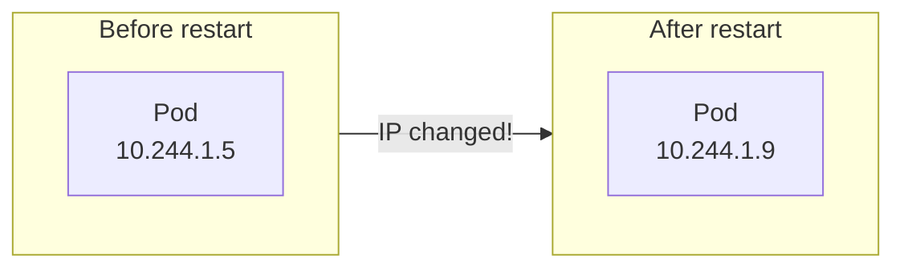
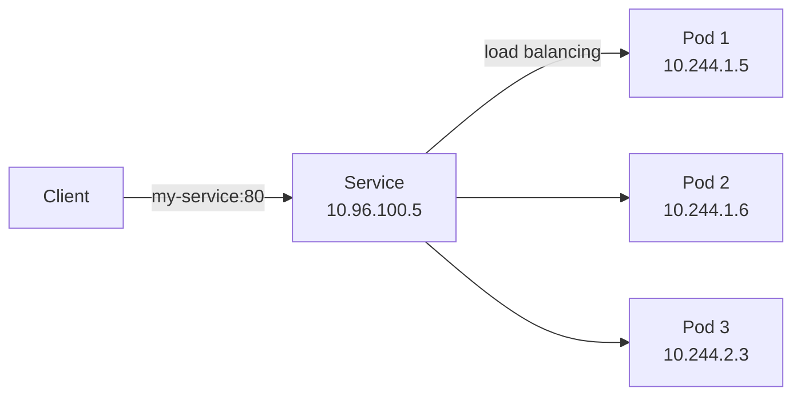
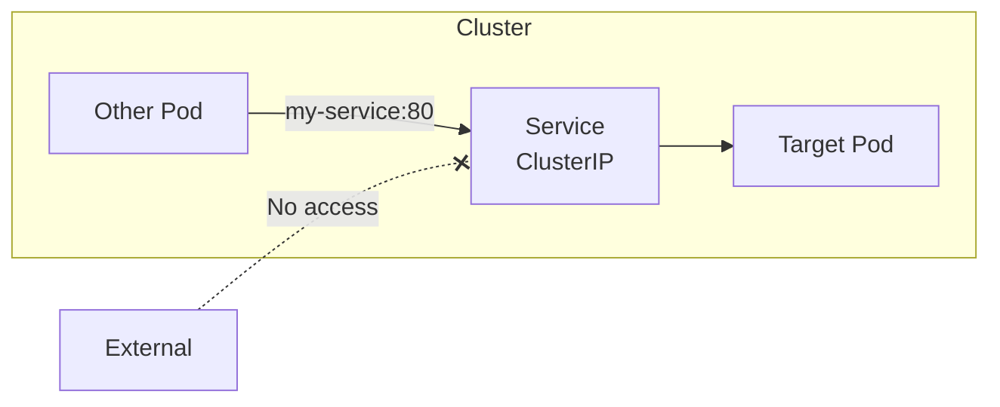
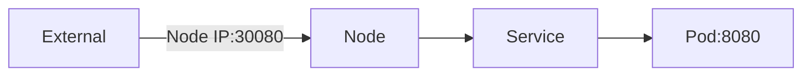
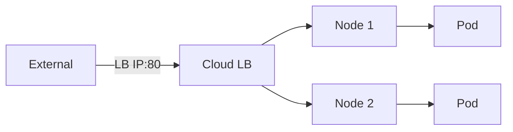

> **Target Audience**: Backend developers who want to configure network access in Kubernetes
> **Prerequisites**: Pod, Deployment concepts
> **After reading this**: You will understand how to reliably access Pods with Services


- Service provides a stable network endpoint for a set of Pods
- Pod IPs change but Service IP (ClusterIP) is fixed
- Three types exist: ClusterIP, NodePort, LoadBalancer


## Why Service is Needed

Pod IPs change whenever Pods are recreated. How can we communicate reliably in this situation?



*This diagram shows the problem where Pod IPs change on restart, making direct access unreliable.*

Using Service maintains a consistent access point even when Pod IPs change.

| Problem | Service Solution |
|---------|-----------------|
| Pod IP changes | Provide fixed Service IP |
| Need traffic distribution to multiple Pods | Automatic load balancing |
| Difficult to access by Pod name | Provide DNS name |
| Need external access method | Provide NodePort, LoadBalancer |

## How Service Works

Service finds Pods using label selectors and distributes traffic to those Pods.



*This diagram shows how a Service load-balances client requests across multiple Pods through a stable IP.*

Service and Pod connection process:

| Step | Description |
|------|-------------|
| 1. Pod creation | Pods created with labels |
| 2. Service creation | Define target Pods with selector |
| 3. Endpoints creation | Service automatically manages Pod IP list |
| 4. Traffic routing | kube-proxy forwards traffic to Pods |

## Service Types

Kubernetes provides three Service types.

### ClusterIP (Default)

Service accessible only within the cluster.

```yaml
apiVersion: v1
kind: Service
metadata:
  name: my-service
spec:
  type: ClusterIP  # Default value, can be omitted
  selector:
    app: my-app
  ports:
  - port: 80        # Service port
    targetPort: 8080 # Pod port
```



*This diagram shows how a ClusterIP Service is accessible only to Pods within the cluster, not from outside.*

ClusterIP characteristics:

| Characteristic | Description |
|----------------|-------------|
| Access scope | Internal cluster only |
| Use case | Internal microservice communication |
| DNS | `<service-name>.<namespace>.svc.cluster.local` |

### NodePort

Allows external access through specific port on all nodes.

```yaml
apiVersion: v1
kind: Service
metadata:
  name: my-service
spec:
  type: NodePort
  selector:
    app: my-app
  ports:
  - port: 80
    targetPort: 8080
    nodePort: 30080  # Range 30000-32767
```



*This diagram shows the NodePort structure where external clients access the Service through a node IP and designated port (30080).*

NodePort characteristics:

| Characteristic | Description |
|----------------|-------------|
| Access scope | External (node IP + port) |
| Port range | 30000-32767 |
| Use case | Dev/test, simple external exposure |
| Limitation | Only one service per port |

### LoadBalancer

Provisions cloud provider's load balancer.

```yaml
apiVersion: v1
kind: Service
metadata:
  name: my-service
spec:
  type: LoadBalancer
  selector:
    app: my-app
  ports:
  - port: 80
    targetPort: 8080
```



*This diagram shows the LoadBalancer Service structure where a cloud Load Balancer distributes external traffic to Pods across multiple nodes.*

LoadBalancer characteristics:

| Characteristic | Description |
|----------------|-------------|
| Access scope | External (fixed IP) |
| Requirements | Cloud environment (AWS, GCP, Azure) |
| Use case | Production external service |
| Cost | Cloud LB cost incurred |

### Type Comparison Summary

| Type | Access Scope | Use Case | Cost |
|------|--------------|----------|------|
| ClusterIP | Internal | Inter-microservice communication | None |
| NodePort | External (node IP) | Dev/test | None |
| LoadBalancer | External (LB IP) | Production | Yes |

## Service DNS

Kubernetes automatically assigns DNS names to Services.

### DNS Name Format

```
<service-name>.<namespace>.svc.cluster.local
```

DNS name examples:

| Example | Description |
|---------|-------------|
| `my-service` | Access from same namespace |
| `my-service.default` | Service in default namespace |
| `my-service.production.svc.cluster.local` | Full FQDN |

### DNS Usage

```yaml
# Using Service DNS in application
spring:
  datasource:
    url: jdbc:postgresql://db-service:5432/mydb
```

When accessing other Services from within a Pod, use DNS names instead of IPs.

## Endpoints

Service manages Pod IP list through Endpoints resource.

```bash
# Check Endpoints
kubectl get endpoints my-service
```

**Expected output:**
```
NAME         ENDPOINTS                                   AGE
my-service   10.244.1.5:8080,10.244.1.6:8080,10.244.2.3:8080   1h
```

If Endpoints is empty, check:

| Check Item | Command |
|------------|---------|
| Pod existence | `kubectl get pods -l <selector>` |
| Pod Ready state | Check READY in `kubectl get pods` |
| Label match | Compare Service selector with Pod labels |

## Session Affinity

Use when you want to send requests from same client to same Pod.

```yaml
apiVersion: v1
kind: Service
metadata:
  name: my-service
spec:
  selector:
    app: my-app
  sessionAffinity: ClientIP
  sessionAffinityConfig:
    clientIP:
      timeoutSeconds: 3600  # 1 hour
  ports:
  - port: 80
    targetPort: 8080
```

Comparing session affinity options:

| Option | Description |
|--------|-------------|
| None | Default, round-robin distribution |
| ClientIP | Fixed based on client IP |


Kubernetes Service doesn't support cookie-based session affinity. Use Ingress Controller if needed.


## Connecting External Services

You can abstract external services (e.g., external DB) as a Service.

### ExternalName

Maps external DNS name to a Service.

```yaml
apiVersion: v1
kind: Service
metadata:
  name: external-db
spec:
  type: ExternalName
  externalName: database.example.com
```

Accessing `external-db` from Pod connects to `database.example.com`.

### Service Without Selector

Directly specify external IP.

```yaml
apiVersion: v1
kind: Service
metadata:
  name: external-service
spec:
  ports:
  - port: 80
    targetPort: 80
---
apiVersion: v1
kind: Endpoints
metadata:
  name: external-service  # Same name as Service
subsets:
- addresses:
  - ip: 203.0.113.10
  ports:
  - port: 80
```

## Practice: Creating and Testing Service

### Create ClusterIP Service

```bash
# Create Deployment (skip if already exists)
kubectl create deployment nginx --image=nginx:1.25 --replicas=3

# Create Service
kubectl expose deployment nginx --port=80 --target-port=80

# Or create with YAML
kubectl apply -f service.yaml
```

### Check Service

```bash
# List Services
kubectl get services

# Detailed information
kubectl describe service nginx

# Check Endpoints
kubectl get endpoints nginx
```

### Test from Inside Cluster

```bash
# Create test Pod
kubectl run test --image=busybox:1.36 --rm -it -- sh

# Access via Service DNS
wget -qO- http://nginx
wget -qO- http://nginx.default.svc.cluster.local

# Make multiple requests to see distribution to different Pods
for i in 1 2 3 4 5; do wget -qO- http://nginx | head -1; done
```

### Test NodePort

```bash
# Create NodePort Service
kubectl expose deployment nginx --type=NodePort --port=80 --target-port=80

# Check assigned NodePort
kubectl get service nginx

# Access in Minikube
minikube service nginx --url
```

## Troubleshooting

### Cannot Connect to Service

1. Check Endpoints:
   ```bash
   kubectl get endpoints <service-name>
   ```
   If empty, check selector and Pod labels.

2. Check Pod Ready state:
   ```bash
   kubectl get pods -l <selector>
   ```
   If Pod is Running but not Ready, check readinessProbe.

3. Check ports:
   ```bash
   kubectl describe service <service-name>
   ```
   Verify targetPort matches Pod's containerPort.

### DNS Resolution Failure

```bash
# Check CoreDNS status
kubectl get pods -n kube-system -l k8s-app=kube-dns

# Test DNS
kubectl run test --image=busybox:1.36 --rm -it -- nslookup <service-name>
```

---

## Next Steps

Once you understand Services, proceed to the next steps:

| Goal | Recommended Doc |
|------|----------------|
| External HTTP routing | [Networking](networking/) |
| Separate configuration | [ConfigMap and Secret](configmap-secret/) |
| Actual deployment practice | [Spring Boot Deployment](../examples/spring-boot/) |
