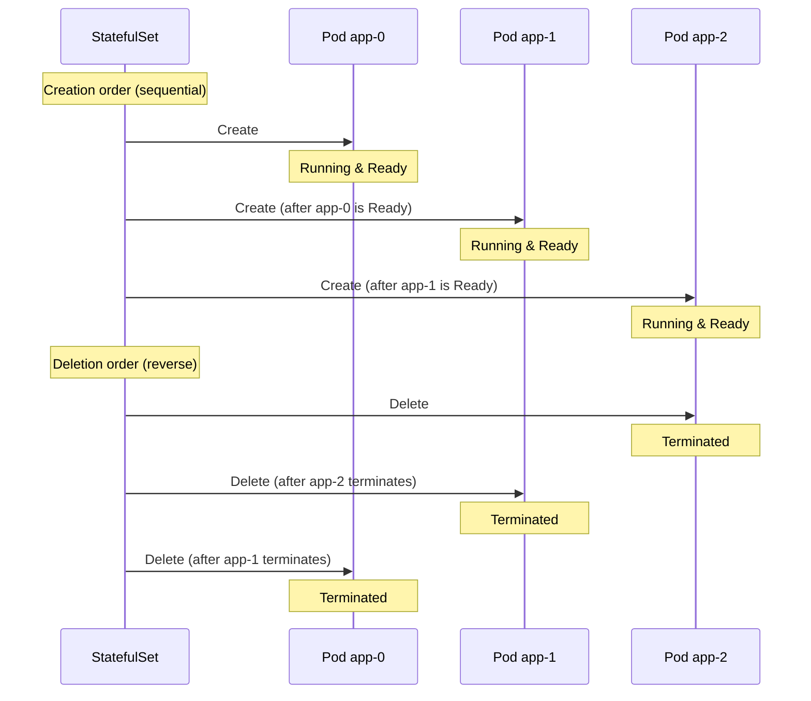
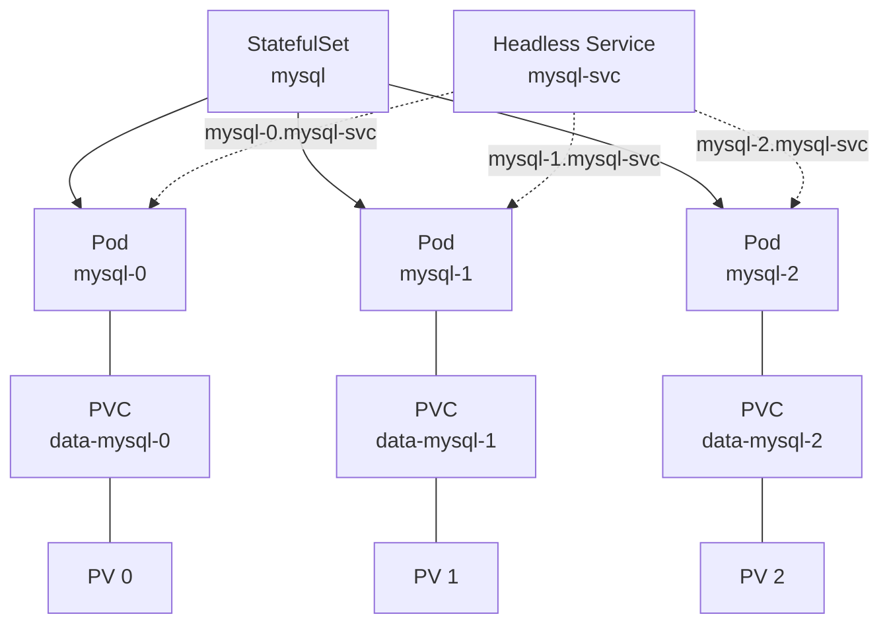

## Overall Analogy: A Restaurant with Reserved Seats

StatefulSets are easy to understand when compared to **a restaurant with reserved seats**:

| Restaurant Analogy | Kubernetes StatefulSet | Role |
|-------------------|----------------------|------|
| Reserved seat numbers (Seat 1, 2, 3) | Pod names (app-0, app-1, app-2) | Stable and unique identifiers |
| Personal locker for each guest | PersistentVolumeClaim | Dedicated persistent storage per Pod |
| Seated/unseated in order | Sequential creation/deletion | Created from 0, deleted in reverse |
| Name plate reservation | Stable network ID | Same hostname preserved after Pod restart |
| Open seating restaurant | Deployment | Sit anywhere, seats may change |

In this way, a StatefulSet is like "having reserved seats and personal lockers so you always use the same seat and the same belongings."

---

> **Target Audience**: Developers deploying databases or clustered applications on Kubernetes
> **Prerequisites**: Deployment, Service, Volume/PVC concepts
> **After reading this**: You will understand how StatefulSets work and how they differ from Deployments


- StatefulSet is a workload resource for stateful applications
- Each Pod gets a stable network ID and dedicated storage
- Pods are created in order and deleted in reverse order


## What Is a StatefulSet?

A StatefulSet is a workload resource for managing stateful applications. Unlike Deployments, each Pod maintains a unique identity.

| Property | Deployment | StatefulSet |
|----------|-----------|-------------|
| Pod name | Random hash (app-7d8f9b) | Ordinal index (app-0, app-1) |
| Network ID | May change each time | Stable hostname preserved |
| Storage | Shared or ephemeral | Dedicated PVC per Pod |
| Creation order | Created simultaneously | Sequential creation (0 -> 1 -> 2) |
| Deletion order | Deleted simultaneously | Reverse deletion (2 -> 1 -> 0) |
| Use case | Stateless web apps | DB, cache, message queue |

## Pod Creation/Deletion Order

StatefulSets create Pods sequentially and delete them in reverse order.




In a database cluster, the Primary node (app-0) must start first so that Replica nodes (app-1, app-2) can connect to it. During deletion, Replicas should be removed first to prevent data loss.


## StatefulSet Structure



The role of each component is as follows.

| Component | Role |
|-----------|------|
| StatefulSet | Manages Pods while guaranteeing order and uniqueness |
| Headless Service | Provides unique DNS records for each Pod |
| PVC | Connects independent persistent storage to each Pod |

## StatefulSet YAML

```yaml
apiVersion: v1
kind: Service
metadata:
  name: mysql-svc
spec:
  clusterIP: None       # Headless Service
  selector:
    app: mysql
  ports:
  - port: 3306
    targetPort: 3306
---
apiVersion: apps/v1
kind: StatefulSet
metadata:
  name: mysql
spec:
  serviceName: mysql-svc    # Headless Service name
  replicas: 3
  selector:
    matchLabels:
      app: mysql
  template:
    metadata:
      labels:
        app: mysql
    spec:
      containers:
      - name: mysql
        image: mysql:8.0
        ports:
        - containerPort: 3306
        env:
        - name: MYSQL_ROOT_PASSWORD
          valueFrom:
            secretKeyRef:
              name: mysql-secret
              key: root-password
        volumeMounts:
        - name: data
          mountPath: /var/lib/mysql
  volumeClaimTemplates:
  - metadata:
      name: data
    spec:
      accessModes: ["ReadWriteOnce"]
      resources:
        requests:
          storage: 10Gi
```

Key fields explained.

| Field | Description |
|-------|-------------|
| `serviceName` | Headless Service name (used for Pod DNS) |
| `volumeClaimTemplates` | PVC template auto-created for each Pod |
| `clusterIP: None` | Headless Service setting (provides individual Pod DNS) |

### Headless Service and Pod DNS

Using a Headless Service assigns predictable DNS names to each Pod.

```
<pod-name>.<service-name>.<namespace>.svc.cluster.local
```

| Pod | DNS Name |
|-----|----------|
| mysql-0 | `mysql-0.mysql-svc.default.svc.cluster.local` |
| mysql-1 | `mysql-1.mysql-svc.default.svc.cluster.local` |
| mysql-2 | `mysql-2.mysql-svc.default.svc.cluster.local` |

## Use Cases

Applications suitable for StatefulSets include the following.

| Application | Why StatefulSet Is Needed |
|-------------|--------------------------|
| MySQL / PostgreSQL | Primary-Replica setup, data persistence |
| Redis Cluster | Unique ID per node, slot assignment |
| Apache Kafka | Broker ID, partition data retention |
| ZooKeeper | Ensemble member identification, order guarantees |
| Elasticsearch | Node role differentiation, data shard retention |


StatefulSet is not always the best choice for every database. Due to high operational complexity, consider managed services (RDS, Cloud SQL, etc.) first.


## Update Strategies

StatefulSet supports two update strategies.

### RollingUpdate (Default)

```yaml
spec:
  updateStrategy:
    type: RollingUpdate
    rollingUpdate:
      partition: 0    # Only update Pods with this ordinal or higher
```

Updates happen in reverse order (app-2 -> app-1 -> app-0).

### Canary Deployment with Partition

Setting a `partition` value updates only Pods with that ordinal or higher.

```yaml
spec:
  updateStrategy:
    type: RollingUpdate
    rollingUpdate:
      partition: 2    # Update only app-2 first
```

| Partition Value | Updated | Unchanged |
|----------------|---------|-----------|
| 0 | All Pods | None |
| 1 | app-1, app-2 | app-0 |
| 2 | app-2 | app-0, app-1 |

### OnDelete

```yaml
spec:
  updateStrategy:
    type: OnDelete    # Pod must be manually deleted to be replaced with new version
```

## Hands-on: Deploying a StatefulSet

### Create and Verify StatefulSet

```bash
# Deploy StatefulSet
kubectl apply -f statefulset.yaml

# Watch Pod creation order (created sequentially)
kubectl get pods -w -l app=mysql

# Expected output:
# NAME      READY   STATUS    AGE
# mysql-0   1/1     Running   30s
# mysql-1   1/1     Running   20s
# mysql-2   1/1     Running   10s
```

### Verify PVCs

```bash
# Verify individual PVC created for each Pod
kubectl get pvc

# Expected output:
# NAME           STATUS   VOLUME   CAPACITY   ACCESS MODES
# data-mysql-0   Bound    pv-001   10Gi       RWO
# data-mysql-1   Bound    pv-002   10Gi       RWO
# data-mysql-2   Bound    pv-003   10Gi       RWO
```

### Verify State After Pod Restart

```bash
# Delete Pod and verify recreation
kubectl delete pod mysql-1

# Recreated with the same name and same PVC
kubectl get pods -l app=mysql
kubectl get pvc
```


Even when a Pod is deleted, the PVC persists. The newly created Pod connects to the same PVC and continues using the existing data.


## Frequently Used kubectl Commands

| Command | Description |
|---------|-------------|
| `kubectl get statefulset` | List StatefulSets |
| `kubectl describe statefulset <name>` | Detailed info |
| `kubectl scale statefulset <name> --replicas=N` | Scaling |
| `kubectl rollout status statefulset/<name>` | Rollout status |
| `kubectl delete statefulset <name> --cascade=orphan` | Delete StatefulSet while keeping Pods |

---

## Next Steps

Now that you understand StatefulSets, proceed to the following:

| Goal | Recommended Document |
|------|---------------------|
| Access control | [RBAC]() |
| Batch job execution | [Jobs and CronJobs]() |
| Network policies | [NetworkPolicy]() |
