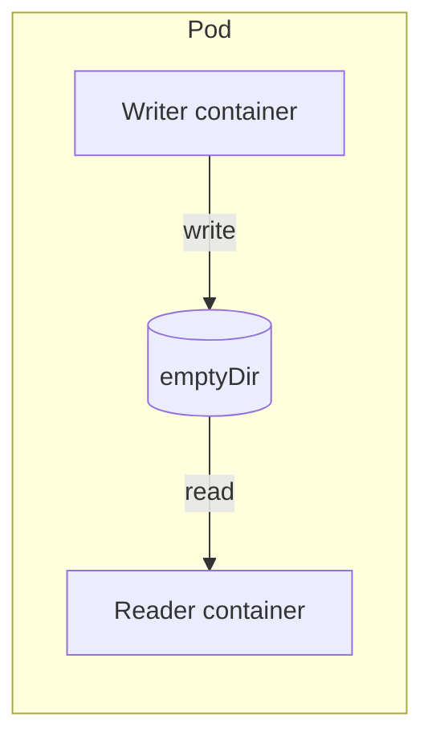
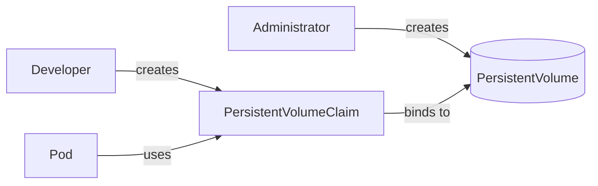
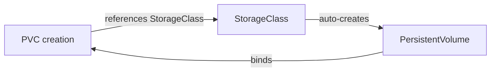

> **Target Audience**: Backend developers who want to persist data in Kubernetes
> **Prerequisites**: Pod concepts
> **After reading this**: You will understand Volume, PersistentVolume, and PersistentVolumeClaim concepts and usage


- Pods are ephemeral by default, data disappears on termination
- Volumes allow data sharing between containers within a Pod
- PersistentVolume (PV) and PersistentVolumeClaim (PVC) maintain data independently of Pod lifecycle


## Why Volumes are Needed?

Container filesystems are ephemeral by default.

| Problem | Volume Solution |
|---------|----------------|
| Data loss on container restart | Preserve data with Volume |
| Cannot share files between containers in same Pod | Mount shared Volume |
| All data lost on Pod termination | Persist with PersistentVolume |

## Volume Types Overview

Kubernetes provides various Volume types.

| Type | Lifetime | Use Case |
|------|----------|----------|
| emptyDir | Same as Pod | Temporary files, cache |
| hostPath | Node lifetime | Node log access (development) |
| configMap/secret | Resource lifetime | Configuration injection |
| PersistentVolume | Independent | Database, file storage |

## emptyDir

Creates an empty directory when Pod starts, deleted when Pod terminates.

```yaml
apiVersion: v1
kind: Pod
metadata:
  name: shared-data
spec:
  containers:
  - name: writer
    image: busybox:1.36
    command: ['sh', '-c', 'while true; do date >> /data/log.txt; sleep 5; done']
    volumeMounts:
    - name: shared
      mountPath: /data
  - name: reader
    image: busybox:1.36
    command: ['sh', '-c', 'tail -f /data/log.txt']
    volumeMounts:
    - name: shared
      mountPath: /data
  volumes:
  - name: shared
    emptyDir: {}
```



emptyDir characteristics summary:

| Characteristic | Description |
|----------------|-------------|
| Lifetime | Same as Pod (data deleted on Pod deletion) |
| Storage location | Node's disk or memory |
| Use case | Temporary cache, inter-container data sharing |

Memory-based emptyDir:
```yaml
volumes:
- name: cache
  emptyDir:
    medium: Memory
    sizeLimit: 100Mi
```

## PersistentVolume and PersistentVolumeClaim

Use PV/PVC to store data independently of Pod lifecycle.

### PV/PVC Relationship



| Resource | Created By | Role |
|----------|-----------|------|
| PersistentVolume (PV) | Administrator | Actual storage resource |
| PersistentVolumeClaim (PVC) | Developer | Storage request |

### Creating PersistentVolume

```yaml
apiVersion: v1
kind: PersistentVolume
metadata:
  name: my-pv
spec:
  capacity:
    storage: 10Gi
  accessModes:
    - ReadWriteOnce
  persistentVolumeReclaimPolicy: Retain
  hostPath:
    path: /data/pv-data
```

Key fields explained:

| Field | Description |
|-------|-------------|
| capacity | Storage capacity |
| accessModes | Access mode |
| reclaimPolicy | Behavior on PVC deletion |

### Access Modes

| Mode | Abbreviation | Description |
|------|--------------|-------------|
| ReadWriteOnce | RWO | Read/write on single node |
| ReadOnlyMany | ROX | Read-only on multiple nodes |
| ReadWriteMany | RWX | Read/write on multiple nodes |

### Reclaim Policy

| Policy | Behavior |
|--------|----------|
| Retain | Keep PV and data after PVC deletion |
| Delete | Delete PV and storage when PVC is deleted |
| Recycle | Delete data and reuse (deprecated) |

### Creating PersistentVolumeClaim

```yaml
apiVersion: v1
kind: PersistentVolumeClaim
metadata:
  name: my-pvc
spec:
  accessModes:
    - ReadWriteOnce
  resources:
    requests:
      storage: 5Gi
```

PVC automatically finds and binds to a matching PV.

### Using PVC in Pod

```yaml
apiVersion: v1
kind: Pod
metadata:
  name: app-with-storage
spec:
  containers:
  - name: app
    image: my-app:1.0
    volumeMounts:
    - name: data
      mountPath: /app/data
  volumes:
  - name: data
    persistentVolumeClaim:
      claimName: my-pvc
```

## StorageClass

StorageClass dynamically provisions PVs. No need to create PVs beforehand; PVs are automatically created when PVC is created.



### StorageClass Example

```yaml
apiVersion: storage.k8s.io/v1
kind: StorageClass
metadata:
  name: fast
provisioner: kubernetes.io/aws-ebs
parameters:
  type: gp3
reclaimPolicy: Delete
volumeBindingMode: WaitForFirstConsumer
```

Main provisioners by cloud:

| Cloud | Provisioner | Storage Type |
|-------|-------------|--------------|
| AWS | kubernetes.io/aws-ebs | EBS |
| GCP | kubernetes.io/gce-pd | Persistent Disk |
| Azure | kubernetes.io/azure-disk | Azure Disk |

### Using StorageClass in PVC

```yaml
apiVersion: v1
kind: PersistentVolumeClaim
metadata:
  name: fast-storage
spec:
  accessModes:
    - ReadWriteOnce
  storageClassName: fast  # Specify StorageClass
  resources:
    requests:
      storage: 20Gi
```

## Real Example: Database Deployment

Example deploying PostgreSQL with PVC.

```yaml
# PVC
apiVersion: v1
kind: PersistentVolumeClaim
metadata:
  name: postgres-pvc
spec:
  accessModes:
    - ReadWriteOnce
  resources:
    requests:
      storage: 10Gi
---
# Deployment
apiVersion: apps/v1
kind: Deployment
metadata:
  name: postgres
spec:
  replicas: 1
  selector:
    matchLabels:
      app: postgres
  template:
    metadata:
      labels:
        app: postgres
    spec:
      containers:
      - name: postgres
        image: postgres:15
        ports:
        - containerPort: 5432
        env:
        - name: POSTGRES_PASSWORD
          valueFrom:
            secretKeyRef:
              name: postgres-secret
              key: password
        - name: PGDATA
          value: /var/lib/postgresql/data/pgdata
        volumeMounts:
        - name: postgres-data
          mountPath: /var/lib/postgresql/data
      volumes:
      - name: postgres-data
        persistentVolumeClaim:
          claimName: postgres-pvc
```


PostgreSQL requires the data directory to be empty. Since PVC mount may have a `lost+found` directory, use a subdirectory (`pgdata`).


## Practice: Creating and Checking PV/PVC

### Create PVC and Check Status

```bash
# Create PVC
kubectl apply -f pvc.yaml

# Check status
kubectl get pvc
```

**Expected output:**
```
NAME     STATUS   VOLUME       CAPACITY   ACCESS MODES   STORAGECLASS   AGE
my-pvc   Bound    pvc-xxx      5Gi        RWO            standard       10s
```

PVC status descriptions:

| Status | Description |
|--------|-------------|
| Pending | Looking for suitable PV |
| Bound | Bound to PV |
| Lost | Bound PV was deleted |

### Check PV

```bash
kubectl get pv
```

### Test Data Persistence

```bash
# Create Pod and write data
kubectl exec -it app-with-storage -- sh -c "echo 'test data' > /app/data/test.txt"

# Delete Pod
kubectl delete pod app-with-storage

# Recreate Pod and verify data
kubectl apply -f pod.yaml
kubectl exec -it app-with-storage -- cat /app/data/test.txt
# Output: test data (data persisted)
```

## Real Usage Scenarios

### Scenario 1: Store Application Logs

Use emptyDir to centrally collect logs from multiple Pods.

```yaml
apiVersion: v1
kind: Pod
metadata:
  name: app-with-log-collector
spec:
  containers:
  - name: app
    image: my-app:1.0
    volumeMounts:
    - name: logs
      mountPath: /var/log/app
  - name: log-collector
    image: fluent/fluentd:v1.16
    volumeMounts:
    - name: logs
      mountPath: /var/log/app
      readOnly: true
  volumes:
  - name: logs
    emptyDir: {}
```

**Reason:** App container generates logs to file, sidecar container reads them and sends to external system.

### Scenario 2: File Upload Storage

Persist user-uploaded files.

```yaml
apiVersion: v1
kind: PersistentVolumeClaim
metadata:
  name: upload-storage
spec:
  accessModes:
    - ReadWriteOnce
  resources:
    requests:
      storage: 50Gi
---
apiVersion: apps/v1
kind: Deployment
metadata:
  name: file-server
spec:
  replicas: 1  # RWO allows only single Pod
  selector:
    matchLabels:
      app: file-server
  template:
    metadata:
      labels:
        app: file-server
    spec:
      containers:
      - name: server
        image: nginx:1.25
        volumeMounts:
        - name: uploads
          mountPath: /usr/share/nginx/html/uploads
      volumes:
      - name: uploads
        persistentVolumeClaim:
          claimName: upload-storage
```

**Note:** `ReadWriteOnce` can only be mounted on a single node. For access from multiple Pods, you need `ReadWriteMany` storage like NFS.

### Scenario 3: Configuration File Injection

Pass ConfigMap configuration file to application.

```yaml
apiVersion: v1
kind: ConfigMap
metadata:
  name: nginx-config
data:
  nginx.conf: |
    server {
        listen 80;
        location / {
            root /usr/share/nginx/html;
        }
    }
---
apiVersion: v1
kind: Pod
metadata:
  name: nginx
spec:
  containers:
  - name: nginx
    image: nginx:1.25
    volumeMounts:
    - name: config
      mountPath: /etc/nginx/conf.d
  volumes:
  - name: config
    configMap:
      name: nginx-config
```

**Advantage:** Files within Pod are automatically updated when ConfigMap changes (takes several minutes).

---

## Next Steps

Once you understand Volumes and storage, proceed to the next steps:

| Goal | Recommended Doc |
|------|----------------|
| Network configuration | [Networking](networking/) |
| Resource management | [Resource Management](resources/) |
| Actual deployment practice | [Spring Boot Deployment](../examples/spring-boot/) |
