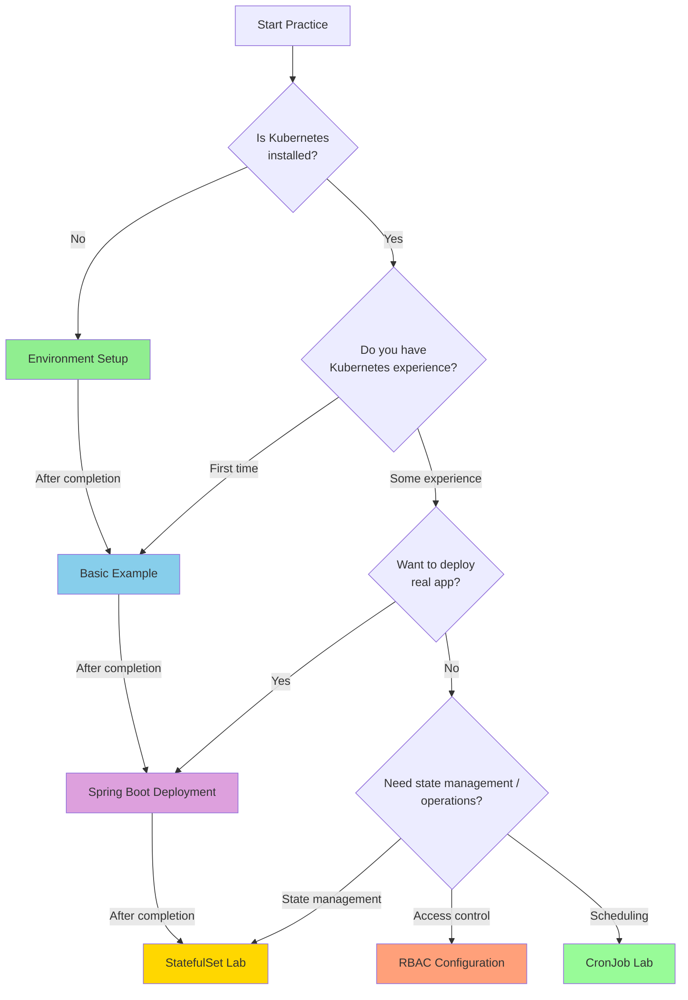

This section provides practical examples to help you run Kubernetes core features hands-on. Each example can be executed independently and includes all necessary YAML files and commands.

## Choose Examples by Goal

**"Which example should I start with?"**

| Your Situation | Recommended Example | What You'll Learn |
|------------|----------|----------|
| New to Kubernetes | [Environment Setup]() → [Basic Example]() | Cluster setup, Pod/Service basics |
| Know concepts but lack hands-on | [Basic Example]() | Run Pod, Deployment, Service directly |
| Want to deploy real apps | [Spring Boot Deployment]() | Apply ConfigMap, Secret, Probe |
| Need stateful apps | [StatefulSet Lab]() | PVC templates, Headless Service |
| Want to manage access permissions | [RBAC Configuration Lab]() | Role, ServiceAccount, RoleBinding |
| Want to automate periodic tasks | [CronJob Lab]() | Scheduling, concurrency policies |

#### Example List

| Example | Difficulty | Estimated Time | Topics Covered |
|------|--------|----------|-------------|
| [Environment Setup]() | ⭐ Beginner | 30 min | Local environment with Minikube, Kind |
| [Basic Example]() | ⭐⭐ Basic | 60 min | Pod, Deployment, Service hands-on |
| [Spring Boot Deployment]() | ⭐⭐⭐ Intermediate | 90 min | Real application deployment |
| [StatefulSet Lab]() | ⭐⭐⭐ Intermediate | 60 min | MySQL StatefulSet, PVC, Headless Service |
| [RBAC Configuration Lab]() | ⭐⭐⭐ Intermediate | 45 min | Role, ServiceAccount, per-namespace access control |
| [CronJob Lab]() | ⭐⭐⭐ Intermediate | 45 min | Periodic backup, concurrency policies, alert setup |

#### Prerequisites

All examples require the following environment:

- Docker 24.x or higher
- kubectl 1.29.x or higher
- Local Kubernetes cluster (Minikube or Kind)

If your environment is not set up, start with the [Environment Setup]() example.
