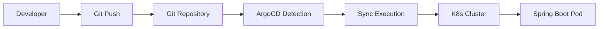
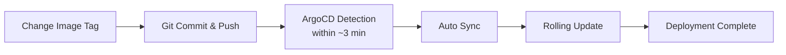

> **Target Audience**: Developers who want to deploy real applications with ArgoCD
> **Prerequisites**: ArgoCD core concepts, Spring Boot, Docker
> **After reading this**: You will be able to deploy a Spring Boot app using GitOps and manage per-environment configurations


- Use Kustomize base/overlay structure to separate per-environment configurations
- Create an ArgoCD Application to automatically detect Git changes and deploy
- Image tag change -> Git Push -> ArgoCD Sync -> zero-downtime deployment


## Overall Flow



*When a developer pushes manifests to Git, ArgoCD detects the changes and automatically deploys to the Kubernetes cluster.*

## 1. Git Repository Structure (Kustomize-based)

In GitOps, it's common practice to manage application source code and deployment manifests in **separate repositories**.

```
my-app-gitops/
├── base/
│   ├── deployment.yaml
│   ├── service.yaml
│   └── kustomization.yaml
└── overlays/
    ├── dev/
    │   ├── kustomization.yaml
    │   └── config.yaml
    ├── staging/
    │   ├── kustomization.yaml
    │   └── config.yaml
    └── prod/
        ├── kustomization.yaml
        └── config.yaml
```

- **base/**: Base manifests shared across all environments
- **overlays/**: Per-environment configurations managed as patches

## 2. Writing Base Manifests

### Deployment

```yaml
# base/deployment.yaml
apiVersion: apps/v1
kind: Deployment
metadata:
  name: my-app
  labels:
    app: my-app
spec:
  replicas: 1
  selector:
    matchLabels:
      app: my-app
  template:
    metadata:
      labels:
        app: my-app
    spec:
      containers:
      - name: app
        image: my-registry/my-app:latest
        ports:
        - containerPort: 8080
        env:
        - name: SPRING_PROFILES_ACTIVE
          value: "kubernetes"
        resources:
          requests:
            memory: "512Mi"
            cpu: "250m"
          limits:
            memory: "1Gi"
            cpu: "500m"
        livenessProbe:
          httpGet:
            path: /actuator/health/liveness
            port: 8080
          initialDelaySeconds: 30
          periodSeconds: 10
        readinessProbe:
          httpGet:
            path: /actuator/health/readiness
            port: 8080
          periodSeconds: 5
```

### Service

```yaml
# base/service.yaml
apiVersion: v1
kind: Service
metadata:
  name: my-app
spec:
  type: ClusterIP
  selector:
    app: my-app
  ports:
  - port: 80
    targetPort: 8080
```

### kustomization.yaml

```yaml
# base/kustomization.yaml
apiVersion: kustomize.config.k8s.io/v1beta1
kind: Kustomization

resources:
  - deployment.yaml
  - service.yaml

commonLabels:
  managed-by: argocd
```

## 3. Per-Environment Overlays

### dev Environment

```yaml
# overlays/dev/kustomization.yaml
apiVersion: kustomize.config.k8s.io/v1beta1
kind: Kustomization

resources:
  - ../../base

namespace: dev

patches:
  - target:
      kind: Deployment
      name: my-app
    patch: |-
      - op: replace
        path: /spec/replicas
        value: 1
      - op: replace
        path: /spec/template/spec/containers/0/env/0/value
        value: "dev"

configMapGenerator:
  - name: my-app-config
    literals:
      - LOG_LEVEL=DEBUG
      - JAVA_OPTS=-Xms256m -Xmx512m
```

### staging Environment

Same structure as dev, with only replicas and profile changes.

```yaml
# overlays/staging/kustomization.yaml
apiVersion: kustomize.config.k8s.io/v1beta1
kind: Kustomization

resources:
  - ../../base
namespace: staging
patches:
  - target:
      kind: Deployment
      name: my-app
    patch: |-
      - op: replace
        path: /spec/replicas
        value: 2
      - op: replace
        path: /spec/template/spec/containers/0/env/0/value
        value: "staging"
```

### prod Environment

Production uses 3 replicas with stricter resource limits.

```yaml
# overlays/prod/kustomization.yaml
apiVersion: kustomize.config.k8s.io/v1beta1
kind: Kustomization

resources:
  - ../../base
namespace: prod
patches:
  - target:
      kind: Deployment
      name: my-app
    patch: |-
      - op: replace
        path: /spec/replicas
        value: 3
      - op: replace
        path: /spec/template/spec/containers/0/resources/limits/memory
        value: "2Gi"
      - op: replace
        path: /spec/template/spec/containers/0/resources/limits/cpu
        value: "1000m"
```

### Per-Environment Configuration Comparison

| Item | dev | staging | prod |
|------|-----|---------|------|
| replicas | 1 | 2 | 3 |
| Profile | dev | staging | prod |
| Log level | DEBUG | INFO | WARN |
| Memory request | 512Mi | 512Mi | 1Gi |
| Memory limit | 1Gi | 1Gi | 2Gi |
| CPU request | 250m | 250m | 500m |
| CPU limit | 500m | 500m | 1000m |

## 4. Creating an ArgoCD Application

An ArgoCD Application defines "which path from which Git repository to deploy to which cluster." There are three ways to create one.

### Method 1: Create via CLI

```bash
# Create Application for dev environment
argocd app create my-app-dev \
  --repo https://github.com/my-org/my-app-gitops.git \
  --path overlays/dev \
  --dest-server https://kubernetes.default.svc \
  --dest-namespace dev \
  --sync-policy automated \
  --auto-prune \
  --self-heal

# staging environment
argocd app create my-app-staging \
  --repo https://github.com/my-org/my-app-gitops.git \
  --path overlays/staging \
  --dest-server https://kubernetes.default.svc \
  --dest-namespace staging \
  --sync-policy automated \
  --auto-prune \
  --self-heal
```

**Key option descriptions:**
- `--sync-policy automated`: Auto Sync on Git changes
- `--auto-prune`: Delete resources from the cluster that were deleted from Git
- `--self-heal`: Restore to Git state when manual changes occur in the cluster

### Method 2: Create via YAML Manifest

```yaml
# argocd/application-dev.yaml
apiVersion: argoproj.io/v1alpha1
kind: Application
metadata:
  name: my-app-dev
  namespace: argocd
spec:
  project: default

  source:
    repoURL: https://github.com/my-org/my-app-gitops.git
    targetRevision: main
    path: overlays/dev

  destination:
    server: https://kubernetes.default.svc
    namespace: dev

  syncPolicy:
    automated:
      prune: true
      selfHeal: true
    syncOptions:
      - CreateNamespace=true
    retry:
      limit: 3
      backoff:
        duration: 5s
        factor: 2
        maxDuration: 3m
```

```bash
# Apply the Application manifest
kubectl apply -f argocd/application-dev.yaml
```

### Method 3: Create via UI

In the ArgoCD Web UI (`https://argocd.example.com`), click **+ New App**, enter the Repository URL, Path (`overlays/dev`), Cluster URL, and Namespace, then click **Create**.

## 5. Deployment and Verification

### Execute Sync

If auto Sync is not configured, run it manually.

```bash
# Manual Sync
argocd app sync my-app-dev

# Wait for Sync result
argocd app wait my-app-dev
```

### Check Status

```bash
# Check Application status
argocd app get my-app-dev
# Sync Status: Synced, Health Status: Healthy means success

# Verify directly in Kubernetes
kubectl get all -n dev -l app=my-app

# Check Spring Boot Actuator health
kubectl port-forward -n dev svc/my-app 8080:80
curl http://localhost:8080/actuator/health
```

## 6. Update Workflow

In GitOps, deployment updates are performed via Git commits.

### Changing Image Tags

```bash
# Change image tag with Kustomize in the GitOps repository
cd my-app-gitops/overlays/dev
kustomize edit set image my-registry/my-app:v2.0

# Git Push -> ArgoCD auto-deploy
git add .
git commit -m "chore: update my-app image to v2.0"
git push
```

If auto Sync is configured, ArgoCD detects the change and auto-deploys within approximately 3 minutes.



*After changing the image tag and pushing to Git, ArgoCD detects the change and automatically performs a Rolling Update.*

### Rollback

If issues occur, you can roll back in two ways.

**Method 1: Git Revert (Recommended)**

Roll back through Git following GitOps principles.

```bash
# Revert the last commit
git revert HEAD
git push

# ArgoCD automatically deploys the previous state
```

**Method 2: ArgoCD CLI Rollback**

Use when rapid response is needed.

```bash
argocd app history my-app-dev     # Check deployment history
argocd app rollback my-app-dev 1  # Roll back to specific version
```


ArgoCD CLI rollback is temporary. If auto Sync is enabled, it will revert to the latest Git state again. For permanent rollback, always use Git Revert.


## 7. Production Deployment Strategy

For production environments, **Manual Sync** is recommended instead of auto Sync. Remove `syncPolicy.automated` from the Application YAML to enable manual mode.

```bash
# Execute prod deployment manually
argocd app sync my-app-prod

# Check deployment status
argocd app wait my-app-prod
```

## 8. Cleanup

After completing the lab, delete the created resources.

```bash
# Delete ArgoCD Applications (K8s resources are also deleted)
argocd app delete my-app-dev --cascade
argocd app delete my-app-staging --cascade
argocd app delete my-app-prod --cascade

# Delete namespaces (if resources remain)
kubectl delete namespace dev staging prod

# If created via Application manifest
kubectl delete -f argocd/application-dev.yaml
```

The `--cascade` option deletes all Kubernetes resources managed by the Application.

---

## Next Steps

After completing ArgoCD GitOps deployment, proceed to the next steps:

| Goal | Recommended Document |
|------|---------------------|
| K8s basic deployment | [Spring Boot Deployment](../spring-boot/) |
| Auto scaling | [Scaling](../concepts/scaling/) |
| Network policies | [Network Policy](../concepts/network-policy/) |
