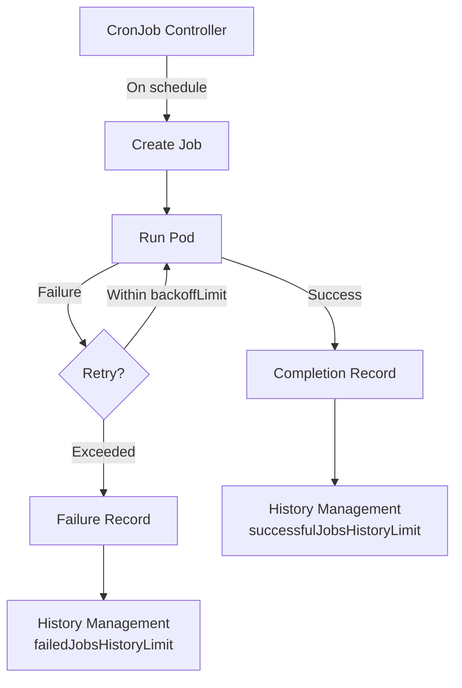
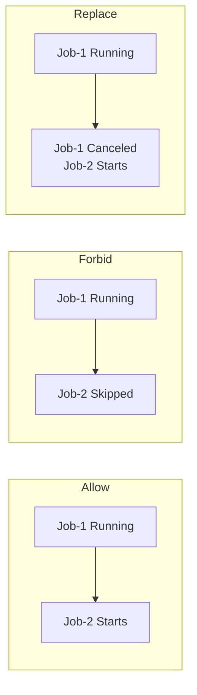

> **Target Audience**: Developers who want to schedule periodic tasks on Kubernetes
> **Prerequisites**: Pod, Job concepts
> **After reading this**: You will be able to create periodic backup tasks with CronJob, and manage execution history and concurrency policies


- Automate periodic data backups with CronJob
- Manage execution history with `successfulJobsHistoryLimit`
- Control concurrent execution with `concurrencyPolicy`
- Configure failure alerts


## CronJob Execution Flow



*This diagram shows the complete CronJob flow: creating Jobs on schedule, managing history on success/failure, and retrying on failure.*

## Prerequisites

You will need the following:

- Local Kubernetes cluster (Minikube or Kind)
- kubectl

```bash
# Check cluster status
kubectl cluster-info

# Create namespace
kubectl create namespace cronjob-lab
```

## Lab 1: Create a Basic CronJob

Create a simple CronJob that runs every minute.

```yaml
# hello-cronjob.yaml
apiVersion: batch/v1
kind: CronJob
metadata:
  name: hello
  namespace: cronjob-lab
spec:
  schedule: "*/1 * * * *"
  jobTemplate:
    spec:
      template:
        spec:
          containers:
          - name: hello
            image: busybox:1.36
            command:
            - /bin/sh
            - -c
            - echo "Hello from CronJob! $(date)"
          restartPolicy: OnFailure
```

```bash
kubectl apply -f hello-cronjob.yaml

# Check CronJob status
kubectl get cronjob hello -n cronjob-lab
```

**Expected output:**
```
NAME    SCHEDULE      SUSPEND   ACTIVE   LAST SCHEDULE   AGE
hello   */1 * * * *   False     0        <none>          10s
```

```bash
# Check Jobs created after 1 minute
kubectl get jobs -n cronjob-lab

# Check Pod logs
kubectl logs -l job-name -n cronjob-lab --tail=5
```

## Lab 2: Data Backup CronJob

A practical example of periodically backing up MySQL data.

### Manage Backup Script with ConfigMap

```yaml
# backup-script-configmap.yaml
apiVersion: v1
kind: ConfigMap
metadata:
  name: backup-script
  namespace: cronjob-lab
data:
  backup.sh: |
    #!/bin/sh
    set -e

    TIMESTAMP=$(date +%Y%m%d-%H%M%S)
    BACKUP_FILE="/backup/db-backup-${TIMESTAMP}.sql"

    echo "[$(date)] Starting backup..."
    mysqldump -h ${DB_HOST} -u ${DB_USER} -p${DB_PASSWORD} ${DB_NAME} > ${BACKUP_FILE}

    # Delete backups older than 7 days
    find /backup -name "*.sql" -mtime +7 -delete

    echo "[$(date)] Backup complete: ${BACKUP_FILE}"
    ls -lh /backup/
```

### Backup CronJob

```yaml
# db-backup-cronjob.yaml
apiVersion: batch/v1
kind: CronJob
metadata:
  name: db-backup
  namespace: cronjob-lab
spec:
  schedule: "0 2 * * *"
  concurrencyPolicy: Forbid
  successfulJobsHistoryLimit: 7
  failedJobsHistoryLimit: 3
  startingDeadlineSeconds: 300
  jobTemplate:
    spec:
      backoffLimit: 2
      activeDeadlineSeconds: 600
      template:
        spec:
          containers:
          - name: backup
            image: mysql:8.0
            command: ["/bin/sh", "/scripts/backup.sh"]
            env:
            - name: DB_HOST
              value: "mysql.default.svc.cluster.local"
            - name: DB_NAME
              value: "mydb"
            - name: DB_USER
              valueFrom:
                secretKeyRef:
                  name: db-credentials
                  key: username
            - name: DB_PASSWORD
              valueFrom:
                secretKeyRef:
                  name: db-credentials
                  key: password
            volumeMounts:
            - name: backup-storage
              mountPath: /backup
            - name: scripts
              mountPath: /scripts
            resources:
              requests:
                memory: "128Mi"
                cpu: "100m"
              limits:
                memory: "256Mi"
                cpu: "200m"
          restartPolicy: OnFailure
          volumes:
          - name: backup-storage
            persistentVolumeClaim:
              claimName: backup-pvc
          - name: scripts
            configMap:
              name: backup-script
              defaultMode: 0755
```

### Key Field Descriptions

| Field | Value | Description |
|-------|-------|-------------|
| `schedule` | `"0 2 * * *"` | Run daily at 2 AM |
| `concurrencyPolicy` | `Forbid` | Skip new Job if previous is still running |
| `successfulJobsHistoryLimit` | `7` | Retain up to 7 successful Jobs |
| `failedJobsHistoryLimit` | `3` | Retain up to 3 failed Jobs |
| `startingDeadlineSeconds` | `300` | Skip if not started within 5 minutes |
| `backoffLimit` | `2` | Retry up to 2 times on failure |
| `activeDeadlineSeconds` | `600` | Terminate if not completed within 10 minutes |

## Lab 3: Concurrency Policy (concurrencyPolicy)

Compare the three policies.



*This diagram shows the differences between the three concurrency policies: Allow (run concurrently), Forbid (skip), and Replace (stop existing and start new).*

| Policy | Behavior | Use Case |
|--------|----------|----------|
| `Allow` (default) | Allow concurrent execution | Independent tasks |
| `Forbid` | Skip new Job | Data backup, batch processing |
| `Replace` | Cancel existing Job, start new one | When only the latest data is needed |

### Test: Verify Forbid with a Long-Running Task

```yaml
# slow-cronjob.yaml
apiVersion: batch/v1
kind: CronJob
metadata:
  name: slow-job
  namespace: cronjob-lab
spec:
  schedule: "*/1 * * * *"
  concurrencyPolicy: Forbid
  jobTemplate:
    spec:
      template:
        spec:
          containers:
          - name: slow
            image: busybox:1.36
            command:
            - /bin/sh
            - -c
            - echo "Started"; sleep 90; echo "Finished"
          restartPolicy: OnFailure
```

```bash
kubectl apply -f slow-cronjob.yaml

# Check after 2 minutes - two Jobs should not run simultaneously
kubectl get jobs -n cronjob-lab -l job-name
```

## Lab 4: Execution History Management

### Check History

```bash
# Check recent executions of CronJob
kubectl get cronjob hello -n cronjob-lab -o wide

# List completed Jobs
kubectl get jobs -n cronjob-lab --sort-by=.metadata.creationTimestamp

# Check Pod logs for a specific Job
JOB_NAME=$(kubectl get jobs -n cronjob-lab -o jsonpath='{.items[-1].metadata.name}')
kubectl logs -l job-name=${JOB_NAME} -n cronjob-lab
```

### Change History Limits

```bash
# Change successful history limit to 3
kubectl patch cronjob hello -n cronjob-lab \
  -p '{"spec":{"successfulJobsHistoryLimit":3}}'

# Verify
kubectl get cronjob hello -n cronjob-lab -o jsonpath='{.spec.successfulJobsHistoryLimit}'
```

## Lab 5: Configure Failure Alerts

Set up a monitoring Job to detect CronJob failures.

```yaml
# backup-monitor-cronjob.yaml
apiVersion: batch/v1
kind: CronJob
metadata:
  name: backup-monitor
  namespace: cronjob-lab
spec:
  schedule: "30 3 * * *"
  jobTemplate:
    spec:
      template:
        spec:
          containers:
          - name: monitor
            image: bitnami/kubectl:latest
            command:
            - /bin/sh
            - -c
            - |
              echo "=== Backup Job Status Check ==="

              # Check recently failed Jobs
              FAILED=$(kubectl get jobs -n cronjob-lab \
                -l app=db-backup \
                --field-selector status.successful=0 \
                --no-headers 2>/dev/null | wc -l)

              if [ "$FAILED" -gt "0" ]; then
                echo "[WARNING] There are ${FAILED} failed backup Jobs!"
                # Send alert via Slack Webhook, etc.
                # curl -X POST -H 'Content-type: application/json' \
                #   --data '{"text":"Backup failure detected!"}' \
                #   ${SLACK_WEBHOOK_URL}
                exit 1
              fi

              echo "[OK] All backups completed successfully."
          restartPolicy: Never
          serviceAccountName: backup-monitor-sa
```

### Monitoring ServiceAccount and Role

```yaml
# backup-monitor-rbac.yaml
apiVersion: v1
kind: ServiceAccount
metadata:
  name: backup-monitor-sa
  namespace: cronjob-lab
---
apiVersion: rbac.authorization.k8s.io/v1
kind: Role
metadata:
  name: job-reader
  namespace: cronjob-lab
rules:
- apiGroups: ["batch"]
  resources: ["jobs"]
  verbs: ["get", "list"]
---
apiVersion: rbac.authorization.k8s.io/v1
kind: RoleBinding
metadata:
  name: backup-monitor-binding
  namespace: cronjob-lab
subjects:
- kind: ServiceAccount
  name: backup-monitor-sa
roleRef:
  kind: Role
  name: job-reader
  apiGroup: rbac.authorization.k8s.io
```

```bash
kubectl apply -f backup-monitor-rbac.yaml
kubectl apply -f backup-monitor-cronjob.yaml
```

## Lab 6: Suspend CronJob

You can temporarily suspend a CronJob during maintenance.

```bash
# Suspend CronJob
kubectl patch cronjob hello -n cronjob-lab \
  -p '{"spec":{"suspend":true}}'

# Check status (SUSPEND=True)
kubectl get cronjob hello -n cronjob-lab

# Resume
kubectl patch cronjob hello -n cronjob-lab \
  -p '{"spec":{"suspend":false}}'
```

## Resource Cleanup

```bash
# Delete all CronJobs (related Jobs and Pods are also deleted)
kubectl delete cronjob --all -n cronjob-lab

# Delete RBAC resources
kubectl delete -f backup-monitor-rbac.yaml

# Delete namespace
kubectl delete namespace cronjob-lab
```

---

## Next Steps

After completing the CronJob lab, proceed to the following:

| Goal | Recommended Document |
|------|---------------------|
| State management | [StatefulSet Lab](statefulset/) |
| Access control | [RBAC Configuration Lab](rbac/) |
| Troubleshooting | [Pod Troubleshooting](../howto/pod-troubleshooting/) |
