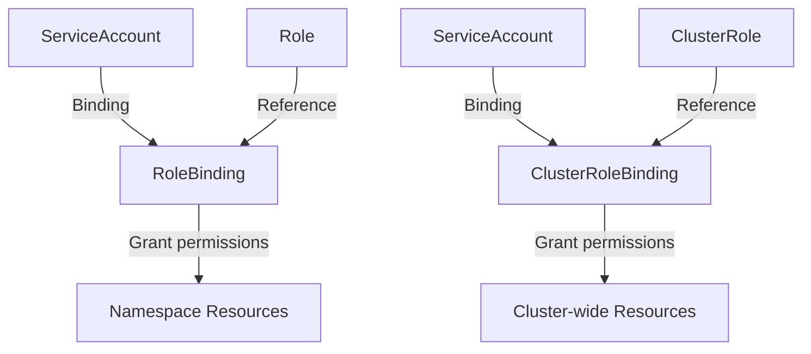

> **Target Audience**: Developers/operators who want to configure access control for Kubernetes clusters
> **Prerequisites**: Namespace, Pod, Deployment concepts
> **After reading this**: You will be able to configure per-namespace access control using Role, RoleBinding, and ServiceAccount


- Create a limited-permission Role for the development team
- Create a ServiceAccount and bind it to the Role
- Test permissions with `kubectl auth can-i`
- Separate access permissions by namespace


## RBAC Structure



| Resource | Scope | Description |
|----------|-------|-------------|
| Role | Namespace | Permissions for resources within a specific Namespace |
| ClusterRole | Cluster | Permissions for cluster-wide resources |
| RoleBinding | Namespace | Bind Role/ClusterRole to subjects |
| ClusterRoleBinding | Cluster | Bind ClusterRole to subjects |

## Prerequisites

You will need the following:

- Local Kubernetes cluster (Minikube or Kind)
- kubectl (cluster-admin permissions)

```bash
# Check cluster status
kubectl cluster-info

# Create lab namespaces
kubectl create namespace dev-team
kubectl create namespace staging
```

## Lab 1: Create a Developer Role

Restrict the development team to only manage Pods and Deployments in the `dev-team` namespace.

### Create Role

```yaml
# dev-role.yaml
apiVersion: rbac.authorization.k8s.io/v1
kind: Role
metadata:
  name: developer
  namespace: dev-team
rules:
- apiGroups: [""]
  resources: ["pods", "pods/log", "pods/exec"]
  verbs: ["get", "list", "watch", "create", "delete"]
- apiGroups: ["apps"]
  resources: ["deployments"]
  verbs: ["get", "list", "watch", "create", "update", "patch"]
- apiGroups: [""]
  resources: ["services"]
  verbs: ["get", "list", "watch"]
- apiGroups: [""]
  resources: ["configmaps"]
  verbs: ["get", "list"]
```

```bash
kubectl apply -f dev-role.yaml
```

### Permission Matrix

The permissions granted by this Role are summarized below:

| Resource | get | list | watch | create | update | delete |
|----------|-----|------|-------|--------|--------|--------|
| pods | O | O | O | O | - | O |
| deployments | O | O | O | O | O | - |
| services | O | O | O | - | - | - |
| configmaps | O | O | - | - | - | - |
| secrets | - | - | - | - | - | - |

## Lab 2: Create ServiceAccount and Binding

### Create ServiceAccount

```yaml
# dev-serviceaccount.yaml
apiVersion: v1
kind: ServiceAccount
metadata:
  name: dev-user
  namespace: dev-team
```

```bash
kubectl apply -f dev-serviceaccount.yaml
```

### Create RoleBinding

```yaml
# dev-rolebinding.yaml
apiVersion: rbac.authorization.k8s.io/v1
kind: RoleBinding
metadata:
  name: developer-binding
  namespace: dev-team
subjects:
- kind: ServiceAccount
  name: dev-user
  namespace: dev-team
roleRef:
  kind: Role
  name: developer
  apiGroup: rbac.authorization.k8s.io
```

```bash
kubectl apply -f dev-rolebinding.yaml
```

## Lab 3: Test Permissions

### Verify with kubectl auth can-i

```bash
# Check if dev-user can get Pods in dev-team
kubectl auth can-i get pods \
  --namespace=dev-team \
  --as=system:serviceaccount:dev-team:dev-user
# Expected: yes

# Check if dev-user can get Secrets in dev-team
kubectl auth can-i get secrets \
  --namespace=dev-team \
  --as=system:serviceaccount:dev-team:dev-user
# Expected: no

# Check if dev-user can create Deployments in dev-team
kubectl auth can-i create deployments \
  --namespace=dev-team \
  --as=system:serviceaccount:dev-team:dev-user
# Expected: yes

# Check if dev-user can access the staging namespace
kubectl auth can-i get pods \
  --namespace=staging \
  --as=system:serviceaccount:dev-team:dev-user
# Expected: no
```

### Test with Actual Resources

```bash
# Create Deployment as dev-user (should succeed)
kubectl create deployment test-nginx --image=nginx:1.25 \
  --namespace=dev-team \
  --as=system:serviceaccount:dev-team:dev-user

# Verify
kubectl get deployment test-nginx \
  --namespace=dev-team \
  --as=system:serviceaccount:dev-team:dev-user
```

**Expected output:**
```
NAME         READY   UP-TO-DATE   AVAILABLE   AGE
test-nginx   1/1     1            1           30s
```

```bash
# Attempt to create Secret as dev-user (should fail)
kubectl create secret generic test-secret \
  --from-literal=key=value \
  --namespace=dev-team \
  --as=system:serviceaccount:dev-team:dev-user
```

**Expected output:**
```
Error from server (Forbidden): secrets is forbidden: User "system:serviceaccount:dev-team:dev-user" cannot create resource "secrets" in API group "" in the namespace "dev-team"
```

## Lab 4: Per-Namespace Access Control

Grant read-only permissions for the staging namespace.

### Read-Only Role

```yaml
# staging-readonly-role.yaml
apiVersion: rbac.authorization.k8s.io/v1
kind: Role
metadata:
  name: viewer
  namespace: staging
rules:
- apiGroups: ["", "apps", "batch"]
  resources: ["pods", "deployments", "services", "jobs", "configmaps"]
  verbs: ["get", "list", "watch"]
```

### RoleBinding

```yaml
# staging-rolebinding.yaml
apiVersion: rbac.authorization.k8s.io/v1
kind: RoleBinding
metadata:
  name: viewer-binding
  namespace: staging
subjects:
- kind: ServiceAccount
  name: dev-user
  namespace: dev-team
roleRef:
  kind: Role
  name: viewer
  apiGroup: rbac.authorization.k8s.io
```

```bash
kubectl apply -f staging-readonly-role.yaml
kubectl apply -f staging-rolebinding.yaml
```

### Verify Cross-Namespace Permissions

```bash
# Can read in staging
kubectl auth can-i get pods \
  --namespace=staging \
  --as=system:serviceaccount:dev-team:dev-user
# Expected: yes

# Cannot write in staging
kubectl auth can-i create deployments \
  --namespace=staging \
  --as=system:serviceaccount:dev-team:dev-user
# Expected: no
```

## Lab 5: Full Permission Summary

```bash
# Check all permissions for dev-user in dev-team namespace
kubectl auth can-i --list \
  --namespace=dev-team \
  --as=system:serviceaccount:dev-team:dev-user

# Check all permissions for dev-user in staging namespace
kubectl auth can-i --list \
  --namespace=staging \
  --as=system:serviceaccount:dev-team:dev-user
```

## Resource Cleanup

```bash
# Delete dev-team resources
kubectl delete rolebinding developer-binding -n dev-team
kubectl delete role developer -n dev-team
kubectl delete serviceaccount dev-user -n dev-team

# Delete staging resources
kubectl delete rolebinding viewer-binding -n staging
kubectl delete role viewer -n staging

# Delete namespaces (includes all resources)
kubectl delete namespace dev-team
kubectl delete namespace staging
```

---

## Next Steps

After completing the RBAC configuration lab, proceed to the following:

| Goal | Recommended Document |
|------|---------------------|
| State management | [StatefulSet Lab]() |
| Periodic tasks | [CronJob Lab]() |
| Network policies | [Networking]() |
