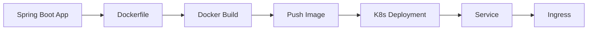

> **Target Audience**: Backend developers who want to deploy Spring Boot applications to Kubernetes
> **Prerequisites**: Deployment, Service, ConfigMap, Docker
> **After reading this**: You'll be able to containerize and deploy Spring Boot apps to Kubernetes


- Write Dockerfile → Build image → Deploy to Kubernetes
- Separate environment-specific configuration with ConfigMap/Secret
- Configure health checks with Actuator endpoints


## Overall Flow



## 1. Prepare Spring Boot Application

### Example Application Structure

```
my-app/
├── src/main/
│   ├── java/com/example/
│   │   └── MyAppApplication.java
│   └── resources/
│       └── application.yml
├── Dockerfile
├── build.gradle.kts
└── kubernetes/
    ├── deployment.yaml
    ├── service.yaml
    ├── configmap.yaml
    └── secret.yaml
```

### application.yml

```yaml
spring:
  application:
    name: my-app
  datasource:
    url: ${DATABASE_URL:jdbc:postgresql://localhost:5432/mydb}
    username: ${DATABASE_USERNAME:postgres}
    password: ${DATABASE_PASSWORD:postgres}

server:
  port: 8080

management:
  endpoints:
    web:
      exposure:
        include: health,info,prometheus
  endpoint:
    health:
      probes:
        enabled: true
  health:
    livenessState:
      enabled: true
    readinessState:
      enabled: true
```

### Simple Controller

```java
@RestController
public class HelloController {

    @GetMapping("/")
    public String hello() {
        return "Hello from Kubernetes!";
    }

    @GetMapping("/hostname")
    public String hostname() {
        try {
            return "Pod: " + InetAddress.getLocalHost().getHostName();
        } catch (UnknownHostException e) {
            return "Unknown";
        }
    }
}
```

## 2. Build Docker Image

### Dockerfile (Multi-stage Build)

```dockerfile
# Build stage
FROM eclipse-temurin:17-jdk AS build
WORKDIR /app
COPY gradle gradle
COPY build.gradle.kts settings.gradle.kts gradlew ./
COPY src src
RUN ./gradlew bootJar --no-daemon

# Runtime stage
FROM eclipse-temurin:17-jre
WORKDIR /app

# Security: use non-root user
RUN addgroup --system appgroup && adduser --system appuser --ingroup appgroup
USER appuser

COPY --from=build /app/build/libs/*.jar app.jar

EXPOSE 8080

ENTRYPOINT ["java", "-jar", "app.jar"]
```

### Build Image

```bash
# Build Docker image
docker build -t my-app:1.0 .

# Test locally
docker run -p 8080:8080 my-app:1.0

# Use local image in Minikube
eval $(minikube docker-env)
docker build -t my-app:1.0 .

# Use local image in Kind
kind load docker-image my-app:1.0
```

## 3. Write Kubernetes Resources

### ConfigMap (Environment Configuration)

```yaml
# kubernetes/configmap.yaml
apiVersion: v1
kind: ConfigMap
metadata:
  name: my-app-config
data:
  SPRING_PROFILES_ACTIVE: "kubernetes"
  DATABASE_URL: "jdbc:postgresql://postgres-service:5432/mydb"
  JAVA_OPTS: "-Xms256m -Xmx512m"
```

### Secret (Sensitive Information)

```bash
# Create Secret (command)
kubectl create secret generic my-app-secret \
  --from-literal=DATABASE_USERNAME=myuser \
  --from-literal=DATABASE_PASSWORD=mypassword
```

Or with YAML:

```yaml
# kubernetes/secret.yaml
apiVersion: v1
kind: Secret
metadata:
  name: my-app-secret
type: Opaque
stringData:
  DATABASE_USERNAME: myuser
  DATABASE_PASSWORD: mypassword
```

### Deployment

```yaml
# kubernetes/deployment.yaml
apiVersion: apps/v1
kind: Deployment
metadata:
  name: my-app
  labels:
    app: my-app
spec:
  replicas: 2
  selector:
    matchLabels:
      app: my-app
  template:
    metadata:
      labels:
        app: my-app
    spec:
      containers:
      - name: app
        image: my-app:1.0
        imagePullPolicy: IfNotPresent
        ports:
        - containerPort: 8080
        env:
        - name: JAVA_OPTS
          valueFrom:
            configMapKeyRef:
              name: my-app-config
              key: JAVA_OPTS
        envFrom:
        - configMapRef:
            name: my-app-config
        - secretRef:
            name: my-app-secret
        resources:
          requests:
            memory: "512Mi"
            cpu: "250m"
          limits:
            memory: "1Gi"
            cpu: "1000m"
        startupProbe:
          httpGet:
            path: /actuator/health/liveness
            port: 8080
          initialDelaySeconds: 30
          periodSeconds: 10
          failureThreshold: 30
        livenessProbe:
          httpGet:
            path: /actuator/health/liveness
            port: 8080
          periodSeconds: 10
          failureThreshold: 3
        readinessProbe:
          httpGet:
            path: /actuator/health/readiness
            port: 8080
          periodSeconds: 5
          failureThreshold: 3
```

### Service

```yaml
# kubernetes/service.yaml
apiVersion: v1
kind: Service
metadata:
  name: my-app
spec:
  type: ClusterIP
  selector:
    app: my-app
  ports:
  - port: 80
    targetPort: 8080
```

## 4. Deploy

### Deploy Resources

```bash
# Create namespace (optional)
kubectl create namespace my-app

# Deploy resources
kubectl apply -f kubernetes/configmap.yaml
kubectl apply -f kubernetes/secret.yaml
kubectl apply -f kubernetes/deployment.yaml
kubectl apply -f kubernetes/service.yaml

# Or deploy entire directory
kubectl apply -f kubernetes/
```

### Verify Deployment

```bash
# Deployment status
kubectl get deployment my-app

# Pod status
kubectl get pods -l app=my-app

# Rollout status
kubectl rollout status deployment/my-app

# Check logs
kubectl logs -l app=my-app --tail=100 -f
```

### Test Service

```bash
# Test from inside cluster
kubectl run test --image=busybox:1.36 --rm -it --restart=Never \
  -- wget -qO- http://my-app

# Port forward
kubectl port-forward service/my-app 8080:80

# Access in browser: http://localhost:8080
```

## 5. Updates and Rollbacks

### Update Image

```bash
# Build new version
docker build -t my-app:2.0 .

# Update image
kubectl set image deployment/my-app app=my-app:2.0

# Check rollout
kubectl rollout status deployment/my-app
```

### Rollback

```bash
# Check history
kubectl rollout history deployment/my-app

# Rollback
kubectl rollout undo deployment/my-app
```

## 6. Ingress Setup (Optional)

To access from outside using a domain, configure Ingress.

```yaml
# kubernetes/ingress.yaml
apiVersion: networking.k8s.io/v1
kind: Ingress
metadata:
  name: my-app
  annotations:
    nginx.ingress.kubernetes.io/rewrite-target: /
spec:
  ingressClassName: nginx
  rules:
  - host: my-app.local
    http:
      paths:
      - path: /
        pathType: Prefix
        backend:
          service:
            name: my-app
            port:
              number: 80
```

```bash
# Enable Ingress in Minikube
minikube addons enable ingress

# Add to /etc/hosts
echo "$(minikube ip) my-app.local" | sudo tee -a /etc/hosts

# Test access
curl http://my-app.local
```

## Troubleshooting

### Pod Won't Start

```bash
# Check events
kubectl describe pod <pod-name>

# Check logs
kubectl logs <pod-name>

# Check previous container logs (if restarted)
kubectl logs <pod-name> --previous
```

### Common Issues and Solutions

| Issue | Cause | Solution |
|------|------|------|
| ImagePullBackOff | Can't find image | Check image name/tag, load local image |
| CrashLoopBackOff | Application startup failure | Check logs, verify environment variables |
| Pending | Resource shortage | Check node resources, adjust requests |
| ReadinessProbe failure | Endpoint not ready | Check Actuator settings, verify path |

---

## Next Steps

After completing Spring Boot deployment, proceed to:

| Goal | Recommended Document |
|------|----------|
| Troubleshooting | [Pod Troubleshooting](../howto/pod-troubleshooting/) |
| Auto-scaling | [Scaling](../concepts/scaling/) |
| Resource optimization | [Resource Optimization](../howto/resource-optimization/) |
