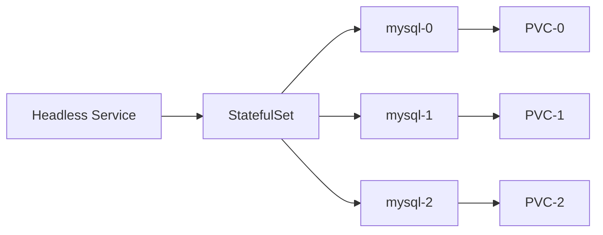

> **Target Audience**: Developers who want to deploy stateful applications on Kubernetes
> **Prerequisites**: Deployment, Service, PersistentVolume concepts
> **After reading this**: You will be able to deploy MySQL with StatefulSet and verify data persistence


- Deploy MySQL with StatefulSet
- Access individual Pods via Headless Service
- Persist data with PersistentVolumeClaim templates
- Verify data preservation during scale up/down


## Overall Flow



*This diagram shows the complete setup of a Headless Service, StatefulSet, and individual PVCs attached to each Pod.*

## Prerequisites

You will need the following:

- Local Kubernetes cluster (Minikube or Kind)
- kubectl
- At least 2GB available memory

```bash
# Check cluster status
kubectl cluster-info

# Create namespace
kubectl create namespace statefulset-lab
```

## StatefulSet vs Deployment

Use StatefulSet for workloads that require the following properties:

| Property | Deployment | StatefulSet |
|----------|-----------|-------------|
| Pod name | Random hash | Ordinal index (0, 1, 2...) |
| Creation/deletion order | Random | Order guaranteed |
| Network ID | None | Stable (Headless Service) |
| Storage | Shareable | Unique PVC per Pod |

## Lab 1: Create Headless Service

StatefulSet requires a Headless Service. Set `clusterIP: None`.

```yaml
# mysql-headless-service.yaml
apiVersion: v1
kind: Service
metadata:
  name: mysql
  namespace: statefulset-lab
  labels:
    app: mysql
spec:
  clusterIP: None
  selector:
    app: mysql
  ports:
  - port: 3306
    targetPort: 3306
```

```bash
kubectl apply -f mysql-headless-service.yaml
```

Through the Headless Service, you can access each Pod using the format `mysql-0.mysql.statefulset-lab.svc.cluster.local`.

## Lab 2: Create Secret

Manage the MySQL root password as a Secret.

```yaml
# mysql-secret.yaml
apiVersion: v1
kind: Secret
metadata:
  name: mysql-secret
  namespace: statefulset-lab
type: Opaque
stringData:
  MYSQL_ROOT_PASSWORD: rootpassword
  MYSQL_DATABASE: testdb
```

```bash
kubectl apply -f mysql-secret.yaml
```

## Lab 3: Deploy StatefulSet

### Create StatefulSet

```yaml
# mysql-statefulset.yaml
apiVersion: apps/v1
kind: StatefulSet
metadata:
  name: mysql
  namespace: statefulset-lab
spec:
  serviceName: mysql
  replicas: 3
  selector:
    matchLabels:
      app: mysql
  template:
    metadata:
      labels:
        app: mysql
    spec:
      containers:
      - name: mysql
        image: mysql:8.0
        ports:
        - containerPort: 3306
        envFrom:
        - secretRef:
            name: mysql-secret
        resources:
          requests:
            memory: "256Mi"
            cpu: "250m"
          limits:
            memory: "512Mi"
            cpu: "500m"
        volumeMounts:
        - name: mysql-data
          mountPath: /var/lib/mysql
        readinessProbe:
          exec:
            command:
            - mysqladmin
            - ping
            - -h
            - localhost
          initialDelaySeconds: 30
          periodSeconds: 10
        livenessProbe:
          exec:
            command:
            - mysqladmin
            - ping
            - -h
            - localhost
          initialDelaySeconds: 60
          periodSeconds: 15
  volumeClaimTemplates:
  - metadata:
      name: mysql-data
    spec:
      accessModes:
      - ReadWriteOnce
      resources:
        requests:
          storage: 1Gi
```

```bash
kubectl apply -f mysql-statefulset.yaml

# Verify Pods are created in order
kubectl get pods -n statefulset-lab -l app=mysql -w
```

**Expected output:**
```
NAME      READY   STATUS    RESTARTS   AGE
mysql-0   1/1     Running   0          60s
mysql-1   1/1     Running   0          45s
mysql-2   1/1     Running   0          30s
```

### Verify PVCs

```bash
# Verify unique PVC created for each Pod
kubectl get pvc -n statefulset-lab
```

**Expected output:**
```
NAME                 STATUS   VOLUME       CAPACITY   ACCESS MODES   AGE
mysql-data-mysql-0   Bound    pv-xxx       1Gi        RWO            2m
mysql-data-mysql-1   Bound    pv-yyy       1Gi        RWO            90s
mysql-data-mysql-2   Bound    pv-zzz       1Gi        RWO            60s
```

## Lab 4: Verify Data Persistence

### Insert Data

```bash
# Connect to mysql-0 and insert data
kubectl exec -n statefulset-lab mysql-0 -it -- mysql -uroot -prootpassword -e "
  USE testdb;
  CREATE TABLE messages (id INT AUTO_INCREMENT PRIMARY KEY, content VARCHAR(255));
  INSERT INTO messages (content) VALUES ('Hello from mysql-0');
  SELECT * FROM messages;
"
```

### Verify Data After Pod Restart

```bash
# Delete Pod (StatefulSet will auto-recreate)
kubectl delete pod mysql-0 -n statefulset-lab

# Wait until Pod is Running again
kubectl wait --for=condition=ready pod/mysql-0 -n statefulset-lab --timeout=120s

# Verify data is preserved
kubectl exec -n statefulset-lab mysql-0 -it -- mysql -uroot -prootpassword -e "
  USE testdb;
  SELECT * FROM messages;
"
```

You can confirm the data remains intact. This is because the PVC exists independently from the Pod.

## Lab 5: Individual Pod DNS Access

```bash
# Access each MySQL instance by DNS from a temporary Pod
kubectl run dns-test -n statefulset-lab --image=busybox:1.36 --rm -it --restart=Never \
  -- nslookup mysql-0.mysql.statefulset-lab.svc.cluster.local

kubectl run dns-test -n statefulset-lab --image=busybox:1.36 --rm -it --restart=Never \
  -- nslookup mysql-1.mysql.statefulset-lab.svc.cluster.local
```

## Lab 6: Scale Up/Down

### Scale Down

```bash
# Scale down from 3 to 2
kubectl scale statefulset mysql -n statefulset-lab --replicas=2

# mysql-2 is deleted first (reverse order)
kubectl get pods -n statefulset-lab -l app=mysql -w
```


PVCs are not deleted when scaling down. When you scale back up, the existing PVC is reconnected.


### Verify PVCs

```bash
# mysql-2's PVC still exists
kubectl get pvc -n statefulset-lab
```

### Scale Up

```bash
# Scale back up to 3
kubectl scale statefulset mysql -n statefulset-lab --replicas=3

# mysql-2 reuses its existing PVC
kubectl get pods -n statefulset-lab -l app=mysql -w
```

## Resource Cleanup

```bash
# Delete StatefulSet
kubectl delete statefulset mysql -n statefulset-lab

# PVCs must be deleted manually
kubectl delete pvc -l app=mysql -n statefulset-lab

# Delete Service, Secret
kubectl delete service mysql -n statefulset-lab
kubectl delete secret mysql-secret -n statefulset-lab

# Delete namespace (includes all resources)
kubectl delete namespace statefulset-lab
```

---

## Next Steps

After completing the StatefulSet hands-on, proceed to the following:

| Goal | Recommended Document |
|------|---------------------|
| Access control | [RBAC Configuration Lab](rbac/) |
| Periodic tasks | [CronJob Lab](cronjob/) |
| Resource management | [Resource Management](../concepts/resources/) |
