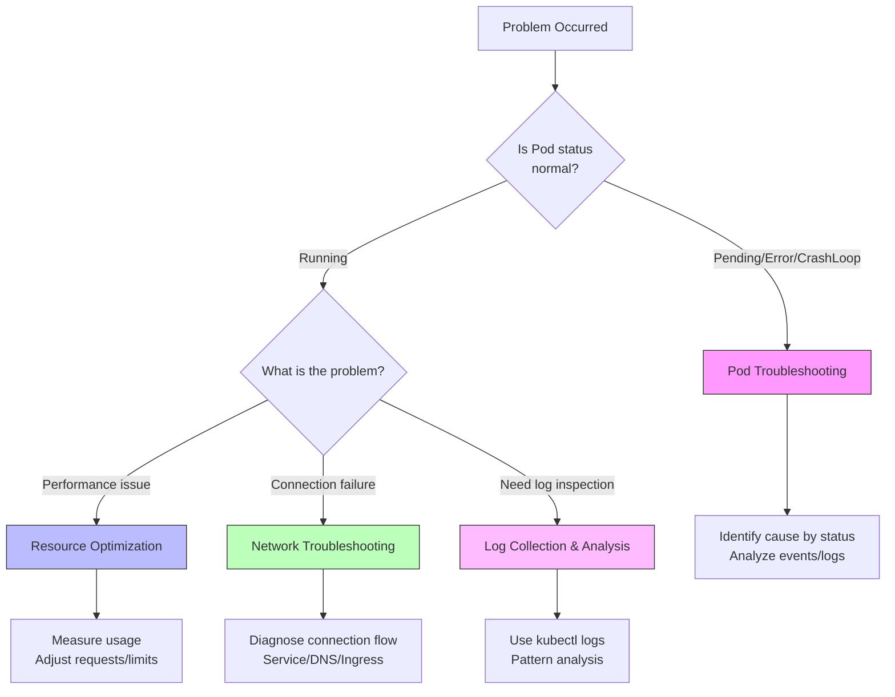

This section provides step-by-step guides to solve specific problems you encounter during Kubernetes operations. Each guide presents clear objectives with concrete solutions.

## Selecting the Right Guide

If you're not sure which guide to follow, use the flowchart below.

| Symptom | Recommended Guide |
|---------|-------------------|
| Pod won't start, CrashLoopBackOff | [Pod Troubleshooting](pod-troubleshooting/) |
| Slow response, OOMKilled, CPU throttling | [Resource Optimization](resource-optimization/) |
| Service/Ingress connection failure, DNS error | [Network Troubleshooting](network-troubleshooting/) |
| Finding error causes, log analysis | [Log Collection & Analysis](logging-guide/) |

## Guide List

| Guide | Situation | Estimated Time |
|-------|-----------|----------------|
| [Pod Troubleshooting](pod-troubleshooting/) | When Pod fails to start or terminates abnormally | 30 min |
| [Resource Optimization](resource-optimization/) | When you need to find appropriate CPU/memory settings | 45 min |
| [Network Troubleshooting](network-troubleshooting/) | When Service or Ingress fails to connect | 30 min |
| [Log Collection & Analysis](logging-guide/) | When you need to effectively collect and analyze logs | 25 min |

## How to Use These Guides

1. Select the guide that matches the problem you're experiencing
2. Verify prerequisites in the **Before You Begin** section
3. Follow the step-by-step instructions in order
4. Confirm progress using the **Success Check** items at each step
5. If the problem isn't resolved, refer to the **Common Errors** section
