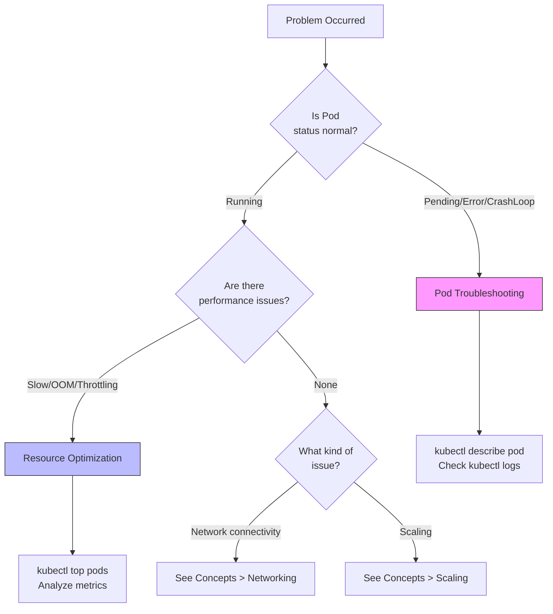

This section provides step-by-step guides to solve specific problems you may encounter while operating Kubernetes. Each guide presents concrete solutions with clear objectives.

## Choosing the Right Guide

If you're unsure which guide to follow, use the flowchart below.

| Symptom | Recommended Guide |
|---------|-------------------|
| Pod won't start, CrashLoopBackOff | [Pod Troubleshooting](pod-troubleshooting/) |
| Slow response, OOMKilled, CPU throttling | [Resource Optimization](resource-optimization/) |

#### Guide List

| Guide | Situation | Estimated Time |
|-------|-----------|----------------|
| [Pod Troubleshooting](pod-troubleshooting/) | When Pod fails to start or terminates abnormally | 30 min |
| [Resource Optimization](resource-optimization/) | When finding appropriate CPU/memory settings | 45 min |

#### How to Use These Guides

1. Select the guide that matches your current problem
2. Check the prerequisites of the guide
3. Follow the step-by-step instructions in order
4. Verify the expected results at each step
