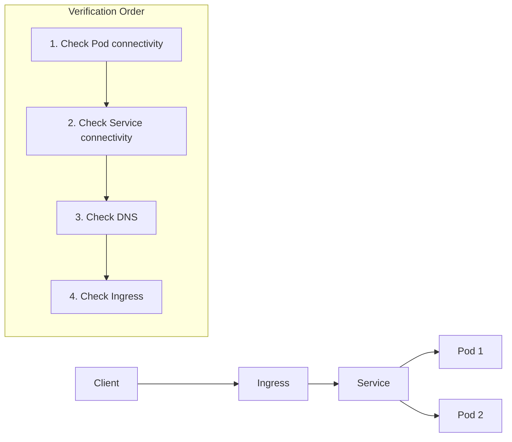

> **Objective**: Identify and resolve issues when Service or Ingress fails to connect
> **Estimated Time**: 30 minutes


**Covers**: Service connectivity issues, DNS issues, Ingress routing issues

**Does not cover**: Pod startup issues (see [Pod Troubleshooting](pod-troubleshooting/)), external network firewall configuration


## Before You Begin

Verify the following prerequisites.

### 1. Verify kubectl Installation and Cluster Access

```bash
kubectl cluster-info
```

**Success output:**
```
Kubernetes control plane is running at https://xxx.xxx.xxx.xxx
CoreDNS is running at https://xxx.xxx.xxx.xxx/api/v1/namespaces/kube-system/services/kube-dns:dns/proxy
```

### 2. Verify Pod Status

Verify the target Pods you want to connect to are in Running status.

```bash
kubectl get pods -l app=<your-app>
```

**Success output:**
```
NAME                     READY   STATUS    RESTARTS   AGE
my-app-xxx-yyy           1/1     Running   0          5m
```


First, resolve Pod issues by referring to [Pod Troubleshooting](pod-troubleshooting/).


### 3. Prepare Test Pod

Create a temporary Pod for network diagnostics.

```bash
kubectl run netshoot --rm -it --image=nicolaka/netshoot -- /bin/bash
```


netshoot is an image that includes network diagnostic tools like curl, nslookup, dig, tcpdump.


---

## Understanding Network Connection Flow

Understand the Kubernetes network flow before troubleshooting.



*This diagram shows the connection flow and verification order for diagnosing network issues: Client → Ingress → Service → Pod.*

---

## Step 1: Verify Direct Pod Connectivity

Verify if you can connect directly to the Pod without going through Service.

### Get Pod IP

```bash
kubectl get pod <pod-name> -o wide
```

**Expected output:**
```
NAME           READY   STATUS    IP           NODE
my-app-xxx     1/1     Running   10.244.1.5   node-1
```

### Test Direct Connection to Pod

```bash
kubectl exec netshoot -- curl -s http://10.244.1.5:8080/health
```

**Success output:**
```json
{"status":"UP"}
```

### If Connection Fails

| Symptom | Possible Cause | Solution |
|---------|----------------|----------|
| Connection refused | Application not listening on that port | Check container port configuration |
| Connection timeout | Network policy blocking traffic | Check NetworkPolicy |
| No route to host | Pod on different node and CNI issue | Check CNI plugin status |

**Success check:** If direct connection to Pod IP succeeds, proceed to next step.

---

## Step 2: Verify Service Connectivity

### Check Service Status

```bash
kubectl get svc <service-name>
```

**Expected output:**
```
NAME       TYPE        CLUSTER-IP      EXTERNAL-IP   PORT(S)    AGE
my-app     ClusterIP   10.96.123.45    <none>        80/TCP     5m
```

### Check Endpoints

Verify if Service is connected to Pods.

```bash
kubectl get endpoints <service-name>
```

**Normal output:**
```
NAME       ENDPOINTS                       AGE
my-app     10.244.1.5:8080,10.244.2.3:8080 5m
```


```
NAME       ENDPOINTS   AGE
my-app     <none>      5m
```
In this case, Service selector and Pod labels don't match.


### Resolve Selector Mismatch

**Check Service selector:**
```bash
kubectl get svc <service-name> -o jsonpath='{.spec.selector}'
```

**Expected output:**
```json
{"app":"my-app"}
```

**Check Pod labels:**
```bash
kubectl get pods --show-labels | grep my-app
```

Verify selector and labels match. If they don't, correct them.

### Test Connection to Service ClusterIP

```bash
kubectl exec netshoot -- curl -s http://10.96.123.45:80/health
```

**Success check:** If connection to Service ClusterIP succeeds, proceed to next step.

---

## Step 3: Verify DNS

### Test Connection Using Service DNS Name

```bash
kubectl exec netshoot -- curl -s http://<service-name>.<namespace>.svc.cluster.local:80/health
```

Or within the same namespace:

```bash
kubectl exec netshoot -- curl -s http://<service-name>:80/health
```

### Verify DNS Resolution

```bash
kubectl exec netshoot -- nslookup <service-name>.<namespace>.svc.cluster.local
```

**Normal output:**
```
Server:    10.96.0.10
Address:   10.96.0.10:53

Name:   my-app.default.svc.cluster.local
Address: 10.96.123.45
```

### If DNS Fails

**Check CoreDNS status:**
```bash
kubectl get pods -n kube-system -l k8s-app=kube-dns
```

**Normal output:**
```
NAME                       READY   STATUS    RESTARTS   AGE
coredns-xxx-yyy            1/1     Running   0          1d
coredns-xxx-zzz            1/1     Running   0          1d
```

**Check CoreDNS logs:**
```bash
kubectl logs -n kube-system -l k8s-app=kube-dns --tail=50
```

**Success check:** If DNS resolution succeeds, proceed to next step.

---

## Step 4: Verify Ingress

Proceed with this step only if you're using Ingress.

### Check Ingress Status

```bash
kubectl get ingress <ingress-name>
```

**Expected output:**
```
NAME       CLASS   HOSTS              ADDRESS        PORTS   AGE
my-app     nginx   my-app.example.com 203.0.113.10   80      5m
```


Ingress Controller is not installed or not functioning properly.


### Check Ingress Controller

```bash
kubectl get pods -n ingress-nginx
```

**Normal output:**
```
NAME                                       READY   STATUS    RESTARTS   AGE
ingress-nginx-controller-xxx-yyy           1/1     Running   0          1d
```

### Verify Ingress Rules

```bash
kubectl describe ingress <ingress-name>
```

**Verify:**
- Host is correct
- Path is correct
- Backend Service and Port are correct

### Test Ingress Connection

Test from outside the cluster.

```bash
curl -H "Host: my-app.example.com" http://<ingress-address>/health
```

**Success check:** If connection through Ingress succeeds, troubleshooting is complete.

---

## Common Errors

### "Connection refused"

**Cause 1:** Application not listening on correct port

**Solution:**
```bash
# Check listening ports inside Pod
kubectl exec <pod-name> -- netstat -tlnp
# or
kubectl exec <pod-name> -- ss -tlnp
```

**Cause 2:** containerPort and Service targetPort mismatch

**Solution:**
```bash
# Check Service targetPort
kubectl get svc <service-name> -o jsonpath='{.spec.ports[0].targetPort}'

# Check container port
kubectl get pod <pod-name> -o jsonpath='{.spec.containers[0].ports[0].containerPort}'
```

Verify both values match.

### "No endpoints available"

**Cause:** Service selector and Pod labels don't match

**Solution:**
```bash
# Service selector
kubectl get svc <service-name> -o jsonpath='{.spec.selector}'

# Pod labels
kubectl get pod <pod-name> -o jsonpath='{.metadata.labels}'
```

All key-values in selector must exist in Pod labels.

### "Name or service not known" (DNS Failure)

**Cause:** CoreDNS is not functioning properly

**Solution:**
```bash
# Restart CoreDNS
kubectl rollout restart deployment coredns -n kube-system

# Check status
kubectl rollout status deployment coredns -n kube-system
```

### "504 Gateway Timeout" (Ingress)

**Cause:** Connection timeout to backend Service

**Solution:**
1. Check Service and Pod connectivity (repeat Step 2)
2. Check timeout settings in Ingress annotations

```yaml
metadata:
  annotations:
    nginx.ingress.kubernetes.io/proxy-connect-timeout: "60"
    nginx.ingress.kubernetes.io/proxy-read-timeout: "60"
```

### "503 Service Unavailable" (Ingress)

**Cause:** No healthy Pods in backend

**Solution:**
```bash
# Check Pod Readiness
kubectl get pods -l app=<your-app>

# Check Endpoints
kubectl get endpoints <service-name>
```

---

## Checking NetworkPolicy

NetworkPolicy may be blocking traffic.

### Check Applied NetworkPolicies

```bash
kubectl get networkpolicy -A
```

### Check Policies Affecting Specific Pod

```bash
kubectl describe networkpolicy <policy-name> -n <namespace>
```

### Temporary Test: Allow All Traffic

```yaml
# allow-all-test.yaml
apiVersion: networking.k8s.io/v1
kind: NetworkPolicy
metadata:
  name: allow-all-test
spec:
  podSelector: {}
  policyTypes:
  - Ingress
  - Egress
  ingress:
  - {}
  egress:
  - {}
```


Make sure to delete this after testing.
```bash
kubectl delete networkpolicy allow-all-test
```


---

## Environment-Specific Notes



```bash
# Access Service in Minikube
minikube service <service-name> --url

# Enable Ingress addon
minikube addons enable ingress

# Check Ingress IP
minikube ip
```


```bash
# Check LoadBalancer Service external address
kubectl get svc <service-name> -o jsonpath='{.status.loadBalancer.ingress[0].hostname}'

# Need to check Security Group
# Verify node Security Group rules in AWS Console
```


```bash
# LoadBalancer Service external IP
kubectl get svc <service-name> -o jsonpath='{.status.loadBalancer.ingress[0].ip}'

# Check firewall rules
gcloud compute firewall-rules list
```



---

## Checklist

### Pod Connectivity
- [ ] Is Pod in Running status?
- [ ] Is direct connection to Pod IP possible?
- [ ] Is application listening on correct port?

### Service Connectivity
- [ ] Do Service Endpoints exist?
- [ ] Do Service selector and Pod labels match?
- [ ] Is connection to Service ClusterIP possible?

### DNS
- [ ] Is CoreDNS Pod in Running status?
- [ ] Can Service DNS name be resolved?

### Ingress (If Used)
- [ ] Is Ingress Controller in Running status?
- [ ] Is ADDRESS assigned to Ingress?
- [ ] Are Host and Path configurations correct?

### NetworkPolicy
- [ ] Is NetworkPolicy not blocking traffic?

---

## Next Steps

| Goal | Recommended Document |
|------|---------------------|
| Resolve Pod issues | [Pod Troubleshooting](pod-troubleshooting/) |
| Networking concepts | [Networking](../concepts/networking/) |
| Service concepts | [Service](../concepts/service/) |
| Log analysis | [Log Collection & Analysis](logging-guide/) |
