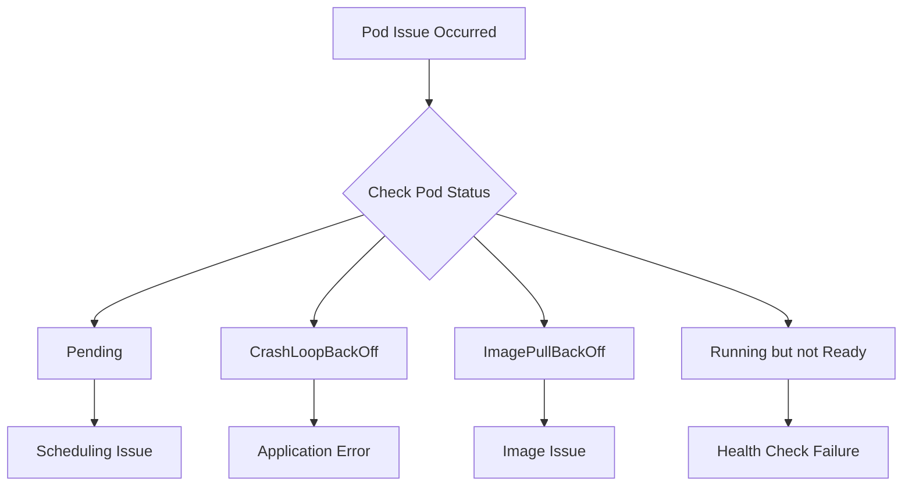

> **Objective**: Identify and resolve issues when Pods fail to start or terminate abnormally
> **Prerequisites**: Basic understanding of Pod and Deployment concepts
> **Estimated Time**: 30 minutes


- Check events with `kubectl describe pod`
- Check application logs with `kubectl logs`
- Identify causes by Pod status (Pending, CrashLoopBackOff, etc.)


## Diagnosis Order

When a Pod issue occurs, follow this diagnosis order:



## Basic Diagnostic Commands

### Check Pod Status

```bash
# List Pods and their status
kubectl get pods

# Detailed information (including events)
kubectl describe pod <pod-name>

# All namespaces
kubectl get pods --all-namespaces
```

### Check Logs

```bash
# Current logs
kubectl logs <pod-name>

# Previous container logs (if restarted)
kubectl logs <pod-name> --previous

# Stream logs in real-time
kubectl logs <pod-name> -f

# Specific container logs (multi-container Pod)
kubectl logs <pod-name> -c <container-name>

# Last N lines
kubectl logs <pod-name> --tail=100
```

### Check Events

```bash
# Recent events (sorted by time)
kubectl get events --sort-by='.lastTimestamp'

# Specific Pod events
kubectl get events --field-selector involvedObject.name=<pod-name>
```

## Troubleshooting by Status

### Pending Status

The Pod is stuck in Pending status.

**Diagnosis:**
```bash
kubectl describe pod <pod-name>
# Check Events section
```

**Common Causes and Solutions:**

| Cause | Event Message | Solution |
|-------|---------------|----------|
| Insufficient resources | `Insufficient cpu/memory` | Add nodes or reduce requests |
| Node selector mismatch | `MatchNodeSelector` | Check labels |
| Taint/Toleration | `Taints not tolerated` | Add toleration |
| Waiting for PVC binding | `persistentvolumeclaim not found` | Check PV/PVC |

**Check Resource Availability:**
```bash
# Check node resources
kubectl describe nodes | grep -A 5 "Allocated resources"

# Or
kubectl top nodes
```

### ImagePullBackOff / ErrImagePull

Cannot pull the container image.

**Diagnosis:**
```bash
kubectl describe pod <pod-name>
# Check image-related errors in Events
```

**Common Causes and Solutions:**

| Cause | Solution |
|-------|----------|
| Image name/tag typo | Verify image name and tag |
| Private registry authentication | Configure imagePullSecrets |
| Network issues | Check registry accessibility |
| Image doesn't exist | Verify image exists in registry |

**Verify Image Name:**
```bash
# Check image in Deployment
kubectl get deployment <name> -o jsonpath='{.spec.template.spec.containers[0].image}'

# Test image pull (locally)
docker pull <image-name>
```

**Create Private Registry Secret:**
```bash
kubectl create secret docker-registry my-registry-secret \
  --docker-server=registry.example.com \
  --docker-username=myuser \
  --docker-password=mypassword
```

### CrashLoopBackOff

The container terminates immediately after starting and keeps restarting.

**Diagnosis:**
```bash
# Check logs (most important)
kubectl logs <pod-name> --previous

# Check exit code
kubectl describe pod <pod-name>
# Check Last State: Terminated, Exit Code
```

**Common Causes and Solutions:**

| Exit Code | Meaning | Solution |
|-----------|---------|----------|
| 0 | Normal termination | Command exits immediately, check ENTRYPOINT |
| 1 | Application error | Check logs, check environment variables |
| 137 | OOM Killed | Increase memory limits |
| 143 | SIGTERM | Normal termination signal |

**Check Memory Issues:**
```bash
kubectl describe pod <pod-name> | grep -A 3 "Last State"
# Reason: OOMKilled
```

### Running but not Ready

The Pod is Running but not Ready.

**Diagnosis:**
```bash
kubectl describe pod <pod-name>
# Check Conditions section for Ready: False
# Check Events for Readiness probe failure messages
```

**Common Causes and Solutions:**

| Cause | Solution |
|-------|----------|
| Readiness Probe failure | Check endpoint, verify path/port |
| Application still initializing | Increase initialDelaySeconds |
| External dependency issues | Check DB/cache connections |

**Test Probe:**
```bash
# Test directly inside Pod
kubectl exec <pod-name> -- curl localhost:8080/health

# Or with wget
kubectl exec <pod-name> -- wget -qO- localhost:8080/health
```

## Advanced Diagnostics

### Access Container Shell

```bash
# Default shell
kubectl exec -it <pod-name> -- /bin/sh

# bash (if available)
kubectl exec -it <pod-name> -- /bin/bash

# Specific container
kubectl exec -it <pod-name> -c <container-name> -- /bin/sh
```

### Network Diagnostics

```bash
# Check DNS
kubectl exec <pod-name> -- nslookup kubernetes.default

# Check Service connectivity
kubectl exec <pod-name> -- curl -v http://<service-name>:<port>

# Check external connectivity
kubectl exec <pod-name> -- curl -v https://google.com
```

### Ephemeral Debug Container

```bash
# Run debug container (Kubernetes 1.25+)
kubectl debug <pod-name> -it --image=busybox

# Debug directly on Node
kubectl debug node/<node-name> -it --image=busybox
```

## Checklist

Checklist for resolving Pod issues:

### Startup Failures
- [ ] Check events with `kubectl describe pod`
- [ ] Verify image name and tag are correct
- [ ] Verify imagePullSecrets configuration (private registry)
- [ ] Verify resource requests are within node capacity

### Repeated Crashes
- [ ] Check logs with `kubectl logs --previous`
- [ ] Check Exit Code (137 = OOM)
- [ ] Verify environment variables are configured correctly
- [ ] Verify ConfigMap/Secret exists

### Not Ready
- [ ] Check Readiness Probe endpoint
- [ ] Verify port number
- [ ] Verify initialDelaySeconds is sufficient
- [ ] Verify external dependencies (DB, etc.) are accessible

---

## Next Steps

| Goal | Recommended Document |
|------|---------------------|
| Optimize resources | [Resource Optimization](resource-optimization/) |
| Configure health checks | [Health Checks](../concepts/health-checks/) |
| Practice deployment | [Spring Boot Deployment](../examples/spring-boot/) |
