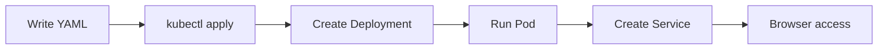
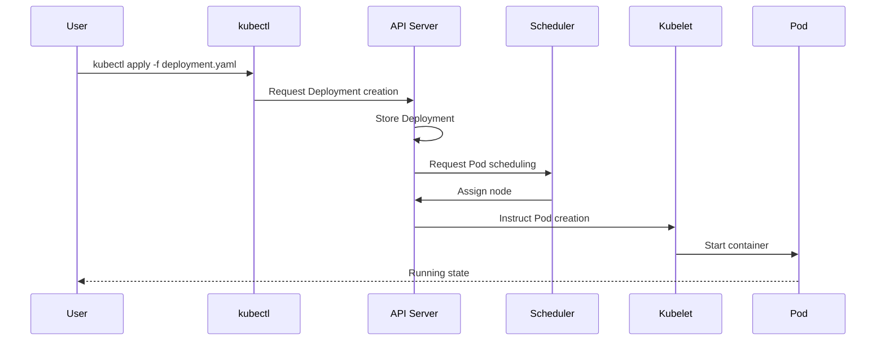

> **Target audience**: Backend developers new to Kubernetes
> **Prerequisites**: Basic Docker concepts, terminal usage
> **After reading this**: You will be able to deploy an application to a local Kubernetes cluster and access it end-to-end


- Run a local Kubernetes cluster with Minikube
- Deploy Deployment and Service with `kubectl apply`
- The entire process takes about 5 minutes


Deploy an application to Kubernetes in 5 minutes.

## Overall Flow

In Quick Start, you'll practice deploying an Nginx web server to Kubernetes and accessing it through a browser.



## Before You Start

Make sure the following tools are installed before starting.

| Item | Check command | Expected result |
|------|---------------|-----------------|
| Docker | `docker --version` | `Docker version 24.x.x` or later |
| Minikube | `minikube version` | `minikube version: v1.32.x` or later |
| kubectl | `kubectl version --client` | `Client Version: v1.29.x` or later |



```bash
# Install with Homebrew
brew install --cask docker
brew install minikube
brew install kubectl
```


```bash
# Install Docker
curl -fsSL https://get.docker.com -o get-docker.sh
sudo sh get-docker.sh

# Install Minikube
curl -LO https://storage.googleapis.com/minikube/releases/latest/minikube-linux-amd64
sudo install minikube-linux-amd64 /usr/local/bin/minikube

# Install kubectl
curl -LO "https://dl.k8s.io/release/$(curl -L -s https://dl.k8s.io/release/stable.txt)/bin/linux/amd64/kubectl"
sudo install kubectl /usr/local/bin/kubectl
```


```powershell
# Install with Chocolatey (Admin PowerShell)
choco install docker-desktop
choco install minikube
choco install kubernetes-cli

# Or manual installation
# - Docker Desktop: https://www.docker.com/products/docker-desktop
# - Minikube: https://minikube.sigs.k8s.io/docs/start/
# - kubectl: https://kubernetes.io/docs/tasks/tools/install-kubectl-windows/
```

**Additional Windows setup:**
- Enable WSL 2 backend after installing Docker Desktop
- Hyper-V must be enabled



---

## Step 1/4: Start Minikube Cluster (~1 min)

Start a Kubernetes cluster locally.



```bash
minikube start
```


```powershell
minikube start
```



### Verify startup

Check that the cluster started successfully:

```bash
kubectl cluster-info
```

**Expected output:**
```
Kubernetes control plane is running at https://127.0.0.1:xxxxx
CoreDNS is running at https://127.0.0.1:xxxxx/api/v1/namespaces/kube-system/services/kube-dns:dns/proxy
```


First run may take 2-3 minutes due to image downloads. Check status with `minikube status`.


---

## Step 2/4: Create Deployment (~1 min)

Deploy an Nginx web server. First, create a working directory and generate the Deployment YAML file.

```bash
mkdir -p ~/k8s-quickstart && cd ~/k8s-quickstart
```

Save the following content as `nginx-deployment.yaml`. Create it directly in terminal or use an editor:



```bash
cat > nginx-deployment.yaml << 'EOF'
apiVersion: apps/v1
kind: Deployment
metadata:
  name: nginx-deployment
spec:
  replicas: 2
  selector:
    matchLabels:
      app: nginx
  template:
    metadata:
      labels:
        app: nginx
    spec:
      containers:
      - name: nginx
        image: nginx:1.25
        ports:
        - containerPort: 80
EOF
```


Create a file named `nginx-deployment.yaml` and copy-paste the following:

```yaml
apiVersion: apps/v1
kind: Deployment
metadata:
  name: nginx-deployment
spec:
  replicas: 2
  selector:
    matchLabels:
      app: nginx
  template:
    metadata:
      labels:
        app: nginx
    spec:
      containers:
      - name: nginx
        image: nginx:1.25
        ports:
        - containerPort: 80
```



Apply the Deployment:

```bash
kubectl apply -f nginx-deployment.yaml
```

**Expected output:**
```
deployment.apps/nginx-deployment created
```

Check if Pods are running:

```bash
kubectl get pods
```

**Expected output:**
```
NAME                                READY   STATUS    RESTARTS   AGE
nginx-deployment-xxx-yyy            1/1     Running   0          30s
nginx-deployment-xxx-zzz            1/1     Running   0          30s
```


Image is downloading. Wait about 30 seconds and check again.


---

## Step 3/4: Create Service (~1 min)

Create a Service to access the Pods.

Create `nginx-service.yaml`:



```bash
cat > nginx-service.yaml << 'EOF'
apiVersion: v1
kind: Service
metadata:
  name: nginx-service
spec:
  type: NodePort
  selector:
    app: nginx
  ports:
  - port: 80
    targetPort: 80
    nodePort: 30080
EOF
```


```yaml
apiVersion: v1
kind: Service
metadata:
  name: nginx-service
spec:
  type: NodePort
  selector:
    app: nginx
  ports:
  - port: 80
    targetPort: 80
    nodePort: 30080
```



Apply the Service:

```bash
kubectl apply -f nginx-service.yaml
```

**Expected output:**
```
service/nginx-service created
```

Check Service status:

```bash
kubectl get services
```

**Expected output:**
```
NAME            TYPE        CLUSTER-IP       EXTERNAL-IP   PORT(S)        AGE
kubernetes      ClusterIP   10.96.0.1        <none>        443/TCP        5m
nginx-service   NodePort    10.104.xxx.xxx   <none>        80:30080/TCP   10s
```

---

## Step 4/4: Access the Application (~1 min)

Access the Service in Minikube:

```bash
minikube service nginx-service
```

This command automatically opens a browser displaying the Nginx web page.

If the browser doesn't open, check the URL manually:

```bash
minikube service nginx-service --url
```

**Expected output:**
```
http://192.168.49.2:30080
```

Access that URL to see the "Welcome to nginx!" page.

---

## Congratulations!

You've successfully deployed an application to Kubernetes.


- [ ] Minikube cluster is running (check with `minikube status`)
- [ ] 2 Pods are in Running state (check with `kubectl get pods`)
- [ ] Service is created (check with `kubectl get services`)
- [ ] Nginx page displays in browser


### Key Concepts You Just Learned

| Concept | What you learned | What's next |
|---------|------------------|-------------|
| **Deployment** | Automatically maintains 2 Pods | Rolling updates, rollbacks |
| **Service** | Provides fixed access point to Pods | ClusterIP vs LoadBalancer |
| **kubectl** | apply, get commands | describe, logs, exec |
| **YAML** | Declarative resource definition | More fields (resources, probes) |

---

## Cleanup

Stop running resources and cluster:

```bash
# Delete deployed resources
kubectl delete -f nginx-deployment.yaml
kubectl delete -f nginx-service.yaml

# Stop Minikube cluster
minikube stop

# (Optional) Completely delete cluster
minikube delete
```

---

## What Happened?

Let's examine the process step by step.



| Order | Component | Action |
|-------|-----------|--------|
| 1 | kubectl | Reads YAML file and sends request to API Server |
| 2 | API Server | Stores Deployment resource in etcd |
| 3 | Controller Manager | Sees Deployment and creates ReplicaSet and Pods |
| 4 | Scheduler | Decides which node to run the Pod on |
| 5 | Kubelet | Runs the container on that node |
| 6 | Service | Provides network endpoints for Pods |


The reason for creating Pods through Deployment rather than directly is for automatic recovery when a Pod dies. Deployment's Controller continuously maintains the desired Pod count (`replicas: 2`).


---

## Examining the YAML

Detailed analysis of the Quick Start example YAML.

### Deployment YAML

```yaml
apiVersion: apps/v1          # API version
kind: Deployment             # Resource type
metadata:
  name: nginx-deployment     # Deployment name
spec:
  replicas: 2                # Number of Pods to maintain
  selector:
    matchLabels:
      app: nginx             # Criteria for selecting Pods to manage
  template:                  # Pod template
    metadata:
      labels:
        app: nginx           # Pod label (must match selector)
    spec:
      containers:
      - name: nginx          # Container name
        image: nginx:1.25    # Image to use
        ports:
        - containerPort: 80  # Container port
```

| Field | Description |
|-------|-------------|
| `replicas` | Number of Pod replicas to run. This count is always maintained |
| `selector.matchLabels` | Criteria for selecting Pods this Deployment manages |
| `template` | Specification of the Pod to create |
| `containers` | List of containers to run in the Pod |

### Service YAML

```yaml
apiVersion: v1
kind: Service
metadata:
  name: nginx-service
spec:
  type: NodePort             # Service type
  selector:
    app: nginx               # Select Pods to route traffic to
  ports:
  - port: 80                 # Service port
    targetPort: 80           # Pod port
    nodePort: 30080          # Port exposed on node
```

| Field | Description |
|-------|-------------|
| `type: NodePort` | Allows external access through specific port on node |
| `selector` | Criteria for selecting Pods to route traffic to |
| `port` | Port the Service exposes |
| `targetPort` | Port the Pod actually listens on |
| `nodePort` | Port exposed externally on node (30000-32767) |

---

## Troubleshooting

### Minikube Start Fails

If you get `Exiting due to PROVIDER_DOCKER_NOT_RUNNING` error:

1. Check if Docker is running:
   ```bash
   docker ps
   ```

2. If Docker is not running, start Docker Desktop

3. If the problem persists, try changing the Minikube driver:
   ```bash
   minikube start --driver=virtualbox
   ```

### Pod Stuck in Pending State

If Pod is stuck in `Pending` state:

1. Check events:
   ```bash
   kubectl describe pod <pod-name>
   ```

2. Common causes:
   - Downloading image: Wait a moment
   - Insufficient resources: `minikube stop && minikube start --memory=4096`

### ImagePullBackOff Error

When image cannot be pulled:

1. Verify image name and tag are correct
2. Check internet connection
3. For private registries, verify authentication settings

### Cannot Access Service

If `minikube service` command doesn't work:

1. Check Service status:
   ```bash
   kubectl get svc nginx-service
   ```

2. Verify Pod labels match Service selector:
   ```bash
   kubectl get pods --show-labels
   ```

3. Try using Minikube tunnel:
   ```bash
   minikube tunnel
   ```

---

## Next Steps

After completing Quick Start, proceed to the next steps:

| Goal | Recommended document |
|------|---------------------|
| Understand Kubernetes structure | [Architecture](../concepts/architecture/) |
| Deep dive into Pod concepts | [Pod](../concepts/pod/) |
| Practice more complex examples | [Basic Examples](../examples/basic/) |
| Deploy a real application | [Spring Boot Deployment](../examples/spring-boot/) |
