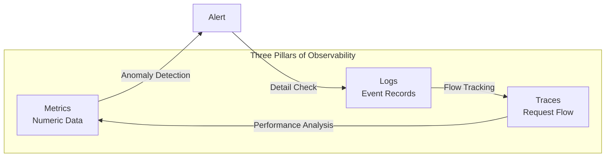
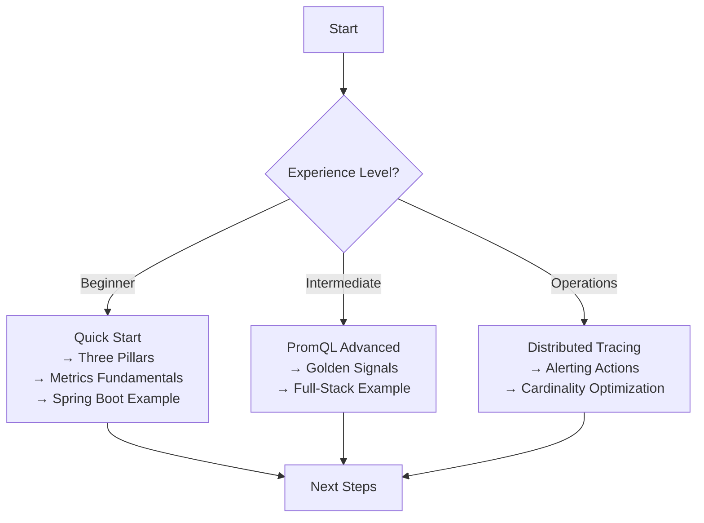

## What is Observability?

Observability is **the ability to understand internal system states from external outputs**. It's not just about installing monitoring tools, but building a system that can answer the question "Why did this problem occur?"

### Why is Observability Necessary?

As microservices and distributed systems become prevalent, the limitations of traditional monitoring have become clear.

| Limitations of Traditional Monitoring | After Adopting Observability |
|---------------------|----------------------|
| Only know "server CPU is high" | Can trace which requests are causing high CPU |
| Can only check pre-defined metrics | Can analyze unexpected problems with data |
| Difficult to understand service connections | Visualize entire flow with distributed tracing |
| Hours to trace root cause after failure | Immediately identify root cause with trace ID |
| Logs, metrics, traces are separated | Integrated analysis by connecting all three pillars |

### The Three Pillars of Observability



| Pillar | Role | Representative Tools | Examples |
|------|------|----------|------|
| **Metrics** | Numeric-based state measurement | Prometheus, Micrometer | CPU 80%, Response time 200ms |
| **Logs** | Detailed event records | Loki, Elasticsearch | "Order creation failed: Out of stock" |
| **Traces** | Track entire request path | Jaeger, Tempo | Order → Payment → Shipping service flow |

### When Should You Adopt Observability?

**Suitable cases:**
- Operating microservices architecture
- When identifying failure causes takes too long
- When SLA/SLO-based operations are needed
- When you want to systematically analyze performance bottlenecks

**May be overkill:**
- Single monolithic applications
- Internal tools with very low traffic
- Small teams with insufficient operational staff

## What This Guide Covers

### [Quick Start]()
Build a Prometheus + Grafana environment in 10 minutes and verify your first metrics.

### [Concepts]()
Explains not just "how to use" but **"why it was designed this way"**.

| Topic | What You'll Learn |
|------|----------|
| [Three Pillars of Observability]() | Roles of Metrics, Logs, Traces and their interconnections |
| [Metrics Fundamentals]() | Understanding Counter, Gauge, Histogram, Summary types |
| [Prometheus Architecture]() | Pull model, time series DB, service discovery |
| [PromQL]() | Query language from basics to advanced (7 documents) |
| [SRE Golden Signals]() | Deep dive into Latency, Traffic, Errors, Saturation (6 documents) |
| [Log Aggregation]() | Loki vs ELK comparison, log design patterns |
| [Distributed Tracing]() | Span, Trace ID, Context Propagation |
| [OpenTelemetry]() | Observability standards and integration methods |
| [Dashboard Design]() | Effective visualization principles |

### [Examples]()
Hands-on experience with executable code.

- [Environment Setup]() - Full stack configuration with Docker Compose
- [Spring Boot Metrics]() - Actuator + Micrometer setup
- [Kafka Monitoring]() - Building Kafka cluster observability
- [Full-Stack Observability]() - Metrics + Logs + Traces integration

### [How-To Guides]()
Common problem scenarios and solutions in practice.

- [Debugging High Latency]() - Tracking P99 latency causes
- [Metrics Cardinality Optimization]() - Cost reduction strategies
- [Managing Alert Fatigue]() - Reduce noise alerts

### [Appendix]()
- [Glossary]() - Quick reference for Observability terms
- [FAQ]() - Frequently asked questions
- [Alerting Actions Guide]() - Response strategies after PromQL detection
- [References]() - Official documentation and additional learning resources

## Prerequisites

- **Required**: Basic Docker usage, HTTP/REST API understanding
- **Helpful**: Spring Boot experience, Kubernetes basics, time series data concepts

## Tech Stack

Tools used in this guide.

| Component | Tool | Version |
|---------|------|------|
| Metrics Collection | Prometheus | 2.50+ |
| Metrics Exposure | Micrometer | 1.12+ |
| Visualization | Grafana | 10.x |
| Log Collection | Loki | 2.9+ |
| Distributed Tracing | Tempo | 2.x |
| Standardization | OpenTelemetry | 1.x |

## Suggested Learning Path



**If you're new:**
```
Quick Start → Three Pillars → Metrics Fundamentals → Prometheus Architecture → Spring Boot Example
```

**If you want to learn PromQL deeply:**
```
PromQL Basics → Aggregation Operators → rate vs increase → histogram_quantile → Recording Rules → Alerting Rules
```

**From an SRE/Operations perspective:**
```
Golden Signals Overview → Latency/Errors/Saturation → Application by Service Type → Alerting Actions Guide
```

Each document can be read independently, but if you're new, we recommend following the order above.
