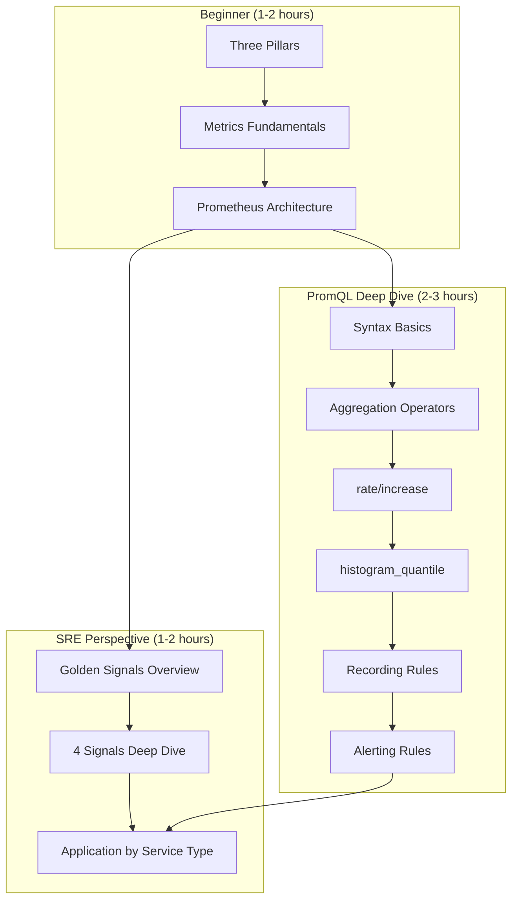

Not just "how to use it" but explaining **"why it was designed this way"**.

## Learning Path

### Foundational Concepts

If you're new to Observability, follow this order.

1. [Three Pillars of Observability]() - Roles of Metrics, Logs, Traces and their interconnections
2. [Metrics Fundamentals]() - Understanding Counter, Gauge, Histogram, Summary types
3. [Prometheus Architecture]() - Pull model, time series DB, service discovery

### PromQL Deep Dive

A deep exploration of the Prometheus query language.

4. [PromQL Overview]() - PromQL learning roadmap
5. [Syntax Basics]() - Selectors, label matching, time ranges
6. [Aggregation Operators]() - sum, avg, count, topk, by/without
7. [rate and increase]() - Core of Counter metric processing
8. [histogram_quantile]() - Calculating percentiles (P50/P95/P99)
9. [Recording Rules]() - Pre-computing complex queries
10. [Alerting Rules]() - Writing alerting rules

### SRE Golden Signals

Applying the 4 core indicators proposed by Google SRE by service type.

11. [Golden Signals Overview]() - Introduction to 4 signals and USE/RED methods
12. [Latency]() - Latency measurement strategies
13. [Traffic]() - Traffic/throughput monitoring
14. [Errors]() - Error rate definition and classification
15. [Saturation]() - Saturation (resource utilization)
16. [Application by Service Type]() - Guide for Web API, Kafka, DB

### Logging and Tracing

Integrating logs and distributed tracing beyond metrics.

17. [Log Aggregation]() - Loki vs ELK comparison, log design patterns
18. [Distributed Tracing]() - Span, Trace ID, Context Propagation
19. [OpenTelemetry]() - Observability standards and integration methods

### Operations

Practical knowledge for effective operations.

20. [Dashboard Design]() - Effective visualization principles

## Document Structure Pattern

Each concept document follows this structure:

```
1. TL;DR - Key summary (within 5 lines)
2. Why is it needed? - Problem situation and solution
3. Core Concepts - Detailed explanation + diagrams
4. Practical Examples - Code ready to apply
5. Trade-offs - Pros/cons and selection criteria
6. Next Steps - Related document links
```

## Recommended Learning Path


