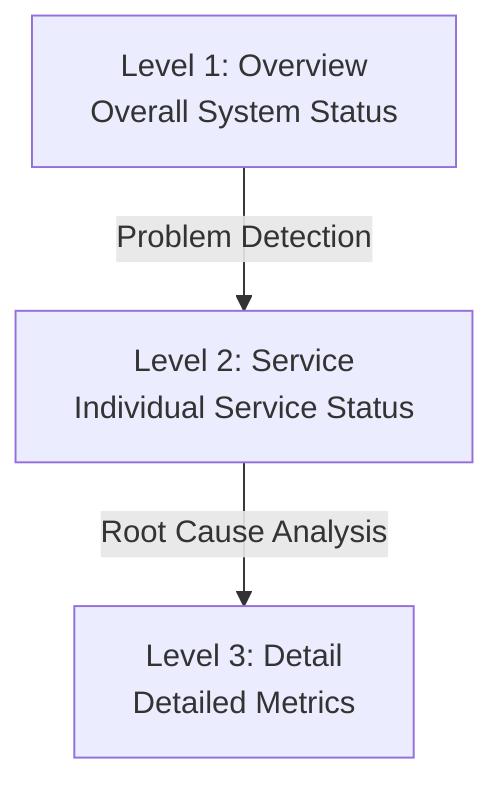

> **Target Audience**: Developers and SREs designing Grafana dashboards
> **Prerequisites**: [SRE Golden Signals]()
> **After Reading**: You'll be able to design effective dashboards and quickly identify problems

## TL;DR


**Key Summary:**
- **Hierarchical Structure**: Overview → Service → Detail order
- **5-Second Rule**: Must be able to identify problem presence in 5 seconds
- **Golden Signals First**: Latency, Traffic, Errors, Saturation
- **Remove Unnecessary Info**: Exclude metrics that don't lead to action


## Dashboard Design Principles

### 1. 5-Second Rule

Within **5 seconds** of viewing the dashboard, you should know:
- Is there a problem?
- Where is the problem?
- How severe is it?

### 2. Hierarchical Structure



### 3. Color Rules

| Color | Meaning | Usage |
|------|------|------|
| 🟢 Green | Normal | Below threshold |
| 🟡 Yellow | Warning | Warning threshold |
| 🔴 Red | Critical | Critical threshold |
| ⚪ Gray | No data | N/A |

---

## Level 1: Overview Dashboard

### Purpose

Grasp overall system status at a glance

### Layout

```
┌─────────────────────────────────────────────────────────────┐
│ Row 1: Key Metrics (Stat Panels)                             │
│ ┌────────┐ ┌────────┐ ┌────────┐ ┌────────┐ ┌────────┐      │
│ │ P99    │ │ RPS    │ │ Error  │ │ CPU    │ │ Memory │      │
│ │ 120ms  │ │ 5,234  │ │ 0.1%   │ │ 45%    │ │ 62%    │      │
│ └────────┘ └────────┘ └────────┘ └────────┘ └────────┘      │
├─────────────────────────────────────────────────────────────┤
│ Row 2: Per-Service Status (Table/Heatmap)                    │
│ ┌───────────────────────────────────────────────────────┐   │
│ │ Service    │ RPS   │ P99    │ Errors │ Status        │   │
│ │ order      │ 1,234 │ 100ms  │ 0.05%  │ 🟢            │   │
│ │ payment    │ 890   │ 250ms  │ 0.5%   │ 🟡            │   │
│ │ inventory  │ 2,100 │ 50ms   │ 0.01%  │ 🟢            │   │
│ └───────────────────────────────────────────────────────┘   │
├─────────────────────────────────────────────────────────────┤
│ Row 3: Trends (Time Series)                                  │
│ ┌───────────────────────────────────────────────────────┐   │
│ │ 📈 RPS / Error Rate Trends (24 hours)                 │   │
│ └───────────────────────────────────────────────────────┘   │
└─────────────────────────────────────────────────────────────┘
```

### Grafana Query Examples

```promql
# Stat: P99 Response Time
histogram_quantile(0.99, sum by (le) (rate(http_request_duration_seconds_bucket[5m])))

# Stat: Total RPS
sum(rate(http_requests_total[5m]))

# Stat: Error Rate
sum(rate(http_requests_total{status=~"5.."}[5m]))
/ sum(rate(http_requests_total[5m])) * 100

# Table: Per-Service Status
# Combine multiple queries with Transformation
```

---

## Level 2: Service Dashboard

### Purpose

Check detailed status of individual services

### Layout (RED Pattern)

```
┌─────────────────────────────────────────────────────────────┐
│ Variable: $service = order-service                           │
├─────────────────────────────────────────────────────────────┤
│ Row 1: Rate (Traffic)                                        │
│ ┌──────────────────────┐ ┌──────────────────────┐           │
│ │ RPS Trend            │ │ RPS by Endpoint      │           │
│ └──────────────────────┘ └──────────────────────┘           │
├─────────────────────────────────────────────────────────────┤
│ Row 2: Errors                                                │
│ ┌──────────────────────┐ ┌──────────────────────┐           │
│ │ Error Rate Trend     │ │ Status Code Dist.    │           │
│ └──────────────────────┘ └──────────────────────┘           │
├─────────────────────────────────────────────────────────────┤
│ Row 3: Duration (Latency)                                    │
│ ┌──────────────────────┐ ┌──────────────────────┐           │
│ │ P50/P95/P99 Trend    │ │ Response Time Heatmap│           │
│ └──────────────────────┘ └──────────────────────┘           │
├─────────────────────────────────────────────────────────────┤
│ Row 4: Resources                                             │
│ ┌──────────────────────┐ ┌──────────────────────┐           │
│ │ CPU Usage            │ │ Memory Usage         │           │
│ └──────────────────────┘ └──────────────────────┘           │
└─────────────────────────────────────────────────────────────┘
```

### Variable Configuration

```yaml
# Grafana Variables
- name: service
  type: query
  query: label_values(http_requests_total, service)
  refresh: on_time_range_change

- name: instance
  type: query
  query: label_values(http_requests_total{service="$service"}, instance)
```

---

## Level 3: Detail Dashboard

### Purpose

Deep analysis for root cause identification

### Layout Example (Database)

```
┌─────────────────────────────────────────────────────────────┐
│ Row 1: Connection Pool                                       │
│ ┌──────────────────────┐ ┌──────────────────────┐           │
│ │ Active Connections   │ │ Pending Connections  │           │
│ └──────────────────────┘ └──────────────────────┘           │
├─────────────────────────────────────────────────────────────┤
│ Row 2: Query Performance                                     │
│ ┌──────────────────────┐ ┌──────────────────────┐           │
│ │ Slow Query Count     │ │ Query Execution Time │           │
│ └──────────────────────┘ └──────────────────────┘           │
├─────────────────────────────────────────────────────────────┤
│ Row 3: Resource Usage                                        │
│ ┌──────────────────────┐ ┌──────────────────────┐           │
│ │ Buffer Hit Rate      │ │ Disk I/O             │           │
│ └──────────────────────┘ └──────────────────────┘           │
└─────────────────────────────────────────────────────────────┘
```

---

## Panel Type Selection

| Panel Type | Suitable Data | Examples |
|----------|-------------|------|
| **Stat** | Single value, current state | RPS, Error rate |
| **Gauge** | Percentage, threshold | CPU usage |
| **Time Series** | Trends over time | Request count trends |
| **Bar Chart** | Comparison, ranking | Traffic by endpoint |
| **Heatmap** | Distribution, density | Response time distribution |
| **Table** | Detailed lists | Service list |
| **Pie Chart** | Proportions | Status code distribution |

---

## Threshold Configuration

### Stat Panel

```json
{
  "thresholds": {
    "mode": "absolute",
    "steps": [
      { "color": "green", "value": null },
      { "color": "yellow", "value": 80 },
      { "color": "red", "value": 90 }
    ]
  }
}
```

### Time Series Threshold Display

```json
{
  "fieldConfig": {
    "defaults": {
      "custom": {
        "thresholdsStyle": {
          "mode": "line"
        }
      },
      "thresholds": {
        "steps": [
          { "color": "green", "value": null },
          { "color": "red", "value": 500 }
        ]
      }
    }
  }
}
```

---

## Best Practices

### DO (Recommended)

```
✅ Dashboards with clear purpose
✅ Hierarchical drill-down structure
✅ Consistent color rules
✅ Filtering with variables
✅ Add descriptions to panels
✅ Visualization connected to alerts
```

### DON'T (Not Recommended)

```
❌ Everything in one dashboard
❌ Listing metrics without action
❌ Meaningless colors
❌ Hardcoded values
❌ Complex queries without explanation
```

---

## Dashboard Sharing Configuration

### JSON Export

```bash
# Export dashboard
curl -H "Authorization: Bearer $TOKEN" \
  "http://grafana:3000/api/dashboards/uid/abc123" \
  | jq '.dashboard' > dashboard.json

# Import dashboard
curl -X POST -H "Authorization: Bearer $TOKEN" \
  -H "Content-Type: application/json" \
  -d @dashboard.json \
  "http://grafana:3000/api/dashboards/db"
```

### Provisioning

```yaml
# grafana/provisioning/dashboards/default.yaml
apiVersion: 1
providers:
  - name: 'default'
    orgId: 1
    folder: 'Observability'
    type: file
    options:
      path: /var/lib/grafana/dashboards
```

---

## Key Summary

| Principle | Description |
|------|------|
| **5-Second Rule** | Quick problem identification |
| **Hierarchy** | Overview → Service → Detail |
| **Golden Signals** | Latency, Traffic, Errors, Saturation |
| **Color Consistency** | Green/Yellow/Red |
| **Action Connection** | Alerts, runbook links |

---

## Next Steps

| Recommended Order | Document | What You'll Learn |
|----------|------|----------|
| 1 | [Environment Setup]() | Grafana hands-on |
| 2 | [Spring Boot Example]() | Dashboard application |
