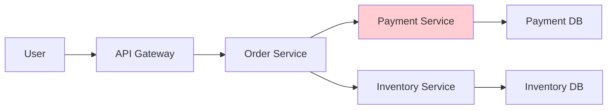
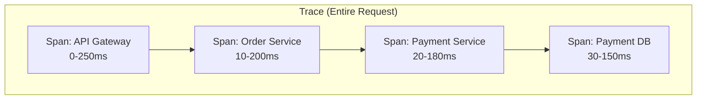
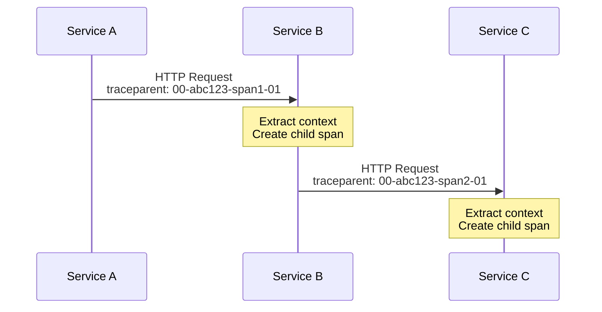
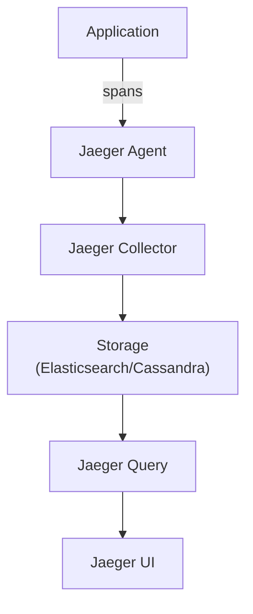
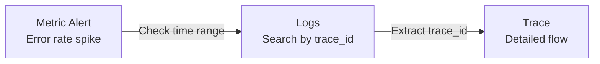
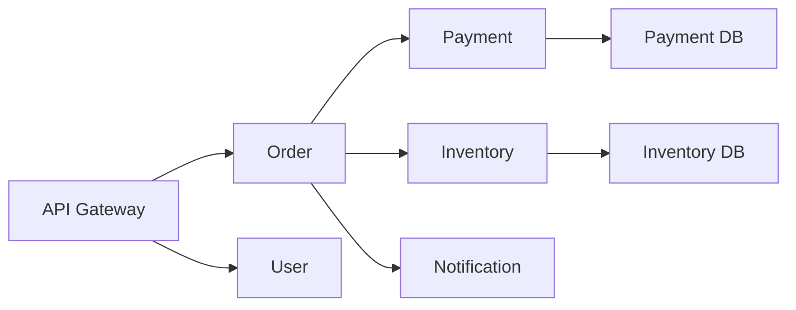

> **Target Audience**: Developers and SREs operating microservices
> **Prerequisites**: [Three Pillars of Observability]()
> **After Reading**: You'll understand distributed tracing and be able to analyze request flows between services

## TL;DR


**Key Summary:**
- **Trace**: Entire path of one request (composed of multiple Spans)
- **Span**: Single unit of work (start/end time, metadata)
- **Context Propagation**: Passing Trace ID between services
- **Sampling**: Store only a portion of total traces (cost optimization)


## Why Is Distributed Tracing Necessary?

In microservices, a single request passes through multiple services. It's hard to identify where delays occur.



**Problem**: Response is slow but don't know where

**Solution**: Distributed tracing to check time spent in each segment

---

## Core Concepts

### Trace and Span



| Term | Description |
|------|------|
| **Trace** | Entire request path (unique Trace ID) |
| **Span** | Individual unit of work (unique Span ID) |
| **Parent Span** | Upper Span that called current Span |
| **Root Span** | First Span (no Parent) |

### Span Structure

```json
{
  "traceId": "abc123def456",
  "spanId": "span001",
  "parentSpanId": null,
  "operationName": "HTTP GET /orders",
  "serviceName": "order-service",
  "startTime": 1704700800000,
  "duration": 245,
  "tags": {
    "http.method": "GET",
    "http.status_code": 200,
    "http.url": "/orders/123"
  },
  "logs": [
    {
      "timestamp": 1704700800100,
      "message": "Fetching order from database"
    }
  ]
}
```

### Context Propagation

The method of passing Trace ID between services.



**W3C Trace Context format:**
```
traceparent: 00-{trace-id}-{span-id}-{flags}
traceparent: 00-abc123def456789-fedcba987654321-01
```

---

## Tool Comparison

| Tool | Features | Suitable For |
|------|------|------------|
| **Jaeger** | CNCF project, excellent UI | Kubernetes environments |
| **Zipkin** | Lightweight, easy setup | Quick start |
| **Tempo** | Grafana integration, low cost | When using Grafana |
| **AWS X-Ray** | AWS integration | AWS environments |

### Architecture (Jaeger)



---

## Spring Boot Configuration

### Add Dependencies

```kotlin
// build.gradle.kts
dependencies {
    implementation("io.micrometer:micrometer-tracing-bridge-otel")
    implementation("io.opentelemetry:opentelemetry-exporter-otlp")
}
```

### application.yml

```yaml
management:
  tracing:
    sampling:
      probability: 1.0  # Development: 100%, Production: 0.1 (10%)
  otlp:
    tracing:
      endpoint: http://jaeger:4318/v1/traces

logging:
  pattern:
    level: "%5p [${spring.application.name:},%X{traceId:-},%X{spanId:-}]"
```

### Manual Span Creation

```java
@Service
@RequiredArgsConstructor
public class OrderService {
    private final Tracer tracer;

    public Order processOrder(OrderRequest request) {
        Span span = tracer.nextSpan().name("processOrder").start();
        try (Tracer.SpanInScope ws = tracer.withSpan(span)) {
            span.tag("order.type", request.getType());
            span.event("Processing started");

            Order order = createOrder(request);

            span.event("Order created");
            return order;
        } finally {
            span.end();
        }
    }
}
```

---

## Sampling Strategy

Storing all traces causes costs to spike. Sampling optimizes costs.

### Sampling Methods

| Method | Description | Suitable For |
|------|------|------------|
| **Probabilistic** | Collect fixed percentage | General use |
| **Rate Limiting** | Collect N per second | Traffic spikes |
| **Tail-based** | Prioritize errors/slow requests | Problem analysis focus |

### Recommended Sampling Rates

| Environment | Sampling Rate | Reason |
|------|---------|------|
| Development | 100% | Track all requests |
| Staging | 50% | Sufficient data |
| Production | 1-10% | Cost optimization |

### 100% Collection on Errors

```yaml
# OpenTelemetry Collector configuration
processors:
  tail_sampling:
    policies:
      - name: errors
        type: status_code
        status_code:
          status_codes: [ERROR]
      - name: slow
        type: latency
        latency:
          threshold_ms: 1000
      - name: probabilistic
        type: probabilistic
        probabilistic:
          sampling_percentage: 10
```

---

## Connecting Logs/Metrics

### Connection via Trace ID



### Include Trace ID in Logs

```java
// Spring Boot auto-includes
// Log pattern: %X{traceId:-}

// Log output example
2026-01-12 10:30:00 INFO [order-service,abc123def456,span001] Order created: 12345
```

### Connection in Grafana

```
1. Identify error rate spike in dashboard
2. Go to Explore → Loki
3. Search {service="order-service"} |= "ERROR"
4. Click trace_id in log
5. View full trace in Tempo/Jaeger
```

---

## Analysis Patterns

### Finding Bottleneck Segments

```
Trace analysis:
├─ API Gateway (10ms) ✓
├─ Order Service (50ms) ✓
│   ├─ Validation (5ms) ✓
│   └─ Payment Call (2000ms) ← bottleneck!
│       └─ Payment DB (1800ms) ← root cause
└─ Response (5ms) ✓
```

### Error Tracking

```
Trace analysis:
├─ API Gateway (10ms) ✓
├─ Order Service (50ms) ✗ Error
│   ├─ Inventory Check (200ms)
│   └─ Error: "Insufficient stock"
```

### Service Dependency Map

Visualize connections between services in Jaeger/Tempo:



---

## Alerting Rules

### Trace-based Alerts

```yaml
# Prometheus alerting rule (Tempo integration)
groups:
  - name: tracing
    rules:
      - alert: HighTraceErrorRate
        expr: |
          sum(rate(traces_spanmetrics_calls_total{status_code="STATUS_CODE_ERROR"}[5m]))
          / sum(rate(traces_spanmetrics_calls_total[5m]))
          > 0.05
        for: 5m
        labels:
          severity: warning
        annotations:
          summary: "High trace error rate"

      - alert: SlowSpans
        expr: |
          histogram_quantile(0.99, sum(rate(traces_spanmetrics_latency_bucket[5m])) by (le, service))
          > 2
        for: 5m
        labels:
          severity: warning
        annotations:
          summary: "P99 span latency > 2s"
```

---

## Key Summary

| Concept | Description |
|------|------|
| **Trace** | Entire request path |
| **Span** | Individual unit of work |
| **Context** | Tracking info passed between services |
| **Sampling** | Selective collection for cost optimization |

**Implementation Checklist:**
- [ ] Add OpenTelemetry SDK
- [ ] Configure sampling rate
- [ ] Include trace_id in logs
- [ ] Deploy Jaeger/Tempo
- [ ] Grafana integration

---

## Next Steps

| Recommended Order | Document | What You'll Learn |
|----------|------|----------|
| 1 | [OpenTelemetry](opentelemetry/) | Standardized instrumentation |
| 2 | [Full-Stack Example](../examples/full-stack/) | Integration hands-on |
