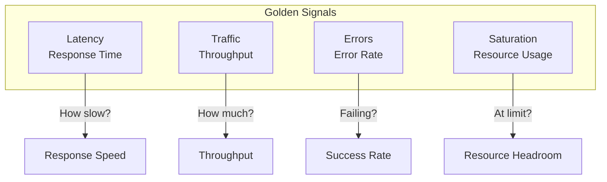
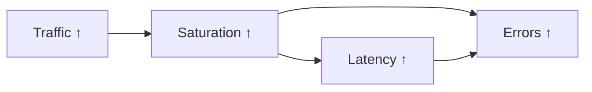
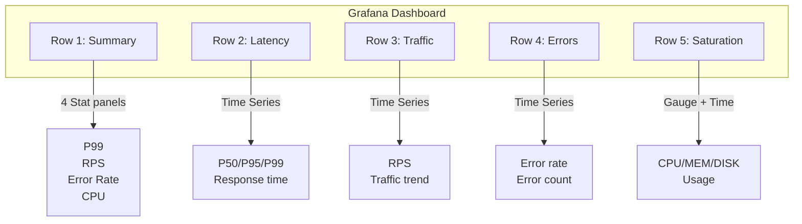

## What are Golden Signals?

The **Four Golden Signals** introduced in the Google SRE book are core metrics for understanding service health.

Among hundreds of metrics, the Golden Signals are the **"truly important ones"**. Like a car dashboard showing only speed, fuel, engine temperature, and warning lights, they provide the minimum set of metrics to grasp system health at a glance.

**Analogy: Key Health Check Metrics**

During a health checkup, dozens of items are measured, but doctors first look at a few key metrics:
- **Blood pressure** (corresponds to Latency): Problems when too high
- **Heart rate** (corresponds to Traffic): How active it is
- **Blood sugar** (corresponds to Errors): Abnormal values
- **Weight** (corresponds to Saturation): Approaching limits

If these four are normal, you're generally healthy. The same applies to systems.

## The Four Golden Signals



*This diagram shows the four golden signals (Latency, Traffic, Errors, Saturation) and the key question each one answers.*
| Signal | Measures | Key Question |
|--------|----------|--------------|
| **Latency** | Response time | "How fast is it?" |
| **Traffic** | Throughput | "How much is it processing?" |
| **Errors** | Failure rate | "How much is failing?" |
| **Saturation** | Resource usage | "How much headroom is left?" |

## Why These Four?

Through years of operational experience, Google's SRE team concluded that **"monitoring just these four can detect most problems"**.

### Completeness

The four signals cover **all aspects** of system state:

1. **Latency**: Detect response **speed** issues
2. **Traffic**: Understand **load** level
3. **Errors**: Detect **correctness** issues
4. **Saturation**: Predict **capacity** limits

Other metrics (e.g., heap memory, GC time) are mostly **root causes** or **detailed indicators** of these four. For example, long GC times increase Latency, and full disk causes Errors.

### Direct User Impact

| Signal | User Impact |
|--------|-------------|
| Latency ↑ | Slow page loading, increased bounce rate |
| Traffic ↑ | Increased system load |
| Errors ↑ | Features don't work, trust declines |
| Saturation ↑ | Predicts imminent failure |

### Interconnected



*This diagram shows the causal chain: increased traffic raises saturation, which leads to higher latency and error rates.*
Increased traffic leads to higher saturation, which leads to increased latency and error rates.

---

## USE Method and RED Method

Besides Golden Signals, these are frequently used methodologies.

### USE (Resource-Focused)

**Utilization, Saturation, Errors** - Suitable for infrastructure/resource monitoring

| Metric | Target | Example |
|--------|--------|---------|
| **U**tilization | Usage rate | 70% CPU usage |
| **S**aturation | Queue | 10 requests waiting |
| **E**rrors | Errors | Disk I/O errors |

### RED (Service-Focused)

**Rate, Errors, Duration** - Suitable for microservice monitoring

| Metric | Target | Example |
|--------|--------|---------|
| **R**ate | Request count | 100 RPS |
| **E**rrors | Error rate | 1% failure |
| **D**uration | Response time | P99 200ms |

### Comparison

| Methodology | Focus | Suitable For |
|-------------|-------|--------------|
| Golden Signals | Service + Resource | General purpose |
| USE | Resource | Server, network, storage |
| RED | Service | API, microservices |

---

## Learning Path

### By Signal

1. [Latency](latency/) - Latency measurement strategy (P50, P95, P99)
2. [Traffic](traffic/) - Traffic/throughput monitoring
3. [Errors](errors/) - Error rate definition and classification
4. [Saturation](saturation/) - Saturation (resource usage)

### By Service Type

5. [By Service Type](by-service-type/) - Guides for Web API, Kafka, DB

---

## Quick Reference: PromQL Queries

### Latency

```promql
# P99 response time
histogram_quantile(0.99,
  sum by (service, le) (rate(http_request_duration_seconds_bucket[5m]))
)

# Average response time
rate(http_request_duration_seconds_sum[5m])
/ rate(http_request_duration_seconds_count[5m])
```

### Traffic

```promql
# Requests per second (RPS)
sum by (service) (rate(http_requests_total[5m]))

# Bytes per second
sum by (service) (rate(http_request_size_bytes_sum[5m]))
```

### Errors

```promql
# Error rate (%)
sum by (service) (rate(http_requests_total{status=~"5.."}[5m]))
/ sum by (service) (rate(http_requests_total[5m]))
* 100

# Error count
sum by (service) (rate(http_requests_total{status=~"5.."}[5m]))
```

### Saturation

```promql
# CPU usage
100 - avg by (instance) (rate(node_cpu_seconds_total{mode="idle"}[5m])) * 100

# Memory usage
(1 - node_memory_MemAvailable_bytes / node_memory_MemTotal_bytes) * 100

# Disk usage
(1 - node_filesystem_avail_bytes / node_filesystem_size_bytes) * 100
```

---

## Recording Rules Template

```yaml
groups:
  - name: golden_signals
    rules:
      # Latency
      - record: service:http_request_duration_seconds:p99
        expr: |
          histogram_quantile(0.99,
            sum by (service, le) (rate(http_request_duration_seconds_bucket[5m]))
          )

      # Traffic
      - record: service:http_requests:rate5m
        expr: sum by (service) (rate(http_requests_total[5m]))

      # Errors
      - record: service:http_requests_errors:ratio_rate5m
        expr: |
          sum by (service) (rate(http_requests_total{status=~"5.."}[5m]))
          / sum by (service) (rate(http_requests_total[5m]))

      # Saturation
      - record: instance:node_cpu_utilization:ratio
        expr: 1 - avg by (instance) (rate(node_cpu_seconds_total{mode="idle"}[5m]))
```

---

## Dashboard Layout



*This diagram shows a Grafana dashboard layout organizing golden signals into Summary, Latency, Traffic, Errors, and Saturation rows.*
---

## Next Steps

| Document | Content |
|----------|---------|
| [Latency](latency/) | P50/P95/P99 measurement, SLA setup |
| [Traffic](traffic/) | RPS, throughput monitoring |
| [Errors](errors/) | Error classification, error budget |
| [Saturation](saturation/) | Resource bottleneck detection |
| [By Service Type](by-service-type/) | Custom metrics for API, Kafka, DB |
