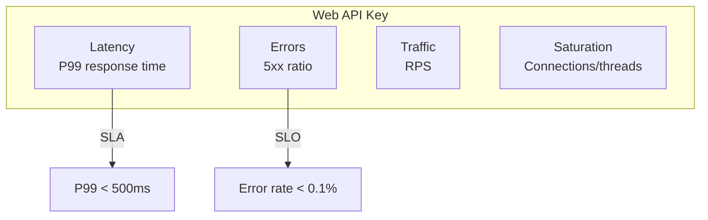
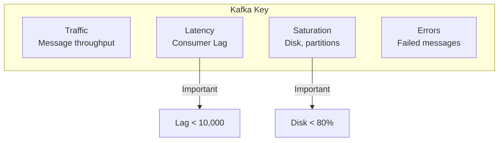
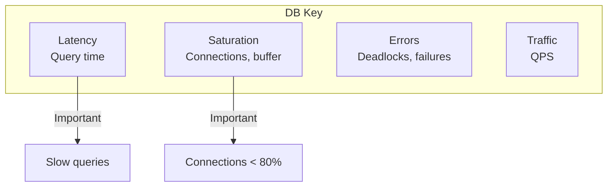
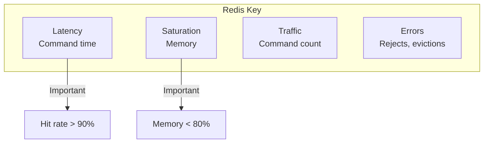
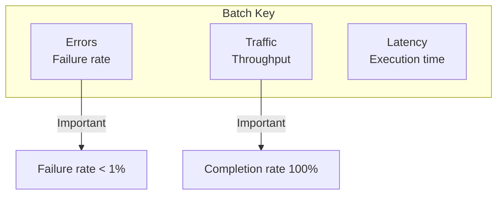

> **Target Audience**: SREs operating various service types
> **Prerequisites**: [SRE Golden Signals]()
> **After reading this**: You'll be able to apply the four signals tailored to service characteristics

## TL;DR


**Key Summary:**
- Each service type has different **key signals**
- **Web API**: Latency, Errors focused
- **Kafka**: Traffic (Lag), Saturation focused
- **Database**: Latency, Saturation focused
- **Batch jobs**: Errors, Traffic (completion rate) focused


## Key Signals by Service Type

| Service Type | Key Signals | Reason |
|--------------|-------------|--------|
| Web API | Latency, Errors | Directly affects user experience |
| Kafka | Traffic (Lag), Saturation | Throughput is key |
| Database | Latency, Saturation | Query performance, connections |
| Cache (Redis) | Latency, Saturation | Response speed, memory |
| Batch jobs | Errors, Traffic | Completion rate, throughput |
| Load balancer | Traffic, Errors | Connection distribution |

---

## Web API / Microservices

### Key Metrics



### PromQL Queries

```promql
# Latency: P99 response time
histogram_quantile(0.99,
  sum by (service, le) (rate(http_request_duration_seconds_bucket[5m]))
)

# Traffic: Requests per second
sum by (service) (rate(http_requests_total[5m]))

# Errors: Error rate
sum by (service) (rate(http_requests_total{status=~"5.."}[5m]))
/ sum by (service) (rate(http_requests_total[5m]))

# Saturation: Concurrent requests
sum by (service) (http_server_requests_active)
```

### Recording Rules

```yaml
groups:
  - name: web_api_golden_signals
    rules:
      - record: service:http_request_duration_seconds:p99
        expr: histogram_quantile(0.99, sum by (service, le) (rate(http_request_duration_seconds_bucket[5m])))

      - record: service:http_requests:rate5m
        expr: sum by (service) (rate(http_requests_total[5m]))

      - record: service:http_errors:ratio
        expr: sum by (service) (rate(http_requests_total{status=~"5.."}[5m])) / sum by (service) (rate(http_requests_total[5m]))
```

---

## Kafka

### Key Metrics



### PromQL Queries

```promql
# Traffic: Messages per second
sum by (topic) (rate(kafka_server_brokertopicmetrics_messagesin_total[5m]))

# Latency: Consumer Lag
sum by (consumer_group, topic) (kafka_consumer_group_lag)

# Saturation: Disk usage
kafka_log_log_size / kafka_log_log_max_size * 100

# Saturation: Under-replicated partitions
kafka_server_replicamanager_underreplicatedpartitions

# Errors: Failure rate
rate(kafka_producer_record_error_total[5m])
```

### Alert Rules

```yaml
groups:
  - name: kafka_alerts
    rules:
      - alert: KafkaConsumerLagHigh
        expr: sum by (consumer_group, topic) (kafka_consumer_group_lag) > 10000
        for: 10m
        labels:
          severity: warning
        annotations:
          summary: "Kafka consumer lag high"

      - alert: KafkaUnderReplicated
        expr: kafka_server_replicamanager_underreplicatedpartitions > 0
        for: 5m
        labels:
          severity: critical
        annotations:
          summary: "Kafka under-replicated partitions"

      - alert: KafkaDiskHigh
        expr: kafka_log_log_size / kafka_log_log_max_size > 0.8
        for: 10m
        labels:
          severity: warning
        annotations:
          summary: "Kafka disk usage high"
```

---

## Database (PostgreSQL/MySQL)

### Key Metrics



### PromQL Queries (PostgreSQL)

```promql
# Latency: Query time
rate(pg_stat_statements_total_time_seconds_sum[5m])
/ rate(pg_stat_statements_calls_total[5m])

# Traffic: Queries per second (QPS)
sum(rate(pg_stat_statements_calls_total[5m]))

# Saturation: Connection usage
sum(pg_stat_activity_count) / pg_settings_max_connections * 100

# Saturation: Buffer hit rate
pg_stat_bgwriter_buffers_alloc
/ (pg_stat_bgwriter_buffers_alloc + pg_stat_bgwriter_buffers_backend) * 100

# Errors: Deadlocks
rate(pg_stat_database_deadlocks_total[5m])
```

### PromQL Queries (MySQL)

```promql
# Traffic: QPS
rate(mysql_global_status_queries[5m])

# Latency: Slow queries
rate(mysql_global_status_slow_queries[5m])

# Saturation: Connection usage
mysql_global_status_threads_connected / mysql_global_variables_max_connections * 100

# Saturation: Buffer pool usage
mysql_global_status_innodb_buffer_pool_pages_data
/ mysql_global_status_innodb_buffer_pool_pages_total * 100
```

---

## Cache (Redis)

### Key Metrics



### PromQL Queries

```promql
# Traffic: Commands per second
rate(redis_commands_total[5m])

# Latency: Average command time
rate(redis_commands_duration_seconds_total[5m])
/ rate(redis_commands_total[5m])

# Saturation: Memory usage
redis_memory_used_bytes / redis_memory_max_bytes * 100

# Errors: Hit rate
rate(redis_keyspace_hits_total[5m])
/ (rate(redis_keyspace_hits_total[5m]) + rate(redis_keyspace_misses_total[5m]))
* 100

# Saturation: Connection count
redis_connected_clients
```

---

## Batch Jobs

### Key Metrics



### PromQL Queries

```promql
# Traffic: Completed jobs
increase(batch_jobs_completed_total[1h])

# Errors: Failure rate
increase(batch_jobs_failed_total[1h])
/ (increase(batch_jobs_completed_total[1h]) + increase(batch_jobs_failed_total[1h]))

# Latency: Average execution time
rate(batch_job_duration_seconds_sum[1h])
/ rate(batch_job_duration_seconds_count[1h])

# Traffic: Processed items
increase(batch_items_processed_total[1h])
```

### Alert Rules

```yaml
      - alert: BatchJobFailed
        expr: increase(batch_jobs_failed_total[1h]) > 0
        labels:
          severity: warning
        annotations:
          summary: "Batch job failed"

      - alert: BatchJobNotRunning
        expr: time() - batch_job_last_success_timestamp > 86400
        labels:
          severity: critical
        annotations:
          summary: "Batch job hasn't run in 24 hours"
```

---

## Load Balancer (Nginx/HAProxy)

### PromQL Queries (Nginx)

```promql
# Traffic: Requests per second
sum(rate(nginx_http_requests_total[5m]))

# Errors: 5xx ratio
sum(rate(nginx_http_requests_total{status=~"5.."}[5m]))
/ sum(rate(nginx_http_requests_total[5m]))

# Saturation: Active connections
nginx_connections_active

# Latency: Upstream response time
histogram_quantile(0.99, rate(nginx_upstream_response_time_seconds_bucket[5m]))
```

---

## Dashboard Templates

### Panel Layout by Service Type

| Service | Row 1 (Summary) | Row 2 (Detail) | Row 3 (Trend) |
|---------|----------------|----------------|---------------|
| Web API | P99, RPS, Error rate | Status code distribution, By endpoint | Time series |
| Kafka | Lag, Throughput, Partitions | By consumer, By topic | Time series |
| DB | QPS, Connections, Slow queries | By query, By table | Time series |
| Redis | Commands, Hit rate, Memory | By command, By keyspace | Time series |

---

## Key Summary

| Service | Top Priority | 2nd Priority | 3rd Priority |
|---------|--------------|--------------|--------------|
| Web API | Latency | Errors | Traffic |
| Kafka | Traffic (Lag) | Saturation | Errors |
| DB | Saturation | Latency | Traffic |
| Redis | Saturation | Latency | Traffic |
| Batch | Errors | Traffic | Latency |

---

## Next Steps

| Recommended Order | Document | What You'll Learn |
|-------------------|----------|-------------------|
| 1 | [Environment Setup](../../examples/setup/) | Practice environment |
| 2 | [Kafka Monitoring](../../examples/kafka-monitoring/) | Kafka details |
