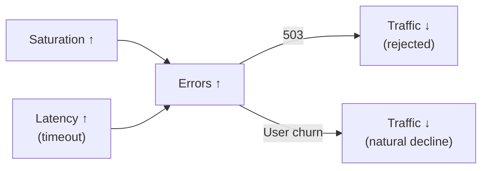
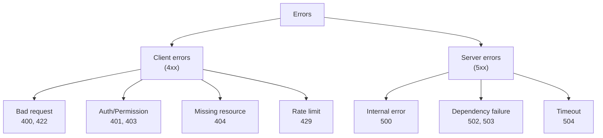

> **Target Audience**: Developers and SREs improving service reliability
> **Prerequisites**: [Aggregation Operators]()
> **After reading this**: You'll be able to systematically classify errors and set up SLO-based monitoring

## TL;DR


**Key Summary:**
- **Error rate**: Failed requests / Total requests
- Not just HTTP 5xx: Include business logic failures
- **Error budget**: Allowed error amount (based on SLO)
- Error **classification** is important: Client vs server, temporary vs permanent


## Why Error Monitoring Matters

Errors are the **most direct indicator of system health**. Services still work with high Latency, but high error rates cause real harm to users. According to Google SRE team research, **users who experience errors are 3x more likely to churn within 72 hours**.

### Analogy: Hospital Emergency Room

Emergency rooms classify (Triage) patients' various symptoms. Headache (mild) and heart attack (critical) are both "symptoms" but urgency and response differ completely. Similarly, error classification is key:

- **404 Not Found**: Common cold - common and mostly normal browsing process
- **429 Too Many Requests**: Vaccination - intentionally triggered protection mechanism
- **500 Internal Error**: Emergency situation - immediate action needed
- **503 Service Unavailable**: ICU full - capacity issue, expansion needed

Treating all errors equally leads to delayed response in truly dangerous situations due to **Alert Fatigue**.

### Errors' Relationship with Other Signals

Errors don't occur in isolation. They chain with other Golden Signals.



| Cause | Error Type | Chain Effect |
|-------|------------|--------------|
| Traffic surge | 503, 429 | More retries → additional traffic increase |
| Dependency failure | 502, 504 | Latency increase → timeout increase |
| Out of memory | 500, OOM | Service restart → connection drops |
| Bad deployment | 500, 400 | Rollback needed |

The key to error monitoring isn't **that errors occurred** but understanding **what errors occurred, why, and how many**. This distinguishes real problems from expected situations.

---

## Error Definition

The most common mistake defining errors is thinking "only HTTP 5xx are errors". But you should define errors from a business perspective. For example, in a payment service, "insufficient balance" returns 200 OK technically but is a business failure.

### What is an Error?

| Type | Example | Is Error? |
|------|---------|-----------|
| HTTP 5xx | 500, 502, 503 | ✅ Server error |
| HTTP 4xx | 400, 404, 429 | ⚠️ Depends on context |
| Timeout | Request timeout | ✅ Error |
| Business failure | Payment failed, out of stock | ⚠️ Needs definition |
| Slow response | Response exceeding SLA | ⚠️ Needs definition |


**4xx depends on context:**
- `400 Bad Request`: Client bug → can count as error
- `404 Not Found`: Normal browsing → can exclude
- `429 Too Many Requests`: Intentional limit → exclude


### Error Classification System



---

## Measurement Methods

### Basic Error Rate

```promql
# 5xx error rate (%)
sum(rate(http_requests_total{status=~"5.."}[5m]))
/ sum(rate(http_requests_total[5m]))
* 100

# Error rate by service
sum by (service) (rate(http_requests_total{status=~"5.."}[5m]))
/ sum by (service) (rate(http_requests_total[5m]))
* 100
```

### Extended Error Rate (Including 4xx)

```promql
# 4xx + 5xx (excluding specific codes)
sum(rate(http_requests_total{status=~"[45]..", status!~"404|429"}[5m]))
/ sum(rate(http_requests_total[5m]))
* 100
```

### Error Count

```promql
# Errors per second
sum(rate(http_requests_total{status=~"5.."}[5m]))

# Total errors in 1 hour
sum(increase(http_requests_total{status=~"5.."}[1h]))

# Error count by status code
sum by (status) (rate(http_requests_total{status=~"[45].."}[5m]))
```

### Availability (Inverse Metric)

```promql
# Availability = 1 - error rate
(1 - (
  sum(rate(http_requests_total{status=~"5.."}[5m]))
  / sum(rate(http_requests_total[5m]))
)) * 100

# 99.9% availability = 0.1% error rate
```

---

## SLO and Error Budget

### Why Error Budget is Needed

Traditional monitoring was simply "alert when error occurs". But this approach has two problems:

1. **Perfect availability is unrealistic**: Targeting 100% availability requires urgent response to any error, however minor
2. **Innovation vs stability conflict**: Deploying new features always carries risk. You can't deploy anything targeting 0% errors

**Analogy: Car Fuel and Budget**

When you get paid, you budget "I can spend up to $300 on fuel this month". Error budget is the same concept. Defining "allow up to 43 minutes of errors this month (99.9% SLO)":

- Budget remaining → deploy new features, experiment
- Budget low → stop deployments, focus on stability
- Budget exhausted → rollback, emergency response

This makes business decisions (whether to deploy) based on **objective data**.

### SLO Definition

| SLO | Allowed Error Rate | Monthly Allowed Downtime |
|-----|-------------------|------------------------|
| 99% | 1% | 7.2 hours |
| 99.9% | 0.1% | 43.2 minutes |
| 99.99% | 0.01% | 4.3 minutes |

### Error Budget Calculation

```promql
# Monthly error budget (99.9% SLO)
# Allowed error rate: 0.1% = 0.001

# Current error rate
sum(rate(http_requests_total{status=~"5.."}[30d]))
/ sum(rate(http_requests_total[30d]))

# Remaining error budget (%)
(0.001 - (
  sum(rate(http_requests_total{status=~"5.."}[30d]))
  / sum(rate(http_requests_total[30d]))
)) / 0.001 * 100
```

### Error Budget Burn Rate

```promql
# Time remaining until error budget exhausted at current rate
# burn rate = current error rate / allowed error rate
# remaining time = remaining budget / burn rate

# Example: burn rate 2 = errors occurring at 2x rate
# 30-day budget exhausted in 15 days
```

---

## Alert Rules

### Basic Error Rate Alerts

```yaml
groups:
  - name: error_alerts
    rules:
      # Error rate exceeds 1% (warning)
      - alert: HighErrorRate
        expr: |
          sum by (service) (rate(http_requests_total{status=~"5.."}[5m]))
          / sum by (service) (rate(http_requests_total[5m]))
          > 0.01
        for: 5m
        labels:
          severity: warning
        annotations:
          summary: "{{ $labels.service }} error rate is {{ $value | humanizePercentage }}"

      # Error rate exceeds 5% (critical)
      - alert: CriticalErrorRate
        expr: |
          sum by (service) (rate(http_requests_total{status=~"5.."}[5m]))
          / sum by (service) (rate(http_requests_total[5m]))
          > 0.05
        for: 2m
        labels:
          severity: critical
        annotations:
          summary: "{{ $labels.service }} error rate critical: {{ $value | humanizePercentage }}"
```

### Error Budget Based Alerts

```yaml
      # 50% of error budget consumed
      - alert: ErrorBudget50PercentConsumed
        expr: |
          (
            sum(rate(http_requests_total{status=~"5.."}[7d]))
            / sum(rate(http_requests_total[7d]))
          ) > (0.001 * 0.5 * 30 / 7)  # Convert to weekly
        for: 1h
        labels:
          severity: warning
        annotations:
          summary: "Error budget 50% consumed this month"

      # Error budget burning rapidly (burn rate > 10)
      - alert: HighErrorBudgetBurnRate
        expr: |
          (
            sum(rate(http_requests_total{status=~"5.."}[1h]))
            / sum(rate(http_requests_total[1h]))
          ) / 0.001 > 10
        for: 5m
        labels:
          severity: critical
        annotations:
          summary: "Error budget burning 10x faster than allowed"
```

### New Error Pattern Detection

```yaml
      # Newly appeared error pattern
      - alert: NewErrorPattern
        expr: |
          sum by (service, status, path) (rate(http_requests_total{status=~"5.."}[5m])) > 0
          unless
          sum by (service, status, path) (rate(http_requests_total{status=~"5.."}[5m] offset 1h)) > 0
        for: 5m
        labels:
          severity: info
        annotations:
          summary: "New error pattern detected: {{ $labels.service }} {{ $labels.path }} {{ $labels.status }}"
```

---

## Error Analysis

### Error Distribution

```promql
# Percentage by status code
sum by (status) (rate(http_requests_total{status=~"[45].."}[5m]))
/ ignoring(status) sum(rate(http_requests_total{status=~"[45].."}[5m]))
* 100

# Error concentration by endpoint
topk(10,
  sum by (path) (rate(http_requests_total{status=~"5.."}[5m]))
)
```

### Error Spike Detection

```promql
# Error rate change vs 1 hour ago
sum(rate(http_requests_total{status=~"5.."}[5m]))
/ sum(rate(http_requests_total[5m]))
-
sum(rate(http_requests_total{status=~"5.."}[5m] offset 1h))
/ sum(rate(http_requests_total[5m] offset 1h))
```

---

## Dashboard Design

### Recommended Panel Layout

```
┌─────────────────────────────────────────────────────┐
│ Stat: Error Rate │ Stat: Error Count │ Stat: Budget │
├─────────────────────────────────────────────────────┤
│ Time Series: Error rate trend (5xx, 4xx separate)  │
├─────────────────────────────────────────────────────┤
│ Pie Chart: Distribution by status code             │
├─────────────────────────────────────────────────────┤
│ Table: Top 10 endpoints by error count             │
└─────────────────────────────────────────────────────┘
```

---

## Recording Rules

```yaml
groups:
  - name: error_rules
    rules:
      # Error rate by service
      - record: service:http_requests_errors:ratio_rate5m
        expr: |
          sum by (service) (rate(http_requests_total{status=~"5.."}[5m]))
          / sum by (service) (rate(http_requests_total[5m]))

      # Total error rate
      - record: :http_requests_errors:ratio_rate5m
        expr: |
          sum(rate(http_requests_total{status=~"5.."}[5m]))
          / sum(rate(http_requests_total[5m]))

      # Availability
      - record: service:http_requests_availability:ratio_rate5m
        expr: |
          1 - (
            sum by (service) (rate(http_requests_total{status=~"5.."}[5m]))
            / sum by (service) (rate(http_requests_total[5m]))
          )
```

---

## Key Summary

| Metric | Calculation | Use Case |
|--------|-------------|----------|
| Error rate | 5xx / total | SLO monitoring |
| Error count | `increase()` | Event aggregation |
| Availability | 1 - error rate | SLA reporting |
| Error budget | Allowed - used | Release decision |

---

## Next Steps

| Recommended Order | Document | What You'll Learn |
|-------------------|----------|-------------------|
| 1 | [Saturation]() | Resource saturation |
| 2 | [Post-Alert Action Guide]() | Error response methods |
