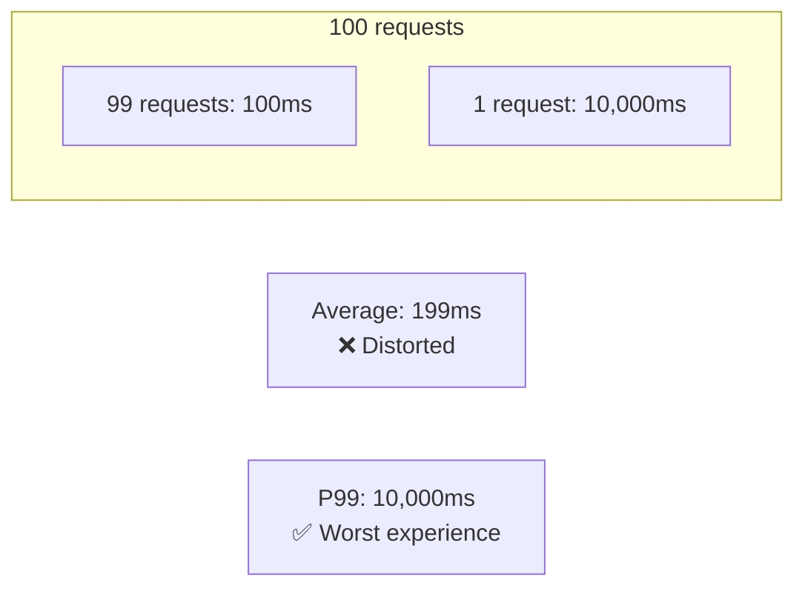
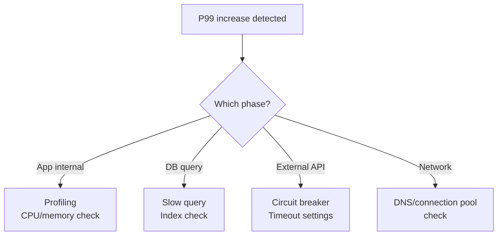

> **Target Audience**: Developers and SREs looking to improve service response times
> **Prerequisites**: [histogram_quantile]()
> **After reading this**: You'll be able to accurately measure latency and set up SLA-based alerts

## TL;DR


**Key Summary:**
- **P50 (median)**: Typical user experience
- **P95**: Most users' experience
- **P99**: Worst-case user experience (SLA baseline)
- **Percentiles** better reflect actual experience than averages
- Measure latency of successful/failed requests **separately**


## Why Percentiles Matter

Latency is **quality directly felt by users**. No matter how great the features, users leave if they have to wait 5 seconds. According to Amazon's research, **100ms of added latency results in 1% decrease in sales**.

### Averages Lie

**Analogy: The Trap of Average Salary**

In a company where 10 employees each earn $50,000, a CEO earning $10 billion joins. The average salary suddenly becomes $950 million. But none of the 10 employees earns $950 million.

Similarly, "average response time 200ms" **doesn't reflect most users' experience**. If 99 people experience 100ms and 1 person experiences 10 seconds, the average is still 199ms. That 1 person has a terrible experience, but it barely shows in the average.

Percentiles solve this problem. If P99 is 10 seconds, you know clearly that "1 in 100 people wait 10 seconds".

### The Trap of Averages



| Metric | Value | Meaning |
|--------|-------|---------|
| Average | 199ms | Distorted by 1% slow requests |
| P50 | 100ms | Half are under 100ms |
| P99 | 10,000ms | 1% wait over 10 seconds |

### Meaning of Each Percentile

| Percentile | Coverage | Use Case |
|------------|----------|----------|
| **P50** | 50% | Typical user experience |
| **P90** | 90% | Most users' experience |
| **P95** | 95% | Nearly all users' experience |
| **P99** | 99% | SLA baseline, worst experience |
| **P99.9** | 99.9% | Very strict SLA |

---

## Measurement Methods

### Basic PromQL

```promql
# P50 (median)
histogram_quantile(0.5,
  sum by (service, le) (rate(http_request_duration_seconds_bucket[5m]))
)

# P95
histogram_quantile(0.95,
  sum by (service, le) (rate(http_request_duration_seconds_bucket[5m]))
)

# P99
histogram_quantile(0.99,
  sum by (service, le) (rate(http_request_duration_seconds_bucket[5m]))
)

# Average (for comparison)
rate(http_request_duration_seconds_sum[5m])
/ rate(http_request_duration_seconds_count[5m])
```

### Separate Success/Failure Measurement


**Failed requests can be fast.** Timeouts are slow, but immediate rejections are fast. Separate measurement is important.


```promql
# P99 for successful requests
histogram_quantile(0.99,
  sum by (service, le) (
    rate(http_request_duration_seconds_bucket{status!~"5.."}[5m])
  )
)

# P99 for failed requests
histogram_quantile(0.99,
  sum by (service, le) (
    rate(http_request_duration_seconds_bucket{status=~"5.."}[5m])
  )
)
```

### Per-Endpoint Measurement

```promql
# P99 by endpoint
histogram_quantile(0.99,
  sum by (path, le) (rate(http_request_duration_seconds_bucket[5m]))
)

# Top 5 slowest endpoints
topk(5,
  histogram_quantile(0.99,
    sum by (path, le) (rate(http_request_duration_seconds_bucket[5m]))
  )
)
```

---

## SLA/SLO Setup

### SLA Definition Examples

| Service | P99 Target | P99.9 Target |
|---------|-----------|--------------|
| API Gateway | 100ms | 500ms |
| Order Service | 500ms | 2s |
| Search Service | 200ms | 1s |
| Batch Job | 30s | 2m |

### SLA Compliance Rate

```promql
# Percentage of time P99 is under 500ms (SLA compliance)
avg_over_time(
  (
    histogram_quantile(0.99,
      sum by (le) (rate(http_request_duration_seconds_bucket[5m]))
    ) < 0.5
  )[24h:5m]
)
```

### Error Budget Calculation

```promql
# Monthly error budget (99.9% SLO)
# Allowed error rate: 0.1% = 0.001

# Current error rate
sum(rate(http_requests_total{status=~"5.."}[30d]))
/ sum(rate(http_requests_total[30d]))

# Remaining error budget (%)
(0.001 - (
  sum(rate(http_requests_total{status=~"5.."}[30d]))
  / sum(rate(http_requests_total[30d]))
)) / 0.001 * 100
```

### Error Budget Burn Rate

```promql
# Time remaining until error budget exhausted at current rate
# burn rate = current error rate / allowed error rate
# remaining time = remaining budget / burn rate

# Example: burn rate 2 = errors occurring at 2x rate
# 30-day budget exhausted in 15 days
```

---

## Alert Rules

### Basic Alerts

```yaml
groups:
  - name: latency_alerts
    rules:
      # P99 exceeds target
      - alert: HighP99Latency
        expr: |
          histogram_quantile(0.99,
            sum by (service, le) (rate(http_request_duration_seconds_bucket[5m]))
          ) > 0.5
        for: 5m
        labels:
          severity: warning
        annotations:
          summary: "{{ $labels.service }} P99 latency is {{ $value | humanizeDuration }}"
          runbook_url: "https://wiki/runbook/high-latency"

      # P99 at critical level
      - alert: CriticalP99Latency
        expr: |
          histogram_quantile(0.99,
            sum by (service, le) (rate(http_request_duration_seconds_bucket[5m]))
          ) > 2
        for: 2m
        labels:
          severity: critical
        annotations:
          summary: "{{ $labels.service }} P99 latency critical: {{ $value | humanizeDuration }}"
```

### Detect Sudden Changes

```yaml
# P99 increased 2x compared to usual
- alert: LatencySpike
  expr: |
    histogram_quantile(0.99, sum by (service, le) (rate(http_request_duration_seconds_bucket[5m])))
    >
    histogram_quantile(0.99, sum by (service, le) (rate(http_request_duration_seconds_bucket[5m] offset 1h)))
    * 2
  for: 5m
  labels:
    severity: warning
  annotations:
    summary: "{{ $labels.service }} latency doubled compared to 1 hour ago"
```

---

## Dashboard Design

### Recommended Panel Layout

```
┌─────────────────────────────────────────────────────┐
│ Stat: Current P99 │ Stat: P99 Change (vs 1h ago)    │
├─────────────────────────────────────────────────────┤
│ Time Series: P50 / P95 / P99 trends                 │
├─────────────────────────────────────────────────────┤
│ Heatmap: Response time distribution                 │
├─────────────────────────────────────────────────────┤
│ Table: P99 by endpoint (Top 10)                     │
└─────────────────────────────────────────────────────┘
```

### Grafana Query Examples

```promql
# Stat: Current P99
histogram_quantile(0.99, sum by (le) (rate(http_request_duration_seconds_bucket[5m])))

# Time Series: Percentile comparison
# P50
histogram_quantile(0.50, sum by (le) (rate(http_request_duration_seconds_bucket[$__rate_interval])))
# P95
histogram_quantile(0.95, sum by (le) (rate(http_request_duration_seconds_bucket[$__rate_interval])))
# P99
histogram_quantile(0.99, sum by (le) (rate(http_request_duration_seconds_bucket[$__rate_interval])))
```

---

## Improvement Strategies

### When Latency is High



### Common Causes

| Cause | Symptom | Solution |
|-------|---------|----------|
| DB query | Only specific endpoints slow | Index, query optimization |
| External API | Slow when calling specific dependencies | Caching, circuit breaker |
| GC | Periodic spikes | Heap tuning, GC algorithm |
| Connection pool exhausted | Slow during high concurrency | Increase pool size |
| CPU saturation | Generally slow | Scale out |

---

## Key Summary

| Metric | Use Case | Example Threshold |
|--------|----------|-------------------|
| P50 | Monitor typical experience | - |
| P95 | Main dashboard metric | 200ms |
| P99 | SLA baseline, alerts | 500ms |
| P99.9 | Strict SLA | 2s |

**Recording Rules Template:**
```yaml
- record: service:http_request_duration_seconds:p99
  expr: |
    histogram_quantile(0.99,
      sum by (service, le) (rate(http_request_duration_seconds_bucket[5m]))
    )
```

---

## Next Steps

| Recommended Order | Document | What You'll Learn |
|-------------------|----------|-------------------|
| 1 | [Traffic]() | Throughput monitoring |
| 2 | [Debugging High Latency]() | Troubleshooting guide |
