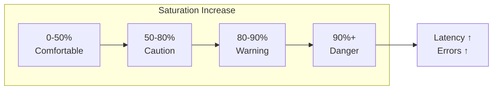

> **Target Audience**: SREs and infrastructure engineers managing system capacity
> **Prerequisites**: [Prometheus Architecture](../prometheus-architecture/)
> **After reading this**: You'll be able to detect resource bottlenecks early and establish capacity planning


- **Saturation**: How "full" resources are (0-100%)
- **Key resources**: CPU, memory, disk, network, connection pools
- Approaching 100% causes **latency spikes, errors**
- USE method: Utilization, Saturation, Errors


## Why Monitor Saturation?

Saturation is the **only metric that can predict failures**. Latency, Traffic, and Errors react **after problems occur**, but Saturation warns **before problems occur**.

This is why Google SRE principles include Saturation in the Golden Signals. When systems reach 100%, everything collapses simultaneously. Response times spike, errors explode, and traffic processing stops. But discovering issues at 90% allows comfortable response time.

### Analogy: The Law of Highway Congestion

Up to 70% of highway capacity, vehicles flow smoothly. Past 80%, intermittent congestion begins. Past 90%, **one small brake triggers chain congestion**. At 100%, it stops completely.

Computer systems are identical. When CPU exceeds 90%, processes queue waiting for execution order. When memory runs out, Swap occurs and speed drops 10x. When disk fills up, even logs can't be written, making failure diagnosis impossible.

**The key is "catching it before reaching the limit".** Saturation is the only metric enabling proactive rather than reactive monitoring.

---

## What is Saturation?

Saturation measures **how close to limit** a resource is. 0% is completely idle, 100% is no capacity left to process more.



*This diagram shows how saturation levels progress from comfortable to caution to warning to critical as utilization increases from 0% to over 90%, with latency and errors spiking at critical levels.*
### Why Warning from 80%?

Systems need **headroom** for peak traffic. If 80% normally, sudden traffic increases risk exceeding 100%. Generally **20% headroom** is recommended.

| Saturation | State | Response | Reason |
|------------|-------|----------|--------|
| 0-50% | Comfortable | Monitor only | Safe even at peak |
| 50-80% | Caution | Watch trends | Need to check increase trend |
| 80-90% | Warning | Capacity planning | Insufficient headroom for peak |
| 90%+ | Danger | Immediate action | Failure imminent |

---

## CPU Saturation

CPU is the core of all computation, so it's the **first resource to monitor**. When CPU saturates, all processes slow down, especially response times increase dramatically.

**Analogy: Chef's Limit**

With 1 chef in the kitchen, up to 5 orders process smoothly. At 10 orders, wait time increases. At 20 orders, no matter how fast the chef moves, orders pile up. CPU cores are chefs, processes are orders.

### Usage Measurement

```promql
# CPU usage (%)
100 - (avg by (instance) (rate(node_cpu_seconds_total{mode="idle"}[5m])) * 100)

# CPU usage by mode
sum by (mode) (rate(node_cpu_seconds_total[5m])) * 100
# user, system, iowait, idle, etc.

# iowait (waiting for disk I/O)
avg by (instance) (rate(node_cpu_seconds_total{mode="iowait"}[5m])) * 100
```

### CPU Saturation Indicators

Besides CPU usage, check **Load Average** together. Even 80% CPU usage is fine without queues. But high Load at 60% usage signals I/O waiting or other bottlenecks.

```promql
# Load Average (number of processes waiting to run)
node_load1   # 1-minute average
node_load5   # 5-minute average
node_load15  # 15-minute average

# Load relative to CPU cores
node_load1 / count without (cpu) (node_cpu_seconds_total{mode="idle"})

# Above 1 means CPU waiting (processes are queuing)
```


**Interpreting Load Average**: On a 4-core server, Load of 4.0 means "all cores at 100% with no waiting". 8.0 means "4 additional processes waiting".


### Alert Rules

```yaml
groups:
  - name: cpu_saturation
    rules:
      - alert: HighCPUUsage
        expr: |
          100 - (avg by (instance) (rate(node_cpu_seconds_total{mode="idle"}[5m])) * 100) > 80
        for: 10m
        labels:
          severity: warning
        annotations:
          summary: "High CPU usage on {{ $labels.instance }}"
          description: "CPU usage is {{ $value | humanize }}%"

      - alert: HighLoadAverage
        expr: |
          node_load5 / count without (cpu) (node_cpu_seconds_total{mode="idle"}) > 1.5
        for: 10m
        labels:
          severity: warning
        annotations:
          summary: "High load average on {{ $labels.instance }}"
```

---

## Memory Saturation

Memory is **the only resource that directly kills the system when insufficient**. CPU at 100% is just slow, but insufficient memory triggers OOM Killer to force-terminate processes. Which process dies is hard to predict.

**Analogy: Desk Space**

Documents spread on the desk are memory. When space runs out, some documents go in drawers (Swap/disk). Retrieving from drawers takes 10-100x longer. Eventually when the desk is too small, documents get thrown on the floor (OOM Kill).

### Usage Measurement

```promql
# Memory usage (%)
(1 - node_memory_MemAvailable_bytes / node_memory_MemTotal_bytes) * 100

# Memory in use
node_memory_MemTotal_bytes - node_memory_MemAvailable_bytes

# Actual usage excluding cache
node_memory_MemTotal_bytes - node_memory_MemFree_bytes - node_memory_Buffers_bytes - node_memory_Cached_bytes
```

### Memory Saturation Indicators

**Swap usage signals problems have already started**. Swap uses disk as temporary memory when memory is insufficient, but disk is 1000x slower than memory. When Swap occurs, application response time slows dramatically.

```promql
# Swap usage (swap use = memory shortage)
node_memory_SwapTotal_bytes - node_memory_SwapFree_bytes

# Swap usage rate
(node_memory_SwapTotal_bytes - node_memory_SwapFree_bytes)
/ node_memory_SwapTotal_bytes * 100

# OOM kill count (processes force-terminated in 1 hour)
increase(node_vmstat_oom_kill[1h])
```


**OOM Kill is a lagging indicator.** If OOM Kill occurred, processes already died. Monitor Swap usage or MemAvailable first.


### Alert Rules

```yaml
      - alert: HighMemoryUsage
        expr: |
          (1 - node_memory_MemAvailable_bytes / node_memory_MemTotal_bytes) > 0.85
        for: 5m
        labels:
          severity: warning
        annotations:
          summary: "High memory usage on {{ $labels.instance }}"
          description: "Memory usage is {{ $value | humanizePercentage }}"

      - alert: SwapUsage
        expr: |
          (node_memory_SwapTotal_bytes - node_memory_SwapFree_bytes) > 0
        for: 5m
        labels:
          severity: warning
        annotations:
          summary: "Swap is being used on {{ $labels.instance }}"
```

---

## Disk Saturation

Disk is the **slowest resource**. Even SSDs are 100x slower than memory, HDDs 1000x slower. When disk saturates, all read/write operations bottleneck. Especially when disk space runs out, log writing, database writes, even system operation can stop.

**Analogy: Warehouse's Two Limits**

Warehouses have two limits. First is **space** (storage capacity), second is **entrance bandwidth** (I/O speed). When the warehouse fills up, new items can't be stored. When the entrance is congested, retrieving items takes long. Disk similarly requires monitoring both "capacity" and "I/O".

### Usage Measurement

```promql
# Disk usage (%)
(1 - node_filesystem_avail_bytes{mountpoint="/"} / node_filesystem_size_bytes{mountpoint="/"}) * 100

# Available space (GB)
node_filesystem_avail_bytes{mountpoint="/"} / 1024 / 1024 / 1024

# inode usage
(1 - node_filesystem_files_free / node_filesystem_files) * 100
```

### Disk I/O Saturation

```promql
# I/O usage (%)
rate(node_disk_io_time_seconds_total[5m]) * 100

# I/O wait time
rate(node_disk_io_time_weighted_seconds_total[5m])
/ rate(node_disk_io_time_seconds_total[5m])

# Read/write throughput
rate(node_disk_read_bytes_total[5m])
rate(node_disk_written_bytes_total[5m])
```

### Alert Rules

```yaml
      - alert: DiskSpaceLow
        expr: |
          (1 - node_filesystem_avail_bytes{mountpoint="/"} / node_filesystem_size_bytes{mountpoint="/"}) > 0.85
        for: 10m
        labels:
          severity: warning
        annotations:
          summary: "Low disk space on {{ $labels.instance }}"
          description: "Disk usage is {{ $value | humanizePercentage }}"

      - alert: DiskWillFillIn24Hours
        expr: |
          predict_linear(node_filesystem_avail_bytes{mountpoint="/"}[6h], 24*3600) < 0
        for: 1h
        labels:
          severity: warning
        annotations:
          summary: "Disk will be full within 24 hours on {{ $labels.instance }}"
```

---

## Network Saturation

Network is the **lifeline of distributed systems**. Microservices, database connections, external API calls all go through network. When network saturates, packets drop and retransmission occurs, dramatically increasing latency.

**Analogy: City Road Network**

Network is like a city's road network. Bandwidth is number of road lanes, packets are vehicles. When roads congest, vehicles slow (latency increases). When too congested, some vehicles don't reach destination (packet drop). TCP connection count is like parking spaces - when space runs out, new vehicles can't enter.

### Bandwidth Usage

```promql
# Receive bandwidth (bytes/s)
rate(node_network_receive_bytes_total{device!="lo"}[5m])

# Transmit bandwidth (bytes/s)
rate(node_network_transmit_bytes_total{device!="lo"}[5m])

# Bandwidth usage (based on 1Gbps = 125MB/s)
rate(node_network_receive_bytes_total{device="eth0"}[5m]) / 125000000 * 100
```

### Network Errors/Drops

```promql
# Receive errors
rate(node_network_receive_errs_total[5m])

# Transmit errors
rate(node_network_transmit_errs_total[5m])

# Dropped packets
rate(node_network_receive_drop_total[5m])
rate(node_network_transmit_drop_total[5m])
```

### TCP Connections

```promql
# Current connections
node_netstat_Tcp_CurrEstab

# TIME_WAIT connections
node_sockstat_TCP_tw

# Connection rejections (port exhaustion)
rate(node_netstat_TcpExt_ListenOverflows[5m])
```

---

## Application Saturation

Even with sufficient infrastructure resources, **application-level bottlenecks** can occur. When connection pools exhaust, new requests wait. When thread pools fill, requests are rejected. When JVM heap runs out, excessive GC makes applications appear frozen.

**Analogy: Restaurant Operations**

For a restaurant (application) to run well, various resources are needed:
- **Tables (connection pool)**: When tables fill, new customers wait
- **Waiters (thread pool)**: Insufficient waiters delay order taking
- **Kitchen space (heap memory)**: Insufficient space requires frequent cleaning (GC), slowing cooking

### Connection Pool

```promql
# HikariCP active connections
hikaricp_connections_active

# Connection pool usage
hikaricp_connections_active / hikaricp_connections_max * 100

# Waiting requests
hikaricp_connections_pending
```

### JVM Heap

```promql
# Heap usage
jvm_memory_used_bytes{area="heap"}
/ jvm_memory_max_bytes{area="heap"} * 100

# Old Gen usage
jvm_memory_used_bytes{area="heap", id="G1 Old Gen"}
/ jvm_memory_max_bytes{area="heap", id="G1 Old Gen"} * 100

# GC time ratio (high means heap shortage)
rate(jvm_gc_pause_seconds_sum[5m])
```

### Thread Pool

```promql
# Tomcat threads
tomcat_threads_busy_threads / tomcat_threads_config_max_threads * 100

# Currently processing requests
http_server_requests_active
```

---

## Kafka Saturation

In Kafka, saturation primarily manifests as **Consumer Lag**. When Producer creates messages faster than Consumer can process, Lag accumulates. If Lag keeps increasing, message processing delays, and eventually broker disk fills up, preventing new message acceptance.

**Why is Consumer Lag important?**

In real-time processing systems, Lag means "time difference between now and processing time". If order system Lag is 10 minutes, you're processing 10-minute-old orders. Payment approval, inventory deduction delayed 10 minutes severely impacts business.

```promql
# Consumer Lag (processing delay - message count)
sum by (consumer_group) (kafka_consumer_group_lag)

# Broker disk usage
kafka_log_log_size / kafka_log_log_max_size * 100

# Partition leader imbalance
kafka_server_replicamanager_leadercount
```

---

## Dashboard Design

### What is the USE Method?

Brendan Gregg's **USE (Utilization, Saturation, Errors)** method systematically diagnoses system performance issues. It asks three questions about every resource:

1. **Utilization**: How much is the resource being used?
2. **Saturation**: Are there queues? Is work piling up?
3. **Errors**: Are errors occurring?

Organizing dashboards along these three axes quickly narrows down problem causes.

### USE Dashboard Layout

```
┌─────────────────────────────────────────────────────┐
│                    CPU                               │
│ Gauge: Usage │ Graph: Usage trend │ Graph: Load Avg │
├─────────────────────────────────────────────────────┤
│                  Memory                              │
│ Gauge: Usage │ Graph: Usage trend │ Graph: Swap     │
├─────────────────────────────────────────────────────┤
│                   Disk                               │
│ Gauge: Usage │ Graph: I/O │ Table: By mountpoint    │
├─────────────────────────────────────────────────────┤
│                  Network                             │
│ Graph: Bandwidth │ Graph: Errors/drops │ Stat: Connections │
└─────────────────────────────────────────────────────┘
```

---

## Recording Rules

```yaml
groups:
  - name: saturation_rules
    rules:
      # CPU usage
      - record: instance:node_cpu_utilization:ratio
        expr: |
          1 - avg by (instance) (rate(node_cpu_seconds_total{mode="idle"}[5m]))

      # Memory usage
      - record: instance:node_memory_utilization:ratio
        expr: |
          1 - node_memory_MemAvailable_bytes / node_memory_MemTotal_bytes

      # Disk usage
      - record: instance:node_filesystem_utilization:ratio
        expr: |
          1 - node_filesystem_avail_bytes{mountpoint="/"} / node_filesystem_size_bytes{mountpoint="/"}

      # Connection pool usage
      - record: instance:hikaricp_pool_utilization:ratio
        expr: |
          hikaricp_connections_active / hikaricp_connections_max
```

---

## Key Summary

### Why These Thresholds?

Thresholds consider **"normal + peak headroom"**. For example, CPU 80% means "can accommodate 1.25x normal traffic". Network is lower at 70% because TCP retransmission etc. drastically reduces actual available bandwidth.

| Resource | Key Metric | Threshold | Reason |
|----------|------------|-----------|--------|
| CPU | Usage, Load Average | 80% | 20% headroom vs peak |
| Memory | Usage, Swap | 85% | Need space for cache |
| Disk | Usage, I/O | 85% | Space for logs/temp files |
| Network | Bandwidth, Errors | 70% | Consider TCP congestion control |
| Connection pool | Active/Max | 80% | Handle burst requests |
| JVM heap | Usage, GC | 80% | Prevent GC overhead |


**Thresholds are starting points.** Accumulate data in real environments, analyze failure patterns, and adjust to fit your organization.


---

## Next Steps

| Recommended Order | Document | What You'll Learn |
|-------------------|----------|-------------------|
| 1 | [By Service Type](by-service-type/) | Custom metrics |
| 2 | [Cardinality Optimization](../../howto/reduce-cardinality/) | Cost reduction |
