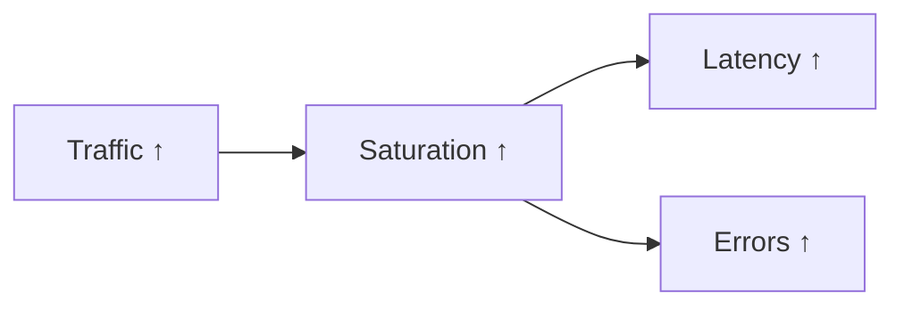

> **Target Audience**: Developers and SREs establishing capacity planning
> **Prerequisites**: [rate and increase]()
> **After reading this**: You'll be able to analyze traffic patterns and use them for capacity planning

## TL;DR


**Key Summary:**
- **RPS (Requests Per Second)**: Requests per second
- **Throughput**: Throughput per second (bytes, messages, etc.)
- **Concurrent Connections**: Active connections
- Traffic changes are a **leading indicator** of other signals


## Why Monitor Traffic?

Traffic measures the **demand** entering the system. If Latency shows "how fast", Traffic shows "how much". To judge system health, you need both. No matter how fast the response, something is wrong if no requests come in. If requests spike but resources are insufficient, failure is imminent.

### Analogy: Highway Traffic Volume

Think of a highway control center. The center monitors **current vehicle count (Traffic)** in real-time. Why?

- **Traffic surge**: When cars flood in like holiday traffic, congestion (Latency increase) starts soon. Early detection allows response with detours or lane expansion.
- **Traffic drop**: If a usually congested section is suddenly empty, there's likely an accident or road closure (failure).
- **Abnormal patterns**: If cars suddenly flood in at 3 AM, there's a special event or abnormal situation.

Similarly, monitoring traffic patterns lets services **respond before problems occur**. Traffic is a **leading indicator** of all other problems.

### Traffic's Relationship with Other Signals



Increased traffic saturates system resources (Saturation), leading to increased latency (Latency) and errors (Errors). Therefore, detecting traffic changes first allows **proactive response before other problems occur**.

### Meaning of Traffic Changes

| Traffic Change | Meaning | Response |
|----------------|---------|----------|
| Sudden increase | Traffic spike, possible attack | Scale out, defend |
| Gradual increase | Service growth | Capacity planning |
| Sudden decrease | Failure, routing issue | Investigate cause |
| Abnormal pattern | Bot traffic, crawler | Consider blocking |


**Key Principle**: Traffic is not a "problem" but a "signal". Traffic itself isn't good or bad; what matters is **whether it's within expected range and if the system can handle it**.


---

## Metrics to Measure

How to measure traffic varies by service characteristics. For web services, HTTP request count matters; for message queues, processed message count matters. Whatever metric you choose, the key is **"how accurately it reflects demand entering the system"**.

### 1. RPS (Requests Per Second)

**Why measure RPS?**

RPS is the most intuitive traffic metric. It shows how many requests come in per second, letting you immediately grasp current load level. It's also the basic unit for capacity planning. It's common to express system capacity in RPS, like "our service can handle up to 10,000 RPS".

```promql
# Total RPS
sum(rate(http_requests_total[5m]))

# RPS by service
sum by (service) (rate(http_requests_total[5m]))

# RPS by endpoint
sum by (path) (rate(http_requests_total[5m]))

# RPS by status code
sum by (status) (rate(http_requests_total[5m]))
```

### 2. Throughput

**Why measure Throughput?**

RPS counts "number of requests", but not all requests are the same size. A 1KB text request and 100MB file upload have completely different system impacts. Throughput measures **actual data volume exchanged**.

**Analogy: Delivery Distribution Center**

At a distribution center, "processed 1,000 deliveries today" (RPS) and "processed 5 tons total today" (Throughput) mean different things. 1,000 small packages and 100 large furniture items differ in count but logistics load can be similar. For systems where network bandwidth or storage IO is the bottleneck, Throughput is more important than RPS.

```promql
# Bytes received per second
sum(rate(http_request_size_bytes_sum[5m]))

# Bytes sent per second
sum(rate(http_response_size_bytes_sum[5m]))

# Messages processed per second (Kafka)
sum(rate(kafka_consumer_records_consumed_total[5m]))
```

### 3. Concurrent Connections/Requests

**Why measure concurrency?**

If RPS is "how many came in during 1 second", concurrent connections is "how many are being processed right now". This difference matters because of **resource occupation time**.

**Analogy: Restaurant Seating**

At a restaurant, "100 customers visited today" (RPS) and "currently 30 seats occupied" (concurrent connections) are different. If customers eat quickly and leave (fast response), the same seats can serve more customers. But if customers stay long (slow response), you can't accept new customers. Spikes in concurrent connections mean response delays or connection rejections will soon occur.

```promql
# Currently processing requests
sum(http_requests_in_progress)

# Active connections
sum(node_netstat_Tcp_CurrEstab)

# Concurrent requests by service
sum by (service) (http_requests_in_progress)
```

---

## Pattern Analysis

More important than traffic's **absolute value** is its **pattern**. Current RPS of 5,000 alone doesn't tell if it's normal or abnormal. If it was 5,000 at the same time yesterday, it's normal. If it was 1,000 yesterday, it's a 5x increase requiring investigation.

**Analogy: Temperature Measurement**

Whether 37.5°C body temperature is normal depends on usual temperature. For someone usually at 36.5°C, 37.5°C is a mild fever. For someone usually at 37.2°C, it's normal range. Traffic similarly requires comparison with a **baseline** for meaningful analysis.

### Daily Pattern Comparison

```promql
# Current vs same time yesterday
sum(rate(http_requests_total[5m]))
- sum(rate(http_requests_total[5m] offset 1d))

# Current vs same time last week
sum(rate(http_requests_total[5m]))
- sum(rate(http_requests_total[5m] offset 7d))

# Change rate (%)
(sum(rate(http_requests_total[5m]))
 - sum(rate(http_requests_total[5m] offset 1d)))
/ sum(rate(http_requests_total[5m] offset 1d))
* 100
```

### Time-Based Analysis

```promql
# Average RPS over last 24 hours
avg_over_time(sum(rate(http_requests_total[5m]))[24h:5m])

# Max RPS over last 24 hours
max_over_time(sum(rate(http_requests_total[5m]))[24h:5m])

# Current ratio vs peak
sum(rate(http_requests_total[5m]))
/ max_over_time(sum(rate(http_requests_total[5m]))[24h:5m])
```

### Anomaly Detection

```promql
# Deviates more than 2 standard deviations from average
abs(
  sum(rate(http_requests_total[5m]))
  - avg_over_time(sum(rate(http_requests_total[5m]))[24h:5m])
)
> 2 * stddev_over_time(sum(rate(http_requests_total[5m]))[24h:5m])
```

---

## Alert Rules

### Traffic Spike

```yaml
groups:
  - name: traffic_alerts
    rules:
      # 2x or more spike compared to usual
      - alert: TrafficSpike
        expr: |
          sum(rate(http_requests_total[5m]))
          > 2 * avg_over_time(sum(rate(http_requests_total[5m]))[1h:5m] offset 5m)
        for: 5m
        labels:
          severity: warning
        annotations:
          summary: "Traffic spike detected"
          description: "Current RPS: {{ $value | humanize }}"
```

### Traffic Drop

```yaml
      # Decreased to 50% or less compared to usual
      - alert: TrafficDrop
        expr: |
          sum(rate(http_requests_total[5m]))
          < 0.5 * avg_over_time(sum(rate(http_requests_total[5m]))[1h:5m] offset 5m)
        for: 5m
        labels:
          severity: warning
        annotations:
          summary: "Traffic drop detected"
          description: "Current RPS: {{ $value | humanize }}, expected: {{ printf `avg_over_time(sum(rate(http_requests_total[5m]))[1h:5m] offset 5m)` | query | first | value | humanize }}"
```

### Approaching Capacity Threshold

```yaml
      # Reached 80% of max capacity
      - alert: TrafficNearCapacity
        expr: |
          sum(rate(http_requests_total[5m])) > 8000  # Assuming max 10,000 RPS
        for: 10m
        labels:
          severity: warning
        annotations:
          summary: "Traffic approaching capacity limit"
          description: "Current: {{ $value | humanize }} RPS, Limit: 10,000 RPS"
```

---

## Capacity Planning

The ultimate purpose of traffic monitoring is **Capacity Planning**. Knowing "how much traffic is there now" isn't enough. You need to predict "when will capacity be insufficient" to secure resources in advance.

**Why is capacity planning necessary?**

Even in cloud environments, resources aren't infinite. Auto Scaling takes time, and there are cost constraints. If Black Friday sale traffic is 10x normal, responding on the day is too late. You must predict and prepare.

### Peak Analysis

```promql
# Daily peak RPS
max_over_time(sum(rate(http_requests_total[5m]))[1d:5m])

# Weekly peak RPS
max_over_time(sum(rate(http_requests_total[5m]))[7d:5m])

# Identify peak hours (in Grafana)
# Check pattern with time series graph
```

### Growth Rate Calculation

```promql
# Weekly growth rate (%)
(max_over_time(sum(rate(http_requests_total[5m]))[7d:5m])
 - max_over_time(sum(rate(http_requests_total[5m]))[7d:5m] offset 7d))
/ max_over_time(sum(rate(http_requests_total[5m]))[7d:5m] offset 7d)
* 100

# Monthly growth rate
(max_over_time(sum(rate(http_requests_total[5m]))[30d:1h])
 - max_over_time(sum(rate(http_requests_total[5m]))[30d:1h] offset 30d))
/ max_over_time(sum(rate(http_requests_total[5m]))[30d:1h] offset 30d)
* 100
```

### Capacity Planning Formula

```
Required capacity = Current peak × (1 + growth rate)^period × safety margin(1.5~2)
```

---

## Dashboard Design

### Recommended Panel Layout

```
┌─────────────────────────────────────────────────────┐
│ Stat: Current RPS │ Stat: vs Yesterday │ Stat: Peak │
├─────────────────────────────────────────────────────┤
│ Time Series: RPS trend (current vs yesterday vs last week) │
├─────────────────────────────────────────────────────┤
│ Bar Chart: Traffic percentage by endpoint          │
├─────────────────────────────────────────────────────┤
│ Table: Top 10 endpoints by RPS                     │
└─────────────────────────────────────────────────────┘
```

### Grafana Query Examples

```promql
# Current RPS
sum(rate(http_requests_total[5m]))

# Same time yesterday (for comparison)
sum(rate(http_requests_total[5m] offset 1d))

# Percentage by endpoint
sum by (path) (rate(http_requests_total[5m]))
/ ignoring(path) sum(rate(http_requests_total[5m]))
* 100
```

---

## Recording Rules

```yaml
groups:
  - name: traffic_rules
    rules:
      # RPS by service
      - record: service:http_requests:rate5m
        expr: sum by (service) (rate(http_requests_total[5m]))

      # Total RPS
      - record: :http_requests:rate5m
        expr: sum(rate(http_requests_total[5m]))

      # RPS by endpoint
      - record: path:http_requests:rate5m
        expr: sum by (path) (rate(http_requests_total[5m]))

      # Daily average RPS (saving as Recording Rule makes long-term analysis easier)
      - record: :http_requests:rate5m:avg24h
        expr: avg_over_time(sum(rate(http_requests_total[5m]))[24h:5m])
```

---

## Key Summary

| Metric | PromQL | Use Case |
|--------|--------|----------|
| RPS | `sum(rate(http_requests_total[5m]))` | Service load |
| Throughput | `sum(rate(http_request_size_bytes_sum[5m]))` | Bandwidth usage |
| Concurrent requests | `sum(http_requests_in_progress)` | Concurrency |
| Change rate | Current vs offset comparison | Anomaly detection |

---

## Next Steps

| Recommended Order | Document | What You'll Learn |
|-------------------|----------|-------------------|
| 1 | [Errors](errors/) | Error rate monitoring |
| 2 | [Saturation](saturation/) | Resource limits |
